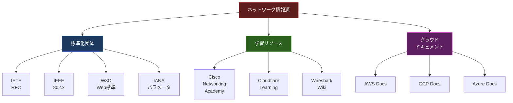

import { Aside } from '@astrojs/starlight/components';

## この節で学ぶこと

ネットワーク技術を学ぶ上で役立つインターネット上の情報源を紹介します．
海外・国内の主要な標準化団体，技術情報サイト，学習リソースを把握し，実務や自己学習に活用する方法を理解します．

## 付.1.1 海外

### 標準化団体・技術仕様の情報源

インターネットやネットワークの技術仕様は，各標準化団体が策定・公開しています．

- IETF（Internet Engineering Task Force）: インターネットの技術標準を策定する団体．RFCを発行
  - RFC Editor（https://www.rfc-editor.org/）: すべてのRFCを検索・閲覧できる
  - IETF Datatracker: ドラフトやRFCの状態を追跡できる
- IEEE（Institute of Electrical and Electronics Engineers）: イーサネット（802.3），無線LAN（802.11）などの標準を策定
  - IEEE Xplore: IEEE標準やカンファレンス論文を検索
- W3C（World Wide Web Consortium）: HTML，CSS，WebSocketsなどのWeb標準を策定
- ICANN（Internet Corporation for Assigned Names and Numbers）: ドメイン名とIPアドレスの管理
- IANA（Internet Assigned Numbers Authority）: プロトコルパラメータ（ポート番号，プロトコル番号など）の管理

### 技術情報・学習リソース

- Cisco Networking Academy: ネットワーク技術の包括的な学習プログラム
- Cloudflare Learning Center: DNS，CDN，DDoS対策などの分かりやすい技術解説
- AWS / GCP / Azure のドキュメント: クラウドネットワーキングの実践的な情報
- Wireshark Wiki: パケットキャプチャの使い方やプロトコル解析の情報

## 付.1.2 国内

### 標準化団体・公的機関

- JPNIC（Japan Network Information Center）: 日本のIPアドレスやAS番号の管理，インターネットに関する情報提供
- JPRS（Japan Registry Services）: JPドメイン名の登録管理
- IPA（情報処理推進機構）: セキュリティ情報の提供，情報処理技術者試験の実施
- JPCERT/CC: コンピュータセキュリティに関するインシデント対応，脆弱性情報の提供
- NICT（情報通信研究機構）: 通信技術の研究開発，日本標準時の管理

### 技術情報・学習サイト

- 総務省「国民のためのサイバーセキュリティサイト」: セキュリティの基礎知識を分かりやすく解説
- JPNICのインターネット歴史年表: インターネットの発展の歴史を時系列で整理
- @IT（アットマークアイティ）: ネットワーク技術やセキュリティの実践的な記事
- Gihyo.jp（技術評論社）: 技術記事や書籍情報

### RFCの検索方法

RFCはインターネット技術の根幹をなす技術文書です．以下の方法で効率的に検索できます:

- RFC Editor で番号やキーワードで検索
- IETF Datatracker でドラフトの状態を確認
- 日本語訳が公開されているRFCもあり，JPNICなどで入手可能

RFCの分類:
- Standards Track: 標準化された仕様
- Informational: 情報提供を目的とした文書
- Experimental: 実験的な仕様
- Best Current Practice（BCP）: 現時点での最善の運用方法

<Aside type="tip" title="FDE実務での活用">
FDEとして技術的な問題に直面した際，RFCを参照することで正確なプロトコル仕様を確認できます．例えば，HTTP/2のフレームフォーマットはRFC 9113，TLS 1.3の仕様はRFC 8446で定義されています．また，AWSやGCPのドキュメントはクラウドネイティブなネットワーク設計の参考になります．国内のJPCERT/CCは脆弱性情報の迅速な取得に欠かせません．日常的にこれらの情報源をチェックする習慣を身につけましょう．
</Aside>

## まとめ

- 海外の主要な標準化団体としてIETF，IEEE，W3C，ICANN/IANAがあり，それぞれ異なる分野の標準を策定している
- RFCはインターネット技術の公式仕様書であり，RFC Editorから無料で閲覧できる
- 国内ではJPNIC，JPRS，IPA，JPCERT/CCなどが情報提供を行っている
- クラウドベンダーのドキュメントは実践的なネットワーク設計の学習に有用

## 理解度チェック

Q1: RFCとは何ですか？どこで入手できますか？

RFC（Request for Comments）は，IETFが発行するインターネット技術の公式仕様書です．プロトコルの詳細な仕様，運用方針，情報提供などが記載されています．RFC Editorのサイト（https://www.rfc-editor.org/）から番号やキーワードで検索し，無料で閲覧できます．

Q2: JPNICとJPRSの役割の違いを説明してください．

JPNIC（Japan Network Information Center）は日本のIPアドレスやAS番号の管理，インターネットに関する情報提供を行う組織です．JPRS（Japan Registry Services）はJPドメイン名（.jp）の登録管理を行う組織です．つまり，JPNICはIPアドレスの管理，JPRSはドメイン名の管理を担当しています．

Q3: セキュリティインシデントの情報を得るために参照すべき国内の組織はどこですか？

JPCERT/CC（Japan Computer Emergency Response Team Coordination Center）が日本におけるコンピュータセキュリティのインシデント対応と脆弱性情報の提供を行っています．また，IPA（情報処理推進機構）もセキュリティに関する情報提供や注意喚起を行っています．

