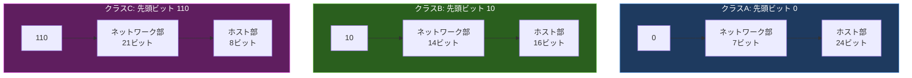

import { Aside } from '@astrojs/starlight/components';

## この節で学ぶこと

CIDR（Classless Inter-Domain Routing）が普及する以前に使われていた，クラスフルアドレッシング（クラスA，B，C）の仕組みを学びます．
各クラスのアドレス範囲，ネットワーク部とホスト部のビット構成，利用可能なネットワーク数とホスト数を理解します．

## クラスフルアドレッシングの概要

初期のIPアドレス体系では，アドレスを5つのクラス（A〜E）に分類する「クラスフルアドレッシング」が使われていました．各クラスはIPアドレスの先頭ビットパターンで区別され，ネットワーク部とホスト部の境界が固定されていました．

クラスフルアドレッシングには大きな問題がありました．クラスAは1ネットワークあたり約1,677万ホストを収容でき，クラスCは254ホストしか収容できないため，中規模なネットワーク（数百〜数千ホスト）に適切なクラスがなく，アドレス空間の無駄が発生しました．この問題を解決するために，サブネットマスクを柔軟に設定できるCIDRが導入されました．

## 付.2.1 クラスA

クラスAのIPアドレスは，先頭ビットが「0」で始まります．

- アドレス範囲: 0.0.0.0 〜 127.255.255.255
- ネットワーク部: 先頭8ビット（先頭1ビットはクラス識別用で「0」固定，残り7ビットがネットワーク識別）
- ホスト部: 残り24ビット
- サブネットマスク: 255.0.0.0（/8）
- ネットワーク数: 126（0と127は予約済み）
- 1ネットワークあたりのホスト数: 16,777,214（2の24乗 - 2）

クラスAは非常に大規模なネットワーク向けで，大企業や政府機関に割り当てられました．例えば，10.0.0.0/8はプライベートアドレスとして使用され，127.0.0.0/8はループバックアドレスとして予約されています．

## 付.2.2 クラスB

クラスBのIPアドレスは，先頭ビットが「10」で始まります．

- アドレス範囲: 128.0.0.0 〜 191.255.255.255
- ネットワーク部: 先頭16ビット（先頭2ビットはクラス識別用で「10」固定，残り14ビットがネットワーク識別）
- ホスト部: 残り16ビット
- サブネットマスク: 255.255.0.0（/16）
- ネットワーク数: 16,384（2の14乗）
- 1ネットワークあたりのホスト数: 65,534（2の16乗 - 2）

クラスBは中〜大規模なネットワーク向けで，大学や中規模企業に割り当てられました．172.16.0.0〜172.31.0.0はプライベートアドレスとして使用されます．

## 付.2.3 クラスC

クラスCのIPアドレスは，先頭ビットが「110」で始まります．

- アドレス範囲: 192.0.0.0 〜 223.255.255.255
- ネットワーク部: 先頭24ビット（先頭3ビットはクラス識別用で「110」固定，残り21ビットがネットワーク識別）
- ホスト部: 残り8ビット
- サブネットマスク: 255.255.255.0（/24）
- ネットワーク数: 2,097,152（2の21乗）
- 1ネットワークあたりのホスト数: 254（2の8乗 - 2）

クラスCは小規模なネットワーク向けです．192.168.0.0〜192.168.255.0はプライベートアドレスとして広く使用されています．

### クラスD・クラスE

参考として，クラスDとクラスEも存在します:

- クラスD（224.0.0.0 〜 239.255.255.255）: マルチキャスト用に予約
- クラスE（240.0.0.0 〜 255.255.255.255）: 実験・将来の使用のために予約

## まとめ

- クラスフルアドレッシングはIPアドレスの先頭ビットでクラスを識別し，ネットワーク部とホスト部の境界が固定されていた
- クラスAは大規模ネットワーク向け（/8），クラスBは中規模（/16），クラスCは小規模（/24）に対応
- クラスフルアドレッシングではアドレス空間の無駄が発生しやすく，CIDRの導入で解消された
- 各クラスのプライベートアドレス範囲（10.0.0.0/8，172.16.0.0/12，192.168.0.0/16）は現在も広く使われている

## 理解度チェック

Q1: クラスA，B，Cの先頭ビットパターンとデフォルトのサブネットマスクをそれぞれ答えてください．

- クラスA: 先頭ビット「0」，サブネットマスク 255.0.0.0（/8）
- クラスB: 先頭ビット「10」，サブネットマスク 255.255.0.0（/16）
- クラスC: 先頭ビット「110」，サブネットマスク 255.255.255.0（/24）

Q2: クラスBのネットワークで利用可能な最大ホスト数はいくつですか？その計算方法も説明してください．

クラスBの最大ホスト数は65,534です．ホスト部が16ビットなので 2の16乗 = 65,536 通りのアドレスが可能ですが，ホスト部がすべて0のネットワークアドレスとすべて1のブロードキャストアドレスを除く必要があるため，65,536 - 2 = 65,534 となります．

Q3: クラスフルアドレッシングの問題点と，それを解決するために導入された技術は何ですか？

クラスフルアドレッシングの問題点は，ネットワーク部とホスト部の境界が固定されているため，ネットワーク規模に応じた柔軟なアドレス割り当てができないことです．クラスAは約1,677万ホスト，クラスCは254ホストと極端で，中規模ネットワークに適したクラスが存在しませんでした．この問題を解決するために，サブネットマスクを任意のビット位置で設定できるCIDR（Classless Inter-Domain Routing）が導入されました．

