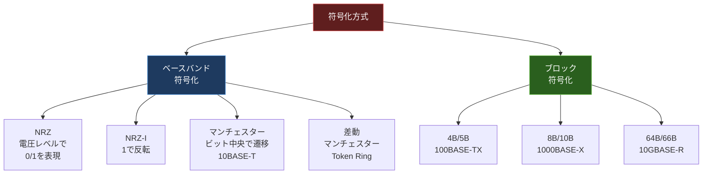

import { Aside } from '@astrojs/starlight/components';

## この節で学ぶこと

OSI参照モデルの最下層である物理層の役割と基礎知識を学びます．
デジタルデータ（0と1）を物理的な信号に変換する符号化方式の仕組みを理解します．

## 付.3.1 物理層の基礎知識

物理層（Physical Layer）はOSI参照モデルの第1層に位置し，ビットストリーム（0と1の列）を物理的な信号に変換して伝送媒体上で送受信する役割を担います．

物理層が定義する主な事項は以下のとおりです:

- 電気的特性: 電圧レベル，信号の振幅，インピーダンスなど
- 機械的特性: コネクタの形状，ピン配置，ケーブルの仕様
- 機能的特性: 各ピンの役割（データ送信，受信，グラウンドなど）
- 手続き的特性: 信号の送受信タイミング，同期方法

### 伝送方式

物理層における信号の伝送方式には以下の種類があります:

- ベースバンド伝送: デジタル信号をそのまま伝送する方式．LANで広く使用
- ブロードバンド伝送: デジタル信号を搬送波に乗せて（変調して）伝送する方式．周波数分割多重により複数のチャネルを同時伝送可能

### 同期方式

送信側と受信側がビットの区切りを正しく認識するための同期方式があります:

- 調歩同期（非同期）方式: 各文字の前後にスタートビットとストップビットを付加する方式．低速通信向け
- クロック同期方式: 送信側のクロック信号に受信側が同期する方式．高速通信向け

## 付.3.2 0と1の符号化

デジタルデータ（0と1）を物理的な電気信号に変換する方法を「符号化（エンコーディング）」と呼びます．符号化方式によって，信号の帯域幅，同期性，エラー検出能力が異なります．

### 主な符号化方式

NRZ（Non-Return to Zero）方式は，最も基本的な符号化方式です．「1」を高電圧，「0」を低電圧（またはその逆）で表現します．同じビットが連続すると電圧変化がなくなり，クロック同期が困難になるという問題があります．

NRZ-I（NRZ Inverted）方式は，「1」のときに信号レベルを反転し，「0」のときは変化しない方式です．NRZよりも同期性が向上しますが，0が連続する場合の問題は残ります．

マンチェスター符号化方式は，各ビットの中央で必ず信号が遷移する方式です．「1」はHighからLowへ，「0」はLowからHighへ遷移します（規格により逆の場合もある）．イーサネット（10BASE-T）で使用されています．ビットごとに遷移があるため確実にクロック同期が可能ですが，帯域幅の効率は50%です．

差動マンチェスター方式は，各ビットの中央で信号が遷移する点はマンチェスター方式と同じですが，ビットの開始時に遷移があるかどうかでデータを表現します．Token Ringで使用されました．

4B/5B符号化方式は，4ビットのデータを5ビットのコードに変換する方式です．5ビットのコードは0の連続が3つ以下になるように設計されており，クロック同期を維持できます．100BASE-TXで使用されています．

8B/10B符号化方式は，8ビットのデータを10ビットのコードに変換する方式です．ギガビットイーサネット（1000BASE-X）で使用されています．DCバランス（0と1の数のバランス）が保たれるよう設計されています．

### 変調方式

アナログ信号でデジタルデータを伝送する場合は，変調（モジュレーション）が必要です:

- ASK（Amplitude Shift Keying: 振幅偏移変調）: 搬送波の振幅を変化させてデータを表現
- FSK（Frequency Shift Keying: 周波数偏移変調）: 搬送波の周波数を変化させてデータを表現
- PSK（Phase Shift Keying: 位相偏移変調）: 搬送波の位相を変化させてデータを表現
- QAM（Quadrature Amplitude Modulation: 直交振幅変調）: 振幅と位相の両方を変化させ，1シンボルで複数ビットを伝送

## まとめ

- 物理層はビットストリームを物理信号に変換して伝送する役割を持ち，電気的・機械的・機能的・手続き的特性を定義する
- 符号化方式にはNRZ，マンチェスター，4B/5B，8B/10Bなどがあり，同期性と帯域効率のトレードオフがある
- マンチェスター符号化はビットごとに信号遷移があるため同期性に優れるが帯域効率は50%
- ブロック符号化（4B/5B，8B/10B）はデータを冗長なコードに変換することで同期性と帯域効率を両立する

## 理解度チェック

Q1: マンチェスター符号化方式の特徴と利点を説明してください．

マンチェスター符号化方式は，各ビットの中央で必ず信号が遷移する符号化方式です．「1」はHighからLowへ，「0」はLowからHighへ遷移します．

利点は，ビットごとに必ず遷移があるためクロック同期が確実に行えることです．NRZのように同じビットが連続しても信号変化がなくなる問題が発生しません．

欠点は，1ビットあたり必ず1回の遷移が必要なため，帯域幅の効率が50%になることです．つまり，データレートに対して2倍の信号帯域が必要です．

Q2: 4B/5B符号化が使われる理由を説明してください．

4B/5B符号化は4ビットのデータを5ビットのコードに変換します．5ビットのコードは0の連続が3つ以下になるように選ばれており，クロック同期を維持できます．マンチェスター符号化に比べて帯域効率が高く（80%），高速通信に適しています．100BASE-TXで使用されています．

Q3: ASK，FSK，PSKの違いを説明してください．

- ASK（振幅偏移変調）: 搬送波の振幅を変化させてデータを表現する．ノイズの影響を受けやすい
- FSK（周波数偏移変調）: 搬送波の周波数を変化させてデータを表現する．ASKよりノイズ耐性が高い
- PSK（位相偏移変調）: 搬送波の位相を変化させてデータを表現する．帯域効率が高く，高速通信に適している

