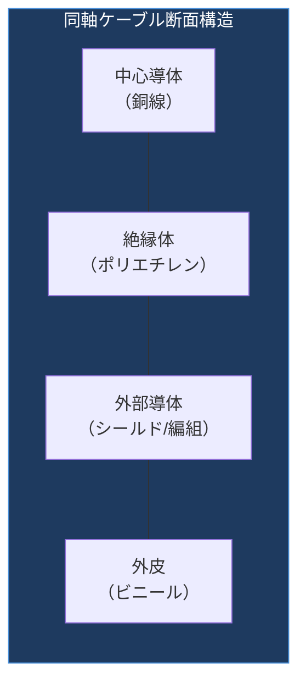
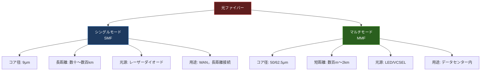
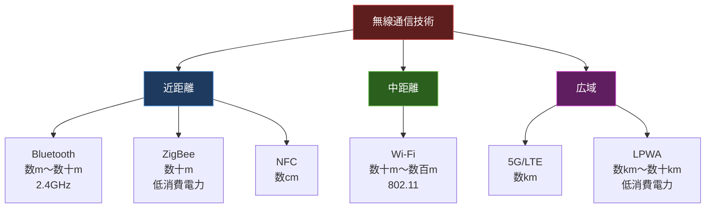

import { Aside } from '@astrojs/starlight/components';

## この節で学ぶこと

コンピュータ同士を接続する通信媒体の種類と特性を学びます．
同軸ケーブル，ツイストペアケーブル，光ファイバーケーブル，無線のそれぞれの構造，特徴，用途を理解します．

## 付.4.1 同軸ケーブル

同軸ケーブル（Coaxial Cable）は，中心の導体（内部導体）を絶縁体，外部導体（シールド），外皮で同心円状に覆った構造のケーブルです．

同軸ケーブルの特徴:

- 外部導体がシールドとして機能し，電磁波ノイズの影響を受けにくい
- かつては10BASE2（Thin Ethernet）や10BASE5（Thick Ethernet）で使用された
- 現在のLANではほとんど使われないが，CATVやアンテナ接続では広く使用されている

同軸ケーブルの種類:
- 50Ω同軸ケーブル: データ通信用（10BASE5，10BASE2）
- 75Ω同軸ケーブル: 映像信号やCATV用

## 付.4.2 ツイストペアケーブル（より対線）

ツイストペアケーブルは，2本の銅線を対にしてよじった（ツイストした）ケーブルです．よじることで外部からの電磁波ノイズの影響を低減します．現在のLANで最も広く使用されている通信媒体です．

### UTPとSTP

- UTP（Unshielded Twisted Pair: 非シールドより対線）: シールドなし．一般的なLAN環境で使用
- STP（Shielded Twisted Pair: シールドより対線）: 各ペアまたはケーブル全体をシールドで覆う．ノイズの多い環境で使用

### カテゴリ

ツイストペアケーブルは伝送性能によりカテゴリに分類されます:

- Cat 5e: 最大1Gbps（1000BASE-T），100MHzまで対応
- Cat 6: 最大1Gbps（1000BASE-T），250MHzまで対応．クロストークが少ない
- Cat 6A: 最大10Gbps（10GBASE-T），500MHzまで対応
- Cat 7: 最大10Gbps，600MHzまで対応．各ペアがシールドされたSTP
- Cat 8: 最大25/40Gbps，2000MHzまで対応．データセンター内の短距離接続向け

### コネクタ

ツイストペアケーブルの標準的なコネクタはRJ-45（8P8C）です．ピン配列にはT568AとT568Bの2つの規格があり，両端が同じ配列のストレートケーブルと，異なる配列のクロスケーブルがあります．ただし，Auto-MDI/MDI-X機能を持つ機器が普及しているため，現在はストレートケーブルだけで問題ありません．

## 付.4.3 光ファイバーケーブル

光ファイバーケーブルは，ガラスまたはプラスチックの繊維を通じて光信号でデータを伝送するケーブルです．電気信号ではなく光を使用するため，電磁波の影響を受けず，長距離・高速通信に適しています．

### シングルモードとマルチモード

- シングルモードファイバー（SMF）: コア径が約9μmと小さく，1つの光のモード（経路）のみを伝搬．長距離伝送に適する（数十〜数百km）．光源にレーザーダイオードを使用
- マルチモードファイバー（MMF）: コア径が50μmまたは62.5μmで，複数の光のモードが伝搬．短距離伝送向け（数百m〜2km）．光源にLEDまたはVCSELを使用

### 光ファイバーのコネクタ

主なコネクタの種類:

- SC（Subscriber Connector）: プッシュプル式の角型コネクタ
- LC（Lucent Connector）: SCの半分のサイズのコネクタ．高密度実装に適する
- ST（Straight Tip）: バヨネット式の丸型コネクタ
- MPO/MTP: 複数の光ファイバーを一括接続するマルチファイバーコネクタ

## 付.4.4 無線

無線通信は，電磁波（電波，赤外線，光）を利用してケーブルなしでデータを伝送する方式です．

主な無線通信技術:

- IEEE 802.11（Wi-Fi）: 2.4GHz/5GHz/6GHz帯を使用するLAN規格
- Bluetooth: 2.4GHz帯を使用する近距離無線通信（数m〜数十m）
- ZigBee: 低消費電力の近距離無線通信．IoTセンサー向け
- LPWA（Low Power, Wide Area）: 低消費電力で広域をカバーする無線通信．IoT向け
- 5G/LTE: 携帯電話ネットワーク

無線通信の特徴:

- ケーブル配線が不要で設置が容易
- 電波の干渉やマルチパス（反射波）の影響を受ける
- 通信距離や障害物による減衰がある
- セキュリティ対策（暗号化，認証）が特に重要

<Aside type="tip" title="FDE実務での活用">
データセンターのケーブリング設計はAIサービスの性能に直結します．GPU間の高速通信にはInfiniBandや高速イーサネットが使われ，サーバーラック間の接続にはシングルモード光ファイバーが標準です．ケーブルの選定では，必要な帯域幅，伝送距離，コストを総合的に判断します．例えば，100GbEの構内接続にはOM4マルチモードファイバーとQSFP28モジュールの組み合わせが一般的です．ケーブル管理の不備はトラブルの原因になるため，ラベリングや配線ドキュメントの整備も重要な実務スキルです．
</Aside>

## まとめ

- 同軸ケーブルはシールド構造でノイズ耐性が高いが，現在のLANではほぼ使われていない
- ツイストペアケーブル（UTP/STP）は現在のLANで最も広く使われ，Cat 5eからCat 8まで速度に応じたカテゴリがある
- 光ファイバーはシングルモード（長距離）とマルチモード（短距離）があり，電磁波の影響を受けない
- 無線通信はWi-Fi，Bluetooth，LPWA，5G/LTEなど用途に応じた技術が多様に存在する

## 理解度チェック

Q1: UTPケーブルとSTPケーブルの違いは何ですか？

UTP（Unshielded Twisted Pair）はシールドがないツイストペアケーブルで，一般的なLAN環境で使用されます．STP（Shielded Twisted Pair）は各ペアまたはケーブル全体がシールドで覆われており，電磁波ノイズの多い工場や通信設備の近くなど，ノイズが問題になる環境で使用されます．STPの方がノイズ耐性は高いですが，コストが高く，接地（グラウンド）が必要です．

Q2: シングルモードファイバーとマルチモードファイバーの違いと使い分けを説明してください．

シングルモードファイバー（SMF）はコア径が約9μmと小さく，光の1つのモードのみが伝搬します．長距離伝送（数十〜数百km）に適し，WANや長距離接続で使用されます．光源にはレーザーダイオードを使用します．

マルチモードファイバー（MMF）はコア径が50/62.5μmで，複数のモードが伝搬します．短距離伝送（数百m〜2km）に適し，データセンター内やLANで使用されます．光源にはLEDやVCSELを使用し，SMFよりも安価です．

Q3: Cat 6AとCat 5eの主な違いは何ですか？

Cat 5eは最大1Gbps（1000BASE-T）の通信速度に対応し，周波数は100MHzまでです．Cat 6Aは最大10Gbps（10GBASE-T）に対応し，周波数は500MHzまでです．Cat 6Aはクロストーク（隣接するペア間の干渉）の低減が強化されており，より高速で安定した通信が可能です．

