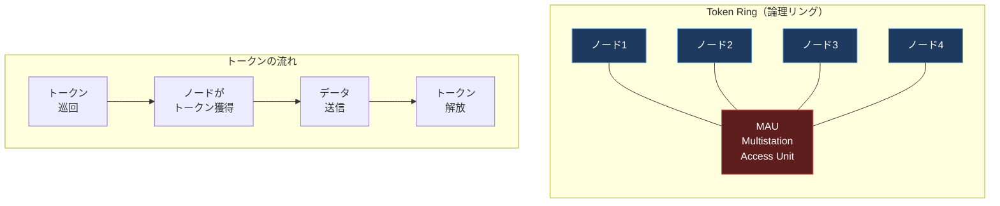

import { Aside } from '@astrojs/starlight/components';

## この節で学ぶこと

現在はほとんど使われなくなった歴史的なデータリンク技術を学びます．
FDDI，Token Ring，100VG-AnyLAN，HIPPIの仕組みと特徴を理解し，これらの技術がイーサネットに置き換えられた経緯を把握します．

## 付.5.1 FDDI（Fiber Distributed Data Interface）

FDDIは，光ファイバーを使用した100Mbpsのトークンパッシング方式のLAN規格です．1980年代後半から1990年代にかけて，基幹ネットワーク（バックボーン）で広く使用されました．

### FDDIの特徴

- 伝送速度: 100Mbps
- 伝送媒体: マルチモード光ファイバー（銅線版のCDDIも存在）
- トポロジ: デュアルリング（二重リング）構造
- アクセス制御: トークンパッシング方式
- 最大リング長: 200km（100kmのリング2本）
- 最大ノード数: 500

```mermaid
graph TD
    subgraph fddi["FDDIデュアルリング"]
        A["ノードA"] -->|"プライマリリング<br/>（時計回り）"| B["ノードB"]
        B --> C["ノードC"]
        C --> D["ノードD"]
        D --> A

        A <--|"セカンダリリング<br/>（反時計回り）"| B
        B <-- C
        C <-- D
        D <-- A
    end

    style A fill:#1e3a5f,stroke:#4a90d9,color:#fff
    style B fill:#1e3a5f,stroke:#4a90d9,color:#fff
    style C fill:#1e3a5f,stroke:#4a90d9,color:#fff
    style D fill:#1e3a5f,stroke:#4a90d9,color:#fff
```

FDDIのデュアルリング構造は耐障害性に優れています．プライマリリングで障害が発生した場合，セカンダリリングを使ってリングを「ラップ」し，通信を維持できます．

FDDIが使われなくなった主な理由は，より安価で管理が容易なイーサネット（特にギガビットイーサネット）が登場したことです．

## 付.5.2 Token Ring

Token Ringは，IBMが開発したトークンパッシング方式のLAN規格です．IEEE 802.5として標準化されました．

### Token Ringの特徴

- 伝送速度: 4Mbpsまたは16Mbps
- 伝送媒体: STPケーブル（UTPも利用可能）
- トポロジ: 物理的にはスター型（MAU: Multistation Access Unitを使用），論理的にはリング型
- アクセス制御: トークンパッシング方式

### トークンパッシング方式

リング上を「トークン」と呼ばれる特殊なフレームが巡回します．データを送信したいノードはトークンを獲得し，データフレームを送信します．データフレームがリングを一周して送信元に戻ると，トークンを解放します．

この方式の利点は，イーサネットのCSMA/CDのような衝突が発生しないことです．高負荷時でもスループットの低下が少なく，予測可能な応答時間を提供できます．



Token Ringは1990年代までIBM製品を中心に企業内LANで広く使用されましたが，スイッチドイーサネットの登場により衝突の問題が解消されたことで，コスト面と速度面で優位なイーサネットに置き換えられました．

## 付.5.3 100VG-AnyLAN

100VG-AnyLANは，HPとIBMが開発した100MbpsのLAN規格です．IEEE 802.12として標準化されました．

### 100VG-AnyLANの特徴

- 伝送速度: 100Mbps
- 伝送媒体: Cat 3以上のUTPケーブル（4対すべてを使用）
- トポロジ: スター型
- アクセス制御: Demand Priority（要求優先度方式）

### Demand Priority方式

100VG-AnyLANのアクセス制御方式であるDemand Priorityは，ハブ（中央装置）が各ノードからの送信要求を順番に確認し，優先度に基づいて送信を許可する方式です．通常優先度と高優先度の2段階があり，高優先度のトラフィック（リアルタイム通信など）を優先的に処理できます．

100VG-AnyLANは，既存のCat 3ケーブルを再利用できる点がメリットでしたが，100BASE-TX（Cat 5ケーブル使用）の普及により，ほとんど使われませんでした．

## 付.5.4 HIPPI

HIPPI（High Performance Parallel Interface）は，スーパーコンピュータ間やスーパーコンピュータと周辺機器間の高速接続のために開発されたインタフェース規格です．

### HIPPIの特徴

- 伝送速度: 800Mbps（32ビット幅）または1.6Gbps（64ビット幅）
- 伝送媒体: パラレルケーブル（銅線）または光ファイバー
- トポロジ: ポイントツーポイント（スイッチを使用して相互接続も可能）
- 最大伝送距離: 銅線で25m，光ファイバーで10km
- 用途: スーパーコンピュータ，大容量データ転送

HIPPIは科学計算やデータセンターで使用されましたが，ファイバーチャネルやInfiniBand，高速イーサネットの登場により置き換えられました．

## まとめ

- FDDIは光ファイバーベースの100Mbpsデュアルリング型LANで，耐障害性に優れていた
- Token RingはIBMが開発したトークンパッシング方式のLANで，衝突が発生しない予測可能な通信を提供した
- 100VG-AnyLANはDemand Priority方式で優先度制御を実現したが，ほとんど普及しなかった
- HIPPIはスーパーコンピュータ向けの高速パラレルインタフェースであった
- これらの技術はすべて，低コストで高速なイーサネットの進化によって置き換えられた

## 理解度チェック

<details>
<summary>Q1: FDDIのデュアルリング構造はどのような利点がありますか？</summary>

FDDIのデュアルリング構造は，プライマリリングとセカンダリリングの2本のリングで構成されています．通常はプライマリリングでデータを伝送しますが，プライマリリングで障害（ケーブルの切断など）が発生した場合，セカンダリリングを使ってリングを「ラップ」（折り返し）し，通信を維持できます．これにより，単一障害点があっても通信の継続が可能になり，高い耐障害性を実現します．
</details>

<details>
<summary>Q2: Token Ring方式がイーサネット（CSMA/CD）と比べて高負荷時に優位な理由は何ですか？</summary>

Token Ringではトークンを獲得したノードだけがデータを送信できるため，衝突が発生しません．イーサネットのCSMA/CD方式では，高負荷時に衝突が頻発してスループットが大幅に低下しますが，Token Ringでは各ノードが公平にトークンを獲得してデータを送信するため，高負荷時でもスループットの低下が少なく，応答時間が予測可能です．
</details>

<details>
<summary>Q3: これらの歴史的なデータリンク技術がイーサネットに置き換えられた主な理由を説明してください．</summary>

主な理由は以下のとおりです:
1. コスト: イーサネットの機器は大量生産により非常に安価になった
2. 速度: イーサネットはファストイーサネット（100Mbps），ギガビットイーサネット（1Gbps），10ギガビットイーサネット（10Gbps）と継続的に高速化された
3. スイッチング技術: スイッチドイーサネットの登場でCSMA/CDの衝突問題が解消され，Token Ringの優位性がなくなった
4. 管理の容易さ: イーサネットの方が設定・管理が簡単
5. エコシステム: イーサネット関連の製品やツールが圧倒的に豊富
</details>
