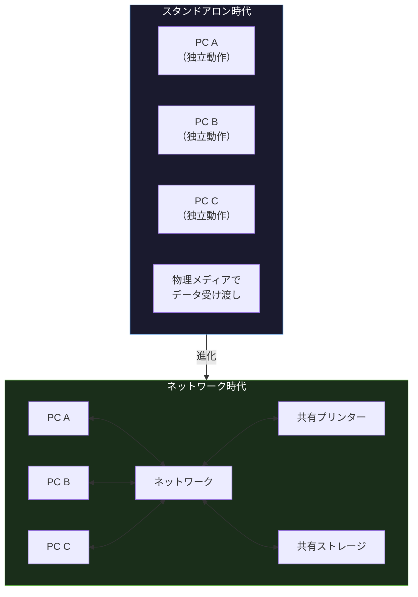
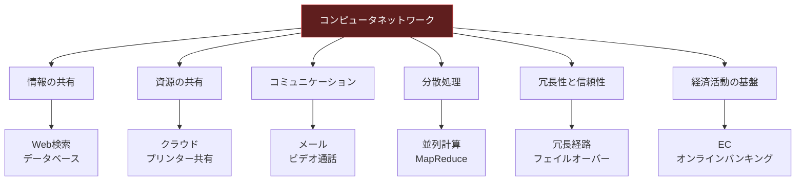

import { Aside } from '@astrojs/starlight/components';

## この節で学ぶこと

コンピュータがどのように普及し，多様化してきたかを振り返ります．
スタンドアロンで利用されていたコンピュータが，なぜネットワークで接続されるようになったのかを理解します．
コンピュータ通信から現代の情報通信環境への進化と，コンピュータネットワークが果たす役割を学びます．

## 1.1.1 コンピュータの普及と多様化

コンピュータは1940年代に軍事目的や科学計算のために開発された大型計算機から始まりました．当初は一部の研究機関や政府機関だけが利用できる非常に高価な装置でしたが，半導体技術の進歩とともに小型化・低価格化が進みました．

1970年代にはミニコンピュータが登場し，企業の各部門で利用されるようになりました．1980年代にはパーソナルコンピュータ（PC）が登場し，オフィスだけでなく家庭にもコンピュータが普及していきました．

現在では，スマートフォン，タブレット，IoTデバイスなど，さまざまな形態のコンピュータが日常生活のあらゆる場面に浸透しています．

コンピュータの多様化は以下のような特徴を持ちます:

- 処理能力の向上: ムーアの法則に従い，半導体の集積度は約2年で2倍に増加
- 小型化: 部屋1つを占有していた大型機が手のひらサイズに
- 低価格化: 数億円の大型機から数万円のPCへ
- 用途の多様化: 科学計算専用からビジネス，エンタメ，通信へ

## 1.1.2 スタンドアロンからネットワーク利用へ

初期のコンピュータは「スタンドアロン」，つまり単独で動作する装置でした．各コンピュータは独立して処理を行い，データの受け渡しは磁気テープやフロッピーディスクなどの物理メディアを介して行われていました．

しかし，コンピュータの普及に伴い，以下のようなニーズが生まれました:

- データの共有: 複数のコンピュータ間で同じデータを利用したい
- 資源の共有: 高価なプリンターやストレージを複数台で共用したい
- 通信: 離れた場所のユーザー同士がメッセージをやり取りしたい
- 集中管理: データやソフトウェアを一元的に管理したい

これらのニーズに応えるために，コンピュータ同士をケーブルで接続し，データを電気信号として送受信する「ネットワーク」という概念が生まれました．

ネットワーク化によって，コンピュータの利用価値は飛躍的に向上しました．個々のコンピュータの処理能力を超えた分散処理が可能になり，メトカーフの法則が示すように，ネットワークの価値はノード数の2乗に比例して増大します．

## 1.1.3 コンピュータ通信から情報通信環境へ

当初のコンピュータネットワークは，コンピュータ同士がデータを交換するための「コンピュータ通信」に過ぎませんでした．しかし，技術の進歩とともに，ネットワークの役割は大きく変化しました．

電話回線を利用したデータ通信から，専用のデジタル回線，光ファイバーへと通信インフラが整備されるにつれ，音声・映像・データを統合的に扱える「情報通信環境」が構築されていきました．

現在では以下のような多様なサービスがネットワーク上で提供されています:

- 電子メール，チャット，ビデオ会議
- Webブラウジング，電子商取引（EC）
- 動画配信（ストリーミング），音楽配信
- クラウドコンピューティング
- IoT（Internet of Things）によるセンサーデータの収集と分析
- AI/MLモデルの分散学習と推論

コンピュータ通信は「人と人」「人とコンピュータ」「コンピュータとコンピュータ」をつなぐ総合的な情報通信基盤へと発展しました．

## 1.1.4 コンピュータネットワークの役割

コンピュータネットワークは現代社会において，以下のような重要な役割を担っています:

- 情報の共有: 世界中の知識や情報にアクセスできる環境の提供
- 資源の共有: ハードウェア（プリンター，ストレージ），ソフトウェア，計算能力の共有
- コミュニケーション: 電子メール，SNS，ビデオ通話による即時的なコミュニケーション
- 分散処理: 大規模な計算を複数のコンピュータで分担して処理
- 冗長性と信頼性: 障害発生時に別の経路でデータを届ける仕組み
- 経済活動の基盤: 電子商取引，オンラインバンキング，電子決済

ネットワークがなければ，現代のビジネスや日常生活は成り立ちません．ネットワークの基本概念を正しく理解することは，あらゆるIT技術者にとって必須のスキルです．

<Aside type="tip" title="FDE実務での活用">
FDE（Forward Deployed Engineer）として顧客先でAIアプリケーションをデプロイする際，クラウドインフラの基盤を支えているのがネットワークです．例えば，大規模言語モデル（LLM）のAPI呼び出しでは，クライアントからクラウドまでの通信経路が確実に確保されている必要があります．ネットワークの基礎を理解することで，「APIのレスポンスが遅い」「接続がタイムアウトする」といった問題の原因を，ネットワーク層から体系的に調査できるようになります．GPUクラスタの分散学習では，ノード間の高速通信が性能のボトルネックとなるため，ネットワーク帯域やレイテンシの理解は不可欠です．
</Aside>

## まとめ

- コンピュータは大型計算機から始まり，半導体技術の進歩で小型化・低価格化・多様化が進んだ
- スタンドアロンのコンピュータは，データ共有・資源共有・通信のニーズからネットワーク化された
- コンピュータ通信は，音声・映像・データを統合する総合的な情報通信環境へと発展した
- コンピュータネットワークは，情報共有，資源共有，コミュニケーション，分散処理，冗長性，経済活動の基盤として現代社会を支えている
- ネットワークの価値はノード数の増加に伴い飛躍的に高まる（メトカーフの法則）

## 理解度チェック

Q1: コンピュータが普及する以前，データの受け渡しはどのように行われていましたか？

磁気テープやフロッピーディスクなどの物理メディアを介して，手作業でデータを運搬していました．これを「スニーカーネット」と呼ぶこともあります．

Q2: スタンドアロンからネットワーク利用へ移行した主な理由を3つ挙げてください．

1. データの共有: 複数のコンピュータ間で同じデータを利用するため
2. 資源の共有: プリンターやストレージなど高価な機器を共用するため
3. 通信: 離れた場所のユーザー同士がメッセージをやり取りするため

Q3: 「コンピュータ通信」から「情報通信環境」への進化とは，具体的にどのような変化を指しますか？

当初のコンピュータ間のデータ交換だけでなく，音声・映像・データを統合的に扱えるようになり，電子メール，Web，動画配信，クラウドコンピューティング，IoTなど多様なサービスが提供される総合的な通信基盤へと発展したことを指します．

Q4: メトカーフの法則とは何ですか？ネットワークの価値とどのような関係がありますか？

メトカーフの法則とは，ネットワークの価値はそのネットワークに接続されたノード数の2乗に比例するという法則です．つまり，ネットワークに参加するユーザーや機器が増えるほど，ネットワーク全体の価値は飛躍的に増大します．例えば，10台のコンピュータが接続されたネットワークの価値は10の2乗=100に比例しますが，100台では10,000に比例します．

