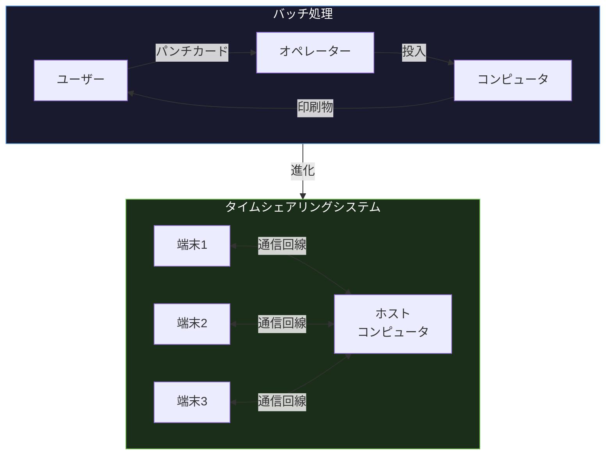
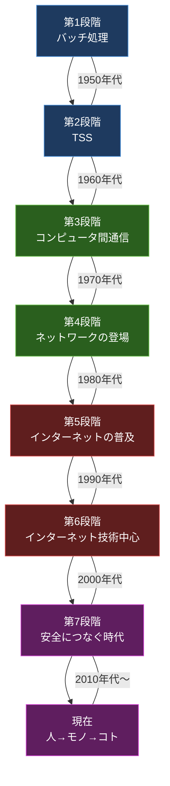
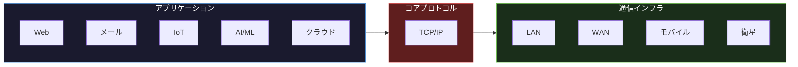

import { Aside } from '@astrojs/starlight/components';

## この節で学ぶこと

コンピュータとネットワーク技術がどのような段階を経て発展してきたかを時系列で理解します．
バッチ処理からTSS，コンピュータ間通信，インターネットの普及，IoT時代へと至る歴史を俯瞰します．
各段階の特徴と技術的なブレークスルーを学び，TCP/IPがすべての基盤であることを認識します．

## 1.2.1 バッチ処理（Batch Processing）

コンピュータ黎明期の利用形態は「バッチ処理」でした．ユーザーはプログラムとデータをパンチカードや磁気テープに記録し，オペレーターに渡します．オペレーターがそれをコンピュータに読み込ませ，処理が完了するまで待ちます．処理結果は印刷物として返却されました．

バッチ処理の特徴:

- ユーザーが直接コンピュータを操作しない
- プログラムの実行に数時間〜数日かかることもある
- 処理のスケジューリングはオペレーターが管理
- コンピュータ資源の利用効率が低い（CPU待ち時間が長い）

バッチ処理では，1つのジョブが完了してから次のジョブが実行されるため，コンピュータの高価な計算資源が十分に活用されていないという問題がありました．

## 1.2.2 タイムシェアリングシステム（TSS）

バッチ処理の非効率を解消するために登場したのが，タイムシェアリングシステム（TSS: Time Sharing System）です．TSSでは，1台のコンピュータを複数のユーザーが端末から同時に利用できます．

CPUの処理時間を非常に短い時間（タイムスライス）に分割し，各ユーザーの処理を順番に実行することで，あたかも各ユーザーが専用のコンピュータを使っているかのような体験を提供しました．

TSSの特徴:

- 複数ユーザーが同時にコンピュータを利用
- 対話的な操作が可能（コマンド入力→即座に結果表示）
- CPU利用効率の大幅な向上
- 端末とホストコンピュータは通信回線で接続

TSSは「通信」の概念をコンピュータ利用に持ち込んだ重要な転換点でした．ユーザーの端末とホストコンピュータの間には通信回線が必要であり，これがネットワーク技術発展の出発点となりました．

## 1.2.3 コンピュータ間通信

TSSでは端末とホストコンピュータの間の通信でしたが，次の段階では「コンピュータ同士」の通信が実現しました．異なるコンピュータ間でデータを転送したり，一方のコンピュータから他方のコンピュータの機能を利用したりすることが可能になりました．

コンピュータ間通信のポイント:

- 対等な関係にある2台のコンピュータ間でのデータ交換
- 電話回線や専用回線を使用
- ファイル転送や遠隔ジョブ投入が主な用途
- ポイント・ツー・ポイント（1対1）の接続

この段階では，特定の2台のコンピュータ間を専用回線で結ぶ形態が一般的であり，多数のコンピュータを効率的に接続するには限界がありました．

## 1.2.4 コンピュータネットワークの登場

コンピュータ間通信の拡大に伴い，複数のコンピュータを共通の通信網で結ぶ「コンピュータネットワーク」が登場しました．1969年に米国国防総省の高等研究計画局（ARPA）が構築したARPANETがその先駆けです．

ARPANETでは，パケット交換方式が採用されました．データを小さなパケットに分割して送信し，ネットワーク上の各ノードが最適な経路でパケットを転送します．これにより，回線を効率的に共有でき，一部の回線に障害が発生しても別の経路で通信を継続できる冗長性が確保されました．

コンピュータネットワークの特徴:

- 複数のコンピュータを相互接続
- パケット交換方式による効率的なデータ転送
- 障害に強い冗長構成
- 分散型のアーキテクチャ

## 1.2.5 インターネットの普及

1990年代に入ると，WWW（World Wide Web）の登場とWebブラウザの普及により，インターネットは一般の人々にも広く利用されるようになりました．

インターネット普及の背景:

- 1991年: ティム・バーナーズ＝リーがWWWを発明
- 1993年: Mosaicブラウザの登場でGUI操作が可能に
- 1995年: Windows 95の発売で一般家庭にPCが普及
- ISP（インターネットサービスプロバイダ）の増加で接続が容易に

インターネットの普及は，電子メール，Webサイト閲覧，電子商取引など，さまざまなサービスを生み出しました．通信の対象はコンピュータ技術者だけでなく，一般の消費者へと広がりました．

## 1.2.6 インターネット技術中心の時代へ

インターネットの爆発的な普及に伴い，企業内ネットワーク（イントラネット）や企業間ネットワーク（エクストラネット）でもTCP/IPが標準的なプロトコルとして採用されるようになりました．

かつては企業ごとに独自のプロトコル（IBM SNA，Novell IPX/SPX，AppleTalkなど）が使われていましたが，インターネットとの相互接続性を確保するため，TCP/IPに統一される流れが加速しました．

電話網もIP化が進み，VoIP（Voice over IP）技術により，音声通話もIP網を介して行われるようになりました．テレビ放送もIPTVへと移行が進んでいます．あらゆる通信がTCP/IP技術を基盤とする時代が到来しました．

## 1.2.7 「単につなぐ」時代から「安全につなぐ」時代へ

インターネットの普及と利用範囲の拡大に伴い，セキュリティの重要性が飛躍的に高まりました．初期のインターネットは研究者間の信頼に基づくオープンなネットワークでしたが，商用利用の拡大とともに，さまざまな脅威が現れました．

- コンピュータウイルス，ワーム
- 不正アクセス，情報漏洩
- フィッシング詐欺，ランサムウェア
- DDoS攻撃

これらの脅威に対応するため，ファイアウォール，IDS/IPS，暗号化（TLS/SSL），VPN，多要素認証などのセキュリティ技術が次々と開発されました．現在は「ゼロトラスト」の考え方に基づき，ネットワーク内外を問わずすべての通信を検証する時代になっています．

## 1.2.8 人からモノへ，モノからコトへ

インターネットに接続される対象は，当初はPCやサーバーなどの「人が操作するコンピュータ」でしたが，IoT（Internet of Things）の進展により，センサー，家電，自動車，産業機器など「モノ」がインターネットに接続されるようになりました．

さらに，「モノ」から収集されたデータを分析し，新たな「コト（サービス・体験）」を創出する段階へと進化しています．

- 人からモノへ: スマート家電，ウェアラブルデバイス，コネクテッドカー
- モノからコトへ: ビッグデータ分析，予防保全，スマートシティ，自動運転

IoT時代のネットワークは，膨大な数のデバイスを接続する必要があり，IPv6の普及，LPWA（Low Power Wide Area）などの省電力広域通信技術，エッジコンピューティングなどが重要な技術となっています．

## 1.2.9 すべての鍵を握るTCP/IP

これまで見てきたコンピュータとネットワークの発展において，一貫して中心的な役割を果たしてきたのがTCP/IPプロトコルスイートです．

TCP/IPは1970年代にARPANETで開発され，以下の理由から事実上の標準（デファクトスタンダード）となりました:

- オープンな仕様: 誰でも無料で仕様書（RFC）を入手し実装できる
- 柔軟なアーキテクチャ: さまざまな種類のネットワークを相互接続できる
- スケーラビリティ: 小規模LANから世界規模のインターネットまで対応
- 実績: 40年以上の運用実績と継続的な改善

インターネットだけでなく，企業内ネットワーク，携帯電話網，IoTネットワーク，クラウドコンピューティングなど，あらゆるネットワークの基盤としてTCP/IPは利用されています．TCP/IPを理解することは，現代のネットワーク技術を理解するための必須条件です．

<Aside type="tip" title="FDE実務での活用">
AI/ML時代のネットワークには特有の要件があります．FDEとしてAIアプリケーションを顧客環境にデプロイする際には，以下のネットワーク要件を理解しておく必要があります:
- 大規模モデルの分散学習: ノード間で数GB/sのパラメータ同期が発生するため，高帯域・低レイテンシのネットワーク（InfiniBand，RoCEなど）が必要
- 推論API: エンドユーザーからのリクエストに対して低レイテンシで応答するため，CDN，ロードバランサー，近接データセンターの活用が重要
- モデル配信: 数十GBのモデルファイルを効率的に配布するため，P2Pやマルチキャスト技術が活用される
- エッジAI: IoTデバイス上で推論を実行するエッジコンピューティングでは，LPWAなどの省電力通信が鍵となる
</Aside>

## まとめ

- バッチ処理からTSSへの移行で，コンピュータの対話的利用と通信の概念が生まれた
- コンピュータ間通信からネットワークの登場へと進み，パケット交換方式が確立された
- インターネットの普及により，TCP/IPがあらゆる通信の標準プロトコルとなった
- セキュリティの重要性が高まり，「安全につなぐ」ための技術が発展した
- IoTの進展で「人→モノ→コト」へと接続対象が拡大し，ネットワークの役割は増大し続けている
- TCP/IPはオープンな仕様，柔軟性，スケーラビリティにより，すべてのネットワークの基盤となっている

## 理解度チェック

Q1: バッチ処理の問題点を説明し，TSSがそれをどのように解決したか述べてください．

バッチ処理では，ユーザーがプログラムを提出してから結果を受け取るまでに長い待ち時間がありました．また，CPUが1つのジョブを処理する間，他のジョブは待機状態となり，計算資源が十分に活用されていませんでした．

TSSはCPUの処理時間をタイムスライスに分割し，複数ユーザーの処理を高速に切り替えることで，各ユーザーが対話的にコンピュータを利用できるようにしました．これによりCPU利用効率が向上し，ユーザーは即座に結果を確認できるようになりました．

Q2: ARPANETで採用されたパケット交換方式のメリットを2つ挙げてください．

1. 回線の効率的な共有: データをパケットに分割して送信するため，複数の通信が同じ回線を共有でき，回線利用率が向上する
2. 障害耐性: ネットワーク上の一部の回線やノードに障害が発生しても，別の経路を通じてパケットを転送でき，通信を継続できる

Q3: 「単につなぐ」時代から「安全につなぐ」時代への移行が必要になった背景は何ですか？

インターネットの商用利用が拡大し，個人情報や金融情報などの機密データがネットワーク上でやり取りされるようになったことで，コンピュータウイルス，不正アクセス，情報漏洩，フィッシング詐欺，DDoS攻撃などのセキュリティ脅威が増大したためです．初期のインターネットは研究者間の信頼に基づくオープンなネットワークでしたが，一般利用の拡大に伴い，通信の暗号化，認証，アクセス制御などのセキュリティ技術が不可欠となりました．

Q4: TCP/IPが事実上の標準（デファクトスタンダード）となった理由を3つ挙げてください．

1. オープンな仕様: RFC（Request for Comments）として誰でも無料で仕様書を入手し，自由に実装できる
2. 柔軟なアーキテクチャ: イーサネット，Wi-Fi，モバイル通信など，さまざまな種類のネットワークを相互接続できる設計
3. スケーラビリティ: 小規模なLANから世界規模のインターネットまで対応できる拡張性

Q5: IoT時代において特に重要となるネットワーク技術を3つ挙げてください．

1. IPv6: IoTデバイスの爆発的増加に対応するため，IPv4では不足するアドレス空間を提供する
2. LPWA（Low Power Wide Area）: バッテリー駆動のIoTデバイスに対応する省電力かつ広域の通信技術
3. エッジコンピューティング: クラウドへの通信量を削減し，低レイテンシの処理を実現するため，ネットワークの端（エッジ）でデータ処理を行う技術

