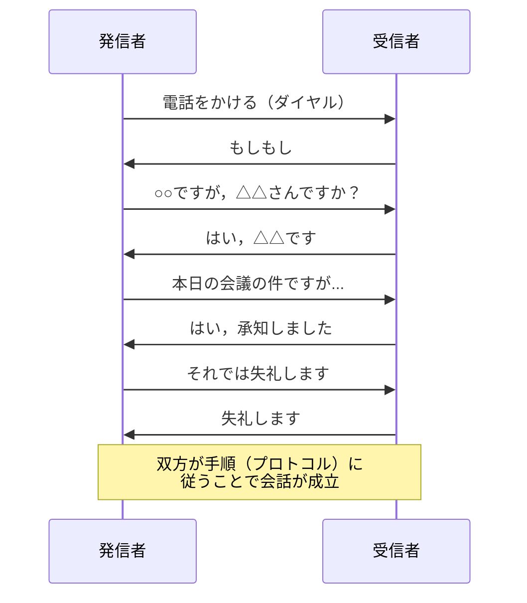
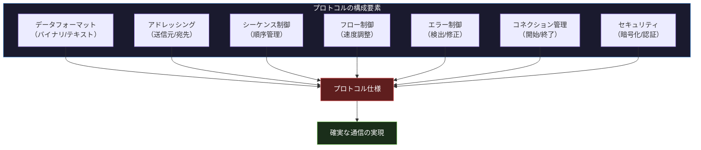
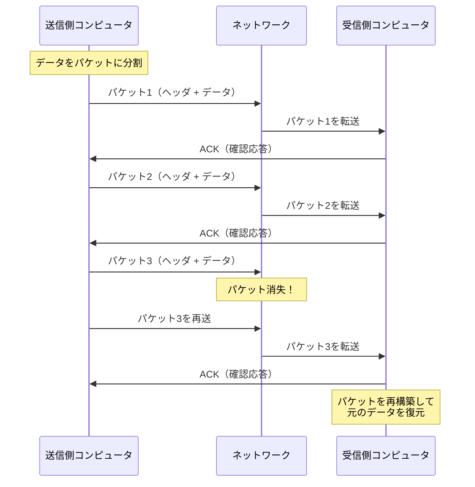

import { Aside } from '@astrojs/starlight/components';

## この節で学ぶこと

プロトコルとは何か，なぜ通信にプロトコルが必要なのかを理解します．
人間の会話を例にプロトコルの概念を直感的に把握し，コンピュータ通信におけるプロトコルの役割を学びます．
パケット交換方式でのプロトコルの具体的な動作を理解します．

## 1.3.1 プロトコルがいっぱい！

コンピュータネットワークの世界には，非常に多くのプロトコルが存在します．TCP，UDP，IP，HTTP，HTTPS，FTP，SMTP，DNS，ARP，ICMP，BGP，OSPF...数え上げればきりがありません．

これらのプロトコルはそれぞれ異なる役割を担っています．例えば:

- IP: データの宛先指定と転送
- TCP: 信頼性のあるデータ配送
- UDP: 高速で軽量なデータ配送
- HTTP/HTTPS: Webページの取得
- SMTP: 電子メールの送信
- DNS: ドメイン名からIPアドレスへの変換

なぜこれほど多くのプロトコルが必要なのでしょうか？ それは，ネットワーク通信が複雑な処理の組み合わせから成り立っており，各段階で適切なルールが必要だからです．1つのプロトコルですべてを賄うのではなく，機能ごとにプロトコルを分離することで，柔軟性と拡張性が確保されています．

## 1.3.2 プロトコルが必要な理由

プロトコル（protocol）とは，もともと「外交儀礼」や「議定書」を意味する言葉です．コンピュータネットワークにおいては，通信を行うために事前に取り決められた「約束事」や「規約」のことを指します．

プロトコルが必要な理由は以下の通りです:

- 異なるメーカーのコンピュータが通信できるようにするため: メーカーごとに独自の方式を使っていては相互通信ができない
- 通信の手順を統一するため: データの送り方，受け取り方，エラー処理の方法を統一することで確実な通信が可能になる
- 複雑な通信を整理するため: 通信プロセスを機能ごとに分割し，それぞれにプロトコルを定義することで管理しやすくなる

共通のプロトコルに従うことで，WindowsのPCからmacOSのサーバーへ，あるいはAndroidのスマートフォンからLinuxのWebサーバーへと，異なるOS・異なるハードウェア間の通信が可能になります．

## 1.3.3 プロトコルを会話で考えると

プロトコルの概念を理解するために，人間の会話に例えてみましょう．

電話での会話を考えます:

1. 発信者が電話番号をダイヤルする（宛先の指定）
2. 受信者の電話が鳴る（着信の通知）
3. 受信者が電話を取り「もしもし」と言う（通信の開始）
4. 発信者が「○○ですが」と名乗る（送信者の識別）
5. 会話を行う（データの交換）
6. 「それでは失礼します」と言って電話を切る（通信の終了）

この一連の手順は，日本語で電話をかける際の「プロトコル」と言えます．もし両者がこの手順に従わなければ，まともな会話は成立しません．

しかし，発信者が日本語で話し，受信者が英語しか理解できない場合はどうでしょうか？ 「言語」という基本的なプロトコルが一致していないため，通信（会話）は成立しません．コンピュータ通信でも同様に，送信側と受信側が同じプロトコルに対応している必要があります．

## 1.3.4 コンピュータでのプロトコル

コンピュータ通信におけるプロトコルには，以下のような要素が含まれます:

- データのフォーマット: データをどのような形式で表現するか（バイナリ，テキスト，圧縮など）
- アドレッシング: 送信元と宛先をどのように指定するか
- シーケンス制御: データの順序をどのように管理するか
- フロー制御: 送信速度をどのように調整するか
- エラー制御: 通信エラーをどのように検出・修正するか
- コネクション管理: 通信の開始・維持・終了をどのように行うか
- セキュリティ: データの暗号化や認証をどのように行うか

これらの要素をすべて1つのプロトコルで定義すると，非常に複雑で扱いにくくなります．そのため，各要素を階層的に分離し，異なるプロトコルで処理する「階層化」という設計手法が採用されています（詳細は1.5節で解説）．

## 1.3.5 パケット交換でのプロトコル

現在のコンピュータネットワークでは，パケット交換方式が広く使用されています．パケット交換方式では，送信するデータをパケット（小包）と呼ばれる小さな単位に分割して送信します．

パケット交換でのプロトコルは，以下のような処理を定義します:

- パケット化: 送信データをパケットに分割する方法
- ヘッダの付加: 各パケットに宛先アドレス，送信元アドレス，シーケンス番号などの制御情報（ヘッダ）を付加する方法
- ルーティング: パケットをネットワーク内で目的地まで転送する方法
- 再構築: 受信側でパケットを元のデータに再構築する方法
- 確認応答: パケットが正しく届いたことを送信側に通知する方法
- 再送: パケットが届かなかった場合に再度送信する方法

パケット交換方式のプロトコルにより，大きなデータファイルの転送でも，一部のパケットが失われた場合にはそのパケットだけを再送すればよく，効率的な通信が実現します．

回線交換方式（従来の電話網）では通信中に回線を占有しますが，パケット交換方式では回線を複数の通信で共有できるため，ネットワーク資源を効率的に利用できます．

<Aside type="tip" title="FDE実務での活用">
FDEとしてAIサービス間の通信プロトコルを選定する際，gRPCとRESTの使い分けが重要になります:
- gRPC: Protocol Buffersによるバイナリシリアライゼーションで通信効率が高い．AI/MLサービスのマイクロサービス間通信，ストリーミング推論（サーバーサイドストリーミング），モデルサーバーとの通信に適している
- REST/HTTP: JSONベースで可読性が高い．外部向けAPI，Webフロントエンドとの通信，シンプルなCRUD操作に適している
- Protocol Buffersは型安全なスキーマ定義を提供し，言語間の互換性を保ちながらJSONの約5〜10倍の通信効率を実現する．大量の推論リクエストを処理するシステムでは，この効率差が大きなコスト削減につながる
</Aside>

## まとめ

- プロトコルとは，コンピュータ通信における「約束事」や「規約」のこと
- ネットワークには多数のプロトコルが存在し，それぞれ異なる役割（アドレッシング，転送，信頼性など）を担う
- 異なるメーカー・OS間での通信を可能にするためにプロトコルの標準化が不可欠
- 人間の会話と同様に，通信の手順（開始，データ交換，終了）が定義されている
- パケット交換方式では，データをパケットに分割し，ヘッダに制御情報を付加して送信する
- 確認応答と再送により，信頼性のある通信を実現する

## 理解度チェック

Q1: プロトコルとは何ですか？なぜ必要ですか？

プロトコルとは，コンピュータネットワークにおいて通信を行うために事前に取り決められた「約束事」や「規約」のことです．異なるメーカーのコンピュータやOSが相互に通信できるようにするため，データの形式，通信手順，エラー処理などを統一した規約として定義する必要があります．プロトコルがなければ，各コンピュータは独自の方式で通信しようとするため，相互接続ができません．

Q2: パケット交換方式と回線交換方式の違いを説明してください．

回線交換方式は，通信開始から終了まで物理的な回線を専有する方式です（従来の電話網）．一方，パケット交換方式は，データを小さなパケットに分割して送信し，ネットワーク上の回線を複数の通信で共有する方式です．パケット交換方式は回線利用効率が高く，障害耐性にも優れています．

Q3: パケットのヘッダにはどのような情報が含まれますか？

パケットのヘッダには以下のような制御情報が含まれます:
- 宛先アドレス: データを届ける先のアドレス
- 送信元アドレス: データを送信した元のアドレス
- シーケンス番号: パケットの順序を識別する番号
- プロトコル識別子: 使用しているプロトコルの種類
- データ長: パケットに含まれるデータのサイズ
- チェックサム: データの破損を検出するための値

Q4: コンピュータ通信のプロトコルに含まれる要素を5つ挙げてください．

1. データのフォーマット: データの表現形式の定義
2. アドレッシング: 送信元と宛先の指定方法
3. シーケンス制御: データの順序管理
4. エラー制御: 通信エラーの検出と修正
5. フロー制御: 送信速度の調整方法

その他にも，コネクション管理やセキュリティ（暗号化・認証）なども重要な要素です．

