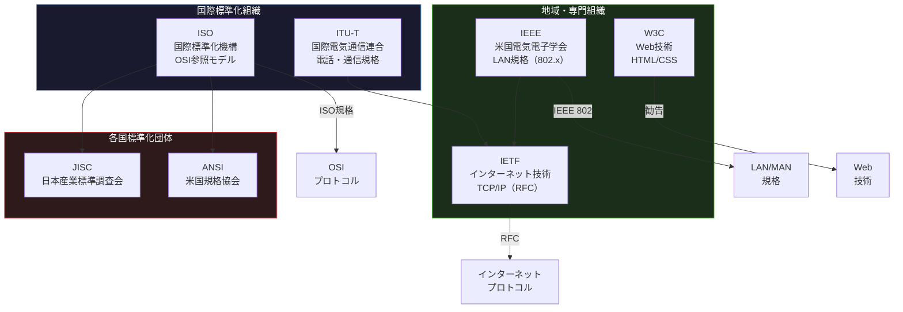
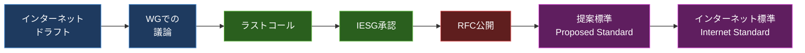

import { Aside } from '@astrojs/starlight/components';

## この節で学ぶこと

プロトコルの標準化がなぜ重要なのか，その歴史的背景を理解します．
ISO，IEEE，IETF，W3Cなどの主要な標準化団体とその役割を学びます．
標準化のプロセスを知り，RFCなどの仕様書がどのように策定されるかを理解します．

## 1.4.1 コンピュータ通信の登場から標準化へ

コンピュータネットワークの初期には，各メーカーが独自のプロトコルを開発していました．IBM は SNA（Systems Network Architecture），DECはDECnet，AppleはAppleTalk，NovellはIPX/SPXといった具合です．

これらのプロトコルは自社製品間の通信では問題なく動作しましたが，異なるメーカーの製品間では通信ができないという深刻な問題がありました．この状況は「ベンダーロックイン」と呼ばれ，ユーザーは一度特定のメーカーの製品を導入すると，他のメーカーの製品に乗り換えることが困難でした．

この問題を解決するために，メーカーに依存しない共通のプロトコルを策定する「標準化」の取り組みが始まりました．標準化によって以下のメリットが生まれます:

- 相互接続性: 異なるメーカーの製品が相互に通信可能
- 競争の促進: ユーザーがベンダーを自由に選択でき，価格・品質の競争が促進される
- 技術の普及: 共通の仕様に基づく実装が増え，技術の普及が加速する
- コスト削減: 大量生産によるスケールメリットが生まれ，製品価格が下がる

標準化には2つのアプローチがあります:

- デジュールスタンダード（de jure standard）: 公的な標準化団体が策定する標準規格．ISO規格やIEEE規格など
- デファクトスタンダード（de facto standard）: 市場での広い普及によって事実上の標準となった規格．TCP/IPやイーサネットなど

## 1.4.2 プロトコルの標準化

プロトコルの標準化を担う主要な組織とその役割を見ていきましょう．

### ISO（International Organization for Standardization）

国際標準化機構．各国の標準化団体で構成される国際的な組織です．ネットワーク分野ではOSI参照モデルとOSIプロトコルスイートを策定しました．ISOの規格は「ISO XXXX」（番号）の形式で命名されます．

### IEEE（Institute of Electrical and Electronics Engineers）

米国電気電子学会．電気・電子工学の分野における世界最大の専門家組織です．ネットワーク分野では，IEEE 802委員会がLAN/MAN（ローカルエリアネットワーク/メトロポリタンエリアネットワーク）に関する標準を策定しています．

主なIEEE 802規格:

- IEEE 802.3: イーサネット
- IEEE 802.11: 無線LAN（Wi-Fi）
- IEEE 802.1Q: VLAN
- IEEE 802.1X: 認証

### IETF（Internet Engineering Task Force）

インターネット技術の標準化を行う組織です．TCP/IPをはじめとするインターネットプロトコルの仕様はRFC（Request for Comments）という文書で公開されます．

IETFの特徴:

- オープンな参加: 誰でも参加可能
- ラフコンセンサスとランニングコード: 大まかな合意と実際に動く実装を重視
- ボトムアップアプローチ: 実際のニーズに基づいた標準化

RFCの主な例:

- RFC 791: IP（Internet Protocol）
- RFC 793: TCP（Transmission Control Protocol）
- RFC 2616: HTTP/1.1
- RFC 7540: HTTP/2
- RFC 9114: HTTP/3

### W3C（World Wide Web Consortium）

WWW（World Wide Web）に関する技術の標準化を行う団体です．HTML，CSS，XMLなどのWeb技術の仕様を策定しています．

### ITU-T（International Telecommunication Union - Telecommunication Standardization Sector）

国際電気通信連合の電気通信標準化部門．電話網やデジタル通信に関する国際標準を策定しています．X.25やATMなどの規格を策定しました．

### 標準化プロセスの例: IETFのRFC策定

IETFにおけるRFC策定のプロセスは以下の通りです:

1. インターネットドラフト（Internet-Draft）: 仕様の草案を公開する（有効期限6ヶ月）
2. ワーキンググループでの議論: メーリングリストや会合で技術的な議論を行う
3. ラストコール: 仕様の最終確認を全体に呼びかける
4. IESG（Internet Engineering Steering Group）による承認
5. RFC番号の付与と公開

IETFの特徴的な点は，「ラフコンセンサスとランニングコード」という理念です．完全な合意を求めるのではなく，おおまかな合意と実際に動く実装を重視します．これにより，迅速な標準化と実用的な仕様の策定が可能になっています．

<Aside type="tip" title="FDE実務での活用">
FDEとして新しい技術を導入する際，RFCの読み方を知っておくことは大きな武器になります．例えば:
- HTTP/2（RFC 7540）やHTTP/3（RFC 9114）の仕様を理解することで，AIモデルAPIのパフォーマンスチューニングに活用できる
- WebSocket（RFC 6455）の仕様を読むことで，リアルタイム推論ストリーミングの設計判断ができる
- RFCは https://www.rfc-editor.org/ で無料公開されている
- RFC文書の構造は「Abstract → Introduction → Terminology → Specification → Security Considerations」のパターンが一般的で，まずAbstractを読んで概要を把握し，必要な箇所だけ詳細を確認するのが効率的
</Aside>

## まとめ

- 初期のネットワークでは各メーカーが独自プロトコルを使用しており，相互接続ができなかった
- 標準化によって異なるメーカーの製品間での通信が可能になり，競争促進とコスト削減が実現した
- 標準にはデジュールスタンダード（公的標準）とデファクトスタンダード（事実上の標準）がある
- 主要な標準化組織として，ISO（国際標準），IEEE（LAN規格），IETF（インターネットプロトコル），W3C（Web技術），ITU-T（電気通信）がある
- IETFは「ラフコンセンサスとランニングコード」の理念に基づき，RFCとしてインターネットプロトコルの仕様を公開している
- TCP/IPはデファクトスタンダードから出発し，IETFを通じて継続的に標準化が進められている

## 理解度チェック

Q1: デジュールスタンダードとデファクトスタンダードの違いを説明してください．

デジュールスタンダード（de jure standard）は，ISOやIEEEなどの公的な標準化団体が正式なプロセスを経て策定した標準規格です．一方，デファクトスタンダード（de facto standard）は，公的な手続きを経ずに，市場での広い普及や業界の支持によって事実上の標準となった規格です．TCP/IPはデファクトスタンダードの代表的な例です．

Q2: IETFの「ラフコンセンサスとランニングコード」とはどのような理念ですか？

「ラフコンセンサス（rough consensus）」とは，完全な全員一致を求めるのではなく，おおまかな合意を得ることで標準化を進める考え方です．「ランニングコード（running code）」とは，仕様が実際に動作する実装として存在することを重視する考え方です．理論上の完璧さよりも，実用性と迅速な標準化を優先する姿勢を表しています．

Q3: IEEE 802委員会が策定した主な規格を3つ挙げ，それぞれの内容を説明してください．

1. IEEE 802.3（イーサネット）: 有線LANの標準規格．ケーブルの種類，通信速度，フレーム形式などを規定
2. IEEE 802.11（無線LAN / Wi-Fi）: 無線LANの標準規格．周波数帯，変調方式，アクセス制御などを規定
3. IEEE 802.1Q（VLAN）: 仮想LAN（VLAN）の標準規格．物理的に1つのネットワークを論理的に複数のネットワークに分割する方法を規定

Q4: プロトコルの標準化がベンダーロックインの解消にどのように貢献しましたか？

プロトコルの標準化により，すべてのメーカーが共通の規格に基づいて製品を開発するようになりました．これにより，ユーザーは特定のメーカーに依存せず，異なるメーカーの製品を自由に組み合わせてネットワークを構築できるようになりました．結果として，メーカー間の競争が促進され，製品の品質向上と価格低下が実現しました．

