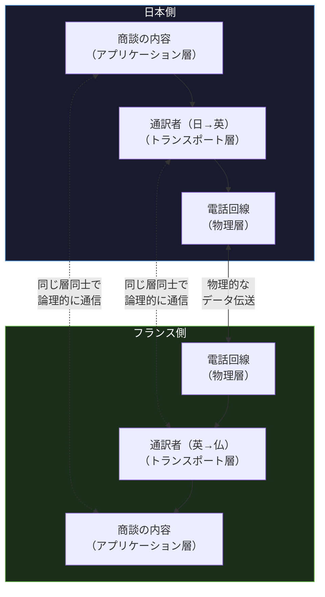
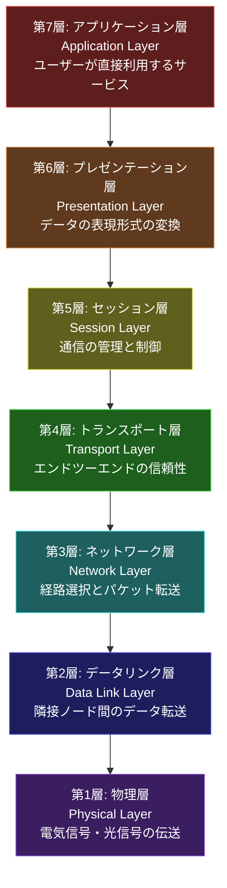
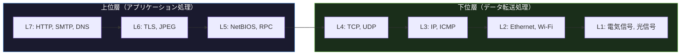

import { Aside } from '@astrojs/starlight/components';

## この節で学ぶこと

プロトコルを階層化するメリットと設計思想を理解します．
人間の会話を例に階層化の概念を直感的に把握します．
OSI参照モデルの7層構造と各層の役割を詳しく学びます．

## 1.5.1 プロトコルの階層化

1.3節で見たように，コンピュータ通信のプロトコルには多くの要素が含まれます．これらをすべて1つのプロトコルで定義すると，仕様が膨大で複雑になり，実装や保守が困難になります．

そこで，通信機能を複数の「層（レイヤー）」に分割し，各層に特定の役割を割り当てる「階層化」という設計手法が採用されています．

階層化のメリット:

- 複雑さの分割: 各層は自分の担当する機能だけに集中すればよい
- 独立した開発: 各層は上下の層とのインタフェースさえ守れば，内部の実装を自由に変更できる
- 柔軟な組み合わせ: 特定の層のプロトコルを別のプロトコルに置き換えることが容易
- 再利用性: 下位層のプロトコルは，上位層の異なるプロトコルから共通に利用できる

例えば，アプリケーション層のHTTPは，トランスポート層のTCPを利用します．将来，TCPよりも優れたトランスポートプロトコルが開発された場合，HTTP自体を変更することなく，トランスポート層のプロトコルだけを置き換えることができます．実際に，HTTP/3ではTCPの代わりにQUIC（UDPベース）が採用されました．

階層化の重要な原則:

- 各層は下位層が提供するサービスを利用する
- 各層は上位層にサービスを提供する
- 同じ層のプロトコル同士が通信する（ピアツーピア通信）
- 隣接する層とのインタフェースが明確に定義されている

## 1.5.2 会話で階層化を考えると

階層化の概念を理解するために，国際的なビジネス会話を例に考えてみましょう．

日本のビジネスパーソンAが，フランスのビジネスパーソンBと商談を行う場合を想定します:

- アプリケーション層: 商談の内容（商品仕様，価格，納期の交渉）
- プレゼンテーション層: データの表現形式（通貨単位，日付形式，数値の表記）
- セッション層: 会話の管理（会議の開始・終了，議題の切り替え）
- トランスポート層: 通訳者（日本語⇔フランス語の翻訳）
- ネットワーク層: 通信経路（テレビ会議か電話会議か）
- データリンク層: 通信手段（光ファイバー，Wi-Fi）
- 物理層: 物理的な伝送媒体（電気信号，光信号）

この例のポイントは，各層が独立していることです:

- AとBは商談の内容（アプリケーション層）に集中でき，通訳がどの言語で翻訳するか（トランスポート層）を気にする必要がない
- 通訳者は翻訳に集中でき，通信手段がWi-Fiか有線LANか（データリンク層）を気にする必要がない
- 通信手段をWi-Fiから有線LANに変更しても，商談の内容には影響しない

## 1.5.3 OSI参照モデル

OSI参照モデル（Open Systems Interconnection Reference Model）は，ISO（国際標準化機構）が1984年に策定した，ネットワークプロトコルの階層モデルです．通信機能を7つの層に分割して定義しています．

「OSI」は「開放型システム間相互接続」の略で，異なるシステム間の通信を可能にするための共通の枠組みを提供することを目的としています．

OSI参照モデルは実際のプロトコルとして広く実装されたわけではありませんが，ネットワーク技術を理解・説明するための「共通言語」として非常に重要な役割を果たしています．ネットワークエンジニアが「レイヤー3の問題だ」「レイヤー7で処理する」といった表現を使うのは，このOSI参照モデルに基づいています．

OSI参照モデルの7層は，上位の3層（アプリケーション層，プレゼンテーション層，セッション層）と下位の4層（トランスポート層，ネットワーク層，データリンク層，物理層）に大別できます:

- 上位3層: アプリケーションに関する処理を担当
- 下位4層: データの転送に関する処理を担当

## 1.5.4 OSI参照モデルの各層の役割

### 第7層: アプリケーション層（Application Layer）

ユーザーが利用するアプリケーション（Webブラウザ，メールソフトなど）とネットワークの間のインタフェースを提供する層です．ユーザーが直接操作するサービスに最も近い層です．

代表的なプロトコル:

- HTTP/HTTPS: Webアクセス
- SMTP/POP/IMAP: 電子メール
- FTP: ファイル転送
- DNS: 名前解決
- SSH: リモートログイン
- SNMP: ネットワーク管理

### 第6層: プレゼンテーション層（Presentation Layer）

データの表現形式を管理する層です．送信側と受信側でデータの表現方法が異なる場合に，相互に理解できる形式に変換します．

主な機能:

- 文字コードの変換（ASCII，UTF-8，Shift_JISなど）
- データの圧縮・展開
- データの暗号化・復号化
- 画像や動画のエンコード・デコード

### 第5層: セッション層（Session Layer）

通信の「セッション」（一連の通信のまとまり）を管理する層です．通信の開始から終了までの制御を行います．

主な機能:

- セッションの確立・維持・終了
- 同期制御（チェックポイントの設定）
- 対話制御（全二重通信，半二重通信の管理）
- 障害からの回復（セッション再開）

### 第4層: トランスポート層（Transport Layer）

送信元から宛先までの「エンドツーエンド」のデータ転送を管理する層です．データが確実に，正しい順序で届くことを保証します．

主な機能:

- ポート番号によるアプリケーションの識別
- データの分割と再構築
- フロー制御（送信速度の調整）
- エラー検出と再送
- コネクションの管理

代表的なプロトコル:

- TCP: 信頼性のある通信（コネクション型）
- UDP: 高速・軽量な通信（コネクションレス型）

### 第3層: ネットワーク層（Network Layer）

異なるネットワーク間でのパケットの転送と経路選択（ルーティング）を担当する層です．送信元から宛先まで，複数のネットワークを経由してパケットを届けます．

主な機能:

- 論理アドレス（IPアドレス）によるアドレッシング
- ルーティング（最適な経路の選択）
- パケットのフラグメンテーション（分割）と再構築
- 輻輳制御

代表的なプロトコル:

- IPv4 / IPv6: インターネットプロトコル
- ICMP: 制御メッセージプロトコル
- OSPF，BGP: ルーティングプロトコル

### 第2層: データリンク層（Data Link Layer）

物理的に接続された隣接ノード間でのデータフレームの転送を担当する層です．物理層が提供するビット列の伝送を，意味のあるデータフレームの転送に変換します．

主な機能:

- フレーミング（データのフレーム化）
- 物理アドレス（MACアドレス）によるアドレッシング
- メディアアクセス制御（CSMA/CD，CSMA/CAなど）
- エラー検出（FCSによるフレームチェック）
- フロー制御

代表的なプロトコル・規格:

- イーサネット（IEEE 802.3）
- 無線LAN（IEEE 802.11）
- PPP

### 第1層: 物理層（Physical Layer）

ビット列（0と1）を電気信号，光信号，電波などの物理的な信号に変換して伝送する層です．ネットワークの最下層に位置し，物理的な接続に関する仕様を定義します．

主な機能:

- 信号の変換（デジタル⇔アナログ）
- 伝送速度の規定
- コネクタの形状やピン配置の規定
- 通信媒体（ケーブル，光ファイバー，無線）の仕様

代表的な規格:

- RS-232C: シリアル通信
- RJ-45: LANケーブルコネクタ
- 光ファイバー規格

### 各層のプロトコル対応表

| 層 | 名称 | 代表的なプロトコル/規格 | データ単位 |
|---|---|---|---|
| 7 | アプリケーション層 | HTTP，SMTP，DNS，FTP，SSH | メッセージ |
| 6 | プレゼンテーション層 | SSL/TLS，JPEG，MPEG | メッセージ |
| 5 | セッション層 | NetBIOS，RPC | メッセージ |
| 4 | トランスポート層 | TCP，UDP，QUIC | セグメント/データグラム |
| 3 | ネットワーク層 | IP，ICMP，ARP | パケット |
| 2 | データリンク層 | イーサネット，Wi-Fi，PPP | フレーム |
| 1 | 物理層 | RS-232C，RJ-45，光ファイバー | ビット |

<Aside type="tip" title="FDE実務での活用">
AIモデルのAPIリクエストがOSI各層をどのように通過するかを理解することは，トラブルシューティングに直結します．例えば，クライアントからOpenAI互換APIにリクエストを送る場合:
- 第7層（アプリケーション層）: HTTPSリクエストの構築（POST /v1/chat/completions）
- 第6層（プレゼンテーション層）: TLSによる暗号化，JSONデータのシリアライゼーション
- 第4層（トランスポート層）: TCPコネクションの確立（3ウェイハンドシェイク），ポート443
- 第3層（ネットワーク層）: IPルーティング（CDN経由でAPIサーバーへ）
- 第2層（データリンク層）: イーサネットフレームとしてルーターへ転送
- 第1層（物理層）: 光ファイバーや無線で物理的に信号を伝送

「APIが遅い」という問題に対して，DNS解決の遅延（L7），TLSハンドシェイクの遅延（L6），TCP再送（L4），ルーティングの問題（L3）など，各層で原因を切り分けることで効率的なデバッグが可能になります．
</Aside>

## まとめ

- プロトコルの階層化により，複雑な通信機能を独立した層に分割し，開発・保守・変更が容易になる
- 各層は下位層のサービスを利用し，上位層にサービスを提供する
- OSI参照モデルは通信機能を7層に分割した国際標準の参照モデル
- 上位3層（第5〜7層）はアプリケーション処理，下位4層（第1〜4層）はデータ転送を担当
- 各層にはそれぞれ代表的なプロトコルがあり，データの単位（メッセージ，セグメント，パケット，フレーム，ビット）が異なる
- OSI参照モデルは実際のプロトコルスイートとしてよりも，ネットワーク技術を理解するための「共通言語」として広く利用されている

## 理解度チェック

Q1: プロトコルを階層化するメリットを3つ挙げてください．

1. 複雑さの分割: 各層が特定の機能だけに集中できるため，設計・実装が容易になる
2. 独立した開発: 各層は上下の層とのインタフェースを守れば，内部実装を自由に変更できる（例: TCP上のHTTPを変更せずに，TCPをQUICに置き換え可能）
3. 再利用性: 下位層のプロトコルは複数の上位層プロトコルから共通に利用できる（例: IPはTCPからもUDPからも利用される）

Q2: OSI参照モデルの第4層（トランスポート層）の役割と代表的なプロトコルを説明してください．

トランスポート層は，送信元から宛先までの「エンドツーエンド」のデータ転送を管理する層です．ポート番号によるアプリケーションの識別，データの分割と再構築，フロー制御，エラー検出と再送などの機能を提供します．代表的なプロトコルはTCP（信頼性のあるコネクション型通信）とUDP（高速・軽量なコネクションレス型通信）です．

Q3: ネットワーク層（第3層）とデータリンク層（第2層）の違いを説明してください．

ネットワーク層は，異なるネットワーク間でのパケット転送と経路選択（ルーティング）を担当します．論理アドレス（IPアドレス）を使用し，送信元から最終的な宛先まで複数のネットワークを経由してパケットを届けます．

一方，データリンク層は，物理的に接続された隣接ノード間でのフレーム転送を担当します．物理アドレス（MACアドレス）を使用し，同一ネットワーク内のノード間でデータを転送します．

つまり，ネットワーク層は「最終目的地までの経路」を扱い，データリンク層は「隣のノードまでの転送」を扱います．

Q4: HTTP/3でTCPの代わりにQUIC（UDPベース）が採用された事実は，階層化のどのようなメリットを示していますか？

これは階層化における「独立した開発」と「柔軟な組み合わせ」のメリットを示しています．HTTP（アプリケーション層）のプロトコルとしての基本的な機能を変えることなく，トランスポート層のプロトコルをTCPからQUICに置き換えることができました．階層間のインタフェースが明確に定義されているため，特定の層のプロトコルを新しいものに差し替えても，他の層に影響を与えません．

Q5: OSI参照モデルの各層でデータの呼び方（データ単位）はどのように変わりますか？

- 第7〜5層（アプリケーション層〜セッション層）: メッセージ（message）
- 第4層（トランスポート層）: セグメント（TCPの場合）/ データグラム（UDPの場合）
- 第3層（ネットワーク層）: パケット（packet）
- 第2層（データリンク層）: フレーム（frame）
- 第1層（物理層）: ビット（bit）

送信時にはデータが上位層から下位層へ渡される際に各層のヘッダが付加され（カプセル化），受信時には下位層から上位層へ渡される際にヘッダが除去されます（非カプセル化）．

