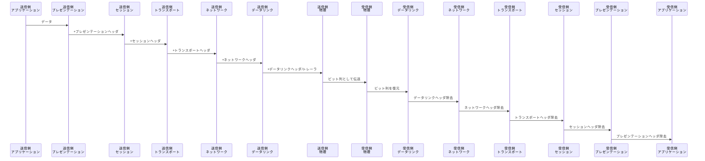
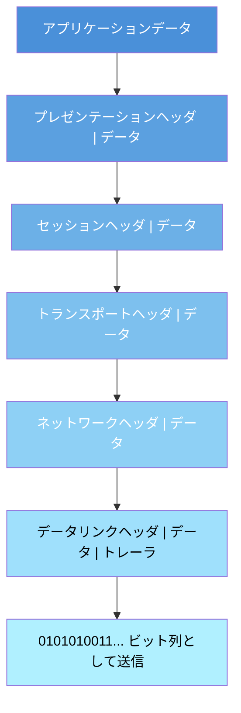
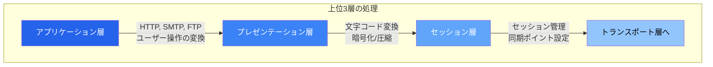
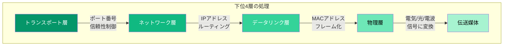

import { Aside } from '@astrojs/starlight/components';

## この節で学ぶこと

OSI参照モデルの7階層が，実際の通信においてどのように連携して動作するかを学びます．
送信側でデータにヘッダが付加されていく「カプセル化」の過程と，受信側でヘッダが取り除かれる「非カプセル化」の過程を理解します．
セッション層以上の上位層とトランスポート層以下の下位層で，処理の役割がどう異なるかを明確にします．

## 1.6.1 7階層の通信

OSI参照モデルでは，通信を7つの階層に分けて考えます．送信側のアプリケーション層から物理層に向かってデータが処理され，受信側では物理層からアプリケーション層に向かってデータが復元されます．

各層では，自分の層に必要な制御情報（ヘッダ）を付加してから下の層に渡します．この過程をカプセル化（Encapsulation）と呼びます．受信側では逆に，各層で自分宛のヘッダを読み取って処理し，残りのデータを上の層に渡します．

このように，送信側と受信側の同じ層同士が論理的に通信しているように見えます．これを「ピア・トゥ・ピア通信」と呼びます．実際のデータは物理層を通じて伝送されますが，各層のプロトコルは対向する同じ層とだけやり取りしているかのように設計されています．

### カプセル化の過程

送信データが各層を通過するたびにヘッダが付加され，最終的に物理層でビット列として送出されます．

各層で付加されるヘッダには，その層のプロトコルが必要とする制御情報が含まれます．たとえば，ネットワーク層のヘッダにはIPアドレスが，データリンク層のヘッダにはMACアドレスが含まれます．

## 1.6.2 セッション層以上での処理

セッション層以上の上位3層（アプリケーション層，プレゼンテーション層，セッション層）は，アプリケーション間の通信を実現するための処理を担当します．

### アプリケーション層の処理

アプリケーション層では，ユーザーが利用するアプリケーションプロトコルに基づいた処理が行われます．たとえば，Webブラウザでページを閲覧する場合はHTTPプロトコルが使用され，メールの送信にはSMTPプロトコルが使用されます．

アプリケーション層は，ユーザーの操作をネットワーク通信に変換する最初の窓口です．ここで生成されたデータが，下位層に渡されて最終的にネットワーク上を伝送されます．

### プレゼンテーション層の処理

プレゼンテーション層は，データの表現形式を管理します．具体的には以下の処理を行います．

- データの符号化と復号化（文字コードの変換など）
- データの暗号化と復号
- データの圧縮と展開

たとえば，送信側がEBCDICで作成したデータを，受信側がASCIIで読めるように変換するのはプレゼンテーション層の役割です．TLS/SSLによる暗号化もこの層に対応する処理と考えることができます．

### セッション層の処理

セッション層は，アプリケーション間の論理的な接続（セッション）の確立，維持，解放を管理します．

- セッションの開始と終了の制御
- データ交換の同期ポイントの設定
- 通信の再開（障害発生時のリカバリポイントからの再開）

たとえば，大量のファイル転送中に障害が発生した場合，セッション層がチェックポイントを設けていれば，最初からやり直すことなく途中から再開できます．

## 1.6.3 トランスポート層以下での処理

トランスポート層以下の4層（トランスポート層，ネットワーク層，データリンク層，物理層）は，実際のデータ転送を担当します．

### トランスポート層の処理

トランスポート層は，送信元と宛先のアプリケーション間でのエンドツーエンド（端から端まで）の通信を管理します．

- ポート番号によるアプリケーションの識別
- データの分割と再構築
- 信頼性の確保（TCPの場合：再送制御，順序制御，フロー制御）
- コネクションの管理（TCPの場合）

トランスポート層のヘッダには，送信元と宛先のポート番号，シーケンス番号などの情報が含まれます．

### ネットワーク層の処理

ネットワーク層は，異なるネットワーク間でのデータ転送を担当します．

- IPアドレスによる送信元・宛先の識別
- ルーティング（最適な経路の選択）
- パケットの分割と再構築（フラグメンテーション）

ルーターはネットワーク層で動作する機器で，IPアドレスに基づいてパケットの転送先を決定します．

### データリンク層の処理

データリンク層は，直接接続されたノード間でのデータ転送を担当します．

- MACアドレスによるノードの識別
- フレームの生成（ヘッダとトレーラの付加）
- エラー検出（FCSによる誤り検出）
- メディアアクセス制御

### 物理層の処理

物理層は，ビット列を電気信号や光信号に変換して伝送媒体上に送出します．

- 電気信号・光信号・電波への変換
- コネクタやケーブルの仕様
- 信号のタイミング制御

### 中継機器での処理

通信経路上にルーターやスイッチなどの中継機器がある場合，これらの機器は必要な層までヘッダを解析して転送処理を行います．

- ルーター: ネットワーク層（第3層）まで処理し，IPアドレスに基づいて転送先を決定
- ブリッジ/L2スイッチ: データリンク層（第2層）まで処理し，MACアドレスに基づいて転送先を決定
- リピーター/ハブ: 物理層（第1層）のみ処理し，信号を増幅して転送

<Aside type="tip" title="FDE実務での活用">
パケットキャプチャツール（Wiresharkなど）を使うと，実際の通信におけるカプセル化の過程を可視化できます．AI APIとの通信をキャプチャした場合，データリンク層のイーサネットフレーム，ネットワーク層のIPパケット，トランスポート層のTCPセグメント，アプリケーション層のHTTPリクエスト/レスポンスを層別に確認できます．トラブルシューティングでは「どの層まで正常に動作しているか」を切り分けることが基本アプローチとなります．
</Aside>

## まとめ

- OSI参照モデルの7階層は，送信側でカプセル化（ヘッダの付加），受信側で非カプセル化（ヘッダの除去）という処理で連携する
- 上位3層（アプリケーション層，プレゼンテーション層，セッション層）はアプリケーション間の通信内容に関する処理を担当する
- 下位4層（トランスポート層，ネットワーク層，データリンク層，物理層）は実際のデータ転送に関する処理を担当する
- 同じ層同士が論理的に通信する「ピア・トゥ・ピア通信」の考え方が階層化の基本である
- 中継機器は対応する層までヘッダを解析して転送処理を行う

## 理解度チェック

Q1: カプセル化とは何ですか？

送信側で各層がデータに自分の層の制御情報（ヘッダ）を付加してから下の層に渡す処理のことです．受信側ではこの逆の処理（非カプセル化）が行われ，各層で自分宛のヘッダを読み取って処理し，残りのデータを上の層に渡します．

Q2: セッション層以上の上位3層はどのような役割を担いますか？

アプリケーション層はユーザーの操作をネットワーク通信に変換します．プレゼンテーション層はデータの表現形式（文字コード，暗号化，圧縮）を管理します．セッション層はアプリケーション間の論理的な接続（セッション）の確立・維持・解放を管理します．

Q3: ルーターは何層まで処理を行いますか？

ルーターはネットワーク層（第3層）まで処理を行います．IPアドレスを読み取り，ルーティングテーブルに基づいてパケットの転送先を決定します．一方，ブリッジ/L2スイッチはデータリンク層（第2層）まで，リピーター/ハブは物理層（第1層）のみを処理します．

Q4: ピア・トゥ・ピア通信とは何ですか？

送信側と受信側の同じ層同士が論理的に直接通信しているように見える通信のことです．実際のデータは物理層を通じて伝送されますが，各層のプロトコルは対向する同じ層のプロトコルとだけやり取りしているかのように設計されています．これにより，各層の実装を独立に変更することが可能になります．

