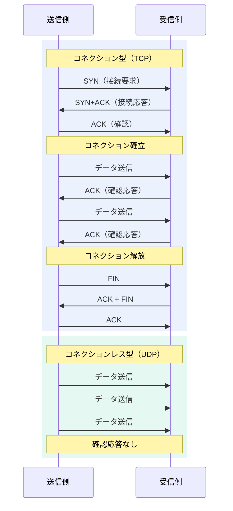
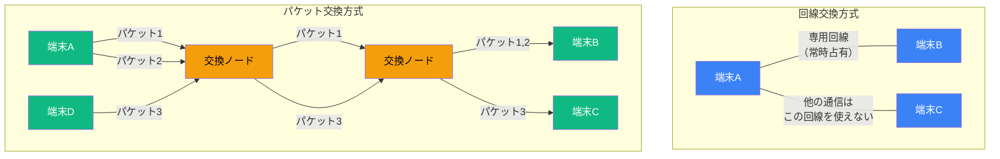
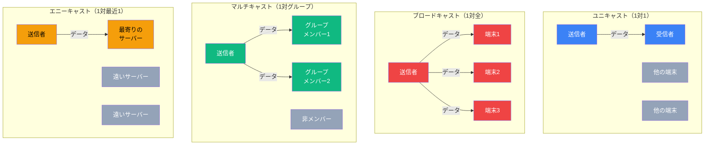

import { Aside } from '@astrojs/starlight/components';

## この節で学ぶこと

通信方式にはさまざまな分類があります．この節では，接続手順による分類（コネクション型とコネクションレス型），交換方式による分類（回線交換とパケット交換），通信相手の数による分類（ユニキャスト，ブロードキャスト，マルチキャスト，エニーキャスト）を学びます．
これらの分類を理解することで，TCPとUDPの使い分けや，ネットワーク設計の基本的な考え方が身につきます．

## 1.7.1 コネクション型とコネクションレス型

通信方式は，データ送信前にコネクション（論理的な接続）を確立するかどうかで2つに大別できます．

### コネクション型（Connection-Oriented）

コネクション型では，データの送信に先立って送信側と受信側の間でコネクションを確立します．電話をかけて相手が出てから会話を始めるイメージです．

コネクション型の特徴:

- データ送信前にコネクションを確立する
- データの到達を保証できる（確認応答，再送制御）
- データの順序が保証される
- フロー制御やふくそう制御が可能
- コネクションの確立・解放のオーバーヘッドがある

代表的なプロトコルとしてTCP（Transmission Control Protocol）があります．

### コネクションレス型（Connectionless）

コネクションレス型では，コネクションを確立せずにデータを送信します．郵便でハガキを送るイメージです．相手の状態を確認せず，ただデータを送り出します．

コネクションレス型の特徴:

- コネクションの確立が不要で即座に送信できる
- オーバーヘッドが少なく高速
- データの到達は保証されない
- データの順序が保証されない
- フロー制御やふくそう制御は上位層に委ねられる

代表的なプロトコルとしてUDP（User Datagram Protocol）があります．

### コネクション型とコネクションレス型の使い分け

用途に応じて適切な方式を選択します．信頼性が重要なファイル転送やWebページの取得にはコネクション型（TCP）を，リアルタイム性が重要な音声通話やDNS問い合わせにはコネクションレス型（UDP）を使用するのが一般的です．

## 1.7.2 回線交換からパケット交換へ

データの交換方式には，大きく分けて回線交換とパケット交換があります．

### 回線交換方式

回線交換方式は，通信の開始から終了まで，送信者と受信者の間に専用の通信回線を確保する方式です．従来の電話網がこの方式を採用しています．

回線交換方式の特徴:

- 通信中は専用の帯域が確保されるため，安定した通信品質が得られる
- 通信していない時間帯も回線を占有するため，効率が悪い
- 同時に通信できる相手の数が回線数で制限される

### パケット交換方式

パケット交換方式は，データを小さな単位（パケット）に分割し，複数の通信が同じ回線を共有する方式です．現在のインターネットはこの方式を基盤としています．

パケット交換方式の特徴:

- 回線を複数の通信で共有でき，効率が良い
- バースト的な（瞬間的に大量の）データ通信に適している
- ネットワークが混雑すると遅延やパケットロスが発生する可能性がある
- 蓄積交換（store-and-forward）方式でパケットを中継する

### 回線交換からパケット交換への移行

初期のコンピュータ通信は電話網（回線交換）を利用していましたが，コンピュータ通信はバースト性が高く，回線交換方式では効率が悪いことがわかりました．そのため，パケット交換方式が開発され，現在のインターネットの基盤となっています．

パケット交換方式の登場により，1本の回線を複数の通信が同時に利用できるようになり，ネットワーク資源の利用効率が飛躍的に向上しました．

## 1.7.3 通信相手の数による通信方式の分類

通信には，送信先の数に応じて以下の分類があります．

### ユニキャスト（Unicast）

ユニキャストは，1対1の通信です．特定の1台の宛先にだけデータを送信します．通常のWebブラウジングやメールの送受信はユニキャストで行われます．

### ブロードキャスト（Broadcast）

ブロードキャストは，同一ネットワーク上のすべてのホストにデータを送信する通信です．ARP（Address Resolution Protocol）がブロードキャストの代表的な利用例です．ブロードキャストのデータは，同一ネットワーク（ブロードキャストドメイン）内のすべての機器が受信します．

### マルチキャスト（Multicast）

マルチキャストは，特定のグループに属するホストにのみデータを送信する通信です．映像配信やオンライン会議などで利用されます．ブロードキャストとは異なり，受信を希望するホストだけがグループに参加してデータを受信できます．

### エニーキャスト（Anycast）

エニーキャストは，同一のアドレスを持つ複数のホストのうち，最も近い（ルーティング的に近い）1台にデータを送信する通信です．DNS ルートサーバーやCDN（Content Delivery Network）で利用されています．

<Aside type="tip" title="FDE実務での活用">
AI推論APIの呼び出し（OpenAI API，Claude APIなど）はTCP（コネクション型）で通信します．HTTPSリクエストとして送信され，信頼性が確保されます．一方，リアルタイム音声AI（音声認識や音声合成のストリーミング）ではUDP（コネクションレス型）が使われることがあります．WebRTCベースの音声AIサービスでは，UDPの低レイテンシ特性を活かし，多少のパケットロスを許容して応答速度を優先します．ユースケースに応じたプロトコル選択がFDEの設計判断において重要です．
</Aside>

## まとめ

- コネクション型（TCP）は信頼性重視，コネクションレス型（UDP）はリアルタイム性・効率重視の通信方式
- 回線交換は専用回線を確保する方式，パケット交換はデータを分割して共有回線を利用する方式
- パケット交換方式の登場により，ネットワーク資源の利用効率が飛躍的に向上した
- 通信相手の数によって，ユニキャスト（1対1），ブロードキャスト（1対全），マルチキャスト（1対グループ），エニーキャスト（1対最近1）に分類される
- 用途に応じて適切な通信方式を選択することが重要

## 理解度チェック

Q1: コネクション型とコネクションレス型の最大の違いは何ですか？

コネクション型はデータ送信前にコネクション（論理的な接続）を確立し，データの到達や順序を保証できるのに対し，コネクションレス型はコネクションを確立せずにデータを送信するため，高速だがデータの到達や順序は保証されません．代表的なプロトコルは，コネクション型がTCP，コネクションレス型がUDPです．

Q2: パケット交換方式が回線交換方式より効率的な理由は何ですか？

回線交換方式では通信中ずっと専用回線を占有しますが，コンピュータ通信はバースト性が高く（データを送っていない時間が多い），この占有が無駄になります．パケット交換方式ではデータをパケットに分割して共有回線を利用するため，複数の通信が同じ回線を効率的に共有でき，ネットワーク資源の利用効率が飛躍的に向上します．

Q3: ブロードキャストとマルチキャストの違いを説明してください．

ブロードキャストは同一ネットワーク上のすべてのホストにデータを送信します．一方，マルチキャストは特定のグループに属するホストにのみデータを送信します．マルチキャストでは受信を希望するホストだけがグループに参加するため，不要な端末への負荷を減らすことができ，映像配信などに適しています．

Q4: エニーキャストはどのような場面で利用されますか？

エニーキャストは，同一アドレスを持つ複数のサーバーのうちルーティング的に最も近い1台にデータを送信する方式です．DNSルートサーバーやCDN（Content Delivery Network）で利用されており，ユーザーに地理的・ネットワーク的に最も近いサーバーからサービスを提供することで，応答速度の向上と負荷分散を実現しています．

