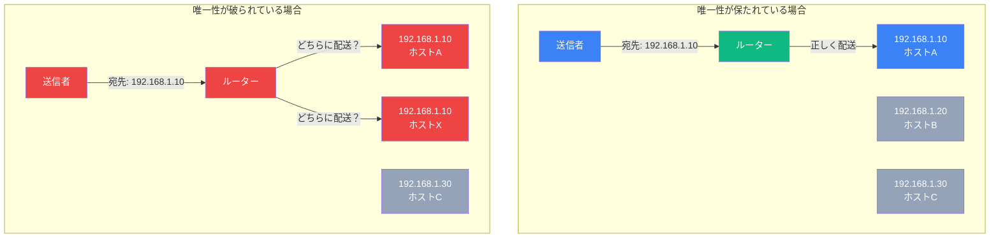
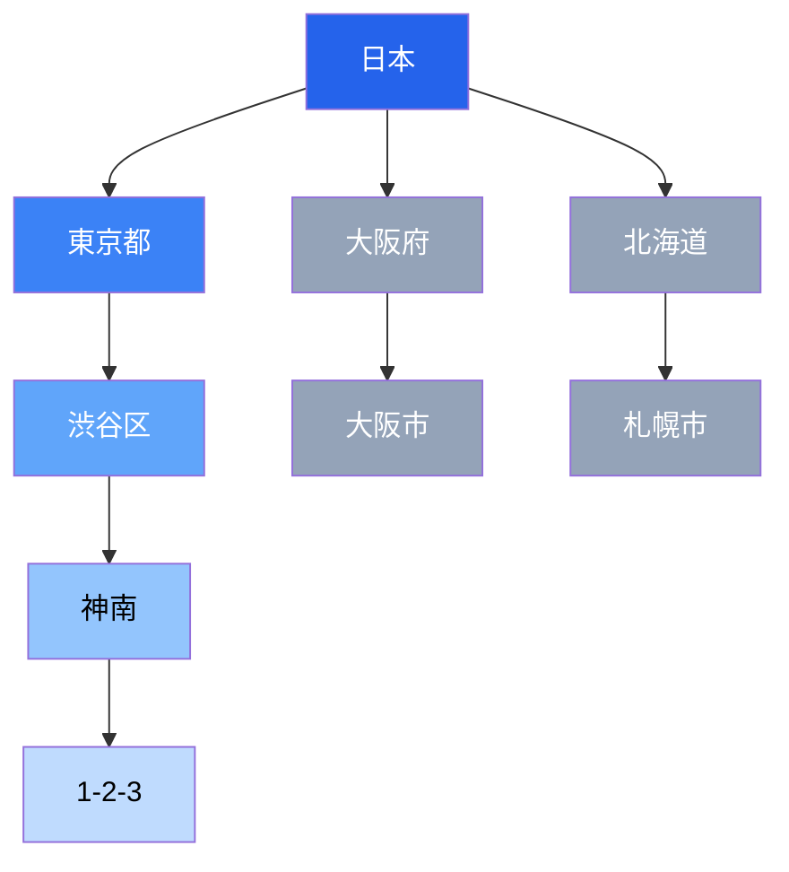
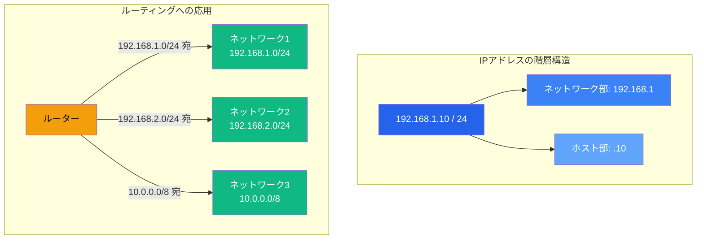

import { Aside } from '@astrojs/starlight/components';

## この節で学ぶこと

ネットワーク通信において，データを正しい宛先に届けるためにはアドレスが不可欠です．
この節では，アドレスが持つべき2つの重要な性質，「唯一性」と「階層性」について学びます．
これらの性質がなぜ必要なのかを理解することで，MACアドレスやIPアドレスの設計思想が明確になります．

## 1.8.1 アドレスの唯一性

### アドレスとは

アドレスとは，ネットワーク上の通信相手を特定するための識別子です．手紙を送るのに住所が必要なように，ネットワーク通信でもデータの宛先を特定するためにアドレスが必要です．

### 唯一性の必要性

アドレスの最も基本的な性質は「唯一性（Uniqueness）」です．同じアドレスを持つ機器が複数存在すると，データをどちらに届ければよいかわからなくなります．

日常生活でたとえると，同じ住所に2軒の家が存在したら，郵便局は手紙をどちらに届ければよいかわからなくなります．ネットワーク通信でも同様に，アドレスが重複するとデータが正しい宛先に届かなくなります．

### ネットワークにおけるアドレスの種類と唯一性の保証

ネットワークでは，層ごとに異なるアドレスが使用されます．

- MACアドレス（データリンク層）: 48ビットの識別子で，ネットワークインタフェースカード（NIC）の製造時に書き込まれます．IEEE がメーカーごとに番号を管理することで，世界中で唯一性を保証しています．
- IPアドレス（ネットワーク層）: IPv4では32ビット，IPv6では128ビットの識別子です．ICANN（Internet Corporation for Assigned Names and Numbers）を頂点とする階層的な組織体系で管理され，グローバルな唯一性を保証しています．
- ポート番号（トランスポート層）: 16ビットの識別子で，同一ホスト内でアプリケーションを区別します．1つのIPアドレスの中でポート番号の唯一性が保証されれば十分です．

これらのアドレスが組み合わされることで，ネットワーク上の任意のアプリケーション同士が一意に通信できるようになります．

## 1.8.2 アドレスの階層性

### 階層性とは

アドレスのもう1つの重要な性質は「階層性（Hierarchy）」です．階層性とは，アドレスが複数の段階に分かれた構造を持つことです．

日常の住所を例に考えてみましょう．「東京都渋谷区神南1-2-3」という住所は以下のように階層化されています．

郵便配達では，まず「東京都」宛てのものを東京に集め，次に「渋谷区」宛てのものを渋谷区に振り分け，最終的に「神南1-2-3」の住所に届けます．この仕組みのおかげで，配達のたびにすべての住所を検索する必要がなく，効率的に配送できます．

### ネットワークにおける階層性

IPアドレスも住所と同様に階層構造を持っています．IPアドレスはネットワーク部とホスト部から構成されます．

- ネットワーク部: どのネットワークに属するかを示す（住所でいう「都道府県・市区町村」に相当）
- ホスト部: そのネットワーク内でのホストの識別子（住所でいう「番地」に相当）

この階層構造により，ルーターは効率的にパケットを転送できます．すべてのホストのアドレスを個別に覚える必要はなく，「このネットワーク宛ならこの方向に転送する」というネットワーク単位のルーティングが可能になります．

### 階層性がない場合の問題

もしIPアドレスに階層性がなければ，ルーターはネットワーク上のすべてのホストのアドレスを個別に記憶し，1つ1つのアドレスに対して転送先を決定しなければなりません．インターネットに接続されている数十億台のデバイスすべてについてルーティングテーブルを持つことは現実的ではありません．

階層性のおかげで，ルーティングテーブルのエントリ数を大幅に削減でき，ルーターの処理効率が向上します．CIDRやサブネットマスクといった技術は，この階層性をより柔軟に活用するために発展しました．

### MACアドレスの階層性

MACアドレスにもある程度の構造があります．上位24ビットがベンダー識別子（OUI: Organizationally Unique Identifier），下位24ビットがメーカーが割り当てる固有番号です．しかし，MACアドレスの構造はルーティングには使われません．MACアドレスは同一データリンク内（同一ネットワークセグメント内）でのみ使用されるため，IPアドレスのような階層的なルーティングは不要です．

<Aside type="tip" title="FDE実務での活用">
MACアドレスとIPアドレスの役割の違いを理解することは，ネットワーク設計やトラブルシューティングの基本です．MACアドレスはデータリンク層（同一ネットワーク内）でフレームを届けるために使用し，IPアドレスはネットワーク層（異なるネットワーク間）でパケットをルーティングするために使用します．クラウド環境でVPCやサブネットを設計する際も，IPアドレスの階層性を活用してネットワークを論理的に分割し，効率的なルーティングとセキュリティグループの管理を実現します．
</Aside>

## まとめ

- アドレスはネットワーク上の通信相手を特定するための識別子であり，「唯一性」と「階層性」が重要な性質
- 唯一性により，データが正しい宛先に確実に届けられる
- 階層性により，ルーティングが効率化され，大規模なネットワークでも管理が可能になる
- IPアドレスはネットワーク部とホスト部に分かれた階層構造を持ち，ネットワーク単位のルーティングを実現する
- MACアドレスは世界中で唯一であるが，階層的なルーティングには使用されない

## 理解度チェック

Q1: アドレスの唯一性が重要な理由を説明してください．

アドレスの唯一性が保たれていないと，同じアドレスを持つ機器が複数存在することになり，データをどの機器に届ければよいか判断できなくなります．これにより，通信の信頼性が損なわれ，データが正しい宛先に届かなくなります．

Q2: IPアドレスの階層性はルーティングにどのように役立ちますか？

IPアドレスがネットワーク部とホスト部に分かれた階層構造を持つことで，ルーターは個々のホストではなくネットワーク単位でルーティングを行えます．これにより，ルーティングテーブルのエントリ数が大幅に削減され，数十億台のデバイスが接続されたインターネットでも効率的なパケット転送が可能になります．

Q3: MACアドレスとIPアドレスの役割の違いは何ですか？

MACアドレスはデータリンク層で使用され，同一ネットワーク（同一データリンク）内でフレームを正しいノードに届けるために使われます．IPアドレスはネットワーク層で使用され，異なるネットワークをまたいでパケットを最終的な宛先までルーティングするために使われます．通信では，パケットがルーターを経由するたびにデータリンク層のMACアドレスは書き換えられますが，IPアドレスは最終宛先まで維持されます．

Q4: MACアドレスの唯一性はどのように保証されていますか？

MACアドレスの唯一性は，IEEEがメーカーごとにOUI（Organizationally Unique Identifier，上位24ビット）を割り当て，各メーカーが下位24ビットを製品ごとに一意に割り当てることで保証されています．このように管理組織（IEEE）とメーカーの2段階で管理することで，世界中のすべてのNICに異なるMACアドレスが割り当てられます．

