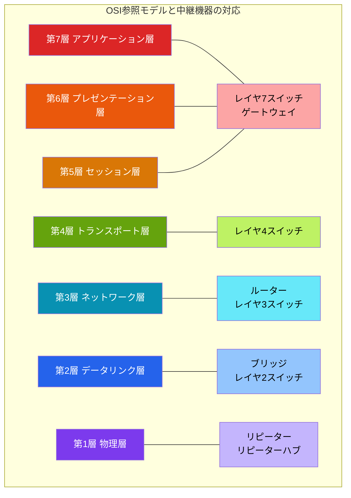
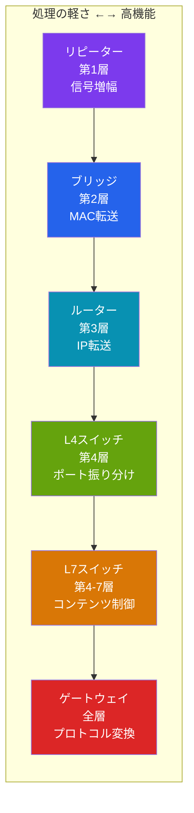

import { Aside } from '@astrojs/starlight/components';

## この節で学ぶこと

ネットワークはさまざまな機器と通信媒体で構成されています．この節では，通信媒体の種類，ネットワークインタフェースの役割，そしてリピーター，ブリッジ，ルーター，レイヤ4-7スイッチ，ゲートウェイといった中継機器がOSI参照モデルのどの層で動作し，どのような処理を行うかを学びます．
各機器の特性を理解することは，ネットワーク設計やトラブルシューティングの基礎となります．

## 1.9.1 通信媒体とデータリンク

### 通信媒体の種類

通信媒体とは，データを伝送するための物理的な手段です．主に以下の種類があります．

- 有線媒体
  - ツイストペアケーブル（UTP/STP）: 最も広く使われるLANケーブル．カテゴリによって伝送速度が異なる
  - 同軸ケーブル: 古いイーサネットで使用．ノイズに強い
  - 光ファイバーケーブル: 長距離・高速伝送が可能．シングルモードとマルチモードがある
- 無線媒体
  - 電波（Wi-Fi，Bluetooth，セルラー通信など）
  - 赤外線（近距離通信）

### データリンク

データリンクとは，通信媒体を使用して直接接続されたノード間でデータを転送するための仕組み（プロトコル）です．同じ通信媒体であっても，異なるデータリンクプロトコルを使用する場合があります．代表的なデータリンクには，イーサネット，Wi-Fi（IEEE802.11），PPPなどがあります．

## 1.9.2 ネットワークインタフェース

ネットワークインタフェースとは，コンピュータやネットワーク機器がネットワークに接続するための装置です．NIC（Network Interface Card）やネットワークアダプターとも呼ばれます．

ネットワークインタフェースの主な役割:

- データリンク層と物理層の処理を行う
- MACアドレスを保持する
- フレームの送受信を行う
- 物理的な信号の変換（デジタルデータと電気/光信号の変換）

1台のコンピュータに複数のネットワークインタフェースを搭載できます．たとえば，有線LANポートとWi-Fiアダプターの両方を持つノートPCは，2つのネットワークインタフェース（2つのMACアドレス）を持つことになります．

## 1.9.3 リピーター

リピーターは，OSI参照モデルの第1層（物理層）で動作する中継機器です．

### リピーターの役割

通信媒体を伝わる電気信号や光信号は，距離が長くなると減衰（弱くなる）します．リピーターは，この減衰した信号を増幅・整形して再送出することで，通信距離を延長します．

### リピーターの特徴

- 物理層のみの処理（信号の増幅と整形）
- アドレスの解析は行わない（届いた信号をそのまますべてのポートに転送）
- リピーターハブ（マルチポートリピーター）は複数のポートを持ち，受信した信号をすべてのポートに転送する
- コリジョンドメインを拡張する（分割しない）

## 1.9.4 ブリッジ／レイヤ2スイッチ

ブリッジとレイヤ2スイッチ（L2スイッチ）は，OSI参照モデルの第2層（データリンク層）で動作する中継機器です．

### ブリッジの役割

ブリッジは，MACアドレスを読み取り，宛先MACアドレスに基づいてフレームの転送先を判断します．

### ブリッジ／L2スイッチの特徴

- データリンク層（MACアドレス）に基づいてフレームを転送
- MACアドレステーブル（学習テーブル）を構築し，どのポートにどのMACアドレスがあるかを記憶
- 不要なフレームを他のポートに転送しないため，ネットワークの効率が向上
- コリジョンドメインを分割する
- ブロードキャストフレームはすべてのポートに転送する

L2スイッチは，ブリッジの機能をマルチポートで高速に実現した機器で，現在のLANの中核を担っています．

## 1.9.5 ルーター／レイヤ3スイッチ

ルーターとレイヤ3スイッチ（L3スイッチ）は，OSI参照モデルの第3層（ネットワーク層）で動作する中継機器です．

### ルーターの役割

ルーターは，IPアドレスに基づいてパケットの転送先を決定し，異なるネットワーク間でデータを中継します．

### ルーター／L3スイッチの特徴

- ネットワーク層（IPアドレス）に基づいてパケットを転送
- ルーティングテーブルを使用して最適な経路を選択
- 異なるデータリンク（イーサネットとWi-Fiなど）間の中継が可能
- ブロードキャストドメインを分割する
- ACL（アクセスコントロールリスト）によるパケットフィルタリングが可能

L3スイッチは，ルーターの機能をハードウェアで高速に実現した機器で，LAN内の高速ルーティングに使用されます．

## 1.9.6 レイヤ4-7スイッチ

レイヤ4-7スイッチは，OSI参照モデルの第4層（トランスポート層）から第7層（アプリケーション層）の情報に基づいて通信を制御する機器です．

### レイヤ4スイッチ

レイヤ4スイッチは，IPアドレスに加えてポート番号（トランスポート層の情報）に基づいてパケットを転送します．ロードバランサー（負荷分散装置）として使用されることが多く，同じサービスを提供する複数のサーバーに通信を振り分けます．

### レイヤ7スイッチ（アプリケーションスイッチ）

レイヤ7スイッチは，アプリケーション層の情報（HTTPのURL，Cookie，ヘッダなど）に基づいて通信を制御します．

- URLパターンに基づく振り分け（/api/* は APIサーバーへ，/static/* はファイルサーバーへ）
- SSLオフロード（SSL/TLS暗号化の終端処理）
- コンテンツキャッシング
- アプリケーションファイアウォール（WAF）機能

## 1.9.7 ゲートウェイ

ゲートウェイは，OSI参照モデルの全層（第1層〜第7層）で動作し，プロトコルの異なるネットワーク間の通信を可能にする中継機器です．

### ゲートウェイの役割

ゲートウェイは，異なるプロトコルを使用するネットワーク間でデータを変換・中継します．たとえば，メールゲートウェイは異なるメールプロトコル間でメッセージを変換し，プロキシサーバーはクライアントとサーバー間のHTTP通信を中継・変換します．

### ゲートウェイの特徴

- アプリケーション層のデータまで解析・変換できる
- プロトコル変換（異なる通信規約間のデータ変換）
- セキュリティ機能（ファイアウォール，コンテンツフィルタリング）
- 処理が重いため，リピーターやブリッジに比べてスループットが低い

### 各中継機器の比較

<Aside type="tip" title="FDE実務での活用">
クラウド上のAIインフラを設計する際，これらのネットワーク構成要素に対応するクラウドサービスを活用します．たとえばAWSでは，VPC（ネットワーク全体），サブネット（L3レベルのネットワーク分割），セキュリティグループ（L4相当のパケットフィルタリング），ALB/NLB（レイヤ7/レイヤ4のロードバランサー），NAT Gateway（アドレス変換）などがあります．AI推論サーバーをプライベートサブネットに配置し，ALBでリクエストを振り分ける構成は，オンプレミスのネットワーク設計と同じ概念をクラウド上に実装したものです．
</Aside>

## まとめ

- 通信媒体には有線（ツイストペアケーブル，光ファイバーなど）と無線（Wi-Fi，Bluetoothなど）がある
- ネットワークインタフェース（NIC）は，コンピュータがネットワークに接続するための装置で，MACアドレスを保持する
- リピーター（第1層）は信号を増幅し，通信距離を延長する
- ブリッジ／L2スイッチ（第2層）はMACアドレスに基づいてフレームを転送し，コリジョンドメインを分割する
- ルーター／L3スイッチ（第3層）はIPアドレスに基づいてパケットを転送し，ブロードキャストドメインを分割する
- レイヤ4-7スイッチはポート番号やアプリケーション情報に基づく高度な通信制御を行う
- ゲートウェイ（全層）は異なるプロトコル間のデータ変換・中継を行う

## 理解度チェック

Q1: リピーターとブリッジの違いを説明してください．

リピーターは物理層（第1層）で動作し，電気信号の増幅・整形のみを行います．アドレスの解析は行わず，受信した信号をすべてのポートに転送します．一方，ブリッジはデータリンク層（第2層）で動作し，MACアドレスを読み取って宛先に基づいたフレームの転送を行います．ブリッジはMACアドレステーブルを学習し，不要な転送を防ぐことでネットワーク効率を向上させます．

Q2: ルーターが「ブロードキャストドメインを分割する」とはどういう意味ですか？

ブロードキャストドメインとは，ブロードキャストフレームが届く範囲のことです．ルーターはブロードキャストフレームを他のネットワークに転送しないため，ルーターを境にブロードキャストの到達範囲が分かれます．これにより，不要なブロードキャストトラフィックが他のネットワークに流れ込むことを防ぎ，ネットワーク全体の効率を維持できます．

Q3: レイヤ4スイッチとレイヤ7スイッチの違いは何ですか？

レイヤ4スイッチはIPアドレスとポート番号（トランスポート層まで）に基づいて通信を振り分けます．一方，レイヤ7スイッチはアプリケーション層の情報（URL，Cookie，HTTPヘッダなど）まで解析して振り分けを行います．レイヤ7スイッチはより高度な制御が可能ですが，処理負荷が大きくなります．

Q4: ゲートウェイが必要になるのはどのような場合ですか？

プロトコルの異なるネットワーク間で通信する必要がある場合にゲートウェイが必要になります．ゲートウェイはアプリケーション層のデータまで解析・変換できるため，異なるメールプロトコル間の変換や，プロキシサーバーとしてのHTTP通信の中継・変換などに使用されます．ただし，全層の処理を行うため，他の中継機器に比べてスループットは低くなります．

Q5: クラウド環境において，L2スイッチやルーターに相当するサービスは何ですか？

クラウド環境（AWSの場合）では，VPCがネットワーク全体に対応し，サブネットがL3レベルのネットワーク分割に対応します．セキュリティグループはL4相当のパケットフィルタリング，ALB（Application Load Balancer）はレイヤ7スイッチ，NLB（Network Load Balancer）はレイヤ4スイッチに対応します．NAT GatewayはNATルーターの機能を提供します．

