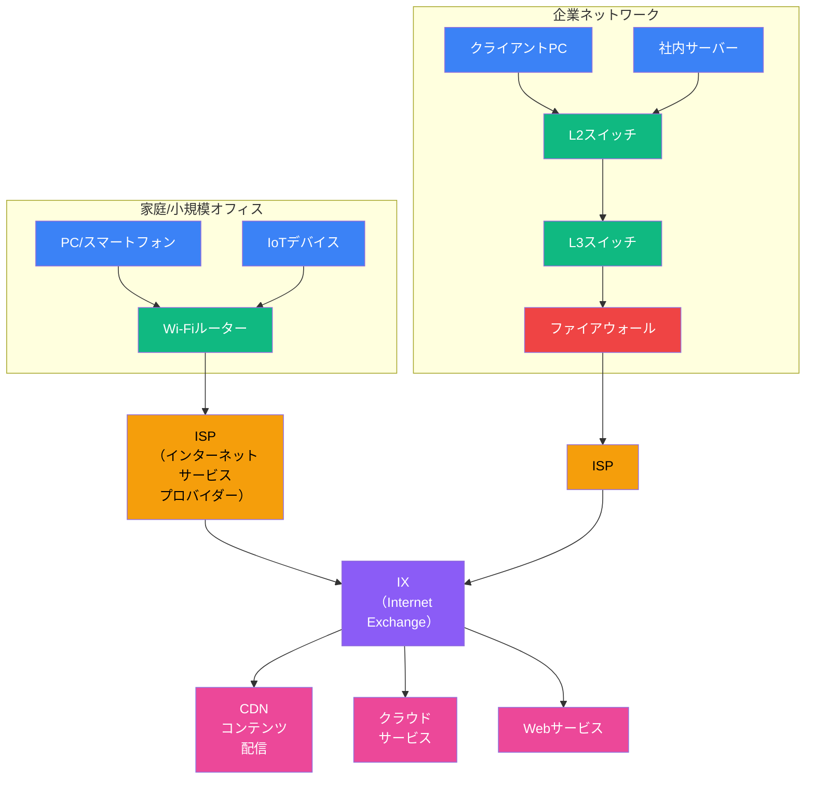
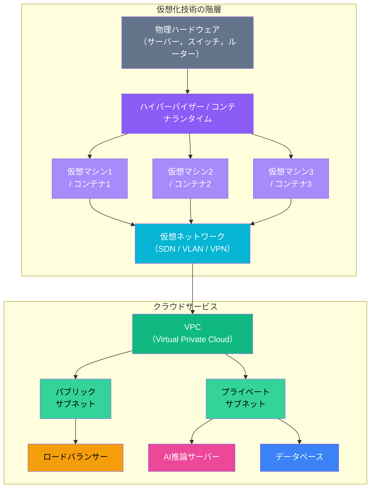
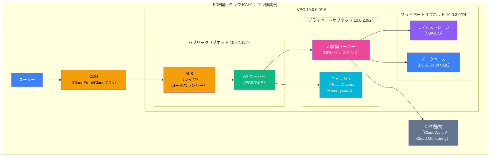

import { Aside } from '@astrojs/starlight/components';

## この節で学ぶこと

これまでの節で学んだネットワークの基礎概念が，実際のネットワークではどのように組み合わされているかを見ていきます．
家庭やオフィスからISPを経由してインターネットに接続する仕組み，携帯端末による通信，サーバー側のネットワーク構成，そして仮想化やクラウドによる新しいネットワークの姿を学びます．
現在のネットワークの全体像を理解することで，FDEとしてシステム設計を行う際の基盤となる知識が身につきます．

## 1.10.1 実際のネットワークの構成

実際のネットワークは，家庭やオフィスのLAN，ISP（Internet Service Provider）のネットワーク，IX（Internet Exchange），そしてさまざまなサービスプロバイダーのネットワークが相互に接続されて構成されています．

### 典型的なネットワーク構成

企業ネットワークでは，ファイアウォールで外部からの不正アクセスを防御し，L3スイッチで部門ごとにサブネットを分割するのが一般的です．家庭では，ブロードバンドルーターが1台でルーティング，NAT，Wi-Fiアクセスポイントの機能を兼ねています．

## 1.10.2 インターネット接続サービスを利用した通信

一般のユーザーや企業がインターネットに接続するには，ISPが提供する接続サービスを利用します．

### 主な接続サービスの種類

- FTTH（Fiber To The Home）: 光ファイバーを家庭まで引き込む高速サービス．現在の主流
- CATV（ケーブルテレビ）: ケーブルテレビの回線を利用したインターネット接続
- ADSL: 電話回線を利用したサービス（多くの地域でサービス終了）
- 固定無線アクセス（FWA）: 5Gなどの無線通信を利用した固定回線の代替

### ISPの役割

ISPはユーザーにIPアドレスを割り当て，インターネットへのアクセスを提供します．ISP同士はIX（Internet Exchange）やピアリング（直接接続）によって相互に接続されており，これによってインターネット全体が1つのネットワークとして機能します．

### PPPoEとIPoE

ISPへの接続方式として，PPPoE（PPP over Ethernet）とIPoE（IP over Ethernet）があります．PPPoEは従来から使われている方式で，ユーザー認証機能がありますが，混雑時にボトルネックになりやすいという課題があります．IPoEはより新しい方式で，PPPoEのオーバーヘッドがなく，高速な通信が可能です．

## 1.10.3 携帯端末による通信

スマートフォンやタブレットなどの携帯端末は，モバイル通信ネットワークを介してインターネットに接続します．

### モバイル通信の進化

- 3G: 下り最大数Mbps〜数十Mbps
- 4G/LTE: 下り最大数百Mbps〜1Gbps程度
- 5G: 下り最大数Gbps〜20Gbps程度，超低遅延，多数同時接続

5Gは，高速大容量（eMBB），超高信頼低遅延通信（URLLC），多数同時接続（mMTC）の3つの特徴を持ち，IoTやAIサービスのリアルタイム処理に不可欠な通信基盤となっています．

### 携帯端末のネットワーク接続

携帯端末は，基地局を経由してコアネットワークに接続し，そこからインターネットに接続します．Wi-Fiが利用可能な環境ではWi-Fiに切り替え，モバイル通信の帯域を節約することも一般的です．

## 1.10.4 情報発信者側にとってのネットワーク

Webサービスやアプリケーションを提供する側（情報発信者側）のネットワーク構成も重要です．

### データセンターのネットワーク

大規模なWebサービスは，データセンターに設置されたサーバー群で運用されます．データセンターのネットワークは以下のように構成されます．

- コアスイッチ（L3）: データセンター全体のルーティング
- アグリゲーションスイッチ: サーバーラックの集約
- ToR（Top of Rack）スイッチ: 各ラック内のサーバーを接続
- ロードバランサー: リクエストを複数のサーバーに分散
- ファイアウォール: セキュリティの確保

### 冗長構成

サービスの可用性を高めるために，ネットワーク機器やサーバーは冗長化されます．複数のISPへの接続（マルチホーミング），機器の二重化，サーバーのクラスタリングなどの手法が用いられます．

## 1.10.5 仮想化とクラウド

### ネットワーク仮想化

ネットワーク仮想化とは，物理的なネットワーク機器やリンクを論理的に抽象化し，ソフトウェアで制御可能にする技術です．

- VLAN: 物理的な接続に関係なく，論理的なネットワークを構成する技術
- VPN（Virtual Private Network）: 公衆ネットワーク上に仮想的なプライベートネットワークを構築する技術
- SDN（Software-Defined Networking）: ネットワークの制御をソフトウェアで集中管理する技術
- NFV（Network Functions Virtualization）: ルーターやファイアウォールなどのネットワーク機能を仮想化する技術

### サーバー仮想化

1台の物理サーバー上に複数の仮想マシン（VM）を動作させる技術です．ハイパーバイザーが物理リソースを抽象化し，各VMに割り当てます．仮想マシンごとに独立したOS・ネットワーク設定が可能です．

コンテナ技術（Docker，Kubernetesなど）は，仮想マシンよりも軽量な仮想化手段として広く普及しています．コンテナはOS カーネルを共有するため，起動が高速でリソース効率が高いという特徴があります．

## 1.10.6 クラウドの構造と利用

### クラウドサービスの分類

クラウドサービスは提供範囲に応じて以下のように分類されます．

- IaaS（Infrastructure as a Service）: 仮想マシン，ストレージ，ネットワークなどのインフラを提供（例: AWS EC2，GCE）
- PaaS（Platform as a Service）: アプリケーション実行環境を提供（例: AWS Elastic Beanstalk，Google App Engine）
- SaaS（Software as a Service）: ソフトウェアをサービスとして提供（例: Gmail，Salesforce）

### クラウドのネットワーク構成

クラウド環境では，ネットワークの構成要素も仮想化されています．

- VPC（Virtual Private Cloud）: クラウド上に構築する仮想的なプライベートネットワーク
- サブネット: VPC内のネットワークを論理的に分割した区画
- インターネットゲートウェイ: VPCとインターネットを接続する仮想ゲートウェイ
- NATゲートウェイ: プライベートサブネットからインターネットへのアウトバウンド通信を可能にする
- セキュリティグループ: 仮想ファイアウォールとしてインバウンド/アウトバウンドの通信を制御
- ネットワークACL: サブネットレベルでのアクセス制御

### マルチクラウドとハイブリッドクラウド

現在の企業では，複数のクラウドプロバイダーを組み合わせるマルチクラウドや，オンプレミス環境とクラウドを組み合わせるハイブリッドクラウドの採用が増えています．これらの環境では，ネットワークの相互接続（VPN接続や専用線接続）の設計が重要になります．

<Aside type="tip" title="FDE実務での活用">
AWS/GCPでAIワークロードを展開する際のVPC設計は，ネットワークの基礎知識が直結します．GPUインスタンスをプライベートサブネットに配置し，ALBでAPI リクエストを振り分け，NATゲートウェイ経由でモデルのダウンロードや外部API呼び出しを行う構成が一般的です．セキュリティグループでポート制限を設け，ネットワークACLでサブネット間の通信を制御することで，AIインフラのセキュリティを確保しつつ，推論リクエストの低レイテンシ処理を実現します．VPCピアリングやTransit Gatewayを使った複数VPC間の接続設計も重要なスキルです．
</Aside>

## まとめ

- 実際のネットワークは，LAN，ISP，IX，サービスプロバイダーが相互に接続されて構成されている
- ISPはIPアドレスの割り当てとインターネットへの接続を提供し，PPPoEやIPoEなどの方式で接続する
- 携帯端末は基地局を経由してモバイル通信ネットワーク（3G/4G/5G）でインターネットに接続する
- データセンターでは，冗長化されたネットワーク構成でサービスの可用性を確保する
- 仮想化技術（VLAN，VPN，SDN，NFV）により，物理ネットワークを柔軟にソフトウェアで制御できる
- クラウドでは，VPC，サブネット，ロードバランサーなどの仮想化されたネットワーク構成要素を組み合わせてインフラを構築する

## 理解度チェック

Q1: ISPの役割とIXの役割をそれぞれ説明してください．

ISP（Internet Service Provider）はユーザーにIPアドレスを割り当て，インターネットへの接続サービスを提供します．IX（Internet Exchange）はISP同士が相互に接続する拠点で，トラフィックを効率的に交換します．IXの存在により，異なるISPのユーザー同士が効率的に通信できます．

Q2: 5Gの3つの特徴を説明してください．

5Gの3つの特徴は，(1) 高速大容量通信（eMBB: enhanced Mobile Broadband，下り最大20Gbps程度），(2) 超高信頼低遅延通信（URLLC: Ultra-Reliable Low-Latency Communications，1ms以下の遅延），(3) 多数同時接続（mMTC: massive Machine Type Communications，1km²あたり100万台のデバイス接続）です．

Q3: IaaS，PaaS，SaaSの違いを説明してください．

IaaS（Infrastructure as a Service）は仮想マシン，ストレージ，ネットワークなどのインフラ層を提供します．PaaS（Platform as a Service）はアプリケーションの実行環境（ミドルウェアやランタイムを含む）を提供します．SaaS（Software as a Service）は完成したアプリケーションをサービスとして提供します．利用者が管理する範囲はIaaSが最も広く，SaaSが最も狭くなります．

Q4: VPCとサブネットの関係を説明してください．

VPC（Virtual Private Cloud）はクラウド上に構築する仮想的なプライベートネットワーク全体です．サブネットはVPC内のネットワークをさらに論理的に分割した区画です．パブリックサブネット（インターネットからアクセス可能）とプライベートサブネット（インターネットから直接アクセス不可）に分け，用途に応じてリソースを配置するのが一般的です．

Q5: AI推論サーバーをプライベートサブネットに配置する理由は何ですか？

AI推論サーバーをプライベートサブネットに配置することで，インターネットから直接アクセスできなくなり，セキュリティが向上します．外部からのリクエストはロードバランサー（パブリックサブネット）で受け，内部ネットワーク経由で推論サーバーに転送します．モデルのダウンロードなどアウトバウンド通信が必要な場合は，NATゲートウェイを経由させます．これにより，攻撃対象面を最小化しつつ必要な通信を確保できます．

