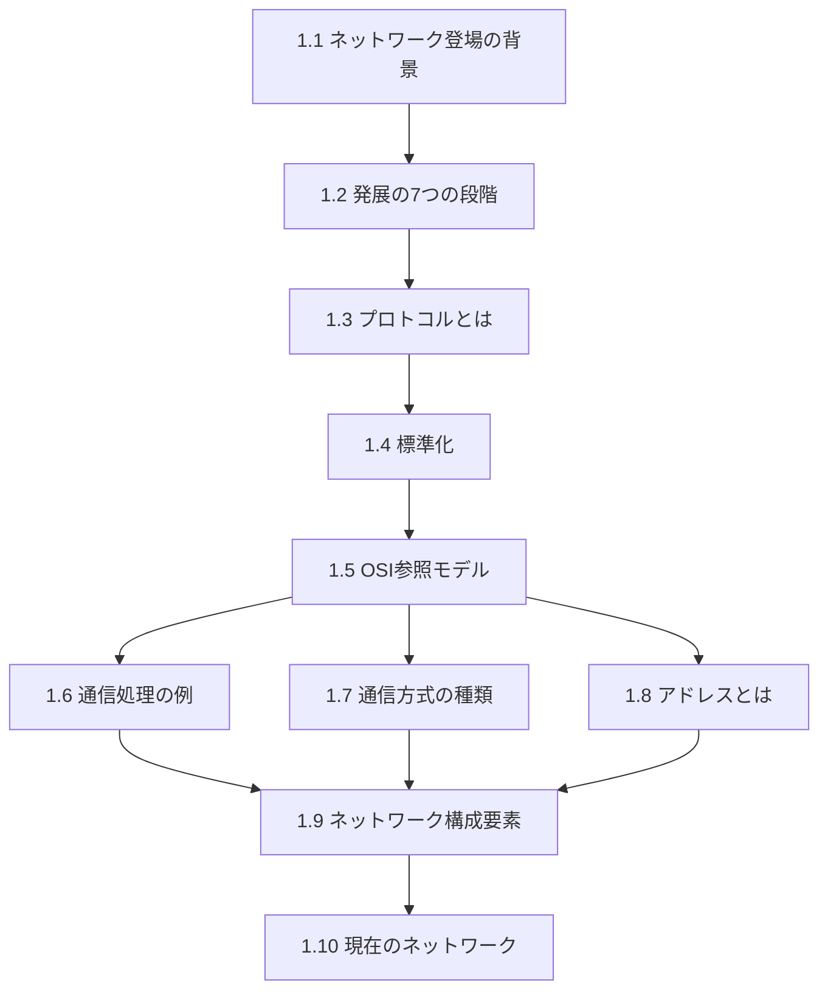

import { Card, CardGrid, Aside } from '@astrojs/starlight/components';

この章では，コンピュータネットワークの基礎となる概念を学びます．ネットワークがなぜ必要になったのか，プロトコルとは何か，OSI参照モデルの7層構造，通信方式の分類，そしてネットワークを構成する機器の役割を理解します．

## この章の構成

<CardGrid>
  <Card title="1.1 ネットワーク登場の背景" icon="document">
    コンピュータの普及からネットワーク利用への変遷
  </Card>
  <Card title="1.2 発展の7つの段階" icon="document">
    バッチ処理からIoT時代までの発展
  </Card>
  <Card title="1.3 プロトコルとは" icon="document">
    通信規約としてのプロトコルの概念
  </Card>
  <Card title="1.4 プロトコルの標準化" icon="document">
    ISO，IEEE，IETFなどの標準化組織
  </Card>
  <Card title="1.5 OSI参照モデル" icon="document">
    7層の階層構造とその役割
  </Card>
  <Card title="1.6 通信処理の例" icon="document">
    OSI参照モデルによる通信の流れ
  </Card>
  <Card title="1.7 通信方式の種類" icon="document">
    コネクション型，パケット交換，ユニキャスト等
  </Card>
  <Card title="1.8 アドレスとは" icon="document">
    アドレスの唯一性と階層性
  </Card>
  <Card title="1.9 ネットワーク構成要素" icon="document">
    リピーター，ブリッジ，ルーター，ゲートウェイ
  </Card>
  <Card title="1.10 現在のネットワーク" icon="document">
    インターネット，モバイル，仮想化，クラウド
  </Card>
</CardGrid>

<Aside type="tip" title="FDEとしての学習ポイント">
この章はネットワーク全体を俯瞰するための基礎です．OSI参照モデルは，AIサービスのネットワークトラブルシューティングで「どの層に問題があるか」を切り分ける際の基本フレームワークとなります．
</Aside>
