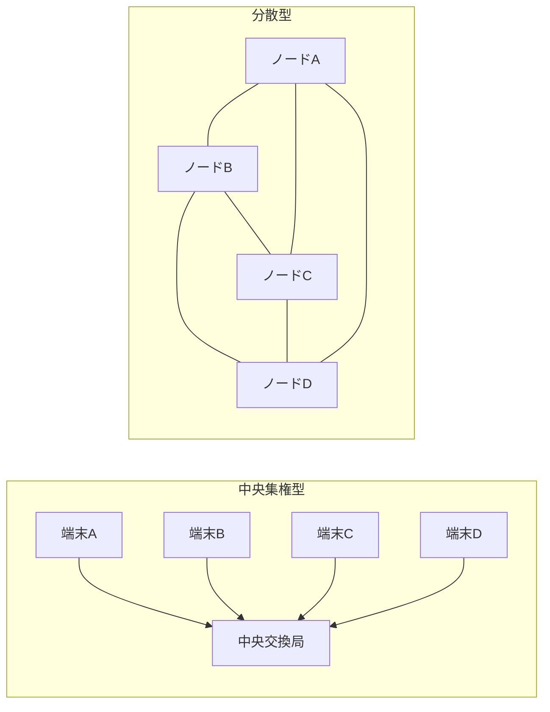
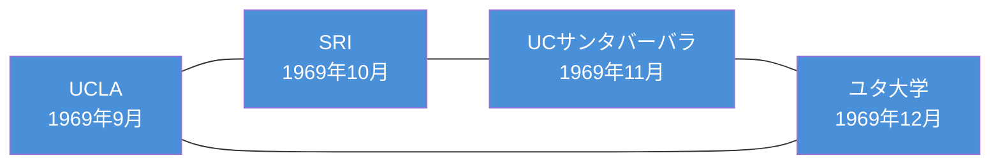
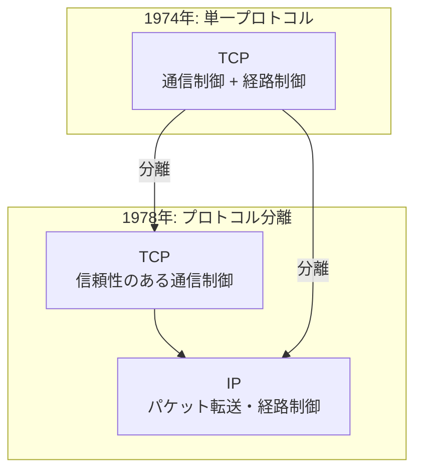
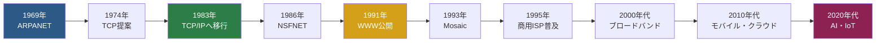

import { Aside } from '@astrojs/starlight/components';

## この節で学ぶこと

TCP/IPは現在のインターネットを支える中核プロトコルであるが，その誕生は冷戦時代の軍事研究にまで遡る．
本節では，なぜTCP/IPが必要とされたのか，どのような歴史的背景のもとで開発・普及していったのかを理解する．
ARPANETの誕生からUNIXの普及，そして商用インターネットサービスの開始に至る技術発展の流れを学ぶことで，
現代のネットワーク技術の基盤を俯瞰できるようになる．

## 2.1.1 軍事技術の応用から

### 冷戦時代の通信課題

1960年代，米国は冷戦のさなかにあり，核攻撃に耐えうる通信ネットワークの構築が重要な課題であった．
当時の通信網は中央集権型であり，中央の交換局が破壊されると通信全体が途絶するという致命的な弱点を抱えていた．

### 分散型ネットワークの発想

この課題に対し，RAND研究所のポール・バランは「分散型通信ネットワーク」の概念を提唱した．
ネットワークを分散型に設計し，一部のノードが破壊されても他の経路を通じて通信を維持できる仕組みを考案した．
この発想が，後のパケット交換技術の基礎となる．

### パケット交換の誕生

ポール・バランの提唱した「メッセージブロック」の概念は，データを小さなブロック（パケット）に分割して送信するという画期的なアイデアであった．
同時期に英国のドナルド・デイヴィスも独立に「パケット交換（Packet Switching）」の概念を発表している．
この技術は，回線交換方式と異なり，通信回線を複数のユーザーで効率的に共有できるという利点を持っていた．

## 2.1.2 ARPANETの誕生

### ARPA（高等研究計画局）の役割

1958年，ソ連のスプートニク打ち上げに衝撃を受けた米国国防総省は，先端技術研究を推進するためにARPA（Advanced Research Projects Agency，後のDARPA）を設立した．
ARPAは大学や研究機関の計算機資源を共有するためのネットワーク構築プロジェクトを推進した．

### 最初の4ノード接続

1969年，ARPANETは最初の実験を開始した．
UCLA，スタンフォード研究所（SRI），UCサンタバーバラ，ユタ大学の4拠点がIMP（Interface Message Processor）と呼ばれる専用コンピュータを介して接続された．
これが世界初のパケット交換ネットワークである．

### ARPANETの拡大

1970年代に入ると，ARPANETは急速に拡大し，米国内の大学や研究機関が次々と接続された．
当初はNCP（Network Control Program）というプロトコルが使われていたが，異なるネットワーク同士の接続には課題があった．

## 2.1.3 TCP/IPの誕生

### 異種ネットワーク間の接続問題

ARPANETの拡大に伴い，衛星通信ネットワークや無線パケット通信ネットワークなど，異なる技術基盤を持つネットワークが複数存在するようになった．
これらを統一的に接続する「インターネットワーキング（Internetworking）」の課題が浮上した．

### ヴィントン・サーフとロバート・カーン

1974年，ヴィントン・サーフとロバート・カーンは「A Protocol for Packet Network Intercommunication」という論文を発表し，異種ネットワーク間を相互接続するためのプロトコル体系を提案した．
これがTCP（Transmission Control Protocol）の原型である．

### TCPからTCP/IPへの分離

当初は単一のTCPプロトコルとして設計されたが，1978年にTCPとIP（Internet Protocol）に分離された．
TCPはエンドツーエンドの信頼性のある通信を担当し，IPはネットワーク間のパケット転送を担当する．
この分離により，各層が独立して進化できるようになった．

### NCPからTCP/IPへの移行

1983年1月1日，ARPANETのプロトコルはNCPからTCP/IPへ正式に切り替えられた．
この日は「フラッグデー」と呼ばれ，インターネットの歴史における重要な転換点となった．

## 2.1.4 UNIXの普及とインターネットの拡大

### BSD UNIXとTCP/IP

カリフォルニア大学バークレー校で開発されたBSD UNIX（Berkeley Software Distribution）は，
1983年にリリースされた4.2BSDにおいてTCP/IPのプロトコルスタックを標準実装した．
これにより，UNIX上でTCP/IPを利用するための基盤が整い，多くの大学や研究機関でTCP/IPが広く利用されるようになった．

### ソケットインタフェース

BSD UNIXはTCP/IPを利用するためのプログラミングインタフェースとして「ソケット」を導入した．
ソケットAPIは現在でもネットワークプログラミングの標準的なインタフェースとして広く使用されている．

### NSFNETの構築

1986年，米国国立科学財団（NSF）はスーパーコンピュータセンターを結ぶバックボーンネットワークNSFNETを構築した．
NSFNETはARPANETに代わるインターネットの基幹ネットワークとなり，接続する大学や研究機関の数は飛躍的に増加した．

### インターネットの国際的な広がり

1980年代後半から1990年代にかけて，インターネットは米国内にとどまらず，ヨーロッパやアジアにも広がった．
日本では1984年にJUNET（Japan University Network）が構築され，1988年にはWIDEプロジェクトが開始された．

## 2.1.5 商用インターネットサービスの開始

### NSFNETの商用利用解禁

NSFNETは当初，学術研究目的にのみ利用が制限されていたが，1991年にその制限が緩和された．
これにより，商用ISP（Internet Service Provider）が次々と設立され，一般企業や個人がインターネットにアクセスできるようになった．

### World Wide Webの誕生

1991年，CERN（欧州原子核研究機構）のティム・バーナーズ＝リーがWorld Wide Web（WWW）を公開した．
HTTPプロトコルとHTMLによるハイパーテキストシステムは，インターネットの利用を爆発的に拡大させた．
1993年のMosaicブラウザの登場により，一般ユーザーにもインターネットが身近なものとなった．

### インターネット普及のタイムライン

### 日本における商用インターネット

日本では1992年にIIJ（インターネットイニシアティブジャパン）が設立され，
1993年から商用インターネット接続サービスが提供開始された．
その後，1990年代後半のダイヤルアップ接続から2000年代のADSL・FTTH（光ファイバー）へと，
アクセス回線の高速化とともにインターネットは急速に普及した．

<Aside type="tip" title="FDE実務での活用">
TCP/IPの歴史を理解することは，現在のインターネット技術の設計思想を把握する上で重要である．
例えば，分散型ネットワークの思想は，現在のクラウドサービスやCDN（Content Delivery Network）の設計にも受け継がれている．
AIサービスの運用においても，インターネットの分散アーキテクチャの理解は，
マルチリージョン展開やエッジコンピューティングの設計判断に直結する．
また，パケット交換の仕組みを理解することで，AI推論APIのリクエストがどのようにネットワーク上を流れるかを正しく把握できる．
</Aside>

## まとめ

- TCP/IPは冷戦時代の軍事研究に端を発し，分散型ネットワークとパケット交換の概念から生まれた
- 1969年にARPANETが誕生し，1983年にTCP/IPへの移行が完了した
- BSD UNIXへのTCP/IP実装とNSFNETの構築がインターネットの拡大を加速させた
- 1990年代にWWWの登場と商用ISPの普及により，インターネットは世界中に広がった
- TCP/IPの設計思想（分散性，相互接続性）は，現代のクラウドやAIサービスの基盤にも通じている

## 理解度チェック

問題1: パケット交換方式が回線交換方式に比べて優れている点は何か？

パケット交換方式では，データを小さなパケットに分割して送信するため，通信回線を複数のユーザーで効率的に共有できる．
回線交換方式のように通信の間中回線を占有する必要がなく，ネットワーク資源の利用効率が高い．
また，一部の経路が障害で使用不能になっても，別の経路を通じてパケットを転送できるため，耐障害性にも優れている．

問題2: 1983年1月1日の「フラッグデー」とは何か，その意義を説明せよ．

フラッグデーとは，ARPANETのプロトコルがNCP（Network Control Program）からTCP/IPへ一斉に切り替えられた日のことである．
この切り替えにより，異なるネットワーク技術を持つ複数のネットワークが統一的なプロトコルで相互接続できるようになった．
これがインターネットの技術的基盤を確立した重要な転換点であり，現在のインターネットの出発点とも言える．

問題3: BSD UNIXがTCP/IPの普及に果たした役割を述べよ．

BSD UNIX（特に4.2BSD）はTCP/IPのプロトコルスタックを標準で実装し，ソケットAPIというネットワークプログラミングインタフェースを提供した．
これにより，開発者がTCP/IPを利用するアプリケーションを容易に作成できるようになった．
大学や研究機関でBSD UNIXが広く使用されていたため，TCP/IPも同時に普及し，
後のインターネットの拡大に大きく貢献した．

問題4: TCPがTCPとIPに分離された理由とその利点を説明せよ．

当初は単一のTCPプロトコルとして設計されていたが，1978年にTCP（信頼性のある通信制御）とIP（パケット転送・経路制御）に分離された．
分離の理由は，通信の信頼性制御とネットワーク間の転送制御という異なる責務を明確に分けることで，
各層が独立して進化・改良できるようにするためである．
この階層化により，UDP（信頼性を必要としない通信）などTCP以外のトランスポートプロトコルもIP上で動作可能となった．

