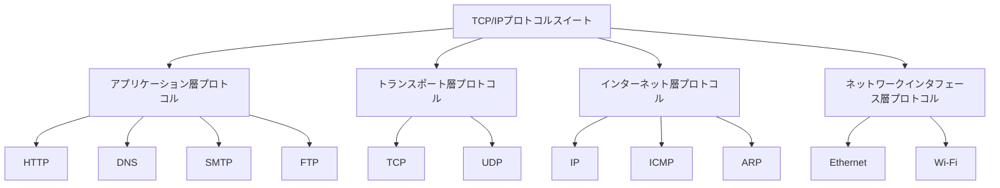
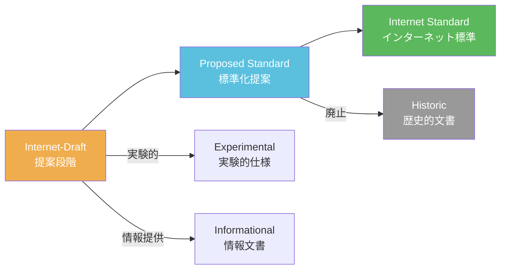
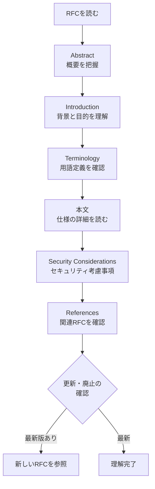

import { Aside } from '@astrojs/starlight/components';

## この節で学ぶこと

TCP/IPは特定の企業や団体が独占的に管理するものではなく，オープンな標準化プロセスによって策定されている．
本節では，「TCP/IP」という言葉が実際に何を指すのか，標準化がどのような精神と手続きで進められるのか，
そしてその仕様書であるRFC（Request for Comments）の構成と入手方法を学ぶ．
エンジニアとしてRFCを読み解く力は，正確なプロトコル理解と実装に不可欠である．

## 2.2.1 TCP/IPという語は何を指す？

### 狭義のTCP/IP

TCP/IPという名称は，文字通りに解釈すればTCP（Transmission Control Protocol）とIP（Internet Protocol）の2つのプロトコルを指す．
TCPはトランスポート層でエンドツーエンドの信頼性のある通信を提供し，IPはインターネット層でパケットの転送と経路制御を担当する．

### 広義のTCP/IP

しかし実際には，「TCP/IP」はこの2つのプロトコルだけを意味するのではなく，
インターネットで使用されるプロトコル群全体を総称する言葉として使われることが多い．
UDP，ICMP，ARP，HTTP，DNS，SMTPなど，数百に及ぶプロトコルが含まれる．
正式には「TCP/IPプロトコルスイート（Protocol Suite）」や「インターネットプロトコルスイート」と呼ばれる．

## 2.2.2 TCP/IP標準化の精神

### ラフコンセンサスとランニングコード

TCP/IPの標準化を主導するIETF（Internet Engineering Task Force）の精神は，「ラフコンセンサスとランニングコード（Rough consensus and running code）」という言葉に集約される．
これは，完全な合意を求めるのではなく，おおよその合意と実際に動作する実装を重視するというアプローチである．

### 「誰でも参加できる」オープンな標準化

IETFの会合やメーリングリストは誰でも参加できるオープンなものである．
特定の企業や国家が独占的に決定権を持つのではなく，技術的な議論に基づいて標準が策定される．
この開放性がTCP/IPの普及に大きく貢献した．

### ベンダー非依存の姿勢

TCP/IPの標準化では，特定のハードウェアやソフトウェアベンダーに依存しない仕様が求められる．
この姿勢は，異なるメーカーの製品間での相互運用性（インターオペラビリティ）を確保するために極めて重要である．

## 2.2.3 TCP/IPの仕様書RFC

### RFCとは

RFC（Request for Comments）は，インターネット技術に関する仕様書，標準ドキュメント，ベストプラクティス，
情報提供文書などをまとめたドキュメントシリーズである．
「コメントを求める」という名称が示すように，もともとは議論のための提案文書であったが，
現在ではインターネット技術の公式な仕様書としての地位を確立している．

### RFCの番号体系

RFCは通し番号で管理される．一度発行されたRFCの番号と内容は変更されない（不変性）．
仕様が更新される場合は，新しい番号のRFCが発行され，古いRFCを「廃止（Obsolete）」とする．

代表的なRFCの例:
- RFC 791: Internet Protocol（IPv4）
- RFC 793: Transmission Control Protocol（TCP）
- RFC 2616: HTTP/1.1（後にRFC 7230-7235で廃止）
- RFC 8200: Internet Protocol, Version 6（IPv6）
- RFC 9110: HTTP Semantics

### RFCの分類

RFCには以下のカテゴリが存在する:

| カテゴリ | 説明 |
|---------|------|
| Standards Track | 標準化過程にある仕様（Proposed Standard → Internet Standard） |
| Best Current Practice（BCP） | 現在の最良慣行 |
| Informational | 情報提供を目的とした文書 |
| Experimental | 実験的な仕様 |
| Historic | 歴史的な文書（廃止された仕様など） |

## 2.2.4 TCP/IPの標準化の流れ

### IETFにおける標準化プロセス

TCP/IPの標準化はIETFのワーキンググループ（WG）で行われる．
標準化プロセスは以下の段階を経る．

### Internet-Draft（I-D）

標準化の第一歩は，Internet-Draft（I-D）の提出である．
I-Dは6ヶ月の有効期限を持ち，更新されなければ自動的に失効する．
I-Dは誰でも提出でき，IETFのウェブサイトで公開される．

### ワーキンググループでの議論

I-DはIETFのワーキンググループで議論され，メーリングリストでの技術的レビューと，
定期的に開催されるIETF会合での対面議論を通じて改良される．

### ラストコールと承認

ワーキンググループ内でコンセンサスが得られると，IETF全体に対してラストコール（Last Call）が行われる．
最終的にIESG（Internet Engineering Steering Group）による承認を経て，RFCとして発行される．

### 相互接続テスト

標準化の過程では，複数の独立した実装による相互接続テスト（Interoperability Testing）が重視される．
仕様書だけでなく，実際に動作するコードの存在が標準化の条件となる．

## 2.2.5 RFCの入手方法

### RFC Editorのウェブサイト

RFCは無料で公開されており，誰でも自由にアクセスできる．
主な入手先は RFC Editor（rfc-editor.org）のウェブサイトである．
RFC番号やキーワードで検索でき，テキスト形式やHTML形式で閲覧・ダウンロードが可能である．

### IETFのDatatracker

IETF Datatracker（datatracker.ietf.org）では，RFCだけでなくInternet-Draftの検索・閲覧も可能である．
標準化の進捗状況や，関連するワーキンググループの情報も確認できる．

### RFCの読み方のポイント

RFCを効率的に読むためのポイントは以下の通りである:

- Abstract（概要）とIntroduction（導入）をまず読み，文書の目的と範囲を把握する
- RFC 2119で定義された要求レベル表現（MUST，SHOULD，MAYなど）に注目する
- 古いRFCは更新や廃止されている可能性があるため，関連RFCの確認が必要である
- Examples（例）セクションがある場合は，実装の理解に役立つ

<Aside type="tip" title="FDE実務での活用">
FDE（フルスタックデベロッパーエンジニア）として，RFCを直接読む機会は多い．
例えば，HTTP/2（RFC 9113）やHTTP/3（RFC 9114）の仕様を理解することで，
Webアプリケーションのパフォーマンスチューニングをプロトコルレベルで行える．
また，TLS 1.3（RFC 8446）の仕様を把握することで，セキュリティの設計判断を正確に行える．
RFCはエンジニアにとっての「一次情報源」であり，ブログ記事や書籍ではなくRFCを参照する習慣をつけることで，
正確な技術理解が可能になる．特にAPIの設計やプロトコルの実装において，RFCへの理解は不可欠である．
</Aside>

## まとめ

- 「TCP/IP」は狭義にはTCPとIPの2つのプロトコルだが，広義にはインターネットプロトコルスイート全体を指す
- TCP/IPの標準化は「ラフコンセンサスとランニングコード」の精神に基づき，オープンなプロセスで行われる
- RFCはインターネット技術の公式仕様書であり，番号で管理され，一度発行されると内容は変更されない
- 標準化はInternet-Draft → Proposed Standard → Internet Standardの段階を経る
- RFCはRFC EditorやIETF Datatrackerから無料で入手できる

## 理解度チェック

問題1: 「ラフコンセンサスとランニングコード」とはどのような考え方か？

IETFにおけるTCP/IPの標準化の基本精神を表す言葉である．
「ラフコンセンサス」は，全員一致ではなく大まかな合意で十分とする姿勢を意味し，
「ランニングコード」は，仕様書だけでなく実際に動作するコード（実装）が存在することを重視する考え方である．
この精神により，迅速かつ実用的な標準化が進められ，理論だけに偏らない実践的な仕様が策定される．

問題2: RFCの「不変性」とは何か，仕様の更新はどのように行われるか？

RFCの不変性とは，一度発行されたRFCの番号と内容は変更されないという原則である．
仕様に誤りが見つかったり改良が必要になった場合は，既存のRFCを修正するのではなく，
新しい番号のRFCが発行される．新しいRFCは古いRFCを「廃止（Obsolete）」または「更新（Update）」するものとして参照関係が記録される．
例えば，HTTP/1.1の仕様はRFC 2616として発行された後，RFC 7230-7235で廃止され，さらにRFC 9110-9114に更新された．

問題3: TCP/IPプロトコルスイートに含まれる主なプロトコルを各層ごとに挙げよ．

- アプリケーション層: HTTP，DNS，SMTP，FTP，SSH，DHCP，SNMP
- トランスポート層: TCP，UDP，QUIC
- インターネット層: IP（IPv4/IPv6），ICMP，ARP
- ネットワークインタフェース層: Ethernet，Wi-Fi（IEEE 802.11），PPP

なお，これらは代表的なものであり，実際にはさらに多くのプロトコルが含まれる．

問題4: RFC 2119で定義されたMUST，SHOULD，MAYの違いを説明せよ．

- MUST（しなければならない）: 仕様の絶対的な要求事項．実装において必ず満たさなければならない
- SHOULD（すべきである）: 特定の状況で正当な理由がある場合は無視してもよいが，原則として従うべき推奨事項
- MAY（してもよい）: 完全にオプションの項目．実装しても実装しなくてもよい

これらの表現はRFC内で大文字で記述された場合に特別な意味を持ち，
仕様の各要件の強制力を明確に区別するために使用される．

問題5: Internet-Draft（I-D）とRFCの違いは何か？

Internet-Draft（I-D）は標準化の提案段階の文書であり，6ヶ月の有効期限を持つ．
更新されなければ自動的に失効し，正式な仕様書としての地位は持たない．
一方，RFCはIETFの承認プロセスを経て正式に発行された文書であり，永続的に保存される．
I-Dは議論や改良のための「ドラフト」であるのに対し，RFCは標準としての権威を持つ「公式文書」である．

