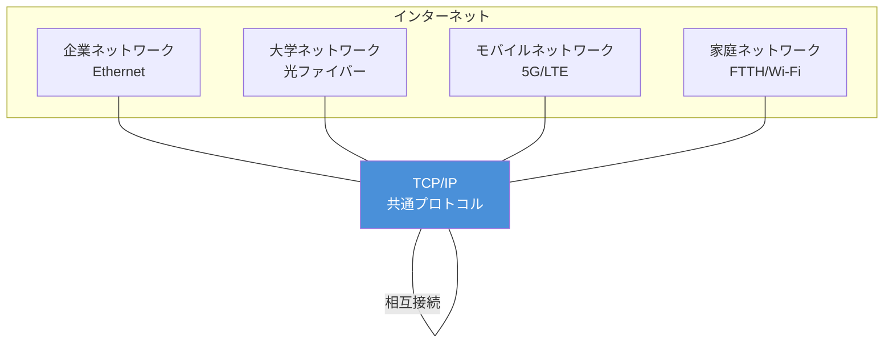
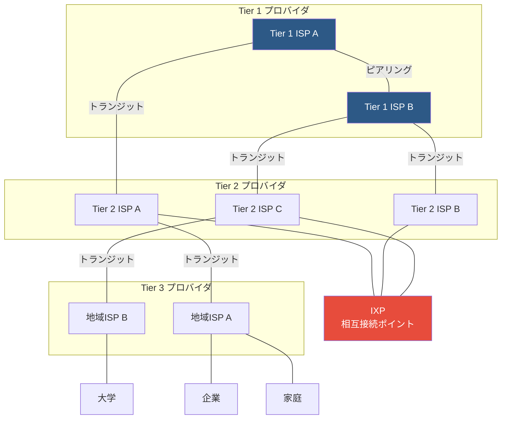
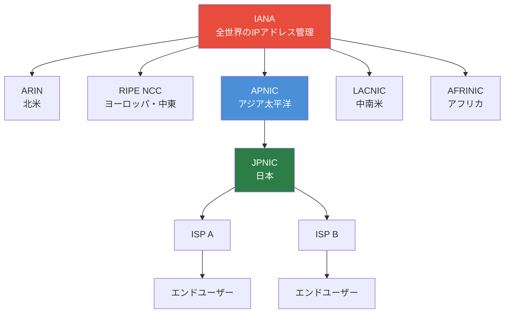

import { Aside } from '@astrojs/starlight/components';

## この節で学ぶこと

「インターネット」という言葉は日常的に使われるが，その技術的な意味と構造を正確に理解している人は意外に少ない．
本節では，インターネットの正確な定義，TCP/IPとの不可分な関係，
そしてISP（Internet Service Provider）やIXP（Internet Exchange Point）を中心としたインターネットの物理的・論理的構造を学ぶ．
これらの知識は，ネットワーク設計や障害対応の基礎となる．

## 2.3.1 インターネットとは

### インターネットの定義

インターネット（Internet）とは，世界中の様々なネットワークがTCP/IPプロトコルによって相互接続された巨大なネットワークの集合体である．
「internet」（小文字のi）が「相互接続されたネットワーク」を一般的に指すのに対し，
「Internet」（大文字のI）は我々が日常的に利用する特定のグローバルネットワークを指す．

### インターネットの特徴

インターネットには以下の特徴がある:

- 分散型アーキテクチャ: 単一の管理主体が存在しない
- オープンな標準: TCP/IPに基づく共通プロトコルを使用
- 自律システムの集合: 各組織が自律的に運用するネットワークの集合体
- エンドツーエンドの原則: ネットワーク内部はシンプルに保ち，知的な処理は端末で行う

### インターネットとイントラネット

インターネットの技術（TCP/IP）を組織内部のネットワークに適用したものをイントラネットと呼ぶ．
さらに，イントラネットを取引先など特定の外部組織にも開放したものをエクストラネットと呼ぶ．

## 2.3.2 インターネットとTCP/IPの関係

### TCP/IPがインターネットの共通言語

インターネットを構成する個々のネットワークは，様々な技術基盤を持っている．
光ファイバー，無線LAN，衛星通信，モバイル通信など，物理的な伝送技術は多岐にわたる．
これらの異種ネットワークが相互に通信できるのは，共通のプロトコルとしてTCP/IPを使用しているからである．

### インターネットの成長とTCP/IPの進化

インターネットの規模拡大に伴い，TCP/IPも進化を続けている．
IPv4のアドレス枯渇に対応するIPv6の導入，HTTP/2やHTTP/3による通信の高速化，
TLS 1.3によるセキュリティの強化など，インターネットの要求に応じてプロトコルは継続的に改良されている．

## 2.3.3 インターネットの構造

### 階層的なネットワーク構造

インターネットは階層的な構造を持っている．
最上位にはTier 1と呼ばれる大規模なバックボーンネットワークが存在し，
その下にTier 2（地域ISP），Tier 3（ローカルISP）が接続されるという階層を形成する．

### AS（自律システム）

インターネットは多数のAS（Autonomous System: 自律システム）から構成される．
ASとは，単一の管理主体（通常はISPや大企業）によって運用されるネットワークの集合であり，
共通のルーティングポリシーを持つ．各ASにはIANA（Internet Assigned Numbers Authority）から一意のAS番号が割り当てられる．

### IXP（Internet Exchange Point）

IXP（インターネットエクスチェンジポイント）は，複数のISPやコンテンツプロバイダが相互に接続するための物理的な施設である．
日本ではJPIX（日本インターネットエクスチェンジ）やJPNAP（Japan Network Access Point）などが主要なIXPとして運用されている．

IXPの存在により，ISP間のトラフィックを効率的に交換でき，通信の遅延低減とコスト削減が実現される．

### ピアリングとトランジット

ISP間の接続には主に2つの形態がある:

- ピアリング（Peering）: 同等の規模を持つISP間で，相互にトラフィックを無料で交換する関係
- トランジット（Transit）: 上位ISPに対して料金を支払い，インターネット全体への到達性を得る関係

Tier 1 ISPはトランジットを購入する必要がなく，すべてのインターネットへの到達性をピアリングのみで実現できるISPと定義される．

## 2.3.4 ISPと地域ネット

### ISP（Internet Service Provider）の役割

ISPは企業や個人にインターネット接続サービスを提供する事業者である．
ISPは以下の機能を提供する:

- インターネットへの物理的な接続（回線サービス）
- IPアドレスの割り当て
- DNS（Domain Name System）サービス
- メールサービス
- その他の付加サービス（Webホスティング，セキュリティなど）

### 地域ネットワーク

地域ネットワーク（地域ネット）は，特定の地域内のユーザーにインターネット接続を提供するネットワークである．
日本では，学術研究ネットワーク（SINET），地域の研究開発ネットワーク，
および各地域の商用ISPがこの役割を果たしている．

### IPアドレスの管理体制

IPアドレスは階層的な管理体制のもとで割り当てられている．

IANAが全体を統括し，地域インターネットレジストリ（RIR）に大きなアドレスブロックを割り当てる．
アジア太平洋地域ではAPNIC，日本ではJPNIC（Japan Network Information Center）がIPアドレスの管理を行っている．

<Aside type="tip" title="FDE実務での活用">
ISPとクラウドリージョンの関係を理解することは，サービスの配置設計において重要である．
例えば，AWS，GCP，Azureなどのクラウドプロバイダは，主要なIXPに近い場所にリージョンを配置している．
これにより，ユーザーからクラウドサービスまでのネットワークホップ数を減らし，レイテンシを低減している．
AIサービスを設計する際には，推論APIのレスポンスタイムにネットワークレイテンシが大きく影響するため，
ユーザーの所在地に近いクラウドリージョンを選択することが重要である．
また，マルチリージョン構成を検討する際には，リージョン間の接続がどのISPやIXPを経由するかを理解しておくことで，
適切なレイテンシ見積もりと冗長構成の設計が可能になる．
</Aside>

## まとめ

- インターネットは世界中の異種ネットワークがTCP/IPで相互接続された巨大なネットワークの集合体である
- TCP/IPはインターネットの共通プロトコルであり，異なる物理層技術を抽象化して統一的な通信を実現する
- インターネットはTier 1/2/3のISPが階層的に接続した構造を持ち，ASとして管理される
- IXPはISP間のトラフィック交換を効率化する重要な拠点である
- IPアドレスはIANA → RIR → NIR → ISP → エンドユーザーの階層で管理・割り当てされる

## 理解度チェック

問題1: インターネットとイントラネットの違いを説明せよ．

インターネットは，世界中のネットワークがTCP/IPで相互接続されたグローバルなネットワークである．
一方，イントラネットは，インターネットと同じTCP/IP技術を組織の内部ネットワークに適用したものであり，
外部からのアクセスが制限されている．
イントラネットは組織内の情報共有やコミュニケーションに利用され，
必要に応じてファイアウォールなどを通じてインターネットと接続される．

問題2: Tier 1 ISPの定義と特徴を述べよ．

Tier 1 ISPとは，他のISPからトランジット（有料の接続サービス）を購入することなく，
インターネット全体への到達性をピアリング（相互接続）のみで実現できるISPのことである．
Tier 1 ISP同士はピアリング契約により相互にトラフィックを交換し，
下位のTier 2やTier 3 ISPにトランジットサービスを提供する．
大規模なバックボーンネットワークを持ち，インターネットの基幹を形成している．

問題3: IXP（Internet Exchange Point）の役割と利点を説明せよ．

IXPは，複数のISPやコンテンツプロバイダが物理的に一つの施設に集まり，
相互にトラフィックを交換するための接続ポイントである．
IXPの利点は以下の通りである:
- ISP間の通信が上位ISPを経由せずに直接交換されるため，通信遅延（レイテンシ）が低減される
- トランジット費用の削減によるコスト効率の向上
- 国内トラフィックを国外に迂回させずに済むため，帯域の効率的な利用が可能になる

問題4: ピアリングとトランジットの違いを述べよ．

ピアリングは，同等の規模や対等な関係にあるISP間で，相互にトラフィックを無料（セトルメントフリー）で交換する関係である．
両者のネットワークに直接接続し，互いの顧客宛のトラフィックのみを交換する．
一方，トランジットは下位のISPが上位のISPに料金を支払い，
上位ISPを通じてインターネット全体への到達性を購入する関係である．
トランジットプロバイダは，自身のネットワークだけでなく，接続している他のすべてのネットワークへのルートを提供する．

問題5: IPアドレスの管理階層を上位から順に説明せよ．

1. IANA（Internet Assigned Numbers Authority）: 全世界のIPアドレス空間を統括管理
2. RIR（Regional Internet Registry: 地域インターネットレジストリ）: 各大陸・地域のアドレスを管理（ARIN，RIPE NCC，APNIC，LACNIC，AFRINIC）
3. NIR（National Internet Registry: 国別インターネットレジストリ）: 各国のアドレスを管理（日本ではJPNIC）
4. LIR（Local Internet Registry: ローカルインターネットレジストリ）/ ISP: エンドユーザーにIPアドレスを割り当て
5. エンドユーザー: ISPから割り当てられたIPアドレスを使用

この階層的な管理体制により，IPアドレスの重複を防ぎ，効率的な割り当てが実現される．

