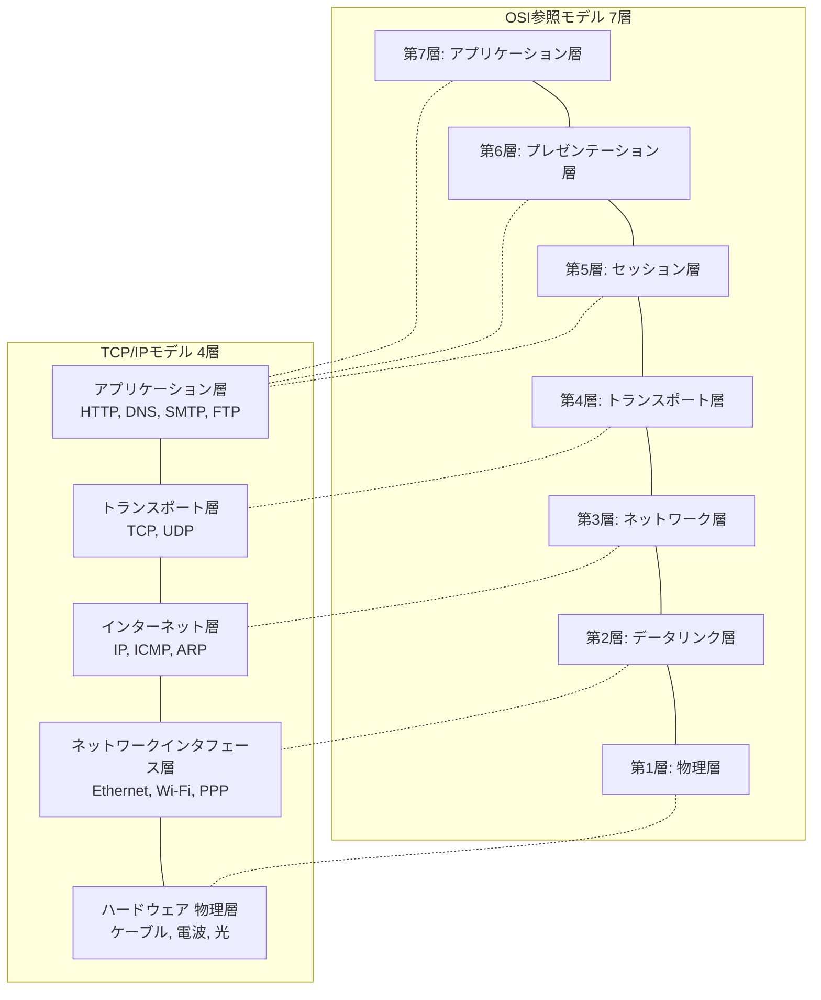
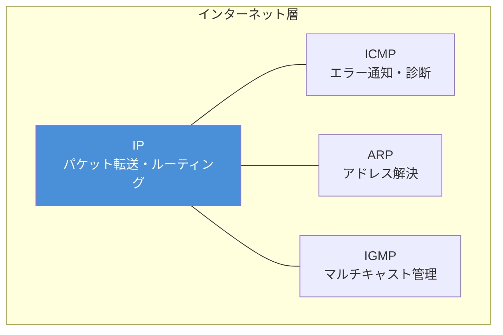
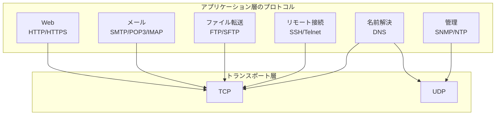

import { Aside } from '@astrojs/starlight/components';

## この節で学ぶこと

TCP/IPはOSI参照モデルの7層とは異なる4層（または5層）の階層モデルで構成されている．
本節では，TCP/IPの階層モデルの各層の役割を理解し，OSI参照モデルとの対応関係を把握する．
物理層からアプリケーション層まで，各層がどのように連携してエンドツーエンドの通信を実現するのかを学ぶ．
階層化の意義を正しく理解することは，ネットワークの設計・運用・障害対応のすべてに通じる基礎知識である．

## 2.4.1 TCP/IPとOSI参照モデル

### 2つのモデルの比較

OSI参照モデルは国際標準化機構（ISO）が策定した7層のネットワークアーキテクチャモデルであり，
TCP/IPモデルはインターネットの実装に基づいた4層のモデルである．
OSI参照モデルは理論的・包括的であるのに対し，TCP/IPモデルは実用的・実装指向である．

### 両モデルの対応関係

| OSI参照モデル | TCP/IPモデル | 主な役割 |
|-------------|------------|---------|
| アプリケーション層（第7層） | アプリケーション層 | ユーザーアプリケーションへのサービス提供 |
| プレゼンテーション層（第6層） | アプリケーション層 | データの表現形式の変換・暗号化 |
| セッション層（第5層） | アプリケーション層 | セッションの管理 |
| トランスポート層（第4層） | トランスポート層 | エンドツーエンドの通信制御 |
| ネットワーク層（第3層） | インターネット層 | パケットの転送と経路制御 |
| データリンク層（第2層） | ネットワークインタフェース層 | 隣接ノード間のデータ転送 |
| 物理層（第1層） | ハードウェア（物理層） | 物理的な信号の伝送 |

### なぜ4層なのか

TCP/IPモデルがOSI参照モデルより層数が少ない理由は，その設計思想にある．
TCP/IPは実際のインターネット実装から帰納的に定義されたモデルであり，
実用上不要な細分化を避け，シンプルで実装しやすい構造を重視している．
特にOSIのセッション層とプレゼンテーション層の機能は，TCP/IPではアプリケーション層に統合されている．

## 2.4.2 ハードウェア（物理層）

### 物理層の役割

ハードウェア（物理層）は，データを実際の物理的な信号（電気信号，光信号，電波）に変換して伝送する層である．
TCP/IPモデルでは明示的に定義されないことも多いが，通信の基盤として不可欠である．

### 伝送媒体の種類

物理層で使用される主な伝送媒体は以下の通りである:

- ツイストペアケーブル（UTP/STP）: LANで最も一般的に使用される銅線ケーブル
- 光ファイバーケーブル: 長距離・大容量通信に適した光伝送媒体
- 同軸ケーブル: CATVネットワークなどで使用
- 無線（電波）: Wi-Fi，Bluetooth，5Gなどの無線通信

### 物理層の規格

物理層の規格は，ケーブルの種類，コネクタの形状，信号の符号化方式，伝送速度などを定義する．
例えば，1000BASE-Tはカテゴリ5e以上のツイストペアケーブルを使用した1Gbpsのイーサネット規格である．

## 2.4.3 ネットワークインタフェース層

### ネットワークインタフェース層（データリンク層）の役割

ネットワークインタフェース層は，同一のネットワーク（データリンク）内で隣接するノード間のデータ転送を担当する．
物理層が提供する「ビットの伝送」を基盤として，「フレーム」という単位で信頼性のあるデータ転送を実現する．

### フレームとMACアドレス

この層では，データをフレームと呼ばれる単位にまとめて送受信する．
各ネットワークインタフェースには固有のMACアドレス（Media Access Control Address）が割り当てられており，
同一データリンク内でのノードの識別に使用される．

### 主なプロトコルと技術

- Ethernet（IEEE 802.3）: 有線LANの標準技術
- Wi-Fi（IEEE 802.11）: 無線LANの標準技術
- PPP（Point-to-Point Protocol）: ポイントツーポイント接続のプロトコル
- PPPoE: PPP over Ethernet

## 2.4.4 インターネット層

### インターネット層（ネットワーク層）の役割

インターネット層は，異なるネットワーク間をまたがるパケットの転送（ルーティング）を担当する．
送信元から宛先まで，複数のネットワークを経由してパケットを届けることがこの層の最大の責務である．

### IP（Internet Protocol）

IPはインターネット層の中核プロトコルであり，以下の機能を提供する:

- IPアドレスによるホストの識別
- パケットの転送（ルーティング）
- パケットの分割と再構成（フラグメンテーション）
- TTL（Time to Live）によるパケットの生存期間管理

### IPのコネクションレス性

IPはコネクションレス型のプロトコルであり，個々のパケットを独立に転送する．
通信の信頼性（パケットの順序制御，再送制御など）はIPでは保証せず，上位層（TCP）に委ねる．
この設計により，IPは単純で高速なパケット転送に専念できる．

### 補助プロトコル

インターネット層にはIP以外にも重要なプロトコルが存在する:

- ICMP（Internet Control Message Protocol）: エラー通知や診断（pingコマンド等）
- ARP（Address Resolution Protocol）: IPアドレスからMACアドレスへの解決
- IGMP（Internet Group Management Protocol）: マルチキャストグループ管理

## 2.4.5 トランスポート層

### トランスポート層の役割

トランスポート層は，エンドツーエンド（送信元ホストから宛先ホスト）の通信制御を担当する．
インターネット層がホスト間のパケット転送を行うのに対し，
トランスポート層はホスト上の特定のアプリケーション間の通信を管理する．

### ポート番号

トランスポート層では，ポート番号を使用して通信先のアプリケーションを識別する．
IPアドレスがホストを特定し，ポート番号がそのホスト上のアプリケーションを特定する．

### TCP（Transmission Control Protocol）

TCPはコネクション型のプロトコルであり，以下の機能を提供する:

- 信頼性のあるデータ転送（順序制御，再送制御）
- フロー制御（受信側の処理能力に応じた送信速度の調整）
- 輻輳制御（ネットワーク全体の混雑を緩和）
- コネクションの確立と切断（3ウェイハンドシェイク）

TCPはHTTP，SMTP，FTPなど，信頼性が要求されるアプリケーションで使用される．

### UDP（User Datagram Protocol）

UDPはコネクションレス型のプロトコルであり，TCPのような信頼性保証は提供しない．
その代わり，オーバーヘッドが小さく，リアルタイム性が求められるアプリケーションに適している．

UDPはDNS，音声通話（VoIP），動画ストリーミング，オンラインゲームなどで使用される．

## 2.4.6 アプリケーション層

### アプリケーション層（セッション層以上の上位層）の役割

TCP/IPのアプリケーション層は，OSI参照モデルのセッション層，プレゼンテーション層，アプリケーション層の機能を統合している．
ユーザーが直接利用するアプリケーションに対して，ネットワーク通信の機能を提供する層である．

### 主なアプリケーション層プロトコル

| プロトコル | ポート番号 | 用途 |
|----------|----------|------|
| HTTP/HTTPS | 80/443 | Webページの転送 |
| DNS | 53 | ドメイン名の解決 |
| SMTP | 25/587 | メールの送信 |
| POP3/IMAP | 110/143 | メールの受信 |
| FTP | 20/21 | ファイル転送 |
| SSH | 22 | セキュアなリモートログイン |
| DHCP | 67/68 | IPアドレスの自動割り当て |
| SNMP | 161/162 | ネットワーク管理 |
| NTP | 123 | 時刻同期 |

### アプリケーション層のモデル

アプリケーション層のプロトコルは，主にクライアント・サーバモデルに基づいて設計されている．
クライアントがサーバに対してリクエストを送信し，サーバがレスポンスを返すという通信パターンである．
近年ではP2P（Peer to Peer）モデルやマイクロサービスアーキテクチャなど，多様な通信パターンも普及している．

<Aside type="tip" title="FDE実務での活用">
AI推論APIへのリクエストを例にとると，各層で以下の処理が行われる:
アプリケーション層ではHTTPSプロトコルでJSON形式のリクエストが構築される．
トランスポート層ではTCPによるコネクション確立（TLSハンドシェイクを含む）が行われる．
インターネット層ではIPパケットとして宛先サーバのIPアドレスに向けてルーティングされる．
ネットワークインタフェース層ではイーサネットフレームとして次のルーターへ転送される．
この一連の処理を理解することで，APIのレスポンスタイムのボトルネックがどの層にあるかを的確に特定でき，
パフォーマンスチューニングやトラブルシューティングに役立つ．
</Aside>

## まとめ

- TCP/IPは4層（ハードウェアを含めると5層）のモデルで構成され，OSI参照モデルの7層を簡略化したものである
- ハードウェア（物理層）は信号の物理的な伝送を担当する
- ネットワークインタフェース層は同一データリンク内のフレーム転送を担当する
- インターネット層はIPによるネットワーク間のパケット転送（ルーティング）を担当する
- トランスポート層はTCP/UDPによるエンドツーエンドの通信制御を担当する
- アプリケーション層はHTTPやDNSなどの上位プロトコルを提供する

## 理解度チェック

問題1: TCP/IPモデルとOSI参照モデルの主な違いを述べよ．

TCP/IPモデルは4層（ハードウェア含めて5層），OSI参照モデルは7層で構成される．
TCP/IPモデルはインターネットの実装から帰納的に定義された実用的なモデルであるのに対し，
OSI参照モデルは理論的・包括的なモデルである．
特に大きな違いは，OSI参照モデルのセッション層とプレゼンテーション層が，
TCP/IPモデルではアプリケーション層に統合されている点である．
TCP/IPモデルはシンプルで実装しやすく，実際のインターネットではTCP/IPモデルが事実上の標準となっている．

問題2: IPがコネクションレス型である理由と，その利点を説明せよ．

IPがコネクションレス型である理由は，ネットワーク内部をシンプルに保つ「エンドツーエンドの原則」に基づいている．
個々のパケットを独立して転送することで，以下の利点がある:
- ルーターの処理が単純になり，高速なパケット転送が可能
- 一部の経路に障害が発生しても，別の経路でパケットを転送可能（柔軟性）
- 信頼性制御が不要なアプリケーション（DNS，動画ストリーミングなど）でオーバーヘッドを削減可能
通信の信頼性が必要な場合は，上位層のTCPが再送制御や順序制御を担当する．

問題3: TCPとUDPの特徴を比較し，それぞれの適切な用途を挙げよ．

TCP:
- コネクション型（3ウェイハンドシェイクで接続確立）
- 信頼性のある通信（再送制御，順序制御）
- フロー制御・輻輳制御あり
- 用途: HTTP/HTTPS（Web），SMTP（メール），FTP（ファイル転送）

UDP:
- コネクションレス型
- 信頼性の保証なし（再送・順序制御なし）
- オーバーヘッドが小さく高速
- 用途: DNS（名前解決），VoIP（音声通話），動画ストリーミング，オンラインゲーム

TCPはデータの完全性が重要なアプリケーション，UDPはリアルタイム性が重要なアプリケーションに適している．

問題4: アプリケーション層のHTTP通信において，下位の各層はそれぞれ何を担当するか？

HTTP通信における各層の役割:
- アプリケーション層: HTTPプロトコルによるリクエスト・レスポンスの構成と解釈
- トランスポート層: TCPによるコネクション確立（3ウェイハンドシェイク），信頼性のあるデータ転送，ポート番号（80/443）による識別
- インターネット層: IPによるパケットの経路制御，送信元・宛先IPアドレスに基づくルーティング
- ネットワークインタフェース層: イーサネット等のフレームとしてのカプセル化，MACアドレスによる隣接ノードへの転送
- ハードウェア（物理層）: 電気信号・光信号・電波としての物理的な伝送

