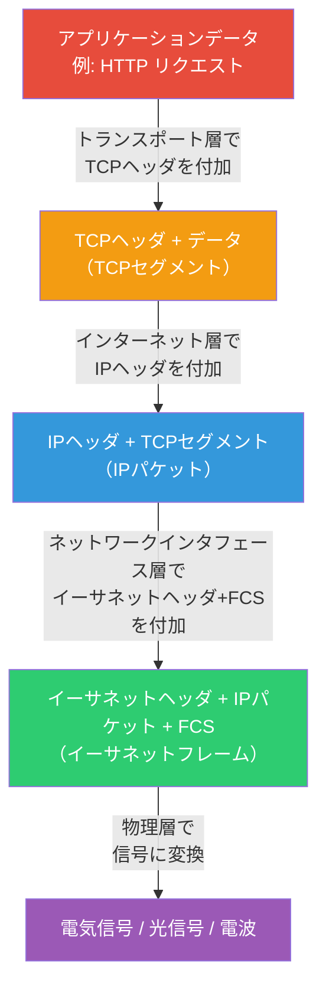
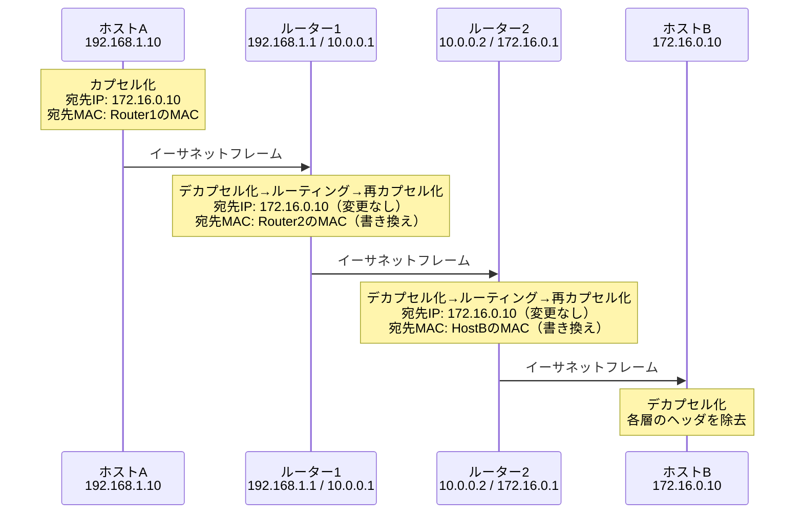
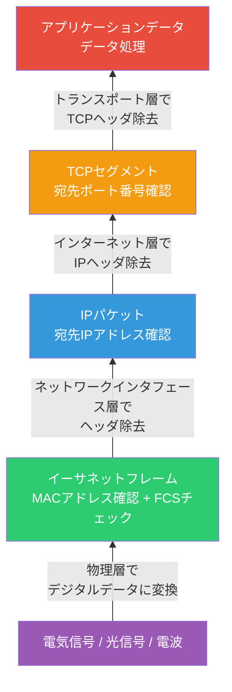

import { Aside } from '@astrojs/starlight/components';

## この節で学ぶこと

TCP/IPの階層モデルでは，データが各層を通過するたびにヘッダが付加される「カプセル化」の仕組みによって通信が成立する．
本節では，パケットヘッダの構造と役割を理解し，送信処理から中継処理，受信処理までの一連の流れを具体的に追う．
データリンク上をパケットが実際にどのように流れるかを把握することで，
ネットワーク障害の解析やパフォーマンスチューニングに必要な基礎力が身につく．

## 2.5.1 パケットヘッダ

### ヘッダとペイロード

ネットワーク通信において，各層のプロトコルはデータの先頭に制御情報を付加する．
この制御情報を「ヘッダ」と呼び，実際のデータ本体を「ペイロード」と呼ぶ．
ヘッダには，送信元・宛先の識別情報，プロトコルの種類，データの長さ，エラーチェック用の情報などが含まれる．

### 各層のヘッダ

TCP/IPの各層で付加されるヘッダは異なる情報を持つ:

| 層 | ヘッダ名 | 主な情報 |
|---|---------|---------|
| アプリケーション層 | アプリケーションヘッダ | HTTPメソッド，Content-Type等 |
| トランスポート層 | TCP/UDPヘッダ | 送信元・宛先ポート番号，シーケンス番号等 |
| インターネット層 | IPヘッダ | 送信元・宛先IPアドレス，TTL等 |
| ネットワークインタフェース層 | イーサネットヘッダ | 送信元・宛先MACアドレス，タイプ等 |

### パケット，セグメント，フレームの呼称

各層で扱うデータの単位には異なる呼称がある:

- アプリケーション層: メッセージ
- トランスポート層: セグメント（TCP）／データグラム（UDP）
- インターネット層: パケット（IPデータグラム）
- ネットワークインタフェース層: フレーム

ただし，一般的には「パケット」という用語がネットワーク上のデータ単位を総称する言葉として広く使われる．

## 2.5.2 パケットの送信処理

### カプセル化のプロセス

送信側のホストでは，アプリケーション層から下位層に向かって，各層でヘッダが順次付加される．
この過程をカプセル化（Encapsulation）と呼ぶ．

### 送信処理の詳細な流れ

1. アプリケーション層: アプリケーション（Webブラウザなど）がHTTPリクエストなどのデータを生成する
2. トランスポート層: TCPが送信元ポート番号，宛先ポート番号，シーケンス番号などのTCPヘッダを付加し，TCPセグメントを作成する
3. インターネット層: IPが送信元IPアドレス，宛先IPアドレス，TTLなどのIPヘッダを付加し，IPパケットを作成する
4. ネットワークインタフェース層: イーサネットドライバが送信元MACアドレス，宛先MACアドレスなどのイーサネットヘッダとFCS（Frame Check Sequence）を付加し，フレームを作成する
5. 物理層: フレームが電気信号や光信号に変換され，伝送媒体上に送出される

## 2.5.3 データリンクを流れるパケットの様子

### ルーターを経由する通信

送信元ホストから宛先ホストまで，パケットは通常複数のルーターを経由する．
各ルーターでは，ネットワークインタフェース層のフレームが一度分解（デカプセル化）され，
IPヘッダの宛先IPアドレスに基づいてルーティングテーブルを参照し，次のルーターへ転送する．
この際，イーサネットヘッダの送信元・宛先MACアドレスはホップごとに書き換えられるが，
IPヘッダの送信元・宛先IPアドレスは変更されない（NATを使用する場合を除く）．

### MACアドレスとIPアドレスの役割の違い

この通信過程から，MACアドレスとIPアドレスの役割の違いが明確になる:

- IPアドレス: エンドツーエンドの通信相手を識別する（送信元から宛先まで不変）
- MACアドレス: 同一データリンク内の次のノードを識別する（ホップごとに変化）

### データリンクが変わるとフレーム形式も変わる

パケットがイーサネットからWi-Fi，さらにPPPなど異なるデータリンクを通過する場合，
ネットワークインタフェース層のフレーム形式は各データリンクに合わせて変化する．
しかし，インターネット層以上のヘッダ（IPヘッダ，TCPヘッダ，アプリケーションデータ）は維持される．
これがIP層による「データリンクの抽象化」であり，異種ネットワーク間の通信を可能にする核心的な仕組みである．

## 2.5.4 パケットの受信処理

### デカプセル化のプロセス

受信側のホストでは，送信処理とは逆の順序で，各層のヘッダが順次除去されていく．
この過程をデカプセル化（Decapsulation）と呼ぶ．

### 受信処理の詳細な流れ

1. 物理層: 伝送媒体上の物理信号を受信し，デジタルデータに変換する
2. ネットワークインタフェース層: イーサネットヘッダの宛先MACアドレスが自身のものか確認し，FCSでエラーチェックを行う．正常であればイーサネットヘッダとFCSを除去し，IPパケットを上位層に渡す
3. インターネット層: IPヘッダの宛先IPアドレスが自身のものか確認する．IPヘッダを除去し，プロトコル番号に基づいてTCPまたはUDPにデータを渡す
4. トランスポート層: TCPヘッダの宛先ポート番号を確認し，対応するアプリケーションにデータを渡す．TCPの場合は確認応答（ACK）を送信側に返す
5. アプリケーション層: アプリケーションヘッダを解析し，データ本体を処理する（Webサーバならリクエストに応じたレスポンスを返すなど）

### 各層でのフィルタリング

受信処理の各層では，ヘッダの情報に基づいてフィルタリング（選別）が行われる:

- ネットワークインタフェース層: 宛先MACアドレスが自身のもの，またはブロードキャスト/マルチキャストかどうか
- インターネット層: 宛先IPアドレスが自身のものかどうか
- トランスポート層: 宛先ポート番号に対応するアプリケーションが待ち受けているかどうか

これにより，自分宛でないパケットは各層で効率的に破棄される．

<Aside type="tip" title="FDE実務での活用">
Wireshark（ネットワークプロトコルアナライザ）を使用すると，実際のパケットのカプセル化構造を目で見て確認できる．
パケットキャプチャでは，イーサネットヘッダ，IPヘッダ，TCPヘッダ，アプリケーションデータが階層的に表示される．
例えば，AI推論APIのHTTPSリクエストをキャプチャすると以下の情報が確認できる:
- イーサネット層: 送信元・宛先のMACアドレス
- IP層: 送信元IPアドレス（クライアント）と宛先IPアドレス（APIサーバ）
- TCP層: クライアントの一時ポート番号と宛先のポート443
- TLS層: 暗号化されたアプリケーションデータ
ネットワーク障害時には，どの層までパケットが正常に処理されているかをWiresharkで確認することで，
問題の切り分けが効率的に行える．tcpdumpコマンドでもコマンドライン上で同様の解析が可能であり，
サーバ環境でのトラブルシューティングに活用できる．
</Aside>

## まとめ

- 各層のプロトコルはデータにヘッダを付加（カプセル化）して下位層に渡す
- アプリケーション層からネットワークインタフェース層に向かってヘッダが順次追加される
- ルーターではフレームのデカプセル化→ルーティング→再カプセル化が行われ，MACアドレスはホップごとに変化する
- IPアドレスはエンドツーエンドで不変だが，MACアドレスはホップごとに書き換えられる
- 受信側ではカプセル化の逆順にヘッダを除去（デカプセル化）し，各層でフィルタリングを行う

## 理解度チェック

問題1: カプセル化とデカプセル化のプロセスを説明せよ．

カプセル化は，送信側でアプリケーション層から下位層に向かって，各層のプロトコルヘッダが順次付加される過程である．
アプリケーションデータにTCPヘッダ→IPヘッダ→イーサネットヘッダ（+FCS）が順に追加される．
デカプセル化はその逆で，受信側で物理層から上位層に向かって，各層のヘッダが順次除去される過程である．
各層でヘッダの情報が解析され，自分宛のデータであることが確認された後にヘッダが除去され，上位層にデータが渡される．

問題2: パケットがルーターを経由する際，IPアドレスとMACアドレスはそれぞれどう変化するか？

IPヘッダの送信元IPアドレスと宛先IPアドレスは，ルーターを経由しても変更されない（NATを使用しない場合）．
IPアドレスはエンドツーエンドの通信相手を識別するためのものだからである．
一方，イーサネットヘッダの送信元MACアドレスと宛先MACアドレスは，ホップ（ルーター）ごとに書き換えられる．
各ルーターは，自身のMACアドレスを送信元として設定し，次のホップのMACアドレスを宛先に設定して，
新しいフレームを構築して転送する．

問題3: 「パケット」「セグメント」「フレーム」の違いを各層と関連づけて説明せよ．

- フレーム: ネットワークインタフェース層（データリンク層）で扱うデータ単位．イーサネットヘッダ，IPパケット，FCSを含む
- パケット（IPデータグラム）: インターネット層（ネットワーク層）で扱うデータ単位．IPヘッダとその上位層のデータを含む
- セグメント: トランスポート層（TCP）で扱うデータ単位．TCPヘッダとアプリケーションデータを含む（UDPの場合は「データグラム」と呼ぶ）
- メッセージ: アプリケーション層で扱うデータ単位．HTTPリクエスト/レスポンスなどのアプリケーションデータ

ただし，「パケット」はネットワーク上のデータ単位を総称する一般的な用語としても広く使用される．

問題4: 受信処理の各層でのフィルタリングとは何か？なぜ必要なのか？

受信処理の各層では，ヘッダ情報に基づいて「このデータは自分宛かどうか」を判定するフィルタリングが行われる:
- ネットワークインタフェース層: 宛先MACアドレスが自身のものか（またはブロードキャスト/マルチキャスト宛か）を確認
- インターネット層: 宛先IPアドレスが自身に割り当てられたものかを確認
- トランスポート層: 宛先ポート番号に対応するアプリケーションが待ち受けているかを確認

フィルタリングが必要な理由は，ネットワーク上には自分宛でないパケットも流れているためである．
特に共有型ネットワーク（イーサネットのブロードキャスト等）では，全ホストにフレームが届く場合がある．
各層でのフィルタリングにより，自分宛でないデータを早い段階で破棄し，処理の効率化とセキュリティの向上を実現する．

問題5: 異なるデータリンク（例: イーサネットとWi-Fi）を経由するとき，パケットはどうなるか？

パケットが異なるデータリンク（例えばイーサネットからWi-Fiへ）を通過する場合，
ネットワークインタフェース層のフレーム形式はデータリンクに合わせて変化する．
例えば，イーサネットフレームの形式からWi-Fiフレームの形式に変換される．
しかし，インターネット層以上のヘッダ（IPヘッダ，TCPヘッダ）とアプリケーションデータはそのまま維持される．
これがIPによる「データリンクの抽象化」の本質であり，
異なる物理的ネットワーク技術が混在するインターネット上で統一的な通信を可能にしている仕組みである．
ルーターは受信したフレームからIPパケットを取り出し，次のデータリンクに適したフレーム形式で再カプセル化して転送する．

