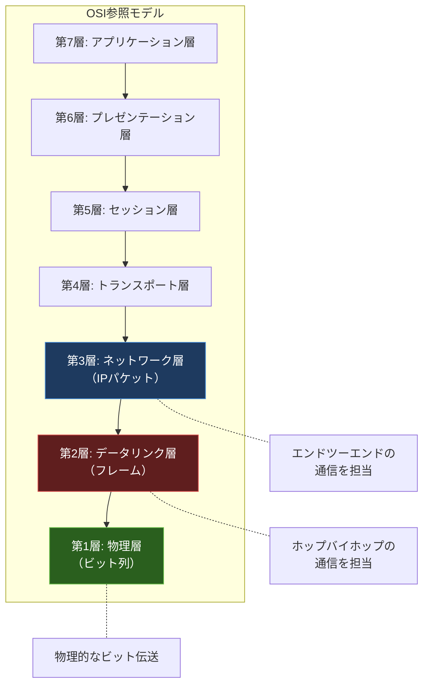
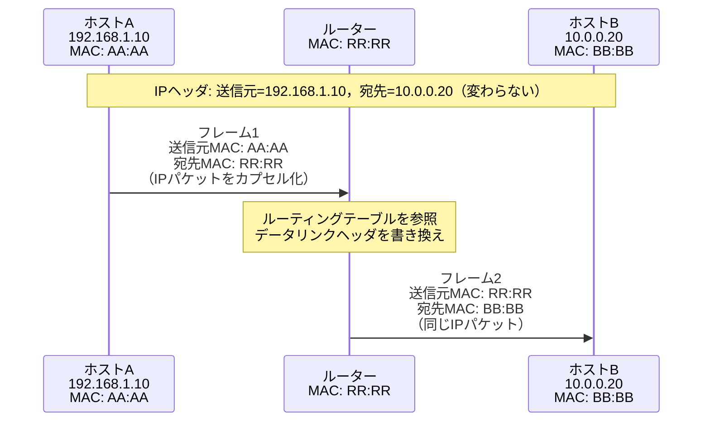
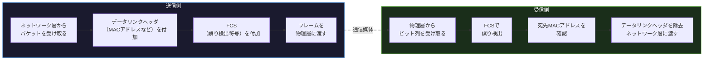

import { Aside } from '@astrojs/starlight/components';

## この節で学ぶこと

データリンク層はOSI参照モデルの第2層に位置し，直接接続されたノード間の通信を担います．
ネットワーク層（第3層）がエンドツーエンドの通信を担当するのに対し，データリンク層はホップバイホップ（隣接ノード間）の通信を実現します．
この節では，データリンク層の基本的な役割，フレームの構造，そしてネットワーク層との関係を学びます．

## データリンク層とは

データリンク層は，物理層が提供するビット列の伝送を利用して，隣接ノード間で意味のあるデータ単位（フレーム）を確実に送受信するための機能を提供します．具体的には以下の役割を担います:

- フレーミング: ビット列を意味のあるフレーム単位に区切る
- アドレッシング: MACアドレスを用いて同一ネットワーク上の送信元と宛先を識別する
- 誤り検出: FCS（Frame Check Sequence）などを用いて伝送中のビット誤りを検出する
- メディアアクセス制御: 複数のノードが同じ通信媒体を共有する場合のアクセス制御を行う
- フロー制御: 送信側と受信側の間でデータの流量を調整する

## データリンク層の位置づけ

OSI参照モデルにおけるデータリンク層の位置づけと，上下の層との関係を示します．

データリンク層は，ネットワーク層から受け取ったパケットをフレームにカプセル化して物理層に渡し，物理層から受け取ったビット列をフレームとして組み立ててネットワーク層に引き渡します．

## ネットワーク層との関係

ネットワーク層（IP）はエンドツーエンドの経路制御を行いますが，実際にデータが物理的に転送されるのは隣接ノード間です．各ホップにおいて，データリンク層がフレームの送受信を担当します．

例えば，ホストAからホストBへIPパケットを送信する場合，途中にルーターが存在すると:

1. ホストA → ルーター: データリンク層のフレームで転送
2. ルーター → ホストB: 新しいデータリンク層のフレームで転送

各ホップでデータリンクヘッダ（MACアドレスなど）は書き換えられますが，IPヘッダ（送信元・宛先IPアドレス）は変わりません．

このように，IPパケットは各ホップでデータリンク層のフレームに包まれて転送されます．ネットワーク層がグローバルな宛先への経路を決定し，データリンク層が「次のホップ」への物理的な転送を実現するという役割分担になっています．

## フレーム転送の流れ

データリンク層におけるフレーム転送の基本的な流れを整理します．

送信側の処理:

1. ネットワーク層からIPパケットを受け取る
2. データリンクヘッダ（送信元MACアドレス，宛先MACアドレスなど）を付加する
3. FCS（Frame Check Sequence）を計算して末尾に付加する
4. 完成したフレームを物理層に渡してビット列として送信する

受信側の処理:

1. 物理層からビット列を受け取り，フレームとして組み立てる
2. FCSを用いて誤りがないかチェックする（誤りがあればフレームを破棄）
3. 宛先MACアドレスが自分宛てかどうかを確認する
4. データリンクヘッダとFCSを除去し，IPパケットをネットワーク層に引き渡す

## データリンク層の抽象化

データリンク層の重要な役割の一つは，上位層（ネットワーク層以上）に対して通信媒体の違いを隠蔽することです．イーサネット，無線LAN，PPPなど，さまざまなデータリンク技術が存在しますが，ネットワーク層（IP）はこれらの違いを意識する必要がありません．

IPにとって，データリンク層は「次のホップにパケットを届けてくれるサービス」として抽象化されています．これにより，異なるデータリンク技術が混在するネットワーク（例えば，LANではイーサネット，WANではPPP）でも，IPによるエンドツーエンド通信が可能になります．

この抽象化は，インターネットがさまざまな種類のネットワークを相互接続できる理由の一つです．

<Aside type="tip" title="FDE実務での活用">
FDE実務において，「ネットワークがつながらない」「通信が遅い」といったトラブルに遭遇した際，データリンク層の知識は原因切り分けに不可欠です．例えば，AI推論サーバーへのリクエストがタイムアウトする場合，まずpingでIP到達性を確認し，それでも問題があればarpコマンドでMACアドレス解決を確認するなど，レイヤーごとに切り分けることで効率的に原因を特定できます．また，データセンター内のGPUクラスタでは，サーバー間が複数のスイッチを経由するため，各ホップのデータリンク層が正常に動作しているかの確認が重要です．リンクダウン，CRCエラー，コリジョンなどデータリンク層固有の問題を理解しておくことで，ネットワーク障害の迅速な診断が可能になります．
</Aside>

## まとめ

- データリンク層はOSI参照モデルの第2層に位置し，隣接ノード間（ホップバイホップ）の通信を担う
- 主な役割はフレーミング，アドレッシング（MACアドレス），誤り検出（FCS），メディアアクセス制御，フロー制御
- ネットワーク層がエンドツーエンドの経路制御を行い，データリンク層が各ホップの物理的な転送を実現する
- IPパケットは各ホップでデータリンク層のフレームにカプセル化されて転送される（MACアドレスは各ホップで変わるが，IPアドレスは変わらない）
- データリンク層は通信媒体の違いを上位層に対して隠蔽し，異種ネットワーク間の相互接続を可能にする

## 理解度チェック

Q1: データリンク層とネットワーク層の役割の違いを説明してください．

データリンク層は隣接ノード間（ホップバイホップ）の通信を担当し，MACアドレスを用いてフレームの送受信を行います．一方，ネットワーク層はエンドツーエンドの通信を担当し，IPアドレスを用いてパケットの経路制御を行います．データリンク層は「次のホップ」への転送を担い，ネットワーク層は「最終宛先」への到達を実現します．

Q2: IPパケットがルーターを経由して転送される際，MACアドレスとIPアドレスはどのように変化しますか？

IPアドレス（送信元・宛先）はルーターを経由しても変化しません．一方，MACアドレスは各ホップで書き換えられます．送信元MACアドレスはそのホップの送信ノードのMACアドレスに，宛先MACアドレスは次のホップのノードのMACアドレスに変更されます．

Q3: FCS（Frame Check Sequence）の役割は何ですか？

FCSはフレームの末尾に付加される誤り検出用のデータです．送信側でフレームのデータからCRC（巡回冗長検査）などのアルゴリズムを用いてFCSを計算し，受信側で同じ計算を行って値を比較します．値が一致しなければ伝送中にビット誤りが発生したことを意味し，そのフレームは破棄されます．

Q4: データリンク層が上位層に対して通信媒体の違いを隠蔽することの利点は何ですか？

ネットワーク層（IP）はイーサネット，無線LAN，PPPなどのデータリンク技術の違いを意識する必要がなくなります．これにより，異なるデータリンク技術が混在するネットワーク環境でも，IPプロトコルによるエンドツーエンドの通信が可能になります．この抽象化がインターネットの多様なネットワーク相互接続を支える基盤となっています．

