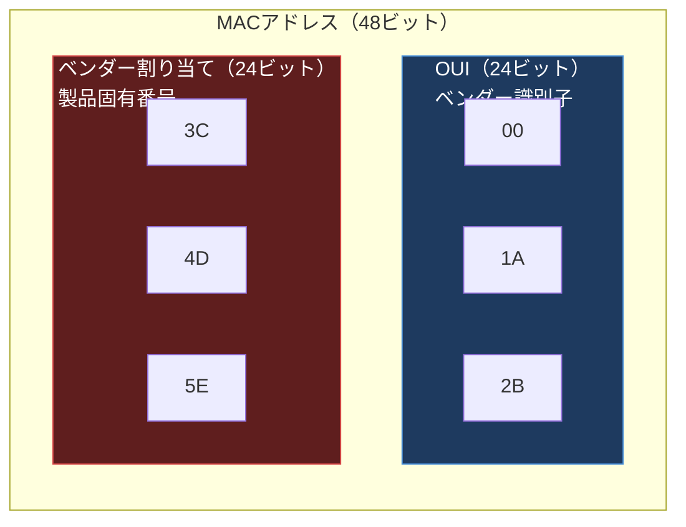
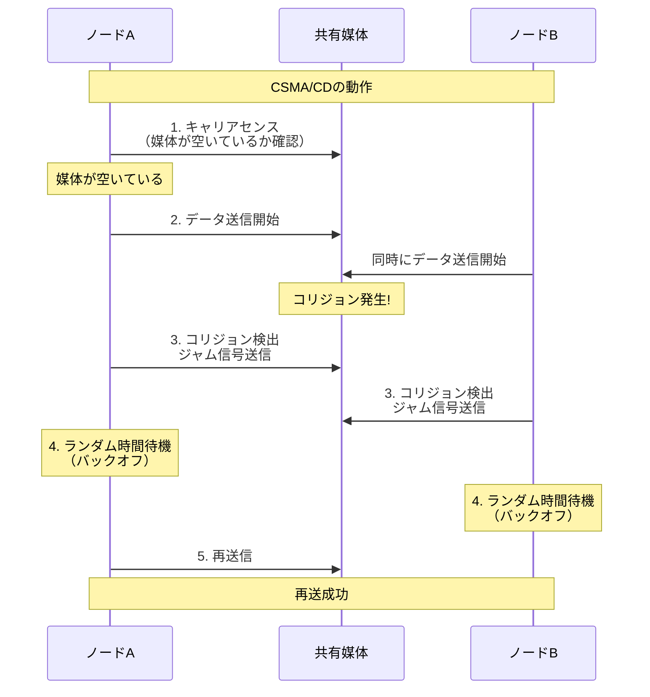
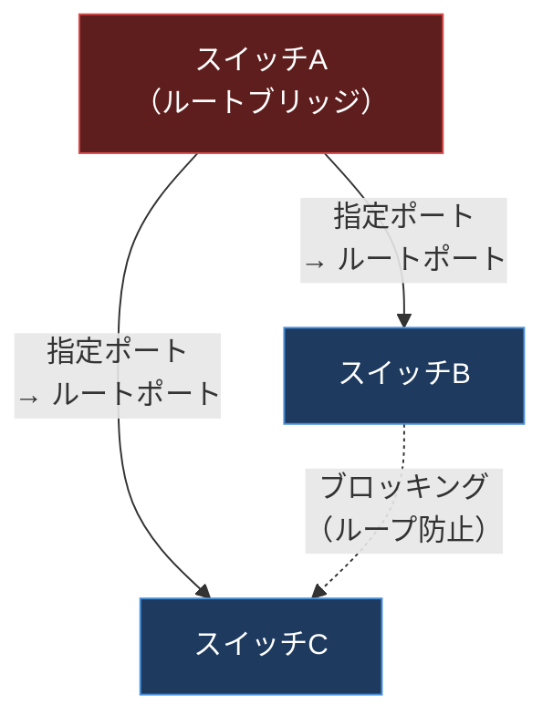
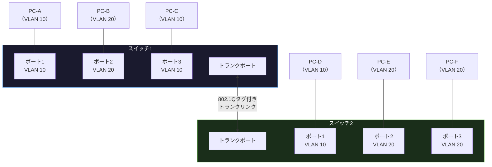

import { Aside } from '@astrojs/starlight/components';

## この節で学ぶこと

データリンク層を支える主要技術を体系的に学びます．
MACアドレスの仕組みと役割，媒体共有型・非共有型ネットワークの違い，MACアドレスによるフレーム転送の仕組みを理解します．
さらに，ネットワークのループを防ぐスパニングツリーや，論理的にネットワークを分割するVLANの技術を習得します．

## 3.2.1 MACアドレス

MACアドレス（Media Access Control Address）は，ネットワークインタフェースカード（NIC）に割り当てられた48ビット（6バイト）の固有識別子です．データリンク層でフレームの送信元と宛先を識別するために使用されます．

MACアドレスは通常，16進数表記で以下のように表されます:

```
00:1A:2B:3C:4D:5E
```



MACアドレスの構成:

- 上位24ビット（OUI: Organizationally Unique Identifier）: IEEEが各ベンダーに割り当てるメーカー識別子
- 下位24ビット: 各ベンダーが製品ごとに割り当てる固有番号

MACアドレスの特殊な形態:

- ブロードキャストアドレス（FF:FF:FF:FF:FF:FF）: 同一ネットワーク上の全ノードに送信
- マルチキャストアドレス: 特定のグループに属するノードに送信（先頭バイトの最下位ビットが1）
- ユニキャストアドレス: 特定の1台のノードに送信

## 3.2.2 媒体共有型のネットワーク

媒体共有型ネットワークは，複数のノードが同一の通信媒体（ケーブルや無線周波数）を共有する方式です．初期のイーサネット（10BASE5，10BASE2）やハブを使用したネットワーク，無線LANが代表的な例です．

媒体共有型では，同時に2つ以上のノードがデータを送信するとコリジョン（衝突）が発生します．これを制御するための代表的な方式が以下の2つです．

CSMA/CD（Carrier Sense Multiple Access with Collision Detection）:

イーサネットで採用されている方式です．



CSMA/CDの手順:

1. キャリアセンス: 送信前に媒体が使用中でないか確認する
2. 送信開始: 媒体が空いていればデータを送信する
3. コリジョン検出: 送信中にコリジョンを検出したらジャム信号を送信して全ノードに知らせる
4. バックオフ: ランダムな時間だけ待機する
5. 再送信: 待機後，再度キャリアセンスから始める

CSMA/CA（Carrier Sense Multiple Access with Collision Avoidance）:

無線LANで採用されている方式です．無線ではコリジョンの検出が困難なため，コリジョンを回避（Avoidance）するアプローチを取ります．送信前にRTS/CTS（Request to Send / Clear to Send）のハンドシェイクを行い，送信権を確保してからデータを送信します．

トークンパッシング:

リング型ネットワーク（Token Ringなど）で使用される方式です．「トークン」と呼ばれる特別なフレームがネットワーク上を巡回し，トークンを保持しているノードだけがデータを送信できます．コリジョンが発生しない利点がありますが，現在はほとんど使用されていません．

## 3.2.3 媒体非共有型のネットワーク

媒体非共有型ネットワークは，各通信が専用の通信路を持つ方式です．レイヤ2スイッチ（スイッチングハブ）を使用したネットワークが代表的な例です．

スイッチングハブでは，各ポートが独立した通信路を持ち，同時に複数の通信を行うことができます．これを全二重通信（Full Duplex）と呼びます．

媒体共有型と非共有型の比較:

| 特性 | 媒体共有型 | 媒体非共有型 |
|------|-----------|-------------|
| 代表機器 | ハブ，無線LANアクセスポイント | スイッチングハブ |
| コリジョン | 発生する | 発生しない |
| 通信方式 | 半二重 | 全二重 |
| 帯域幅 | 全ノードで共有 | ポートごとに専用 |
| スケーラビリティ | ノード数増加で性能低下 | ノード数増加の影響が小さい |

## 3.2.4 MACアドレスによる転送

レイヤ2スイッチ（スイッチングハブ）は，MACアドレステーブル（CAMテーブル，FDBとも呼ばれる）を用いてフレームの転送先を決定します．

MACアドレスによる転送の手順:

1. フレーム受信: スイッチがフレームを受信する
2. 学習: フレームの送信元MACアドレスと受信ポートの対応をMACアドレステーブルに記録する
3. 検索: 宛先MACアドレスでテーブルを検索する
4. 転送:
   - テーブルに宛先が登録されていれば，対応するポートにのみフレームを転送（ユニキャスト転送）
   - テーブルに宛先が登録されていなければ，受信ポート以外の全ポートに転送（フラッディング）
   - 宛先がブロードキャストアドレスなら，受信ポート以外の全ポートに転送

この仕組みにより，不要なフレームがネットワーク上に流れることを抑制し，帯域幅を効率的に利用できます．

## 3.2.5 ループを検出するための技術

スイッチを複数台接続してネットワークを構築する際，冗長性を確保するために複数の経路を設けることがあります．しかし，これによりネットワーク上にループが発生すると，フレームが永久に巡回し続ける「ブロードキャストストーム」が発生し，ネットワークがダウンする原因になります．

スパニングツリープロトコル（STP: Spanning Tree Protocol，IEEE 802.1D）:

STPは，ネットワーク上のループを検出し，論理的にポートをブロッキング状態にすることでループのないツリー構造を構築するプロトコルです．

STPの動作:

1. ルートブリッジの選出: ブリッジID（優先度＋MACアドレス）が最小のスイッチがルートブリッジになる
2. BPDU（Bridge Protocol Data Unit）の交換: スイッチ間でBPDUを交換して経路コストを計算する
3. ポート役割の決定:
   - ルートポート: ルートブリッジへの最短経路のポート
   - 指定ポート: 各セグメントでBPDUを転送するポート
   - ブロッキングポート: ループを防ぐためにデータ転送を停止するポート



STPの改良版として，以下のプロトコルがあります:

- RSTP（Rapid Spanning Tree Protocol，IEEE 802.1w）: STPの収束時間を大幅に短縮（数十秒→数秒）
- MSTP（Multiple Spanning Tree Protocol，IEEE 802.1s）: VLANごとに異なるスパニングツリーを構築可能

## 3.2.6 VLAN（Virtual LAN）

VLAN（Virtual LAN）は，物理的なネットワーク構成に関係なく，論理的にネットワークを分割する技術です．同じスイッチに接続されたポートを異なるVLANに割り当てることで，あたかも別のスイッチに接続されているかのように動作させることができます．

VLANの利点:

- ブロードキャストドメインの分割: 不要なブロードキャストの伝搬範囲を限定する
- セキュリティの向上: 異なるVLAN間の通信はルーターを経由する必要があるため，アクセス制御が可能
- 柔軟なネットワーク構成: 物理配線を変更せずに論理的なネットワーク構成を変更できる
- 管理の簡素化: ユーザーの移動やグループ変更に物理的な配線変更が不要

タグVLAN（IEEE 802.1Q）:

複数のスイッチ間でVLAN情報を共有するために，フレームにVLANタグ（4バイト）を挿入する方式です．スイッチ間を接続するトランクポートでは，フレームにVLAN IDを含むタグが付加され，どのVLANに属するフレームかを識別できます．



上図の構成では:

- VLAN 10に属するPC-A，PC-C，PC-Dは互いに通信可能
- VLAN 20に属するPC-B，PC-E，PC-Fは互いに通信可能
- VLAN 10とVLAN 20の間の通信にはルーター（レイヤ3スイッチ）が必要

ポートVLANとタグVLAN:

- ポートVLAN: スイッチの各ポートに固定的にVLAN IDを割り当てる方式（アクセスポート）
- タグVLAN: IEEE 802.1Qタグを使用して1つのポート（トランクポート）で複数のVLANのフレームを転送する方式

<Aside type="tip" title="FDE実務での活用">
コンテナネットワーキング環境（Docker，Kubernetes）では，データリンク層の技術が重要な役割を果たします．Dockerのブリッジネットワークは仮想的なレイヤ2スイッチとして機能し，コンテナ間の通信を実現します．Kubernetesのオーバーレイネットワーク（VXLAN）は，物理ネットワーク上に仮想的なレイヤ2ネットワークを構築する技術で，VLANの概念を拡張したものです．VXLANは最大1600万以上のセグメントIDをサポートし，VLAN IDの4,096個の制限を大幅に超えます．FDEとして，AIワークロードのコンテナ環境を構築する際，VLANによるネットワーク分離の設計や，オーバーレイネットワークのトラブルシューティングの知識は不可欠です．
</Aside>

## まとめ

- MACアドレスは48ビットの固有識別子で，上位24ビットがOUI（ベンダー識別子），下位24ビットがベンダー割り当て番号
- 媒体共有型ネットワークではCSMA/CDやCSMA/CAでコリジョンを制御し，媒体非共有型ではスイッチが全二重通信を実現する
- レイヤ2スイッチはMACアドレステーブルを用いてフレームの転送先を判断する
- STPはネットワーク上のループを検出し，ブロッキングポートにより論理的にループのないツリー構造を構築する
- VLANは物理構成に依存せず論理的にネットワークを分割し，ブロードキャストドメインの分離とセキュリティの向上を実現する

## 理解度チェック

<details>
<summary>Q1: MACアドレスのOUI部分は何を示していますか？</summary>

OUI（Organizationally Unique Identifier）はMACアドレスの上位24ビットで，IEEEが各ベンダー（メーカー）に割り当てる識別子です．OUIを見ることで，そのNIC（ネットワークインタフェースカード）がどのメーカーによって製造されたかを特定できます．
</details>

<details>
<summary>Q2: CSMA/CDの「CD」とCSMA/CAの「CA」の違いを説明してください．</summary>

CD（Collision Detection）は「コリジョン検出」を意味し，有線イーサネットで使用されます．送信中にコリジョンを検出して再送する方式です．CA（Collision Avoidance）は「コリジョン回避」を意味し，無線LANで使用されます．無線ではコリジョンの検出が困難なため，送信前にRTS/CTSのハンドシェイクで送信権を確保し，コリジョンを事前に回避するアプローチを取ります．
</details>

<details>
<summary>Q3: スイッチのMACアドレステーブルに宛先MACアドレスが登録されていない場合，フレームはどのように処理されますか？</summary>

宛先MACアドレスがテーブルに登録されていない場合，スイッチはフレームを受信ポート以外の全ポートに送信します．これを「フラッディング」と呼びます．宛先ノードがフレームに応答すると，その応答フレームの送信元MACアドレスがテーブルに学習され，以降は該当ポートにのみ転送されるようになります．
</details>

<details>
<summary>Q4: VLANを使用する主なメリットを3つ挙げてください．</summary>

1. ブロードキャストドメインの分割: 不要なブロードキャストの伝搬範囲を限定し，ネットワークの効率を向上させる
2. セキュリティの向上: 異なるVLAN間の通信にはルーターを経由する必要があり，アクセス制御が可能になる
3. 柔軟なネットワーク構成: 物理配線を変更せずに論理的なネットワーク構成を変更でき，ユーザーの移動やグループ変更に柔軟に対応できる
</details>

<details>
<summary>Q5: スパニングツリープロトコル（STP）が必要な理由と，その基本的な動作を説明してください．</summary>

冗長性のために複数の経路を設けたスイッチネットワークでは，ループが発生する可能性があります．ループが発生すると，ブロードキャストフレームが永久に巡回し続ける「ブロードキャストストーム」が発生し，ネットワークがダウンします．STPは，各スイッチ間でBPDUを交換してルートブリッジを選出し，各ポートの役割（ルートポート，指定ポート，ブロッキングポート）を決定することで，論理的にループのないツリー構造を構築します．
</details>
