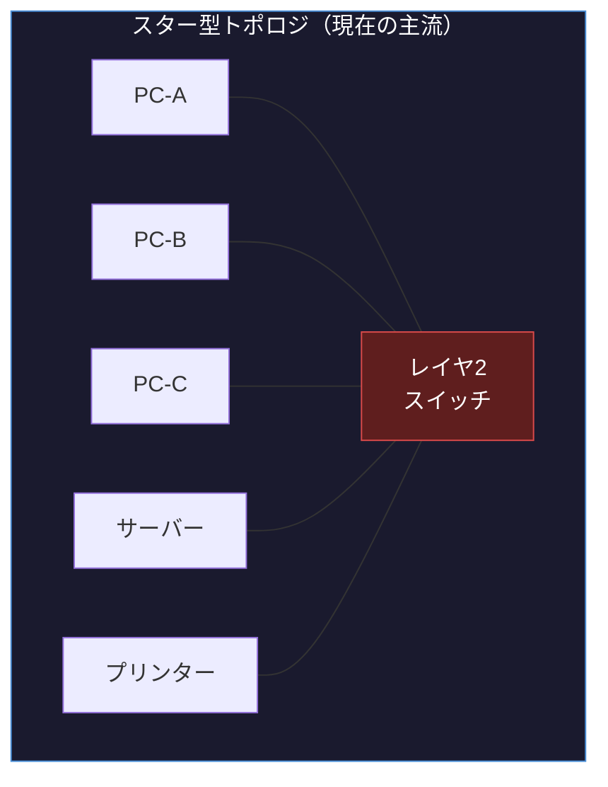
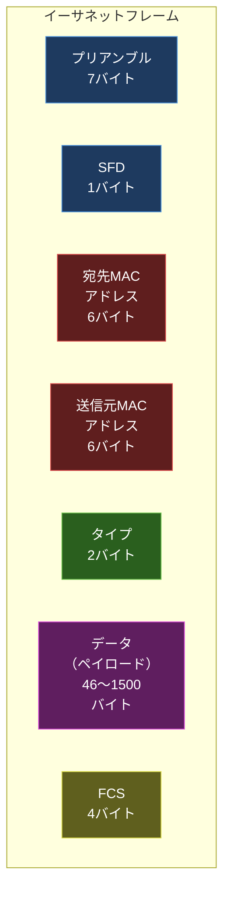

import { Aside } from '@astrojs/starlight/components';

## この節で学ぶこと

イーサネットは現在最も広く使われているデータリンク技術です．
この節では，イーサネットの接続形態（トポロジ），さまざまな規格の種類と特徴，歴史的な発展経緯，そしてフレームフォーマットの詳細を学びます．
データセンターや企業ネットワークの基盤技術として，イーサネットの理解は不可欠です．

## 3.3.1 イーサネットの接続形態

イーサネットの接続形態（トポロジ）は，歴史的にバス型からスター型へと変遷してきました．

バス型トポロジ:

初期のイーサネット（10BASE5，10BASE2）では，1本の同軸ケーブルに複数のノードが接続されるバス型トポロジが採用されていました．全ノードが同一の通信媒体を共有するため，コリジョンが発生する媒体共有型のネットワークです．

スター型トポロジ:

現在のイーサネットでは，ハブやスイッチを中心にノードを接続するスター型トポロジが標準です．各ノードはツイストペアケーブルや光ファイバーで中央のスイッチに接続されます．

スター型トポロジの利点:

- 1台のノードの障害が他のノードに影響しない
- ケーブルの追加・削除が容易
- スイッチを用いることで全二重通信が可能
- 障害箇所の特定が容易

大規模ネットワークでは，複数のスイッチを階層的に接続するツリー型や，スイッチ間を複数のリンクで接続するメッシュ型の構成が採用されます．

## 3.3.2 イーサネットにはいろいろな種類がある

イーサネットは通信速度と使用するケーブルの種類によって多くの規格が存在します．

| 規格名 | 速度 | ケーブル | 最大距離 | 策定年 |
|--------|------|---------|---------|-------|
| 10BASE-T | 10Mbps | UTPカテゴリ3以上 | 100m | 1990年 |
| 100BASE-TX | 100Mbps | UTPカテゴリ5以上 | 100m | 1995年 |
| 1000BASE-T | 1Gbps | UTPカテゴリ5e以上 | 100m | 1999年 |
| 1000BASE-SX | 1Gbps | マルチモード光ファイバー | 550m | 1998年 |
| 1000BASE-LX | 1Gbps | シングルモード光ファイバー | 5km | 1998年 |
| 10GBASE-T | 10Gbps | UTPカテゴリ6a以上 | 100m | 2006年 |
| 10GBASE-SR | 10Gbps | マルチモード光ファイバー | 300m | 2002年 |
| 10GBASE-LR | 10Gbps | シングルモード光ファイバー | 10km | 2002年 |
| 25GBASE-SR | 25Gbps | マルチモード光ファイバー | 100m | 2016年 |
| 40GBASE-SR4 | 40Gbps | マルチモード光ファイバー | 150m | 2010年 |
| 100GBASE-SR4 | 100Gbps | マルチモード光ファイバー | 100m | 2010年 |
| 400GBASE-SR8 | 400Gbps | マルチモード光ファイバー | 100m | 2017年 |

規格名の命名規則:

- 先頭の数字: 通信速度（10，100，1000，10G，25G，40G，100G，400G）
- BASE: ベースバンド伝送方式
- 末尾の文字: ケーブル種別（T=ツイストペア，S=短距離光ファイバー，L=長距離光ファイバー）

## 3.3.3 イーサネットの歴史

イーサネットは1970年代にXerox PARCのロバート・メトカーフらによって発明され，以後半世紀にわたって進化を続けてきました．

```mermaid
graph LR
    E1["1973年<br/>実験的イーサネット<br/>2.94Mbps"] --> E2["1980年<br/>DIX Ethernet<br/>（Ethernet I）"]
    E2 --> E3["1982年<br/>Ethernet II<br/>10Mbps"]
    E3 --> E4["1983年<br/>IEEE 802.3<br/>10BASE5"]
    E4 --> E5["1990年<br/>10BASE-T<br/>ツイストペア"]
    E5 --> E6["1995年<br/>Fast Ethernet<br/>100Mbps"]
    E6 --> E7["1999年<br/>Gigabit Ethernet<br/>1Gbps"]
    E7 --> E8["2002年<br/>10GbE<br/>10Gbps"]
    E8 --> E9["2010年<br/>40GbE/100GbE"]
    E9 --> E10["2017年<br/>200GbE/400GbE"]

    style E1 fill:#1e3a5f,stroke:#4a90d9,color:#fff
    style E5 fill:#2a5f1e,stroke:#6abf4b,color:#fff
    style E7 fill:#5f1e5f,stroke:#d94ad9,color:#fff
    style E10 fill:#5f1e1e,stroke:#d94a4a,color:#fff
```

歴史的な転換点:

- DIX Ethernet（1980年）: DEC，Intel，Xeroxの3社が策定した最初の規格
- IEEE 802.3（1983年）: IEEEによる標準化（DIX Ethernetをベースに）
- 10BASE-T（1990年）: ツイストペアケーブルの採用により低コスト化と普及が進む
- Fast Ethernet（1995年）: 100Mbpsへの高速化
- Gigabit Ethernet（1999年）: 1Gbpsの実現により，バックボーンだけでなくデスクトップ接続にも展開
- 10GbE以降（2002年〜）: データセンターやバックボーン向けの超高速イーサネット

イーサネットが他の技術（Token Ring，FDDI，ATMなど）に勝って標準となった理由:

- シンプルな仕組みで実装コストが低い
- 速度の向上に継続的に成功してきた
- 互換性を保ちながら進化できた
- 幅広いベンダーによるエコシステムの形成

## 3.3.4 イーサネットのフレームフォーマット

イーサネットフレーム（Ethernet II，DIXフレーム）のフォーマットを示します．

各フィールドの説明:

- プリアンブル（7バイト）: 受信側のクロック同期のための交番ビットパターン（10101010の繰り返し）
- SFD（Start Frame Delimiter，1バイト）: フレームの開始を示すパターン（10101011）
- 宛先MACアドレス（6バイト）: フレームの送信先となるノードのMACアドレス
- 送信元MACアドレス（6バイト）: フレームの送信元ノードのMACアドレス
- タイプ（2バイト）: ペイロードに含まれる上位層プロトコルを示す（IPv4=0x0800，IPv6=0x86DD，ARP=0x0806）
- データ（46〜1500バイト）: 上位層から受け取ったデータ（最小46バイト，不足分はパディング）
- FCS（Frame Check Sequence，4バイト）: CRC-32によるフレームの誤り検出符号

フレームサイズ:

- 最小フレームサイズ: 64バイト（プリアンブルとSFDを除く）
- 最大フレームサイズ: 1518バイト（プリアンブルとSFDを除く）
- ジャンボフレーム: 最大9000バイト程度（標準規格外だが，データセンターで広く使用）

IEEE 802.3フレームとの違い:

Ethernet IIフレームの「タイプ」フィールドは，IEEE 802.3フレームでは「長さ」フィールドになります．値が1536（0x0600）以上であればタイプ（Ethernet II），1500以下であれば長さ（IEEE 802.3）として解釈されます．現在はEthernet IIフレームが主流です．

<Aside type="tip" title="FDE実務での活用">
データセンター内のAIクラスタでは，GPU間の通信に高速イーサネットが使用されます．例えば，大規模言語モデルの分散学習では，100GbEや400GbEを使用してGPUサーバー間のパラメータ同期を行います．ジャンボフレーム（MTU 9000）を有効にすることで，CPUのオーバーヘッドを削減し，スループットを向上させることが一般的です．また，RDMA over Converged Ethernet（RoCE）を使用すれば，イーサネット上でRDMA（Remote Direct Memory Access）を実現し，CPUを介さずにGPUメモリ間で直接データ転送が可能になります．FDEとして，AIクラスタのネットワーク構成を設計する際，適切なイーサネット規格の選定，MTUの設定，フレームフォーマットの理解が重要になります．
</Aside>

## まとめ

- イーサネットの接続形態は，バス型トポロジからスイッチを中心としたスター型トポロジへと変遷した
- イーサネットは10Mbpsから400Gbps以上まで多くの規格が存在し，ツイストペアケーブルと光ファイバーケーブルが使用される
- イーサネットは1973年の発明以来，シンプルさと高い互換性を武器に，他のデータリンク技術を淘汰して標準となった
- イーサネットフレーム（Ethernet II）は，プリアンブル，MACアドレス，タイプ，データ，FCSから構成される
- 最小フレームサイズは64バイト，最大は1518バイト（ジャンボフレームでは約9000バイト）

## 理解度チェック

Q1: イーサネットの規格名「10GBASE-SR」の各部分は何を意味しますか？

- 10G: 通信速度が10Gbps
- BASE: ベースバンド伝送方式を使用
- SR: Short Range（短距離）の光ファイバーケーブル（マルチモード光ファイバー）を使用

この規格は主にデータセンター内の短距離接続に使用され，最大伝送距離は約300mです．

Q2: イーサネットフレームの「タイプ」フィールドの値が0x0800の場合，何を意味しますか？

タイプフィールドの値0x0800は，ペイロードにIPv4パケットが格納されていることを示します．主なタイプ値として，IPv4=0x0800，IPv6=0x86DD，ARP=0x0806があります．受信側はこのフィールドを参照して，ペイロードを適切な上位層プロトコルに引き渡します．

Q3: イーサネットフレームの最小サイズが64バイトと規定されている理由は何ですか？

CSMA/CDでコリジョンを確実に検出するためです．フレームが小さすぎると，送信が完了する前にコリジョンが検出できない可能性があります．10Mbpsイーサネットで最大ケーブル長（2500m）の場合の往復伝搬遅延時間内に，送信側がコリジョンを検出できるだけの最小フレーム長として64バイトが定められました．データが46バイトに満たない場合はパディングが追加されます．

Q4: ジャンボフレームを使用するメリットとデメリットを説明してください．

メリット: MTUを標準の1500バイトから最大9000バイト程度に拡大することで，大量データの転送時にフレーム数が減少し，CPUのオーバーヘッド（割り込み処理やヘッダ処理）が削減されます．これにより，特にデータセンター内の高速通信においてスループットが向上します．

デメリット: ジャンボフレームは標準規格外であり，経路上の全ての機器がジャンボフレームに対応している必要があります．MTUの不一致はフラグメンテーションやパケットロスの原因となります．また，1フレームの再送にかかるコストが増加するため，エラー率が高い環境では逆効果になる場合があります．

