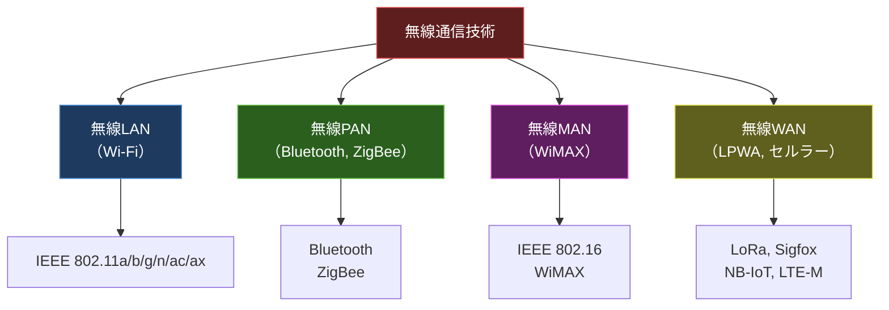
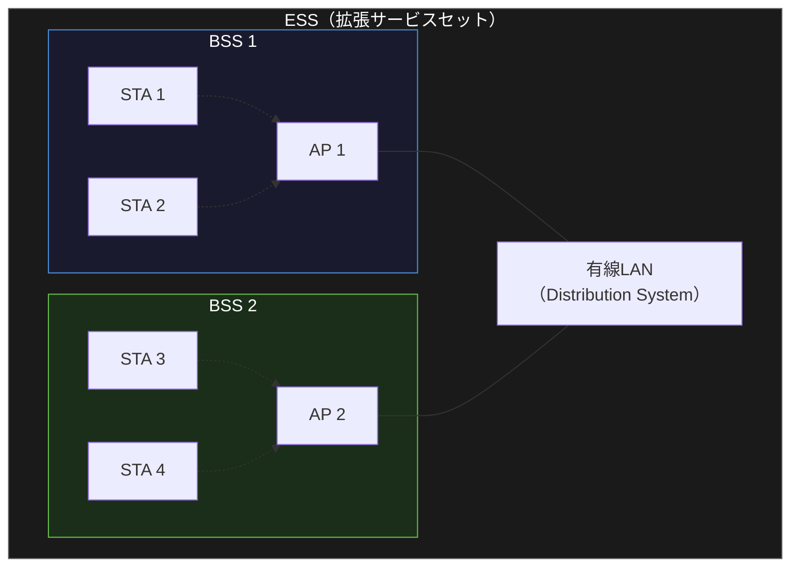
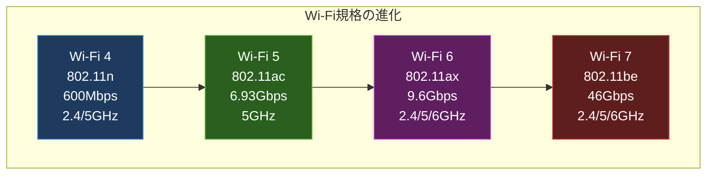
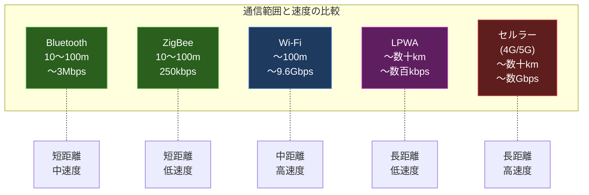

import { Aside } from '@astrojs/starlight/components';

## この節で学ぶこと

無線通信はケーブルを使わずに電波や赤外線などの電磁波でデータを送受信する技術です．
Wi-Fi（IEEE 802.11）の各規格を中心に，WiMAX，Bluetooth，ZigBee，LPWAなど多様な無線通信技術の特徴と用途を学びます．
IoTやモバイル環境の拡大に伴い，無線通信の知識は現代のネットワークエンジニアにとって不可欠です．

## 3.4.1 無線通信の種類

無線通信は使用する周波数帯，通信距離，通信速度によって多くの種類に分類されます．

無線通信を利用する際は，以下の点を考慮する必要があります:

- 周波数帯: 使用する周波数帯によって通信特性が変わる（2.4GHz帯は障害物に強いが干渉が多い，5GHz帯は高速だが到達距離が短い）
- 変調方式: OFDM，DSSS，FHSSなど
- 免許の要否: 免許不要帯（ISMバンド）と免許が必要な帯域がある
- セキュリティ: 電波は物理的に遮断できないため，暗号化が必須

## 3.4.2 IEEE 802.11

IEEE 802.11は無線LAN（Wi-Fi）の国際標準規格です．1997年に最初の規格が策定され，以後さまざまな拡張規格が策定されてきました．

IEEE 802.11の基本的な構成要素:

- STA（Station）: 無線LANに接続するクライアント端末
- AP（Access Point）: STAとの通信を中継し，有線LANへのブリッジ機能を提供する機器
- BSS（Basic Service Set）: 1つのAPとそれに接続するSTAの集合
- ESS（Extended Service Set）: 複数のBSSを接続した拡張されたネットワーク
- SSID（Service Set Identifier）: 無線LANネットワークを識別する名前

インフラストラクチャモードとアドホックモード:

- インフラストラクチャモード: APを経由して通信する方式（一般的な利用形態）
- アドホックモード: AP無しでSTA同士が直接通信する方式

## 3.4.3 IEEE 802.11b / IEEE 802.11g

IEEE 802.11b（1999年策定）:

- 周波数帯: 2.4GHz帯（ISMバンド）
- 最大通信速度: 11Mbps
- 変調方式: DSSS / CCK
- 特徴: 2.4GHz帯を使用するため，電子レンジやBluetoothなどとの干渉が発生する可能性がある

IEEE 802.11g（2003年策定）:

- 周波数帯: 2.4GHz帯
- 最大通信速度: 54Mbps
- 変調方式: OFDM
- 特徴: 802.11bとの後方互換性を持つ．OFDMの採用により高速化を実現

## 3.4.4 IEEE 802.11a

IEEE 802.11a（1999年策定）:

- 周波数帯: 5GHz帯
- 最大通信速度: 54Mbps
- 変調方式: OFDM
- 特徴: 5GHz帯を使用するため，2.4GHz帯の干渉を受けない．利用可能なチャネル数が多い．ただし，障害物による減衰が2.4GHz帯より大きい

## 3.4.5 IEEE 802.11n

IEEE 802.11n（2009年策定，Wi-Fi 4）:

- 周波数帯: 2.4GHz帯 / 5GHz帯（デュアルバンド）
- 最大通信速度: 600Mbps
- 変調方式: OFDM
- 主な技術:
  - MIMO（Multiple Input Multiple Output）: 複数のアンテナを使用して同時に複数のデータストリームを送受信（最大4ストリーム）
  - チャネルボンディング: 20MHzのチャネルを2つ束ねて40MHzとして使用
  - フレームアグリゲーション: 複数のフレームをまとめて送信しオーバーヘッドを削減

## 3.4.6 IEEE 802.11ac

IEEE 802.11ac（2013年策定，Wi-Fi 5）:

- 周波数帯: 5GHz帯
- 最大通信速度: 6.93Gbps（理論値）
- 変調方式: OFDM
- 主な技術:
  - MU-MIMO（Multi-User MIMO）: 複数のSTAに同時にデータを送信（ダウンリンク方向）
  - 最大8ストリームのMIMO
  - チャネルボンディング: 最大160MHz幅
  - 256-QAM変調: より多くのビットを1シンボルに乗せることで高速化
  - ビームフォーミング: 電波の指向性を制御して特定のSTAへの信号強度を向上

## 3.4.7 IEEE 802.11ax（Wi-Fi 6）

IEEE 802.11ax（2020年策定，Wi-Fi 6 / Wi-Fi 6E）:

- 周波数帯: 2.4GHz帯 / 5GHz帯 / 6GHz帯（Wi-Fi 6E）
- 最大通信速度: 9.6Gbps（理論値）
- 変調方式: OFDMA（Orthogonal Frequency Division Multiple Access）
- 主な技術:
  - OFDMA: 1つのチャネルを複数のサブキャリアに分割し，複数のSTAに同時にデータを送信
  - 上下両方向のMU-MIMO（最大8ストリーム）
  - 1024-QAM変調: さらに高い変調次数
  - TWT（Target Wake Time）: STAの省電力制御（IoTデバイス向け）
  - BSS Coloring: 近隣のBSSとの干渉を低減

Wi-Fi規格の比較:

## 3.4.8 無線LANを使用する場合の留意点

無線LANの運用にあたっては，以下の点に留意する必要があります:

セキュリティ:

- WEP（非推奨）: 脆弱性が発見され，短時間で解読可能
- WPA2（推奨）: AES暗号化を使用．現在の標準
- WPA3（最新）: SAE（Simultaneous Authentication of Equals）による強化された認証

電波干渉:

- 2.4GHz帯は電子レンジ，Bluetooth，他のアクセスポイントとの干渉に注意
- 5GHz帯はDFS（Dynamic Frequency Selection）によりレーダーとの共存が必要
- チャネル設計により干渉を最小化する

通信品質:

- 障害物（壁，床，金属）による電波の減衰
- 距離による信号強度の低下
- 隠れ端末問題: 互いの送信を検出できない端末間のコリジョン

## 3.4.9 WiMAX

WiMAX（Worldwide Interoperability for Microwave Access，IEEE 802.16）は，広域無線ネットワーク（MAN: Metropolitan Area Network）を実現する技術です．

- 固定WiMAX（IEEE 802.16-2004）: 固定拠点間の無線接続，最大75Mbps
- モバイルWiMAX（IEEE 802.16e）: 移動体通信に対応，最大40Mbps

WiMAXは一時期LTEの競合技術として注目されましたが，現在はLTE/5Gに市場を譲り，導入事例は限定的です．

## 3.4.10 Bluetooth

Bluetooth（IEEE 802.15.1）は，短距離無線通信の標準規格です．

- 周波数帯: 2.4GHz帯（ISMバンド）
- 通信距離: 10m〜100m（クラスによる）
- 通信速度: 最大3Mbps（Bluetooth 2.0+EDR），BLE（Bluetooth Low Energy）は1Mbps
- 主な用途: ワイヤレスイヤホン，キーボード，マウス，ウェアラブルデバイス，IoTセンサー

Bluetooth 5.0以降の特徴:

- 通信距離の拡大（最大400m，見通し環境）
- ブロードキャスト通信の強化
- IoT向けの低消費電力通信

## 3.4.11 ZigBee

ZigBee（IEEE 802.15.4ベース）は，低消費電力・低速度・短距離の無線通信規格です．

- 周波数帯: 2.4GHz帯（グローバル），868MHz帯（欧州），915MHz帯（米国）
- 通信速度: 最大250kbps
- 通信距離: 10〜100m
- 特徴:
  - メッシュネットワーク対応: 中継ノードを経由して通信範囲を拡大
  - 低消費電力: 電池駆動のセンサーに適する
  - 最大65,000ノード: 大規模なセンサーネットワークの構築が可能
- 主な用途: スマートホーム，ビル管理，産業用センサーネットワーク

## 3.4.12 LPWA（Low Power, Wide Area）

LPWAは，低消費電力で広域をカバーする無線通信技術の総称です．IoTデバイスの接続に適しています．

主なLPWA技術:

| 技術 | 周波数帯 | 通信距離 | 通信速度 | 免許 | 特徴 |
|------|---------|---------|---------|------|------|
| LoRaWAN | 920MHz帯（日本） | 〜15km | 〜50kbps | 不要 | 独自ネットワーク構築可能 |
| Sigfox | 920MHz帯（日本） | 〜50km | 100bps | 不要 | サービス型，上り通信特化 |
| NB-IoT | セルラー帯域 | 〜15km | 〜250kbps | 必要 | 既存セルラー網を利用 |
| LTE-M | セルラー帯域 | 〜11km | 〜1Mbps | 必要 | 音声通信も可能 |

LPWAの用途:

- スマートメーター（電気，ガス，水道）
- 農業センサー（土壌水分，気温）
- 物流トラッキング
- 環境モニタリング

<Aside type="tip" title="FDE実務での活用">
エッジAIデバイスの接続設計において，無線通信の選択は重要な設計判断です．例えば，工場のラインに設置するAI画像検査装置にはWi-Fi 6（低遅延・高帯域）が適していますが，広大な農場に分散配置する土壌センサーにはLPWA（LoRaWAN）が適しています．また，ウェアラブルAIデバイスの接続にはBluetooth Low Energyが選ばれることが多いです．FDEとして，「通信速度」「通信距離」「消費電力」「コスト」のバランスを考慮した最適な無線技術の選定が求められます．特に，エッジで推論を行うAIデバイスでは，モデルの推論結果（数十〜数百バイト）のアップロードにはLPWAで十分ですが，カメラ映像のリアルタイム送信にはWi-Fi以上の帯域が必要になります．
</Aside>

## まとめ

- 無線通信は通信距離によりPAN（Bluetooth，ZigBee），LAN（Wi-Fi），MAN（WiMAX），WAN（LPWA，セルラー）に分類される
- IEEE 802.11（Wi-Fi）はb/g（2.4GHz），a（5GHz），n（Wi-Fi 4），ac（Wi-Fi 5），ax（Wi-Fi 6）と進化し，MIMO，OFDMA，MU-MIMOなどの技術で高速化・高効率化を実現
- 無線LANのセキュリティはWEP→WPA→WPA2→WPA3と進化し，WPA2以上の使用が推奨される
- Bluetoothは短距離デバイス間通信，ZigBeeはメッシュ型センサーネットワーク，LPWAは広域IoTデバイス接続に適する
- 用途に応じて「通信速度」「通信距離」「消費電力」「コスト」のバランスで最適な技術を選択する

## 理解度チェック

Q1: Wi-Fi 6（IEEE 802.11ax）がWi-Fi 5（IEEE 802.11ac）から改善された主要な点を3つ挙げてください．

1. OFDMA（Orthogonal Frequency Division Multiple Access）の採用: 1つのチャネルを複数のサブキャリアに分割し，複数のSTAに同時にデータを送受信できるようになった
2. 上下両方向のMU-MIMO: Wi-Fi 5ではダウンリンクのみだったMU-MIMOがアップリンクにも対応した
3. TWT（Target Wake Time）: STAの起動タイミングをスケジューリングすることで，IoTデバイスの省電力化を実現した

その他，1024-QAM変調による高速化やBSS Coloringによる干渉低減もある．

Q2: CSMA/CAとCSMA/CDの違いは何ですか？なぜ無線LANではCSMA/CAが使われるのですか？

CSMA/CDは有線イーサネットで使用され，送信中にコリジョンを「検出」（Detection）して再送する方式です．一方，CSMA/CAは無線LANで使用され，コリジョンを「回避」（Avoidance）する方式です．無線では，送信中に自分の送信信号が強すぎて他の信号を検出できないため，コリジョンの検出が困難です．そのため，送信前にRTS/CTSのハンドシェイクで送信権を確保し，コリジョンを事前に回避するアプローチが取られます．

Q3: LPWAとWi-Fiの用途の違いを説明してください．

LPWAは低消費電力・長距離（数km〜数十km）・低速度（数百bps〜数百kbps）の通信に適しており，電池駆動のIoTセンサー（スマートメーター，農業センサー，物流トラッキング）に使用されます．一方，Wi-Fiは中距離（〜100m程度）・高速度（数百Mbps〜数Gbps）の通信に適しており，動画視聴，Web閲覧，ファイル転送など帯域幅を必要とする用途に使用されます．消費電力はLPWAの方が大幅に少ないため，電池で数年間動作するデバイスの接続にはLPWAが選択されます．

Q4: 2.4GHz帯と5GHz帯の無線LANの特性の違いを説明してください．

2.4GHz帯は電波の波長が長いため障害物の回り込み（回折）に強く，壁や床を越えた通信が可能です．ただし，電子レンジやBluetooth，他のアクセスポイントとの干渉が発生しやすく，利用可能なチャネル数も少ない（日本では13チャネルだが非重複は3〜4チャネル）です．5GHz帯は利用可能なチャネル数が多く干渉が少ないですが，障害物による減衰が大きく通信距離が短くなります．また，DFS（Dynamic Frequency Selection）によりレーダーとの共存が必要です．

