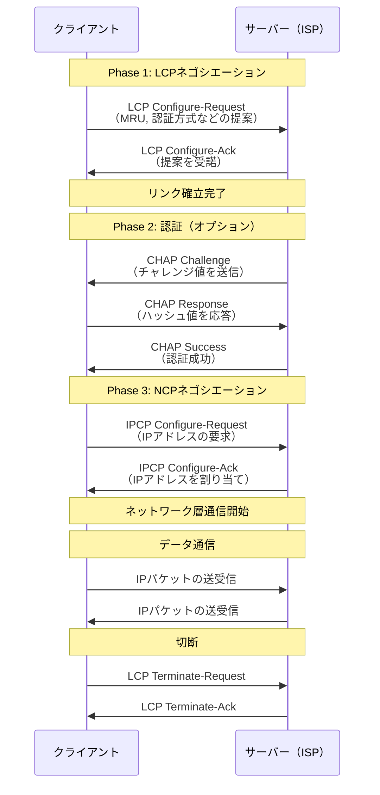
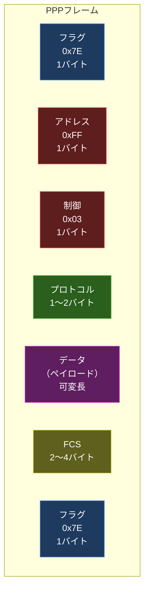
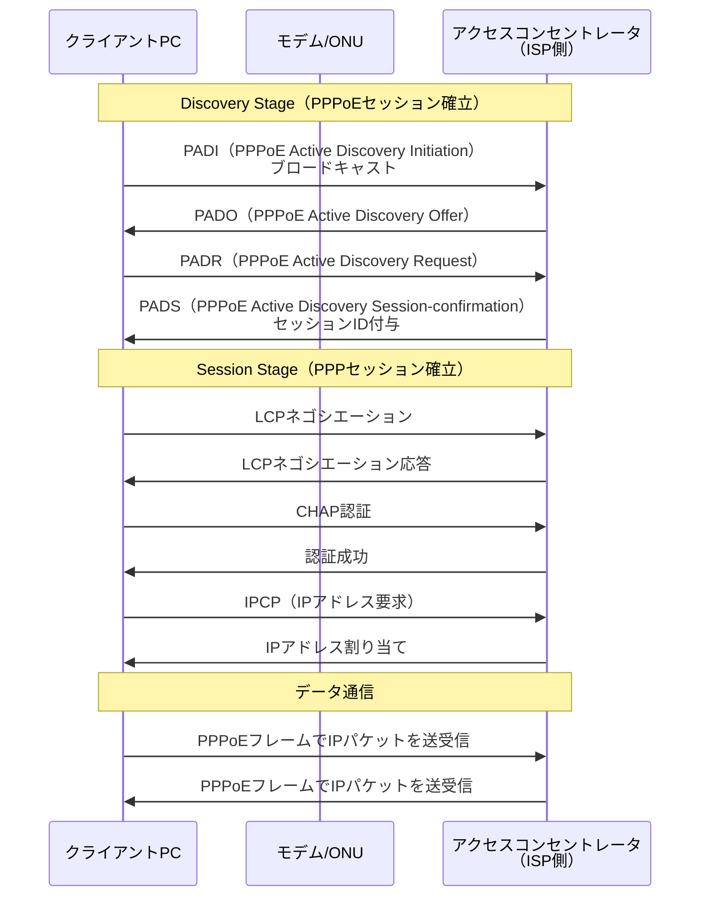

import { Aside } from '@astrojs/starlight/components';

## この節で学ぶこと

PPP（Point-to-Point Protocol）は，2つのノード間を1対1で接続するデータリンクプロトコルです．
この節では，PPPの基本概念，LCPとNCPによるリンク制御の仕組み，PPPフレームフォーマットの構造，そしてイーサネット上でPPPを利用するPPPoEの仕組みを学びます．
PPPはISP（インターネットサービスプロバイダ）への接続やVPN接続で広く利用されてきた重要なプロトコルです．

## 3.5.1 PPPとは

PPPは，RFC 1661で定義されたデータリンク層のプロトコルで，ポイントツーポイント（1対1）接続でデータを転送するために使用されます．

PPPの主な特徴:

- マルチプロトコル対応: IP，IPv6，IPXなど複数のネットワーク層プロトコルを同時にカプセル化できる
- 認証機能: PAP（Password Authentication Protocol）やCHAP（Challenge Handshake Authentication Protocol）による接続認証
- リンク品質監視: リンクの品質を監視し，品質が低下した場合にリンクを切断する機能
- エラー検出: FCSによるフレームの誤り検出
- アドレス割り当て: IPCPにより接続時にIPアドレスを動的に割り当てる

PPPが使用される場面:

- ダイヤルアップ接続（電話回線経由のインターネット接続）
- ISDN接続
- 専用線接続
- PPPoE（ADSL，FTTHでのインターネット接続）
- PPTP，L2TPなどのVPNトンネリング

## 3.5.2 LCPとNCP

PPPの接続確立は，LCP（Link Control Protocol）とNCP（Network Control Protocol）の2段階で行われます．

LCP（Link Control Protocol）の役割:

- データリンク層の接続パラメータをネゴシエーションする
- MRU（Maximum Receive Unit）: フレームの最大受信サイズ
- 認証方式: PAP / CHAP
- マジックナンバー: ループ検出用のランダムな値
- リンクの品質監視パラメータ
- リンクの確立・維持・切断を管理する

NCP（Network Control Protocol）の役割:

- ネットワーク層プロトコルごとの接続パラメータをネゴシエーションする
- IPCP（IP Control Protocol）: IPアドレス，DNSサーバーの割り当て
- IPv6CP: IPv6アドレスの設定
- 各ネットワーク層プロトコルの有効化・無効化を管理する

認証プロトコル:

- PAP（Password Authentication Protocol）: ユーザー名とパスワードを平文で送信する（セキュリティが低い）
- CHAP（Challenge Handshake Authentication Protocol）: チャレンジ・レスポンス方式で認証する（パスワードが平文で流れない）
- EAP（Extensible Authentication Protocol）: 拡張可能な認証フレームワーク（802.1Xでも使用）

## 3.5.3 PPPのフレームフォーマット

PPPフレームはHDLC（High-Level Data Link Control）をベースにしたフォーマットです．

各フィールドの説明:

- フラグ（0x7E）: フレームの開始と終了を示すデリミタ
- アドレス（0xFF）: ブロードキャストアドレス（PPPはポイントツーポイントのため常にこの値）
- 制御（0x03）: Unnumbered Information（UI）を示す固定値
- プロトコル: ペイロードのプロトコルを識別
  - 0x0021: IP
  - 0x0057: IPv6
  - 0xC021: LCP
  - 0x8021: IPCP
  - 0xC023: PAP
  - 0xC223: CHAP
- データ: 上位層のパケット（デフォルト最大1500バイト，MRUで変更可能）
- FCS: CRC-16またはCRC-32による誤り検出符号

## 3.5.4 PPPoE（PPP over Ethernet）

PPPoE（PPP over Ethernet）は，イーサネットフレーム上にPPPフレームをカプセル化して転送するプロトコルです．ADSL やFTTHなどのブロードバンド接続でISPへの接続に広く使用されています．

PPPoEが使用される理由:

- イーサネットはもともと認証機能を持たないが，PPPoEによりPPPの認証機能を利用できる
- ISPはPPPの認証機能を使ってユーザーを識別し，IPアドレスを動的に割り当てる
- 同一のイーサネット上で複数のPPPセッションを同時に確立できる

PPPoE接続の流れ:

PPPoEのDiscovery Stage:

1. PADI（Initiation）: クライアントがブロードキャストでアクセスコンセントレータを探索
2. PADO（Offer）: アクセスコンセントレータが応答
3. PADR（Request）: クライアントが接続先を選択して要求
4. PADS（Session-confirmation）: セッションIDが付与されてPPPoEセッション確立

PPPoEの制約:

- PPPoEヘッダ（6バイト）とPPPヘッダ（2バイト）が付加されるため，MTUが1500から1492バイトに減少する
- MTUの減少によりフラグメンテーションが発生する可能性がある
- Path MTU Discoveryやクランプ MSS（TCP MSS調整）で対処する

<Aside type="tip" title="FDE実務での活用">
日本のブロードバンド接続では，PPPoEが広く使用されています．FDEとして，オフィスや自宅からISP経由でクラウド上のAI開発環境にアクセスする際，PPPoEの仕組みを理解しておくことはトラブルシューティングに役立ちます．例えば，PPPoEセッションの確立失敗（認証エラー，セッション数の上限超過）が原因でインターネットに接続できないケースや，PPPoEのMTU制約（1492バイト）によりパケットが途中で破棄されるケースがあります．大容量データ転送が必要なAIワークロードでは，PPPoEのオーバーヘッドを回避するIPoE（PPPoEを使わないIPv6/IPv4接続方式）への移行も検討されます．
</Aside>

## まとめ

- PPPは2つのノード間を1対1で接続するデータリンクプロトコルで，認証機能とマルチプロトコル対応が特徴
- 接続はLCP（データリンクパラメータのネゴシエーション）→ 認証 → NCP（ネットワーク層パラメータのネゴシエーション）の順で確立される
- PPPフレームはHDLCベースで，フラグ，アドレス，制御，プロトコル，データ，FCSから構成される
- PPPoEはイーサネット上でPPPを利用するプロトコルで，ADSL/FTTHでのISP接続に使用される
- PPPoEではMTUが1492バイトに減少するため，Path MTU DiscoveryやクランプMSSで対処する

## 理解度チェック

Q1: LCPとNCPの役割の違いを説明してください．

LCP（Link Control Protocol）はデータリンク層の接続パラメータ（MRU，認証方式，マジックナンバーなど）をネゴシエーションし，リンクの確立・維持・切断を管理します．NCP（Network Control Protocol）はネットワーク層プロトコルごとの接続パラメータ（IPアドレス，DNSサーバーなど）をネゴシエーションします．PPP接続ではまずLCPでリンクを確立し，その後NCPでネットワーク層の設定を行います．

Q2: PAPとCHAPの違いは何ですか？どちらがセキュリティ上優れていますか？

PAP（Password Authentication Protocol）はユーザー名とパスワードを平文で送信するため，通信を傍受されるとパスワードが漏洩する危険があります．CHAP（Challenge Handshake Authentication Protocol）はチャレンジ・レスポンス方式を使用し，サーバーが送信するチャレンジ値にパスワードを組み合わせたハッシュ値で認証を行うため，パスワードが平文で流れません．また，CHAPは定期的に再認証を行い，セッションハイジャックを防止します．セキュリティ上はCHAPが大幅に優れています．

Q3: PPPoEでMTUが1500バイトから1492バイトに減少する理由を説明してください．

PPPoEでは，イーサネットフレームのペイロード内にPPPoEヘッダ（6バイト）とPPPプロトコルフィールド（2バイト）が追加されます．イーサネットの最大ペイロードサイズは1500バイトなので，PPPのデータ部分は1500 - 6 - 2 = 1492バイトが上限となります．このMTUの減少により，1500バイトのIPパケットはそのまま送信できず，フラグメンテーションが必要になる場合があります．

Q4: PPPoE Discovery Stageの4つのメッセージの役割を説明してください．

1. PADI（PPPoE Active Discovery Initiation）: クライアントがブロードキャストで送信し，利用可能なアクセスコンセントレータを探索する
2. PADO（PPPoE Active Discovery Offer）: アクセスコンセントレータがPADIに応答し，サービスの提供を申し出る
3. PADR（PPPoE Active Discovery Request）: クライアントが接続先のアクセスコンセントレータを選択し，セッションの確立を要求する
4. PADS（PPPoE Active Discovery Session-confirmation）: アクセスコンセントレータがセッションIDを付与し，PPPoEセッションが確立される

