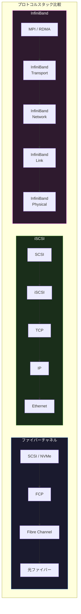
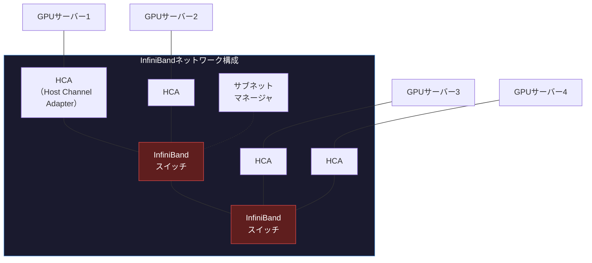

import { Aside } from '@astrojs/starlight/components';

## この節で学ぶこと

イーサネットや無線LAN以外にも，特定の用途に特化したさまざまなデータリンク技術が存在します．
この節では，ATM，POS，ファイバーチャネル，iSCSI，InfiniBand，IEEE1394，HDMI，DOCSIS，高速PLCの各技術の特徴と用途を学びます．
特にInfiniBandやファイバーチャネルは，AI分散学習やストレージネットワークの分野で重要な役割を果たしています．

## 3.6.1 ATM（Asynchronous Transfer Mode）

ATMは，53バイト固定長の「セル」を単位としてデータを転送する通信技術です．

- セルサイズ: 53バイト（ヘッダ5バイト＋ペイロード48バイト）
- 通信速度: 155Mbps（OC-3），622Mbps（OC-12），2.4Gbps（OC-48）
- 特徴:
  - 固定長セルにより，ハードウェアでの高速スイッチングが可能
  - QoS（Quality of Service）による帯域保証
  - 音声，映像，データを統合的に扱える
  - コネクション型通信（VPI/VCIによる仮想回線）

ATMは1990年代にバックボーンネットワークやWAN接続で広く使用されましたが，イーサネットの高速化とIP技術の発展により，現在は新規導入はほとんどありません．

## 3.6.2 POS（Packet over SDH/SONET）

POSは，SDH/SONET（Synchronous Digital Hierarchy / Synchronous Optical Networking）の光伝送フレーム上にIPパケットを直接カプセル化する技術です．

- 通信速度: 155Mbps〜40Gbps
- 特徴:
  - ATMのようなセル化のオーバーヘッドがない
  - PPPによるフレーミングを使用
  - キャリアグレードの信頼性（SDH/SONETの保護切替機能）
  - WAN回線のバックボーンで使用

POSもイーサネットの高速化により，100GbEなどに置き換えられつつあります．

## 3.6.3 ファイバーチャネル（Fiber Channel）

ファイバーチャネルは，ストレージエリアネットワーク（SAN）で使用される高速データリンク技術です．

- 通信速度: 1GFC（1Gbps），2GFC（2Gbps），4GFC（4Gbps），8GFC（8Gbps），16GFC（16Gbps），32GFC（32Gbps），64GFC（64Gbps）
- 伝送媒体: 光ファイバー（主流），銅線
- 特徴:
  - ロスレス通信: フレームロスを防ぐクレジットベースのフロー制御
  - 低レイテンシ: マイクロ秒単位の遅延
  - SCSIプロトコルのカプセル化（FCP: Fibre Channel Protocol）
  - Fabric（スイッチ型），Arbitrated Loop（ループ型），Point-to-Point（直結型）のトポロジ

## 3.6.4 iSCSI

iSCSI（Internet Small Computer System Interface）は，TCP/IPネットワーク上でSCSIコマンドを転送するプロトコルです．

- 通信速度: 1GbE，10GbE，25GbE以上のイーサネットに依存
- 特徴:
  - 既存のイーサネットインフラを使用してストレージネットワークを構築できる
  - ファイバーチャネルに比べて低コスト
  - TCP/IPベースのため，長距離（WAN）でのストレージ接続も可能
  - iSCSIイニシエータ（クライアント）とiSCSIターゲット（ストレージ）間でSCSIコマンドを転送

iSCSIの構成要素:

- イニシエータ: SCSIコマンドを発行する側（サーバー）
- ターゲット: SCSIコマンドを受け取る側（ストレージ装置）
- LUN（Logical Unit Number）: ターゲット内の論理ストレージ単位

## 3.6.5 InfiniBand

InfiniBandは，高性能コンピューティング（HPC）やデータセンター内のサーバー間接続に使用される高速通信技術です．

- 通信速度:
  - SDR: 10Gbps
  - DDR: 20Gbps
  - QDR: 40Gbps
  - FDR: 56Gbps
  - EDR: 100Gbps
  - HDR: 200Gbps
  - NDR: 400Gbps
  - XDR: 800Gbps
- 特徴:
  - RDMA（Remote Direct Memory Access）: CPUを介さずにリモートホストのメモリに直接アクセス
  - 超低レイテンシ: サブマイクロ秒（1マイクロ秒未満）の遅延
  - ロスレス通信: クレジットベースのフロー制御
  - カーネルバイパス: OSカーネルを経由せず，アプリケーションから直接通信

InfiniBandの主要コンポーネント:

- HCA（Host Channel Adapter）: サーバーに搭載するネットワークアダプター（NICに相当）
- スイッチ: InfiniBandスイッチでノード間を接続
- サブネットマネージャ: InfiniBandサブネット内の経路制御を管理
- ルーター: InfiniBandサブネット間を接続

## 3.6.6 IEEE1394

IEEE1394（FireWire，i.LINK）は，デジタル機器間の高速シリアル接続規格です．

- 通信速度: 100Mbps / 200Mbps / 400Mbps（IEEE1394a），800Mbps〜3.2Gbps（IEEE1394b）
- 特徴:
  - ホットプラグ対応
  - デイジーチェーン接続が可能（最大63台）
  - アイソクロナス転送（リアルタイム転送）をサポート
  - 主にデジタルビデオカメラ，外付けHDDで使用

現在はUSB 3.x / Thunderboltに置き換えられ，ほとんど使用されていません．

## 3.6.7 HDMI

HDMI（High-Definition Multimedia Interface）は，映像と音声をデジタル信号で伝送するインタフェース規格です．

- 通信速度: HDMI 1.4（10.2Gbps），HDMI 2.0（18Gbps），HDMI 2.1（48Gbps）
- 特徴:
  - 映像と音声を1本のケーブルで伝送
  - HDCP（High-bandwidth Digital Content Protection）によるコンテンツ保護
  - CEC（Consumer Electronics Control）によるデバイス制御
  - ARC / eARC（Audio Return Channel）による音声の双方向伝送
- 対応解像度: 4K / 8K / 10K（HDMI 2.1）

## 3.6.8 DOCSIS

DOCSIS（Data Over Cable Service Interface Specification）は，ケーブルテレビ（CATV）のインフラを利用したデータ通信の規格です．

- バージョンと速度:
  - DOCSIS 3.0: 下り約1Gbps，上り約200Mbps
  - DOCSIS 3.1: 下り約10Gbps，上り約1Gbps
  - DOCSIS 4.0: 下り約10Gbps，上り約6Gbps
- 特徴:
  - 既存のCATVインフラ（同軸ケーブル）を再利用
  - HFC（Hybrid Fiber Coax）構成: 幹線は光ファイバー，ラストマイルは同軸ケーブル
  - 複数チャネルのボンディングによる高速化

## 3.6.9 高速PLC（高速電力線搬送通信）

高速PLCは，既存の電力線（コンセント）を通信媒体として利用するデータ通信技術です．

- 通信速度: 最大約200Mbps（理論値）
- 周波数帯: 2MHz〜30MHz
- 特徴:
  - 新たな配線工事不要（既存の電力線を利用）
  - 建物内のLANとして利用可能
  - 電力線のノイズや減衰の影響を受ける
  - 通信品質が環境に大きく依存する

PLCは，Wi-Fiの電波が届きにくい建物内のネットワーク接続補助として使用されることがあります．

<Aside type="tip" title="FDE実務での活用">
AI分散学習の世界では，InfiniBandが不可欠な技術です．大規模言語モデル（LLM）の学習では，数百〜数千台のGPU間で勾配情報を同期するAllReduce通信が頻繁に発生します．代表的なRing-AllReduceパターンでは，各GPUが隣接するGPUとデータを交換しながら全GPUの勾配を集約します．InfiniBandのRDMAにより，CPUを介さずGPUメモリ間で直接データ転送が可能で，NDR（400Gbps）やXDR（800Gbps）の帯域幅を活かして通信ボトルネックを最小化します．NVIDIAのDGXシステムやクラウドプロバイダのAIインスタンスでは，InfiniBandまたはRoCE（RDMA over Converged Ethernet）が標準的に使用されています．FDEとして，AIクラスタの性能チューニングでは，NCCL（NVIDIA Collective Communications Library）のパラメータ調整やネットワークトポロジの最適化が重要なスキルとなります．
</Aside>

## まとめ

- ATMは53バイト固定長セルで通信する技術で，QoSに優れるが現在は新規導入がほとんどない
- POSはSDH/SONET上にIPパケットを直接カプセル化する技術で，WAN回線に使用されてきた
- ファイバーチャネルはSAN（ストレージエリアネットワーク）の標準技術で，ロスレス通信と低レイテンシが特徴
- iSCSIはTCP/IP上でSCSIコマンドを転送し，既存のイーサネットインフラでストレージネットワークを構築できる
- InfiniBandはRDMAによる超低レイテンシ通信を実現し，HPCやAI分散学習で不可欠な技術
- IEEE1394やHDMIはデジタル機器間のインタフェース規格，DOCSISはCATVインフラを利用したデータ通信規格，高速PLCは電力線を利用した通信技術

## 理解度チェック

Q1: ファイバーチャネルとiSCSIの違いを説明してください．

ファイバーチャネルは専用の光ファイバーネットワークとプロトコルを使用するSAN技術で，ロスレス通信と低レイテンシが特徴です．専用インフラが必要なため高コストですが，高い信頼性と性能を提供します．一方，iSCSIはTCP/IPベースでSCSIコマンドを転送するため，既存のイーサネットインフラを流用でき低コストです．ただし，TCP/IPのオーバーヘッドにより，ファイバーチャネルに比べてレイテンシが高くなる傾向があります．

Q2: InfiniBandのRDMA（Remote Direct Memory Access）とは何ですか？

RDMAは，リモートホストのメモリにCPUやOSカーネルを介さずに直接アクセスする技術です．通常のTCP/IP通信では，データがアプリケーション→カーネル→NIC→ネットワーク→NIC→カーネル→アプリケーションと多くのコピーを経由しますが，RDMAではアプリケーションのメモリからNICを経由してリモートホストのメモリに直接書き込むことが可能です．これにより，CPUのオーバーヘッドが大幅に削減され，サブマイクロ秒のレイテンシと高いスループットが実現できます．

Q3: ATMのセルが53バイト固定長である利点は何ですか？

固定長セルの利点は，ハードウェアによる高速スイッチングが容易になることです．可変長パケットの場合，バッファ管理やスケジューリングが複雑になりますが，固定長セルなら単純なハードウェアロジックで高速に処理できます．また，音声や映像のようなリアルタイム通信と，データ通信を同じネットワーク上で統合的に扱えるQoS制御が実現しやすいという利点もあります．ただし，48バイトのペイロードに対して5バイトのヘッダがあるため，約9.4%のオーバーヘッドが発生するという欠点があります．

Q4: AI分散学習でInfiniBandが選ばれる理由を説明してください．

AI分散学習（特にデータ並列学習）では，各GPU間で勾配情報を同期するAllReduce通信が頻繁に発生します．この通信はミリ秒単位で繰り返されるため，低レイテンシと高帯域幅が求められます．InfiniBandはRDMAによるサブマイクロ秒のレイテンシ，NDR/XDRで400〜800Gbpsの帯域幅，ロスレス通信を提供するため，通信がボトルネックとなることを最小化できます．イーサネットベースのRoCEも代替として使用されますが，InfiniBandはネイティブにRDMAをサポートしているため，より安定した低レイテンシ通信が可能です．

