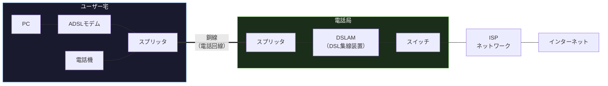
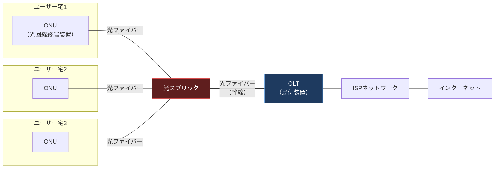
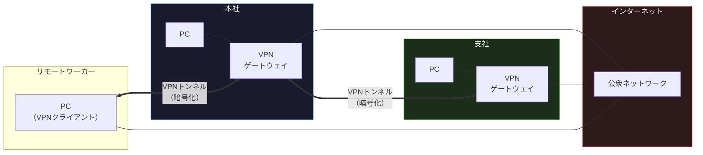

import { Aside } from '@astrojs/starlight/components';

## この節で学ぶこと

公衆アクセス網は，ISP（インターネットサービスプロバイダ）やキャリアが提供する通信サービスを通じてインターネットに接続するための回線です．
この節では，アナログ電話回線からモバイル通信，ADSL，FTTH，ケーブルテレビ，専用回線，VPN，公衆無線LANまで，多様な公衆アクセス網の技術と特徴を学びます．
現代のクラウドベースのAI開発において，アクセス回線の特性理解は不可欠です．

## 3.7.1 アナログ電話回線

アナログ電話回線は，音声通信のために敷設された銅線（メタル回線）をデータ通信にも利用する方式です．

- 通信速度: 最大56kbps（V.90），最大33.6kbps（V.34）
- 接続方式: モデムを使用してアナログ信号とデジタル信号を相互変換
- 特徴:
  - ダイヤルアップ接続: 電話番号をダイヤルしてISPに接続
  - 通話中はインターネット接続不可（電話回線を占有）
  - 従量課金または定額課金

アナログ電話回線によるインターネット接続は，1990年代のインターネット黎明期に広く使用されましたが，ブロードバンド回線の普及により現在はほとんど使われていません．

## 3.7.2 モバイル通信サービス

モバイル通信サービスは，携帯電話の基地局を利用した無線データ通信です．

| 世代 | 規格 | 最大通信速度 | 主な特徴 |
|------|------|------------|---------|
| 2G | GSM/PDC | 〜384kbps | デジタル音声通信 |
| 3G | W-CDMA/CDMA2000 | 〜14Mbps（HSPA） | モバイルインターネット |
| 3.9G | LTE | 〜150Mbps | 高速データ通信 |
| 4G | LTE-Advanced | 〜1Gbps | キャリアアグリゲーション |
| 5G | NR（New Radio） | 〜20Gbps | eMBB, URLLC, mMTC |

5G（第5世代移動通信システム）の3つの特徴:

- eMBB（enhanced Mobile Broadband）: 超高速大容量通信（最大20Gbps）
- URLLC（Ultra-Reliable Low-Latency Communications）: 超高信頼・低遅延通信（1ms以下）
- mMTC（massive Machine-Type Communications）: 多数同時接続（1km2あたり100万台）

## 3.7.3 ADSL

ADSL（Asymmetric Digital Subscriber Line）は，既存のアナログ電話回線（銅線）を利用した高速デジタル通信技術です．

- 通信速度: 下り最大50Mbps，上り最大12Mbps（ADSL2+）
- 特徴:
  - 非対称通信: 下り（ダウンロード）が上り（アップロード）より高速
  - 電話回線との共用: スプリッタにより音声通信とデータ通信を分離
  - 距離減衰: 電話局からの距離が遠いほど通信速度が低下
  - 周波数分割: 低周波を音声通話，高周波をデータ通信に使用

日本では2024年3月をもってNTTのフレッツ・ADSLが終了し，FTTHへの移行が進みました．

## 3.7.4 FTTH（Fiber To The Home）

FTTH（Fiber To The Home）は，光ファイバーケーブルを各家庭まで直接敷設する通信方式です．現在の日本における主流のブロードバンド接続です．

- 通信速度: 最大10Gbps（10G-EPON），一般的には1Gbps
- 方式:
  - GE-PON（Gigabit Ethernet Passive Optical Network）: 最大1Gbpsを複数ユーザーで共有
  - 10G-EPON: 最大10Gbps
  - GPON（Gigabit-capable PON）: ATMベース
  - XGS-PON: 10Gbps対称
- 特徴:
  - 光ファイバーによる低損失・低遅延の通信
  - 電磁波の影響を受けない
  - 上下対称の通信速度
  - 長距離でも速度劣化がほとんどない

PON（Passive Optical Network）の仕組み:

- OLT（Optical Line Terminal）: 通信事業者の局舎に設置される装置
- 光スプリッタ: 光信号を分岐する受動素子（電源不要）
- ONU（Optical Network Unit）: ユーザー宅に設置される光回線終端装置

## 3.7.5 ケーブルテレビ

ケーブルテレビ（CATV）のインフラを利用したインターネット接続サービスです．

- 通信速度: 最大1Gbps以上（DOCSIS 3.1）
- 構成: HFC（Hybrid Fiber Coax）: 幹線は光ファイバー，ラストマイルは同軸ケーブル
- 特徴:
  - テレビ視聴とインターネット接続を同一のインフラで提供
  - ケーブルモデムを使用
  - 同一セグメントのユーザーと帯域を共有

## 3.7.6 専用回線（専用線）

専用回線は，拠点間を専用の通信回線で常時接続するサービスです．

- 種類:
  - デジタル専用線: 64kbps〜1.5Mbps
  - 高速デジタル専用線: 1.5Mbps〜135Mbps
  - ATM専用線: 0.5Mbps〜135Mbps
  - イーサネット専用線: 10Mbps〜10Gbps
  - 広域イーサネット: イーサネット技術でWANを構築
- 特徴:
  - 帯域保証: 契約した帯域が専有できる
  - 高い信頼性: SLAによる品質保証
  - セキュリティ: 他のユーザーとの通信の分離
  - 高コスト: 距離と帯域に応じた月額料金

## 3.7.7 VPN（Virtual Private Network）

VPNは，公衆ネットワーク（インターネット）上に仮想的なプライベートネットワークを構築する技術です．

VPNの種類:

- インターネットVPN: インターネット上にVPNトンネルを構築
  - IPsec VPN: IPレベルでの暗号化トンネル
  - SSL/TLS VPN: SSL/TLSによる暗号化トンネル（リモートアクセス向け）
  - WireGuard: 軽量・高速な次世代VPN
- IP-VPN: キャリアの閉域網を使用（MPLS-VPN）
- 広域イーサネット: レイヤ2レベルでの拠点間接続

VPNトンネリングの仕組み:

1. 元のIPパケットを暗号化する
2. 新しいIPヘッダを付加する（カプセル化）
3. インターネット上を暗号化されたパケットとして転送する
4. 受信側で外側のIPヘッダを除去し，復号化して元のパケットを取り出す

## 3.7.8 公衆無線LAN

公衆無線LANは，カフェ，駅，空港などの公共施設に設置された無線LANアクセスポイントを通じてインターネットに接続するサービスです．

- 提供形態:
  - 携帯キャリア提供（docomo Wi-Fi，au Wi-Fi SPOTなど）
  - 専門事業者提供（Wi2など）
  - 施設独自提供（FREE Wi-Fi）
- セキュリティ上の注意:
  - 暗号化されていないアクセスポイントでの通信は傍受のリスクがある
  - VPNの使用が推奨される
  - 正規のアクセスポイントになりすます「Evil Twin」攻撃に注意

## 3.7.9 その他の公衆通信サービス

X.25:

- パケット交換網の初期の国際標準プロトコル
- エラー訂正と再送制御を各ノードで実行（信頼性が低い回線への対応）
- 現在はほとんど使用されていない

フレームリレー:

- X.25の簡略版で，エラー訂正を省略して高速化
- 通信速度: 64kbps〜45Mbps
- 企業のWAN接続に使用されていた（現在はほぼ廃止）

ISDN（Integrated Services Digital Network）:

- デジタル電話網を利用した通信サービス
- BRI（Basic Rate Interface）: 2B＋D（64kbps × 2 ＋ 16kbps = 144kbps）
- PRI（Primary Rate Interface）: 23B＋D（1.536Mbps，北米/日本）
- INSネット64（BRI），INSネット1500（PRI）として提供されていた
- ブロードバンド回線の普及により利用は縮小

<Aside type="tip" title="FDE実務での活用">
FDEとしてリモートからAI開発環境にアクセスする場面は日常的に発生します．VPN接続を使ってクラウド上のGPUインスタンスや社内のオンプレミスクラスタにアクセスする際，アクセス回線の特性がワークフローに大きく影響します．例えば，大規模なデータセットの転送にはFTTHの上り帯域（数百Mbps〜1Gbps）が必要で，モバイル回線では時間がかかりすぎる場合があります．また，VPN接続時にはMTUの減少（IPsecヘッダによるオーバーヘッド）やスプリットトンネリングの設定が通信速度に影響します．WireGuardのような軽量VPNを採用することで，VPNのオーバーヘッドを最小化し，リモートでもストレスの少ないAI開発が可能です．
</Aside>

## まとめ

- アナログ電話回線（56kbps）は歴史的なアクセス方式で，現在はブロードバンドに移行済み
- モバイル通信は2Gから5Gへ進化し，5Gは超高速（eMBB），超低遅延（URLLC），多数同時接続（mMTC）を実現する
- ADSLは既存の電話線を利用した非対称通信で，FTTHへの移行が進んでいる
- FTTHは光ファイバーを各家庭まで敷設する方式で，日本のブロードバンド接続の主流
- VPNはインターネット上に暗号化されたトンネルを構築し，安全なリモートアクセスを実現する
- 公衆無線LANは利便性が高い反面，セキュリティリスクに注意が必要

## 理解度チェック

Q1: ADSLの「非対称」とは何を意味しますか？また，なぜ非対称な設計になっているのですか？

ADSLの「A」はAsymmetric（非対称）を意味し，下り（ISP→ユーザー）と上り（ユーザー→ISP）の通信速度が異なることを表します．下りの方が上りより高速です．これは，一般的なインターネット利用（Webページの閲覧，動画視聴など）では下りのトラフィックが上りよりも圧倒的に多いため，限られた帯域を効率的に配分する設計です．

Q2: FTTHのPON（Passive Optical Network）方式で「Passive」とはどういう意味ですか？

PONの「Passive」は，OLT（局側装置）とONU（ユーザー宅装置）の間にある光スプリッタが電源を必要としない受動素子（パッシブデバイス）であることを意味します．光スプリッタは単に光信号を物理的に分岐するだけで，信号の増幅や再生は行いません．これにより，中継点での電源供給や保守が不要となり，運用コストが低減されます．

Q3: インターネットVPNとIP-VPNの違いを説明してください．

インターネットVPNは公衆インターネット上にIPsecやSSL/TLSで暗号化されたトンネルを構築する方式で，低コストですが，インターネットの混雑により通信品質が変動する可能性があります．一方，IP-VPNはキャリアが提供する閉域網（MPLS網）を使用するため，インターネットを経由せず，帯域保証やQoSによる高い通信品質が確保されます．ただし，IP-VPNはインターネットVPNに比べて高コストです．

Q4: 5Gの3つの特徴（eMBB，URLLC，mMTC）はそれぞれどのような用途に適していますか？

eMBB（enhanced Mobile Broadband）は超高速大容量通信で，4K/8K動画のストリーミング，VR/ARコンテンツ，高速大容量ファイルのダウンロードに適しています．URLLC（Ultra-Reliable Low-Latency Communications）は超高信頼・低遅延通信で，自動運転，遠隔手術，産業用ロボットの制御など，リアルタイム性と高い信頼性が求められる用途に適しています．mMTC（massive Machine-Type Communications）は多数同時接続で，スマートシティのIoTセンサー，スマートメーター，環境モニタリングなど，大量のデバイスが少量のデータを送信する用途に適しています．

