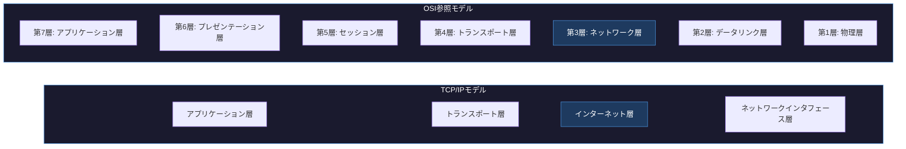
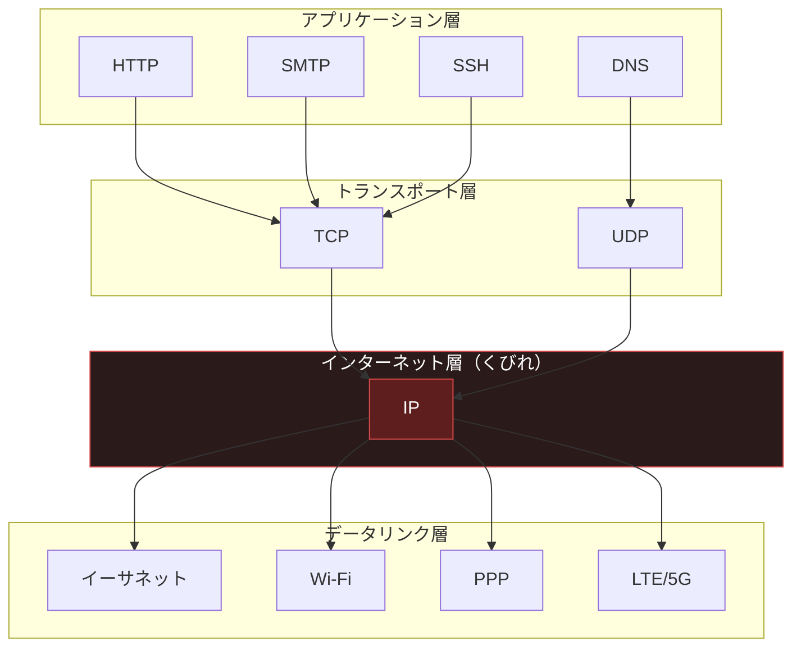
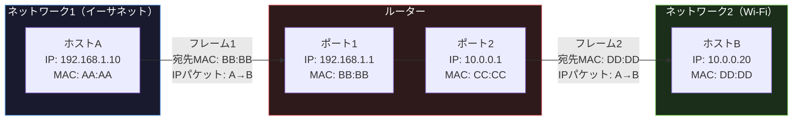

import { Aside } from '@astrojs/starlight/components';

## この節で学ぶこと

IP（Internet Protocol）は，TCP/IPの階層モデルにおけるインターネット層の中核プロトコルです．
OSI参照モデルでは第3層（ネットワーク層）に相当し，異なるネットワーク間でのデータ転送を担います．
この節では，IPの位置付けと，ネットワーク層とデータリンク層の関係について学びます．

## 4.1.1 IPはOSI参照モデルの第3層に相当

IP（Internet Protocol）は，TCP/IPプロトコルスイートの中でインターネット層に位置するプロトコルです．OSI参照モデルに当てはめると，第3層のネットワーク層に相当します．

ネットワーク層の主な役割は，送信元ホストから宛先ホストまでのエンドツーエンドのデータ配送です．データリンク層が隣接するノード間（ホップバイホップ）の通信を担うのに対し，ネットワーク層は複数のネットワークをまたがる通信を実現します．

IPが提供する主要な機能は以下の通りです:

- アドレッシング: IPアドレスによる送信元と宛先の識別
- ルーティング: 宛先までの最適経路の選択
- フラグメンテーション: データリンクのMTUに合わせたパケットの分割と再構築
- データグラム配送: コネクションレス型のベストエフォート配送

TCP/IPの階層モデルでは，OSI参照モデルの第5層から第7層をまとめてアプリケーション層とし，第1層と第2層をまとめてネットワークインタフェース層としています．インターネット層はOSIの第3層に直接対応し，IPがその中心的役割を担います．

IPの上位層にはTCPやUDPといったトランスポート層プロトコルが位置し，下位層にはイーサネットやWi-Fiなどのデータリンク層プロトコルが位置します．IPはこれらの層をつなぐ「砂時計モデル」のくびれ部分に当たり，インターネットアーキテクチャ全体の要となっています．

この砂時計モデルにより，上位層のアプリケーションは下位層のデータリンク技術を意識する必要がなく，逆に新しいデータリンク技術が登場してもIPの上位層に影響を与えません．

## 4.1.2 ネットワーク層とデータリンク層の関係

ネットワーク層（IP）とデータリンク層は，それぞれ異なるスコープの通信を担当します．この2つの層の関係を正しく理解することが，ネットワーク通信の仕組みを理解する鍵となります．

データリンク層は，直接接続されたノード間（同一ネットワークセグメント内）のフレーム転送を行います．一方，ネットワーク層は，複数のデータリンクを経由して，離れたネットワークにある宛先ホストまでのパケット転送を実現します．

| 項目 | データリンク層 | ネットワーク層 |
|------|--------------|--------------|
| スコープ | 同一セグメント内（ホップバイホップ） | エンドツーエンド |
| アドレス | MACアドレス | IPアドレス |
| データ単位 | フレーム | パケット（データグラム） |
| 主な役割 | 隣接ノード間の転送 | 異なるネットワーク間の経路制御 |

以下の図は，送信元ホストAから宛先ホストBへパケットが転送される際に，各層がどのように協調して動作するかを示しています．

この図から分かる重要なポイントは以下の通りです:

- IPパケットの送信元IPアドレス（192.168.1.10）と宛先IPアドレス（10.0.0.20）は，経路全体を通じて変化しない
- データリンク層のMACアドレスは，ネットワークセグメントをまたぐたびに変化する
- ルーターはネットワーク層（第3層）でパケットを中継し，適切な出力ポートへ転送する

つまり，IPアドレスはエンドツーエンドの通信相手を識別するために使われ，MACアドレスは各ホップでの次の転送先を識別するために使われます．この階層的な役割分担により，異なるデータリンク技術を持つネットワーク同士を自由に接続できるのです．

<Aside type="tip" title="FDE実務での活用">
IPがすべてのインターネット通信の基盤である理由は，この砂時計モデルにあります．FDEとして顧客環境にAIシステムをデプロイする際，オンプレミスのイーサネット環境からクラウドのVPC，さらにはモバイルネットワークまで，さまざまなデータリンク技術が混在します．しかし，IPという共通のプロトコルが中間に位置することで，アプリケーションレベルでは接続先のネットワーク構成を意識せずに通信できます．例えば，エッジデバイスからクラウドのMLパイプラインにデータを送信する場合，Wi-Fi→イーサネット→光ファイバーと複数のデータリンクを経由しますが，IP層が一貫したエンドツーエンドの通信を保証します．
</Aside>

## まとめ

- IPはTCP/IPのインターネット層に位置し，OSI参照モデルの第3層（ネットワーク層）に相当する
- IPの主な機能は，アドレッシング，ルーティング，フラグメンテーション，データグラム配送である
- IPは砂時計モデルのくびれ部分に位置し，多様なアプリケーションとデータリンク技術を仲介する
- データリンク層がホップバイホップの転送を行うのに対し，IPはエンドツーエンドのパケット配送を実現する
- IPアドレスはエンドツーエンドで不変だが，MACアドレスはホップごとに変化する

## 理解度チェック

Q1: IPがOSI参照モデルの第3層に相当するとは，具体的にどのような機能を意味しますか？

OSI参照モデルの第3層（ネットワーク層）は，異なるネットワーク間でのデータ転送を担う層です．IPがこの層に相当するということは，IPアドレスによるアドレッシング，ルーティングによる最適経路の選択，フラグメンテーションによるパケットサイズの調整，コネクションレス型のデータグラム配送といった機能を提供することを意味します．

Q2: 砂時計モデルにおけるIPの役割とは何ですか？

砂時計モデルでは，IPが上位の多様なアプリケーション（HTTP，SMTP，DNSなど）と下位の多様なデータリンク技術（イーサネット，Wi-Fi，PPPなど）を仲介するくびれ部分に位置します．これにより，新しいアプリケーションや新しいデータリンク技術が登場しても，IP層を変更する必要がなく，インターネットの拡張性と柔軟性が確保されます．

Q3: パケットがルーターを経由する際，IPアドレスとMACアドレスはそれぞれどのように変化しますか？

IPアドレス（送信元・宛先）は経路全体を通じて変化しません．一方，MACアドレスはネットワークセグメントを越えるたびに変化します．ルーターは受信したフレームからIPパケットを取り出し，ルーティングテーブルに基づいて次のホップを決定した後，そのホップのMACアドレスを宛先として新しいフレームを生成して転送します．

Q4: ネットワーク層とデータリンク層の「スコープの違い」を説明してください．

データリンク層のスコープは同一ネットワークセグメント内（ホップバイホップ）であり，直接接続されたノード間のフレーム転送を担当します．ネットワーク層のスコープはエンドツーエンドであり，複数のデータリンクを経由して，離れたネットワークにある最終的な宛先ホストまでのパケット転送を実現します．

