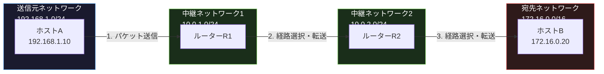
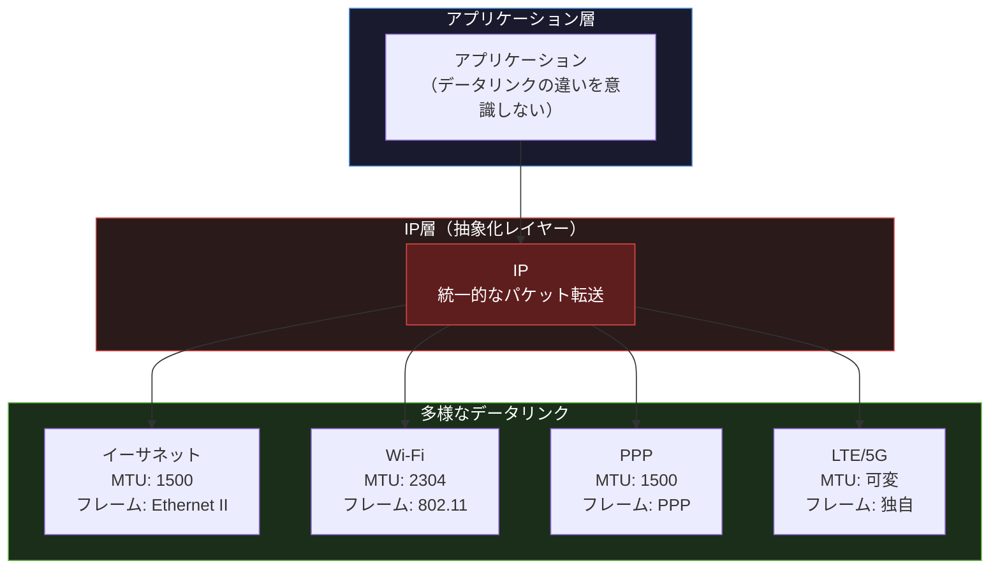
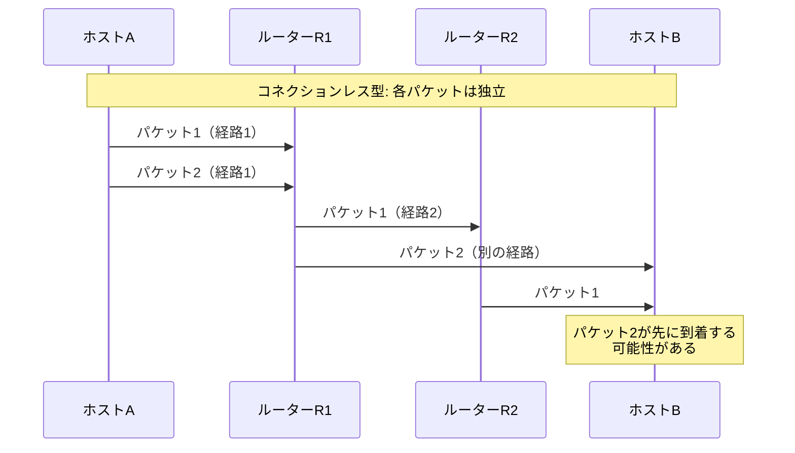

import { Aside } from '@astrojs/starlight/components';

## この節で学ぶこと

IPの4つの基本概念を学びます．IPアドレスによるネットワーク層でのアドレッシング，ルーティングによるパケット転送，異なるデータリンク技術をIPで統一的に扱うデータリンクの抽象化，そしてコネクションレス型通信の特徴を理解します．

## 4.2.1 IPアドレスはネットワーク層のアドレス

IPアドレスは，ネットワーク層でホストやルーターのインタフェースを一意に識別するためのアドレスです．データリンク層で使われるMACアドレスがハードウェアに紐づくアドレスであるのに対し，IPアドレスはネットワークの論理的な構成に基づいて割り当てられる論理アドレスです．

IPアドレスの特徴は以下の通りです:

- 階層的なアドレス構造: ネットワーク部とホスト部に分かれており，効率的なルーティングが可能
- 論理的な割り当て: ネットワーク構成に応じて管理者が設定可能
- グローバルな一意性: インターネット上で重複しないことが保証される（グローバルIPアドレスの場合）

IPv4アドレスは32ビット，IPv6アドレスは128ビットの数値で構成されます．IPv4アドレスは通常，8ビットずつ4つのオクテットに分けてドット区切りの10進数表記（例: 192.168.1.1）で記述します．

MACアドレスとIPアドレスの比較:

| 項目 | MACアドレス | IPアドレス |
|------|-----------|-----------|
| 層 | データリンク層（第2層） | ネットワーク層（第3層） |
| ビット長 | 48ビット | 32ビット（IPv4）/ 128ビット（IPv6） |
| 割り当て | 製造時にハードウェアに固定 | 管理者が論理的に設定 |
| 構造 | フラット（ベンダーID+シリアル） | 階層的（ネットワーク部+ホスト部） |
| スコープ | 同一セグメント内で有効 | ネットワーク間で有効 |

## 4.2.2 経路制御

経路制御（ルーティング）は，IPパケットを送信元から宛先まで最適な経路で転送するための仕組みです．インターネットは無数のネットワークが相互接続された巨大なネットワークであり，目的のホストに到達するまでに複数のルーターを経由する必要があります．

ルーティングの基本的な動作は次の通りです:

1. ホストまたはルーターがIPパケットを受信する
2. 宛先IPアドレスを確認する
3. ルーティングテーブル（経路制御表）を参照する
4. 次のホップ（転送先）を決定する
5. 適切なネットワークインタフェースからパケットを送出する

各ルーターは自身が持つルーティングテーブルに基づいて転送先を決定します．ルーティングテーブルには，宛先ネットワークとそのネットワークに到達するための次のホップの情報が記録されています．

ルーティングテーブルの例:

| 宛先ネットワーク | サブネットマスク | 次のホップ | インタフェース |
|----------------|----------------|-----------|-------------|
| 192.168.1.0 | 255.255.255.0 | 直接接続 | eth0 |
| 172.16.0.0 | 255.255.0.0 | 10.0.2.1 | eth1 |
| 0.0.0.0 | 0.0.0.0 | 10.0.1.1 | eth1 |

最後のエントリ（0.0.0.0/0）はデフォルトルートと呼ばれ，他のどのエントリにも一致しない宛先へのパケットを転送するための経路です．

## 4.2.3 データリンクの抽象化

IPの最も重要な役割の一つが，さまざまなデータリンク技術の違いを吸収し，上位層に統一的なインタフェースを提供する「データリンクの抽象化」です．

現実のネットワークでは，以下のようにさまざまなデータリンク技術が使われています:

- 有線LAN: イーサネット（10Mbps〜400Gbps）
- 無線LAN: Wi-Fi（IEEE 802.11a/b/g/n/ac/ax）
- 広域通信: PPP，FTTH
- モバイル通信: LTE，5G
- データセンター: InfiniBand，ファイバーチャネル

これらのデータリンクはそれぞれ異なるフレームフォーマット，最大転送単位（MTU），アドレス体系を持っています．しかし，IPがこれらの違いを吸収することで，アプリケーション層からは統一されたIPパケットとして通信を行えます．

この抽象化の実現には以下のメカニズムが使われています:

- IPパケットをデータリンク層のフレームにカプセル化（エンカプセレーション）して送信
- 受信側ではフレームからIPパケットを取り出す（デカプセレーション）
- MTUの違いはIPのフラグメンテーション機能で対応

データリンクの抽象化により，新しいデータリンク技術が登場しても，IPとの接続点（インタフェース）を実装すれば，既存のアプリケーションをそのまま利用できます．

## 4.2.4 IPはコネクションレス型

IPはコネクションレス型のプロトコルです．これは，データを送信する前に相手との接続（コネクション）を確立しないことを意味します．IPは各パケットを独立したデータグラムとして扱い，個々のパケットが異なる経路を通る可能性があります．

コネクション型とコネクションレス型の比較:

| 特徴 | コネクション型（例: TCP） | コネクションレス型（例: IP） |
|------|------------------------|--------------------------|
| 事前接続 | 必要（3ウェイハンドシェイク） | 不要 |
| データ順序 | 保証される | 保証されない |
| 信頼性 | 再送制御あり | ベストエフォート |
| 経路 | 一定（仮想回線） | パケットごとに異なる可能性 |
| オーバーヘッド | 大きい | 小さい |

IPがコネクションレス型を採用している理由は以下の通りです:

- シンプルさ: コネクション管理の複雑さを避け，プロトコルをシンプルに保てる
- 効率性: コネクション確立のオーバーヘッドがない
- 耐障害性: 経路上のルーターが故障しても，パケットは別の経路で配送される
- スケーラビリティ: ルーターはコネクション状態を保持する必要がなく，大規模ネットワークに対応できる

IPがベストエフォート（最善努力）の配送を行うということは，パケットの到達，順序，重複排除を保証しないことを意味します．信頼性が必要な通信には，上位層のTCPがこれらの保証を提供します．この層ごとの役割分担が，TCP/IPアーキテクチャの設計思想です．

<Aside type="tip" title="FDE実務での活用">
IPのデータリンク抽象化は，クラウドのマルチリージョン展開を可能にする基盤です．例えば，AWSの東京リージョンとバージニアリージョン間では，海底光ファイバー，陸上光ファイバー，各種スイッチ・ルーターなど，多種多様なデータリンク技術が使われています．しかし，IPがこれらを抽象化するため，VPC間のピアリングやTransit Gatewayを設定すれば，アプリケーションからはシームレスな通信が実現できます．AIモデルの分散推論基盤を複数リージョンに展開する際も，IPの抽象化のおかげで，リージョン間の物理的なネットワーク構成を意識することなく，論理的なネットワーク設計に集中できます．
</Aside>

## まとめ

- IPアドレスはネットワーク層の論理アドレスで，階層的な構造を持つ
- 経路制御（ルーティング）により，ルーティングテーブルに基づいてパケットが最適経路で転送される
- IPはさまざまなデータリンク技術を抽象化し，上位層に統一的なインタフェースを提供する
- IPはコネクションレス型のベストエフォート配送を行い，信頼性はTCPなどの上位層が担保する
- データリンクの抽象化とコネクションレス型の組み合わせが，インターネットのスケーラビリティと耐障害性を実現している

## 理解度チェック

Q1: IPアドレスとMACアドレスの構造的な違いを説明してください．

IPアドレスは階層的な構造（ネットワーク部とホスト部）を持ち，ネットワークの論理構成に基づいて管理者が割り当てます．MACアドレスはフラットな構造（ベンダーIDとシリアル番号）を持ち，製造時にハードウェアに固定されます．この階層的な構造により，IPアドレスは効率的なルーティングを可能にします．

Q2: データリンクの抽象化とは何ですか？なぜ重要ですか？

データリンクの抽象化とは，イーサネット，Wi-Fi，PPPなど異なるデータリンク技術の違い（フレームフォーマット，MTU，アドレス体系など）をIP層で吸収し，上位層に統一的なインタフェースを提供する仕組みです．これにより，アプリケーションはデータリンクの種類を意識せずに通信でき，新しいデータリンク技術が登場しても既存のアプリケーションをそのまま利用できます．

Q3: IPがコネクションレス型を採用している理由を3つ挙げてください．

1. シンプルさ: コネクション管理の複雑さを排除し，プロトコルの実装と運用をシンプルに保てる
2. 耐障害性: 経路上のルーターが故障しても，個々のパケットは別の経路で迂回配送が可能
3. スケーラビリティ: ルーターがコネクション状態を保持する必要がなく，膨大な数の通信を処理できる

Q4: デフォルトルートとは何ですか？どのような場面で使われますか？

デフォルトルート（0.0.0.0/0）は，ルーティングテーブル内の他のどのエントリにも一致しない宛先アドレスに対して適用される経路です．インターネット上のすべてのネットワークの経路をルーティングテーブルに記載することは非現実的であるため，明示的に登録されていない宛先へのパケットをデフォルトゲートウェイに転送するために使用されます．

