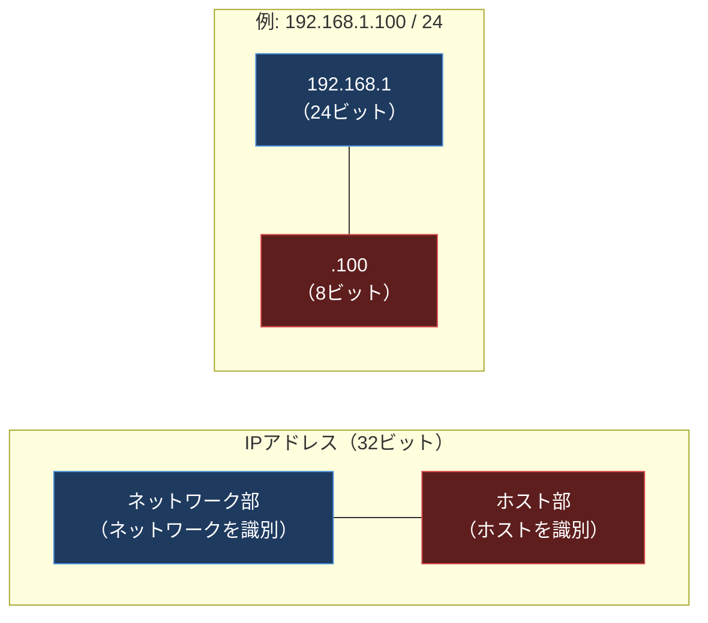
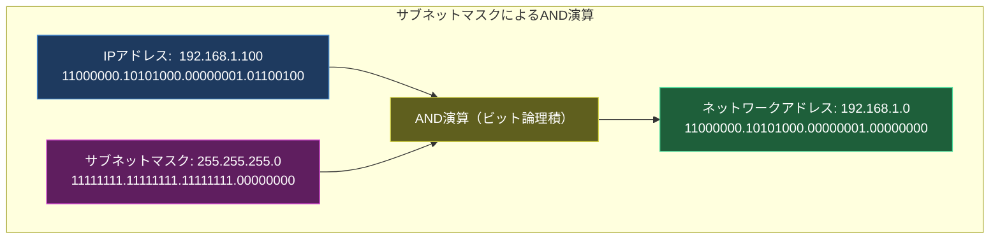
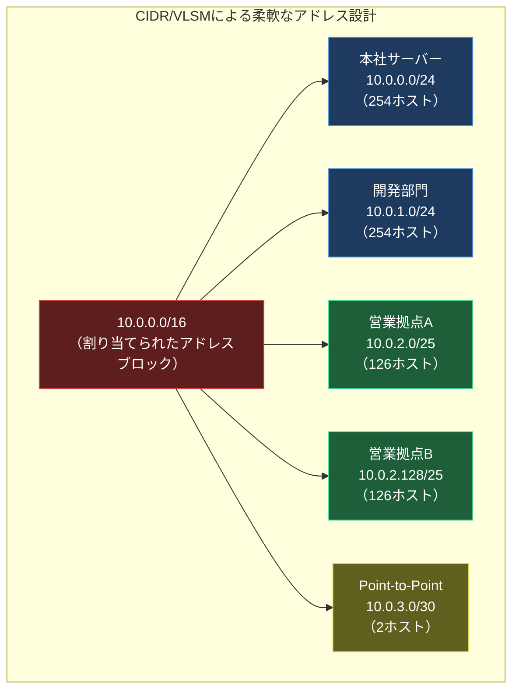

import { Aside } from '@astrojs/starlight/components';

## この節で学ぶこと

IPアドレスはネットワーク通信の基盤となるアドレス体系です．この節では，IPアドレスの構造（ネットワーク部とホスト部），歴史的なクラスフル方式，ブロードキャストとマルチキャスト，サブネットマスク，CIDRとVLSM，そしてグローバルアドレスとプライベートアドレスの違いまで，IPアドレスに関する基礎知識を網羅的に学びます．

## 4.3.1 IPアドレスとは

IPアドレスは，IPネットワーク上の各ホスト（コンピュータやネットワーク機器）のインタフェースを一意に識別するための32ビット（IPv4）の数値です．IPアドレスによって，送信元と宛先を特定し，ルーティングを行うことが可能になります．

IPv4アドレスは32ビットの2進数で表現されますが，人間にとって読みやすいように8ビットずつ4つのオクテットに分け，各オクテットを10進数に変換してドットで区切った表記法が使われます．

例:
- 2進数表記: 11000000.10101000.00000001.00000001
- 10進数表記: 192.168.1.1

32ビットで表現できるIPアドレスの総数は 2^32 = 約43億個です．インターネットの急速な普及により，この数では不足する事態に陥っており，128ビットのIPv6への移行が進められています．

## 4.3.2 ネットワーク部とホスト部

IPアドレスは「ネットワーク部」と「ホスト部」の2つの部分から構成されています．この階層的な構造がIPアドレスの最も重要な特徴です．

- ネットワーク部: ホストが所属するネットワーク（サブネット）を識別する部分
- ホスト部: そのネットワーク内で個々のホストを識別する部分

ルーターはパケットを転送する際，宛先IPアドレスのネットワーク部だけを見て経路を決定します．これにより，個々のホストのアドレスではなくネットワーク単位で経路情報を管理でき，ルーティングテーブルのサイズを抑えることができます．

ネットワーク部とホスト部の境界は，サブネットマスクによって決定されます（4.3.6で詳述）．

## 4.3.3 IPアドレスのクラス

IPv4アドレスには歴史的に5つのクラス（A〜E）が定義されていました．クラスは先頭ビットのパターンによって区別され，それぞれネットワーク部とホスト部の長さが異なります．

| クラス | 先頭ビット | ネットワーク部 | ホスト部 | アドレス範囲 | ネットワーク数 | ホスト数/NW |
|-------|-----------|-------------|---------|------------|-------------|-----------|
| A | 0 | 8ビット | 24ビット | 0.0.0.0〜127.255.255.255 | 126 | 約1,677万 |
| B | 10 | 16ビット | 16ビット | 128.0.0.0〜191.255.255.255 | 約16,000 | 約65,000 |
| C | 110 | 24ビット | 8ビット | 192.0.0.0〜223.255.255.255 | 約200万 | 254 |
| D | 1110 | - | - | 224.0.0.0〜239.255.255.255 | マルチキャスト用 | - |
| E | 1111 | - | - | 240.0.0.0〜255.255.255.255 | 実験用（予約） | - |

クラスフル方式の問題点は，アドレス空間の無駄が大きいことです．例えば，500台のホストが必要な場合，クラスCでは足りず（254台），クラスBを割り当てると約65,000台分のアドレスが無駄になります．この問題を解決するために，後述するCIDRが導入されました．

## 4.3.4 ブロードキャストアドレス

ブロードキャストアドレスは，同一ネットワーク上の全ホストに対して一斉にパケットを送信するためのアドレスです．IPのブロードキャストには2種類あります:

- リミテッドブロードキャスト（255.255.255.255）: 同一セグメント内の全ホストに送信．ルーターを越えない
- ディレクテッドブロードキャスト: 特定のネットワークの全ホストに送信．ホスト部のビットがすべて1のアドレス（例: 192.168.1.255/24）

ブロードキャストアドレスとネットワークアドレス（ホスト部がすべて0）はホストに割り当てることができないため，/24のネットワークで実際に使用できるホストアドレスは 2^8 - 2 = 254個です．

## 4.3.5 IPマルチキャスト

マルチキャストは，特定のグループに属する複数のホストに対して同時にパケットを送信する方式です．ブロードキャストがネットワーク上の全ホストに送信するのに対し，マルチキャストは受信を希望するホスト（グループメンバー）だけに送信します．

マルチキャストの用途:

- 動画・音声のストリーミング配信
- ルーティングプロトコル（OSPF，RIPなど）の情報交換
- サービスディスカバリ（mDNS，SSDPなど）

マルチキャストアドレスはクラスDの範囲（224.0.0.0〜239.255.255.255）を使用します．代表的なマルチキャストアドレスの例:

- 224.0.0.1: 同一セグメント内のすべてのホスト
- 224.0.0.2: 同一セグメント内のすべてのルーター
- 224.0.0.5: OSPF全ルーター
- 224.0.0.9: RIPv2ルーター

## 4.3.6 サブネットマスク

サブネットマスクは，IPアドレスのどの部分がネットワーク部で，どの部分がホスト部であるかを示す32ビットの値です．ネットワーク部に対応するビットが1，ホスト部に対応するビットが0になります．

IPアドレスとサブネットマスクのAND演算（ビット論理積）を行うことで，ネットワークアドレスを求めることができます．

サブネットマスクの表記方法は2通りあります:

- ドット表記: 255.255.255.0
- プレフィックス表記（CIDR表記）: /24（ネットワーク部のビット数）

サブネットマスクを使うことで，クラスの境界にとらわれず，任意の位置でネットワーク部とホスト部を区切ることができます．これをサブネッティングと呼びます．

サブネッティングの例（192.168.1.0/24を4つのサブネットに分割）:

| サブネット | ネットワークアドレス | サブネットマスク | 使用可能ホスト数 |
|-----------|-------------------|----------------|--------------|
| 1 | 192.168.1.0/26 | 255.255.255.192 | 62 |
| 2 | 192.168.1.64/26 | 255.255.255.192 | 62 |
| 3 | 192.168.1.128/26 | 255.255.255.192 | 62 |
| 4 | 192.168.1.192/26 | 255.255.255.192 | 62 |

## 4.3.7 CIDRとVLSM

CIDR（Classless Inter-Domain Routing，サイダー）は，クラスフルなアドレス体系を廃止し，任意のビット長でネットワーク部を指定できるようにした仕組みです．これにより，アドレス空間を柔軟かつ効率的に利用できます．

CIDR表記では，IPアドレスの後にスラッシュとプレフィックス長を付けます（例: 10.0.0.0/22）．

VLSM（Variable Length Subnet Mask，可変長サブネットマスク）は，同一ネットワーク内で異なるサブネットマスク長を使用できる仕組みです．これにより，サブネットごとに必要なホスト数に応じて最適なサブネットサイズを選択できます．

CIDRとVLSMの利点:

- アドレスの無駄が少ない: 必要なホスト数に合わせたサブネットサイズを選択可能
- 経路集約（ルート集約）が可能: 連続するアドレスブロックを1つのエントリにまとめてルーティングテーブルを縮小
- スケーラブル: インターネットの成長に対応可能

## 4.3.8 グローバルアドレスとプライベートアドレス

IPアドレスは，利用範囲によってグローバルアドレスとプライベートアドレスに分類されます．

グローバルIPアドレスは，インターネット上で一意に割り当てられるアドレスです．IANA（Internet Assigned Numbers Authority）を頂点とした階層的な管理組織によって管理されています．

プライベートIPアドレスは，組織内のローカルネットワークで自由に使用できるアドレスです．インターネット上ではルーティングされず，外部との通信にはNAT（Network Address Translation）を介します．

RFC 1918で定義されたプライベートアドレスの範囲:

| クラス | アドレス範囲 | CIDR表記 | ネットワーク数 |
|-------|------------|---------|-------------|
| A | 10.0.0.0〜10.255.255.255 | 10.0.0.0/8 | 1 |
| B | 172.16.0.0〜172.31.255.255 | 172.16.0.0/12 | 16 |
| C | 192.168.0.0〜192.168.255.255 | 192.168.0.0/16 | 256 |

プライベートアドレスの利点:

- グローバルアドレスの節約: 組織内部ではプライベートアドレスを使用
- セキュリティ: 内部ネットワークのホストがインターネットから直接アクセスされない
- 自由な設計: IANA等への申請なしに自由にアドレス設計が可能

## 4.3.9 グローバルIPアドレスは誰が決める

グローバルIPアドレスの管理は，以下の階層的な組織構造で行われています:

1. IANA（Internet Assigned Numbers Authority）: 全世界のIPアドレスを統括管理
2. RIR（Regional Internet Registry）: 地域ごとのアドレス管理
   - ARIN（北米）
   - RIPE NCC（ヨーロッパ，中東，中央アジア）
   - APNIC（アジア太平洋）
   - LACNIC（中南米）
   - AFRINIC（アフリカ）
3. NIR（National Internet Registry）: 国ごとのアドレス管理（例: JPNIC）
4. LIR（Local Internet Registry）: ISPや企業への割り当て

日本では，APNICの下にJPNIC（Japan Network Information Center）が位置し，国内のIPアドレスの管理を行っています．一般の企業やユーザーは，ISP（インターネットサービスプロバイダ）を通じてIPアドレスの割り当てを受けます．

<Aside type="tip" title="FDE実務での活用">
VPCのCIDR設計は，クラウドインフラ構築の最初に行う重要な意思決定です．AWS VPCでは /16〜/28 の範囲でCIDRを指定します．設計のポイントは:

- 他VPCやオンプレミスとのピアリングを考慮して重複しないCIDRを選ぶ（例: 本番 10.0.0.0/16，開発 10.1.0.0/16，検証 10.2.0.0/16）
- AZ（アベイラビリティゾーン）ごとにサブネットを分割する（例: パブリックサブネット /24，プライベートサブネット /20）
- 将来のスケールを見据えて十分なアドレス空間を確保する
- GCPでは auto mode VPC（10.128.0.0/9）とcustom mode VPCが選択可能

AIワークロードでは，GPUインスタンスの台数増加に伴いIPアドレスの消費が急速に進むため，余裕を持ったCIDR設計が不可欠です．
</Aside>

## まとめ

- IPアドレスはネットワーク上のインタフェースを一意に識別する32ビット（IPv4）の論理アドレス
- IPアドレスはネットワーク部とホスト部に分かれ，ルーティングの効率化に寄与する
- クラスフル方式（A〜E）はアドレスの無駄が多く，CIDRとVLSMに置き換えられた
- ブロードキャストは全ホストへ，マルチキャストは特定グループへの一斉送信
- サブネットマスクによるAND演算でネットワークアドレスを求められる
- グローバルアドレスはIANA→RIR→NIR→LIRの階層的組織で管理される
- プライベートアドレスは組織内で自由に利用でき，NATを介して外部と通信する

## 理解度チェック

Q1: IPアドレス 172.20.10.50，サブネットマスク 255.255.254.0 のネットワークアドレスを求めてください．

172.20.10.50 を2進数に変換: 10101100.00010100.00001010.00110010
255.255.254.0 を2進数に変換: 11111111.11111111.11111110.00000000

AND演算:
10101100.00010100.00001010.00110010
AND 11111111.11111111.11111110.00000000
= 10101100.00010100.00001010.00000000

ネットワークアドレスは 172.20.10.0/23 です．

Q2: クラスフル方式の問題点と，CIDRがそれをどのように解決したかを説明してください．

クラスフル方式では，ネットワーク部の長さがクラスA（8ビット），B（16ビット），C（24ビット）の3段階に固定されており，必要なホスト数とクラスのサイズが合わない場合にアドレス空間の大きな無駄が発生しました．例えば500台のホストが必要でも，クラスC（254台）では足りず，クラスB（65,534台）を割り当てると65,000個以上が無駄になります．CIDRでは任意のビット長でネットワーク部を指定できるため（例: /22で1,022台），必要な規模に合わせた柔軟なアドレス割り当てが可能になりました．

Q3: プライベートIPアドレスの3つの範囲と，使用するメリットを述べてください．

プライベートIPアドレスの範囲:
1. 10.0.0.0/8（クラスA: 10.0.0.0〜10.255.255.255）
2. 172.16.0.0/12（クラスB: 172.16.0.0〜172.31.255.255）
3. 192.168.0.0/16（クラスC: 192.168.0.0〜192.168.255.255）

メリット: グローバルアドレスの節約，内部ネットワークのセキュリティ強化（直接外部からアクセスされない），IANAへの申請なしに自由にアドレス設計が可能な点です．

Q4: ブロードキャストアドレスとマルチキャストアドレスの違いを説明してください．

ブロードキャストアドレスは，同一ネットワーク上の全ホストにパケットを一斉送信するためのアドレスです．すべてのホストが受信対象となります．一方，マルチキャストアドレス（224.0.0.0〜239.255.255.255）は，特定のマルチキャストグループに参加しているホストのみにパケットを送信します．受信を希望しないホストにはパケットが配送されないため，ネットワーク帯域を効率的に使用できます．

Q5: VPCのCIDR設計で，/16と/24のどちらを選ぶべきかの判断基準を述べてください．

/16では65,534個のIPアドレスが使用可能で，/24では254個が使用可能です．判断基準としては，VPC内に配置するリソース数（EC2インスタンス，Lambda ENI，ELBなど），サブネットの分割数（AZ数 x サブネット種別），将来のスケール計画，他VPCやオンプレミスとのピアリング時のアドレス重複回避を考慮します．一般的に，本番環境では /16，小規模な開発環境では /20〜/24 が推奨されます．

