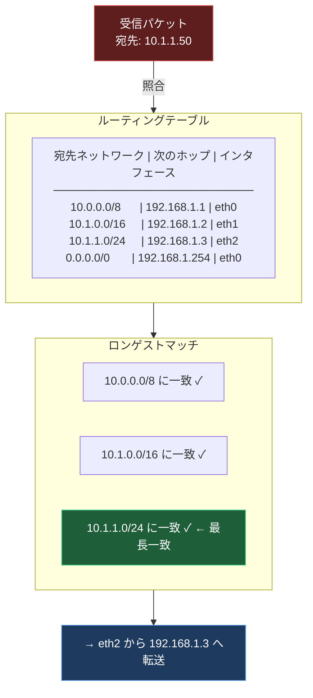
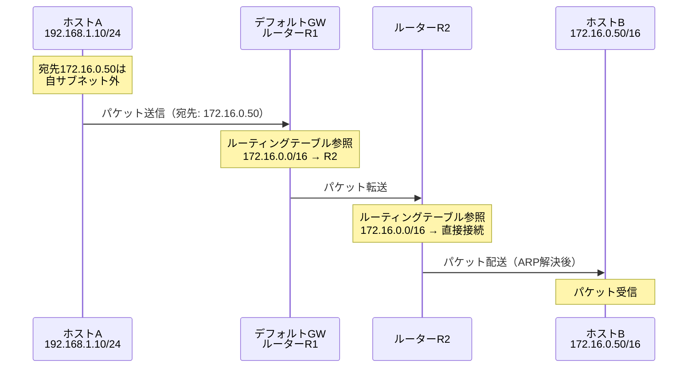
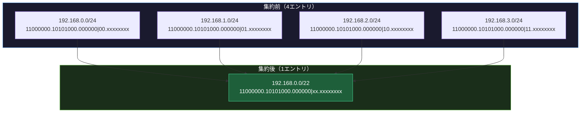

import { Aside } from '@astrojs/starlight/components';

## この節で学ぶこと

IPネットワークにおける経路制御（ルーティング）の詳細を学びます．IPアドレスのネットワーク部に基づいてパケットが転送される仕組み，ルーティングテーブルの構造と参照方法，そして経路情報を効率的に管理するための経路集約について理解を深めます．

## 4.4.1 IPアドレスと経路制御

IPによるパケットの転送は，宛先IPアドレスのネットワーク部とルーティングテーブルの照合によって行われます．ルーターは受信したパケットの宛先IPアドレスを確認し，ルーティングテーブル内のエントリと照合して最適な転送先を決定します．

ルーティングテーブルの照合では，ロンゲストマッチ（最長一致）の原則が適用されます．複数のエントリが宛先アドレスに一致する場合，プレフィックス長が最も長い（最も具体的な）エントリが選択されます．

パケット転送の流れを具体的に見てみましょう．ホストAから宛先ホストBへパケットを送信する場合:

1. ホストAは宛先IPアドレスと自身のサブネットマスクを使い，宛先が同一サブネット内かを判定
2. 同一サブネット内の場合 → ARPで宛先のMACアドレスを解決し，直接送信
3. 異なるサブネットの場合 → デフォルトゲートウェイ（ルーター）へ送信
4. ルーターはルーティングテーブルを参照し，次のホップを決定
5. 宛先ネットワークに到達するまで，各ルーターが手順4を繰り返す

ルーティングテーブルのエントリは以下の方法で設定されます:

- 直接接続ルート: ルーターのインタフェースに設定されたネットワーク（自動生成）
- スタティックルート: 管理者が手動で設定する固定経路
- ダイナミックルート: ルーティングプロトコル（RIP，OSPF，BGPなど）が動的に学習した経路

## 4.4.2 経路制御表の集約

経路集約（ルートアグリゲーション）は，複数の連続するネットワークアドレスを1つのエントリにまとめる技術です．これにより，ルーティングテーブルのエントリ数を削減し，ルーターのメモリ使用量とルーティング処理の負荷を軽減できます．

経路集約の具体例:

以下の4つのネットワークを集約する場合:
- 192.168.0.0/24
- 192.168.1.0/24
- 192.168.2.0/24
- 192.168.3.0/24

これらの4つのネットワークは，192.168.0.0/22 という1つのエントリに集約できます．

経路集約が可能な条件:

- 集約対象のネットワークアドレスが連続していること
- 集約対象のネットワークが同じ次のホップ（同じ方向）に転送されること
- 集約後のアドレス範囲に，意図しないネットワークが含まれないこと

経路集約は，インターネット全体のルーティングテーブルサイズを管理可能な範囲に保つために不可欠な技術です．ISPは顧客に連続するアドレスブロックを割り当て，上位のルーターではこれらを集約して広告します．

### MTU問題の特定と解決

ルーティングに関連するトラブルとして，MTU（Maximum Transmission Unit）の不一致問題があります．異なるデータリンク間でパケットが転送される際，MTUの違いによるパケットの破棄やフラグメンテーションが発生することがあります．

MTU問題の主な症状:

- 小さなパケット（pingなど）は通るが，大きなデータの転送が失敗する
- SSH接続は確立できるが，大量のデータ転送時にハングする
- VPN経由の通信でスループットが極端に低下する

トラブルシューティング手順:

1. `ping -M do -s <size> <target>` でPath MTUを確認（Linuxの場合）
2. `traceroute --mtu <target>` でMTUが変化するポイントを特定
3. `ip route change <route> mtu <value>` でMTUを明示的に設定
4. VPN環境では，トンネルインタフェースのMTUをオーバーヘッド分だけ小さく設定

<Aside type="tip" title="FDE実務での活用">
クラウド環境でのルートテーブル設定は，ネットワーク設計の核心です．AWS VPCの例:

- メインルートテーブル: VPC内のローカル通信（10.0.0.0/16 → local）
- カスタムルートテーブル: インターネット向け（0.0.0.0/0 → igw-xxx），NAT Gateway向け（0.0.0.0/0 → nat-xxx）
- VPCピアリング: 相手VPCのCIDR（172.16.0.0/16 → pcx-xxx）
- Transit Gateway: オンプレミス向け（192.168.0.0/16 → tgw-xxx）

経路集約は，Transit Gatewayのルートテーブルで特に重要です．複数のVPCやオンプレミスネットワークの経路を集約することで，ルーティングの管理を簡素化できます．AIプラットフォームの構築では，学習用データレイクVPC，推論サービスVPC，モニタリングVPCなど複数のVPCが連携するため，集約可能なCIDR設計が運用効率を大きく左右します．
</Aside>

## まとめ

- ルーティングは宛先IPアドレスのネットワーク部とルーティングテーブルを照合して転送先を決定する
- ロンゲストマッチの原則により，最も具体的な（プレフィックス長が最長の）エントリが選択される
- ルーティングテーブルには直接接続，スタティック，ダイナミックの3種類の経路がある
- 経路集約により，連続するネットワークアドレスを1つのエントリにまとめ，ルーティングテーブルを縮小できる
- MTU問題はルーティング関連の代表的なトラブルであり，Path MTU Discoveryや手動設定で対処できる

## 理解度チェック

Q1: ロンゲストマッチの原則とは何ですか？具体例で説明してください．

ロンゲストマッチとは，ルーティングテーブルの照合において，宛先IPアドレスに一致するエントリが複数ある場合，プレフィックス長が最も長い（最も具体的な）エントリを選択する原則です．例えば，宛先が10.1.1.50の場合，10.0.0.0/8，10.1.0.0/16，10.1.1.0/24の3つのエントリに一致しますが，最もプレフィックスが長い10.1.1.0/24が選択されます．

Q2: 192.168.4.0/24，192.168.5.0/24，192.168.6.0/24，192.168.7.0/24の4つのネットワークを集約すると，どのような1つのエントリになりますか？

192.168.4.0/22 に集約できます．4つのネットワークの第3オクテットを2進数で見ると，4=00000100，5=00000101，6=00000110，7=00000111です．先頭22ビット（192.168.000001xx）が共通するため，/22で集約可能です．192.168.4.0/22 は 192.168.4.0〜192.168.7.255 の範囲をカバーします．

Q3: 宛先が同一サブネット内かどうかを判定する方法を説明してください．

送信元ホストは，自身のIPアドレスとサブネットマスクのAND演算で自身のネットワークアドレスを求めます．次に，宛先IPアドレスと同じサブネットマスクのAND演算で宛先のネットワークアドレスを求めます．この2つのネットワークアドレスが一致すれば同一サブネット内であり，ARPで直接MACアドレスを解決して送信します．一致しなければ異なるサブネットであり，デフォルトゲートウェイに転送します．

Q4: VPN環境でMTU問題が発生しやすい理由を説明してください．

VPNではIPパケットをさらに別のIPパケットでカプセル化（トンネリング）するため，オリジナルのパケットにVPNヘッダ分のオーバーヘッドが追加されます．例えば，IPsecの場合，ESP（Encapsulating Security Payload）ヘッダなどで50〜80バイト程度のオーバーヘッドが発生します．元のMTUが1500バイトの場合，VPNトンネル内の実効MTUは1420〜1450バイト程度に低下します．DF（Don't Fragment）ビットが設定されたパケットがこの実効MTUを超えると破棄され，通信障害が発生します．

