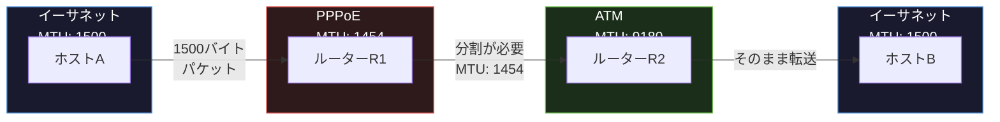
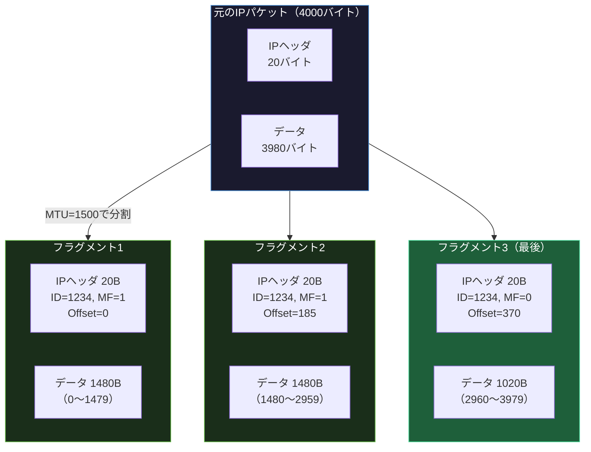
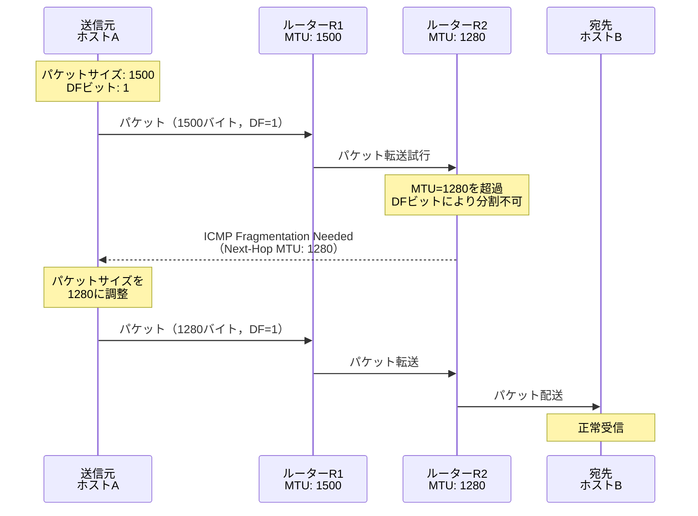

import { Aside } from '@astrojs/starlight/components';

## この節で学ぶこと

IPパケットがデータリンクのMTU（Maximum Transmission Unit）より大きい場合に行われるフラグメンテーション（分割処理）と，宛先での再構築処理について学びます．データリンクごとに異なるMTU，IPデータグラムの分割と再構築の仕組み，そして効率的な通信を実現するPath MTU Discovery（経路MTU探索）を理解します．

## 4.5.1 データリンクによってMTUは違う

MTU（Maximum Transmission Unit）は，データリンク層が1回の転送で運べるペイロードの最大サイズです．データリンク技術によってMTUの値は異なります．

| データリンク | MTU（バイト） |
|-------------|-------------|
| イーサネット | 1,500 |
| IEEE 802.3 | 1,492 |
| PPPoE | 1,454 |
| IEEE 802.11（Wi-Fi） | 2,304 |
| FDDI | 4,352 |
| ATM（AAL5） | 9,180 |
| ジャンボフレーム対応イーサネット | 9,000 |
| ループバック | 65,535 |

インターネットでは，パケットが送信元から宛先まで到達するまでに，異なるMTUを持つ複数のデータリンクを経由する可能性があります．送信元で作成されたIPパケットのサイズが，経路上のいずれかのデータリンクのMTUより大きい場合，そのパケットは分割される必要があります．

上の図では，1500バイトのパケットがPPPoEリンク（MTU: 1454）を通過する際にフラグメンテーションが必要になることを示しています．経路全体で最も小さいMTUを「経路MTU（Path MTU）」と呼びます．

## 4.5.2 IPデータグラムの分割処理と再構築処理

IPフラグメンテーションでは，MTUを超えるパケットを複数の小さなフラグメント（断片）に分割します．各フラグメントは独立したIPパケットとして転送され，宛先ホストで再構築されます．

分割処理で使用されるIPヘッダのフィールド:

- 識別子（Identification）: 16ビット．元のパケットを識別するための値．同じパケットから分割されたフラグメントは同じ識別子を持つ
- フラグ（Flags）: 3ビット
  - 予約ビット（1ビット）: 常に0
  - DF（Don't Fragment）ビット: 1の場合，分割禁止．MTUを超える場合はパケットを破棄し，ICMPエラーを返す
  - MF（More Fragments）ビット: 1の場合，後続のフラグメントが存在する．最後のフラグメントは0
- フラグメントオフセット（Fragment Offset）: 13ビット．元のパケット内でのフラグメントの位置を8バイト単位で示す

フラグメントオフセットの計算:
- フラグメント1: オフセット = 0/8 = 0
- フラグメント2: オフセット = 1480/8 = 185
- フラグメント3: オフセット = 2960/8 = 370

再構築処理のポイント:

- 再構築は宛先ホストでのみ行われる（中間ルーターでは行わない）
- 同じ識別子を持つフラグメントを，フラグメントオフセットに基づいて正しい順序で結合する
- MF=0のフラグメントを受信すると，そのオフセットとデータサイズから元のパケットの全長が判明する
- すべてのフラグメントが揃った時点で再構築が完了する
- 一定時間内にすべてのフラグメントが揃わない場合，受信済みのフラグメントは破棄される

フラグメンテーションの問題点:

- パフォーマンスの低下: 分割・再構築の処理オーバーヘッド
- 信頼性の低下: 1つのフラグメントが失われると，元のパケット全体を再送する必要がある
- セキュリティ上の懸念: フラグメントを悪用した攻撃（ティアドロップ攻撃，フラグメントオーバーラップ攻撃など）

これらの問題から，現代のネットワークではDFビットを設定してフラグメンテーションを禁止し，次に説明するPath MTU Discoveryを使用することが推奨されています．

## 4.5.3 経路MTU探索（Path MTU Discovery）

Path MTU Discovery（PMTUD）は，送信元から宛先までの経路上で最も小さいMTU（経路MTU）を動的に発見する仕組みです．送信元はこの経路MTUに合わせてパケットサイズを調整することで，経路上でのフラグメンテーションを回避します．

Path MTU Discoveryの動作:

1. 送信元はDFビットを設定（分割禁止）してパケットを送信
2. 経路上のルーターがMTUを超えるパケットを受信すると，パケットを破棄
3. ルーターはICMP「Fragmentation Needed（Type 3, Code 4）」メッセージを送信元に返す．このメッセージにはそのリンクのMTU値が含まれる
4. 送信元はパケットサイズを通知されたMTU以下に調整して再送
5. 手順1〜4を経路MTUが確定するまで繰り返す

Path MTU Discoveryの利点:

- フラグメンテーションを回避し，パフォーマンスを最適化
- 経路上の全リンクのMTUに適応した効率的な通信

Path MTU Discoveryの注意点:

- ICMPメッセージがファイアウォールでブロックされると，Path MTU Discoveryが機能しない（ブラックホール問題）
- 経路が変更された場合，Path MTUの再探索が必要

ブラックホール問題への対策として，TCPではMSS（Maximum Segment Size）のクランプや，PLPMTUD（Packetization Layer Path MTU Discovery）が使用されます．

<Aside type="tip" title="FDE実務での活用">
AIモデルの学習データや推論結果の大規模データ転送では，MTUの設定がスループットに大きく影響します．データセンター内のサーバー間通信では，ジャンボフレーム（MTU: 9000）を有効にすることで，IPヘッダのオーバーヘッド比率を低減し，転送効率を向上させることができます．

例えば，AWSでは同一VPC内の通信でジャンボフレーム（MTU: 9001）がサポートされており，GPUインスタンス間のパラメータ同期やAllReduce通信で高いスループットを実現できます．ただし，VPN Gateway経由の通信では MTU が1500以下に制限されるため，オンプレミスとのハイブリッド構成ではPath MTU Discoveryが正しく機能することを確認する必要があります．

大規模データパイプラインの設計では，経路上のMTU制約を事前に把握し，アプリケーション側でパケットサイズを最適化することが，安定した高スループットを実現する鍵です．
</Aside>

## まとめ

- MTUはデータリンク層が1回で転送できる最大ペイロードサイズで，データリンク技術によって異なる
- IPフラグメンテーションは，MTUを超えるパケットを識別子，MFビット，フラグメントオフセットを使って分割・再構築する仕組み
- 再構築は宛先ホストでのみ行われ，中間ルーターでは行われない
- フラグメンテーションにはパフォーマンス低下やセキュリティリスクがあるため，現代ではDFビットの設定が推奨される
- Path MTU Discoveryは，DFビットとICMPメッセージを使って経路MTUを動的に発見する仕組み

## 理解度チェック

Q1: 4500バイトのIPパケット（ヘッダ20バイト+データ4480バイト）をMTU 1500のリンクで転送する場合，何個のフラグメントに分割されますか？

各フラグメントのデータ部は MTU - IPヘッダ = 1500 - 20 = 1480バイト（8の倍数で切り捨てる必要があるが1480は8の倍数）です．
- フラグメント1: 1480バイト（残り: 4480 - 1480 = 3000バイト）
- フラグメント2: 1480バイト（残り: 3000 - 1480 = 1520バイト）
- フラグメント3: 1480バイト（残り: 1520 - 1480 = 40バイト）
- フラグメント4: 40バイト

合計4個のフラグメントに分割されます．各フラグメントにはIPヘッダ20バイトが付加されるため，実際の転送データ量は 1500 + 1500 + 1500 + 60 = 4560バイトとなります．

Q2: DFビットの役割と，それが設定されている場合のルーターの動作を説明してください．

DF（Don't Fragment）ビットは，IPヘッダのフラグフィールドにある1ビットのフラグで，このパケットを分割してはならないことを示します．DFビットが設定されたパケットを受信したルーターが，そのパケットのサイズが出力インタフェースのMTUを超えていた場合，パケットを破棄し，送信元にICMP「Fragmentation Needed」（Type 3, Code 4）メッセージを返します．このメッセージにはそのリンクのMTU値が含まれ，Path MTU Discoveryに利用されます．

Q3: Path MTU Discoveryのブラックホール問題とは何ですか？

Path MTU Discoveryは，ICMPの「Fragmentation Needed」メッセージに依存して経路MTUを発見します．しかし，セキュリティ上の理由からICMPメッセージをブロックするファイアウォールが存在する場合，送信元はパケットが破棄されたことを知ることができず，MTUの調整ができません．結果として，パケットが経路上で「ブラックホール」に吸い込まれるように消失し，通信が成立しなくなります．これがブラックホール問題です．対策として，TCPのMSSクランプやPLPMTUDが使用されます．

Q4: ジャンボフレームとは何ですか？どのような場面で有効ですか？

ジャンボフレームは，通常のイーサネットのMTU（1500バイト）を超えるサイズ（通常9000バイト）のフレームです．1回のフレーム転送で運べるデータ量が増えるため，IPヘッダなどのオーバーヘッド比率が低下し，大量データの転送効率が向上します．データセンター内のサーバー間通信，ストレージネットワーク（iSCSI，NFS），GPUクラスタのパラメータ同期など，大量のデータを高速に転送する場面で特に有効です．ただし，経路上のすべてのネットワーク機器がジャンボフレームに対応している必要があります．

