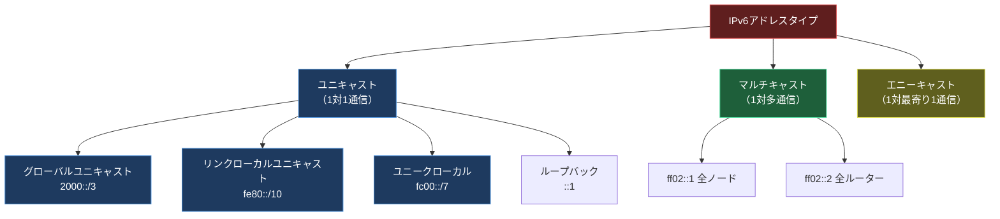
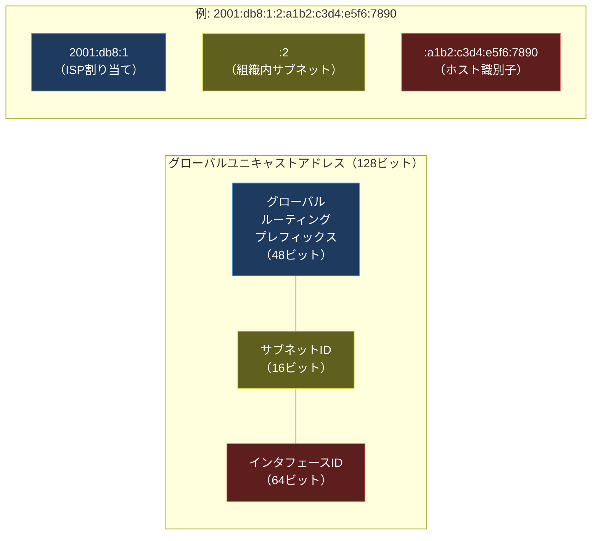

import { Aside } from '@astrojs/starlight/components';

## この節で学ぶこと

IPv6は，IPv4のアドレス枯渇問題を根本的に解決するために設計された次世代のIPプロトコルです．この節では，IPv6が必要とされる理由，IPv4との違い，128ビットアドレスの表記方法，アドレスアーキテクチャ（グローバルユニキャスト，リンクローカル，ユニークローカル），そしてIPv6での分割処理の変更点を包括的に学びます．

## 4.6.1 IPv6が必要な理由

IPv4は32ビットのアドレス空間（約43億アドレス）を持ちますが，インターネットの爆発的な普及により，アドレスの枯渇が深刻な問題となりました．

IPv4アドレス枯渇の経緯:
- 2011年2月: IANAの未割り当てIPv4アドレスブロックが枯渇
- 2011年4月: APNIC（アジア太平洋）の通常割り当てが終了
- その後: 各RIRで順次枯渇

NATやCIDRなどの延命技術により完全な枯渇は先延ばしにされましたが，以下の理由からIPv6への移行が不可避です:

- IoTデバイスの爆発的増加: 数百億のデバイスがネットワーク接続を必要とする
- NAT越えの複雑さ: P2P通信やリアルタイム通信でのNATの問題
- エンドツーエンド接続の回復: IPの本来の設計思想であるエンドツーエンド通信の実現

## 4.6.2 IPv6の特徴

IPv6はIPv4の後継プロトコルとして，アドレス空間の拡大だけでなく，さまざまな改良が加えられています:

- 広大なアドレス空間: 128ビット（2^128 ≒ 3.4 x 10^38 個）
- ヘッダの簡素化: 固定長40バイトのシンプルなヘッダ構造
- 自動設定（SLAAC）: DHCPなしでアドレスを自動的に設定可能
- IPsecの標準サポート: セキュリティ機能がプロトコルに組み込まれている
- フロー制御: フローラベルフィールドによるQoS（Quality of Service）のサポート
- フラグメンテーションの制限: 中間ルーターでの分割禁止（送信元のみ分割可能）
- 拡張ヘッダ: 必要に応じてオプション機能をチェーン式に追加

## 4.6.3 IPv6でのIPアドレスの表記方法

IPv6アドレスは128ビットの数値を，16ビットずつ8つのグループに分け，各グループを16進数で表記し，コロンで区切ります．

完全表記の例:
```
2001:0db8:0000:0000:0000:0000:0000:0001
```

省略ルール:

1. 各グループの先頭の0は省略可能
   - 0db8 → db8
   - 0000 → 0
2. 連続するオール0のグループは「::」で1回だけ省略可能
   - 2001:0db8:0000:0000:0000:0000:0000:0001 → 2001:db8::1

省略表記の例:
| 完全表記 | 省略表記 |
|---------|---------|
| 2001:0db8:0000:0000:0000:0000:0000:0001 | 2001:db8::1 |
| fe80:0000:0000:0000:0001:0002:0003:0004 | fe80::1:2:3:4 |
| 0000:0000:0000:0000:0000:0000:0000:0001 | ::1（ループバック） |
| 0000:0000:0000:0000:0000:0000:0000:0000 | ::（未指定アドレス） |

プレフィックス表記はIPv4のCIDRと同様で，アドレスの後にスラッシュとプレフィックス長を付けます（例: 2001:db8::/32）．

## 4.6.4 IPv6アドレスのアーキテクチャ

IPv6アドレスは用途に応じて複数のタイプに分類されます．IPv4と大きく異なるのは，ブロードキャストが廃止され，代わりにマルチキャストとエニーキャストが使われる点です．



## 4.6.5 グローバルユニキャストアドレス

グローバルユニキャストアドレスは，インターネット上で一意に識別されるアドレスです．IPv4のグローバルIPアドレスに相当します．

プレフィックスは 2000::/3（先頭3ビットが001）で，通常は /48 のプレフィックスがISPから割り当てられます．



- グローバルルーティングプレフィックス（48ビット）: ISPやRIRから割り当てられる部分
- サブネットID（16ビット）: 組織内のサブネットを識別．最大65,536個のサブネットを構成可能
- インタフェースID（64ビット）: ホストのインタフェースを識別．EUI-64形式（MACアドレスから生成）やランダム生成が使われる

## 4.6.6 リンクローカルユニキャストアドレス

リンクローカルユニキャストアドレスは，同一リンク（同一セグメント）内でのみ有効なアドレスです．ルーターを越えて転送されることはありません．

プレフィックスは fe80::/10 で，IPv6が有効なすべてのインタフェースに自動的に設定されます．

主な用途:

- 近隣探索プロトコル（NDP: Neighbor Discovery Protocol）
- ルーター探索
- DHCPv6のやり取り
- ルーティングプロトコルのネクストホップアドレス

リンクローカルアドレスは手動設定不要で自動生成されるため，プラグアンドプレイのネットワーク接続が実現されます．

## 4.6.7 ユニークローカルアドレス

ユニークローカルアドレス（ULA）は，IPv4のプライベートアドレスに相当する，組織内部で使用するためのアドレスです．

プレフィックスは fc00::/7 で，実際には fd00::/8 が使用されます（fc00::/8 は現時点で未定義）．

ULAの特徴:

- インターネット上ではルーティングされない
- 組織内のローカル通信に使用
- 40ビットのランダム生成IDにより，異なる組織間でのアドレス重複の可能性が極めて低い
- 組織のネットワーク統合時にもアドレス衝突のリスクが少ない

## 4.6.8 IPv6での分割処理

IPv6では，フラグメンテーションに関してIPv4から重要な変更が加えられています:

- 中間ルーターによるフラグメンテーションが禁止: 分割は送信元ホストでのみ行う
- Path MTU Discoveryが必須: 送信元は経路MTUを探索してパケットサイズを調整する
- 最小MTUは1,280バイト: すべてのIPv6リンクは最低1,280バイトのMTUをサポートする必要がある
- フラグメンテーション関連のフィールドは拡張ヘッダに移動

この設計変更により，ルーターの処理負荷が軽減され，パケット転送のパフォーマンスが向上しています．

<Aside type="tip" title="FDE実務での活用">
IoTやエッジAIの分野では，IPv6の採用が急速に進んでいます．その理由:

- デバイス数の爆発: 数十億のIoTセンサーやエッジデバイスにグローバルに到達可能なアドレスが必要
- エンドツーエンド通信: NATを介さない直接通信により，リアルタイムのAI推論結果のフィードバックが可能
- 自動設定（SLAAC）: デバイスをネットワークに接続するだけでIPv6アドレスが自動的に設定され，大量デバイスの管理コストを低減
- セキュリティ: IPsecの標準サポートにより，デバイスからクラウドまでの通信を暗号化

例えば，工場のエッジAIシステムでは，数千のセンサーから収集したデータをリアルタイムで推論モデルに送信する必要があります．IPv6のグローバルユニキャストアドレスにより，NATの制約なく各センサーと直接通信でき，レイテンシの最小化が実現できます．
</Aside>

## まとめ

- IPv6はIPv4のアドレス枯渇を解決するために設計された128ビットアドレスのプロトコル
- IPv6はヘッダの簡素化，自動設定（SLAAC），IPsec標準サポートなど多くの改良を含む
- IPv6アドレスは16進数コロン区切り表記で，連続する0の省略ルールがある
- アドレスタイプにはグローバルユニキャスト，リンクローカル，ユニークローカル，マルチキャスト，エニーキャストがある
- IPv6ではブロードキャストが廃止され，マルチキャストに置き換えられた
- IPv6では中間ルーターでのフラグメンテーションが禁止され，送信元のみが分割を行う

## 理解度チェック

<details>
<summary>Q1: IPv6アドレス 2001:0db8:0000:0000:0000:ff00:0042:8329 を省略表記で書いてください．</summary>

2001:db8::ff00:42:8329

省略ルール:
1. 各グループの先頭の0を省略: 0db8→db8，0000→0，ff00はそのまま，0042→42，8329はそのまま
2. 連続する0のグループ（3つの0000）を :: で省略
</details>

<details>
<summary>Q2: グローバルユニキャストアドレスの3つの構成部分を説明してください．</summary>

1. グローバルルーティングプレフィックス（48ビット）: ISPやRIRから割り当てられる，インターネット上でルーティングされる部分
2. サブネットID（16ビット）: 組織内でサブネットを識別するための部分．最大65,536個のサブネットを構成可能
3. インタフェースID（64ビット）: ホストの個々のネットワークインタフェースを識別する部分．EUI-64やランダム生成で作成される
</details>

<details>
<summary>Q3: IPv6でブロードキャストが廃止された理由は何ですか？</summary>

IPv4のブロードキャストは，同一ネットワーク上のすべてのホストにパケットを強制的に送信するため，受信を望まないホストにも処理負荷がかかります．IPv6ではブロードキャストを廃止し，代わりにマルチキャスト（特定のグループメンバーのみに送信）を使用することで，不要なパケット処理を削減し，ネットワークの効率を向上させています．「全ノード」宛のマルチキャスト（ff02::1）がブロードキャスト的な役割を果たしますが，これもマルチキャストの仕組みで実現されています．
</details>

<details>
<summary>Q4: IPv6とIPv4のフラグメンテーション処理の違いを説明してください．</summary>

IPv4では送信元ホストだけでなく経路上の中間ルーターもフラグメンテーションを行えますが，IPv6ではフラグメンテーションは送信元ホストでのみ行われます．中間ルーターがMTUを超えるパケットを受信した場合は，パケットを破棄しICMPv6の「Packet Too Big」メッセージを送信元に返します．これにより，ルーターの処理負荷が軽減され，パケット転送のパフォーマンスが向上します．送信元はPath MTU Discoveryを必須で使用し，適切なパケットサイズで送信します．
</details>
