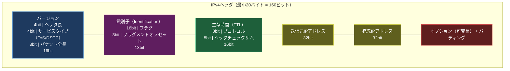
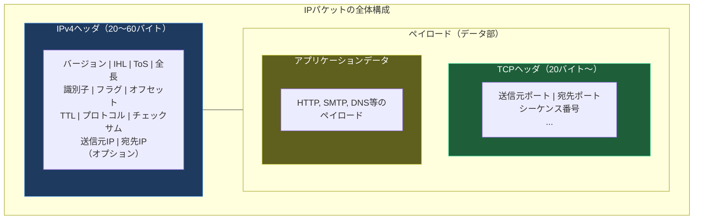

import { Aside } from '@astrojs/starlight/components';

## この節で学ぶこと

IPv4ヘッダは，IPパケットの先頭に付加される制御情報です．送信元・宛先アドレス，パケット長，TTL，プロトコル番号など，パケットの転送に必要なすべての情報が含まれています．この節では，IPv4ヘッダの全フィールドの構造と役割を詳細に学びます．

## IPv4ヘッダの構造

IPv4ヘッダは最小20バイト（オプションなしの場合），最大60バイトの可変長構造です．以下に全フィールドの構成を示します．

### 各フィールドの詳細

バージョン（Version）- 4ビット

IPプロトコルのバージョンを示します．IPv4の場合は「4」が設定されます．受信側はこのフィールドでIPv4かIPv6かを判別します．

ヘッダ長（IHL: Internet Header Length）- 4ビット

IPv4ヘッダの長さを4バイト単位で表します．オプションなしの場合は「5」（= 20バイト），オプションありの場合は最大「15」（= 60バイト）です．

サービスタイプ（ToS / DSCP + ECN）- 8ビット

パケットのサービス品質（QoS）を指定するフィールドです．

- 旧ToS: 優先度（3ビット），遅延（1ビット），スループット（1ビット），信頼性（1ビット），コスト（1ビット），予約（1ビット）
- 現行DSCP+ECN: DSCP（Differentiated Services Code Point，6ビット）+ ECN（Explicit Congestion Notification，2ビット）

パケット全長（Total Length）- 16ビット

IPヘッダとデータ部を合わせたパケット全体のバイト数です．最大値は65,535バイトですが，実際にはデータリンクのMTUに制約されます．

識別子（Identification）- 16ビット

パケットを一意に識別するための値です．フラグメンテーションされたパケットの再構築時に，同じ識別子を持つフラグメントを元のパケットとしてグループ化します．

フラグ（Flags）- 3ビット

- 予約ビット（ビット0）: 常に0
- DF（Don't Fragment，ビット1）: 1の場合，パケットの分割を禁止
- MF（More Fragments，ビット2）: 1の場合，後続のフラグメントが存在

フラグメントオフセット（Fragment Offset）- 13ビット

元のパケット内でのこのフラグメントの位置を，8バイト単位で示します．最初のフラグメントは0です．

生存時間（TTL: Time To Live）- 8ビット

パケットがネットワーク上で存在できる残り「寿命」を示します．ルーターを通過するたびに1ずつ減算され，0になるとパケットは破棄されます．これにより，ルーティングループが発生してもパケットが永遠にネットワーク上を循環し続けることを防ぎます．

一般的な初期値:
- Linux: 64
- Windows: 128
- Cisco IOS: 255

プロトコル（Protocol）- 8ビット

IPペイロードに格納されている上位層プロトコルを識別します．

| プロトコル番号 | プロトコル名 |
|-------------|------------|
| 1 | ICMP |
| 6 | TCP |
| 17 | UDP |
| 41 | IPv6（トンネリング） |
| 47 | GRE |
| 50 | ESP（IPsec） |
| 89 | OSPF |

ヘッダチェックサム（Header Checksum）- 16ビット

IPヘッダの整合性を検証するための値です．ヘッダのみを対象とし，データ部は含みません．TTLが各ルーターで変更されるため，チェックサムもホップごとに再計算されます．

送信元IPアドレス（Source Address）- 32ビット

パケットの送信元のIPアドレスです．通常はパケットが転送されても変更されません（NATを使用する場合を除く）．

宛先IPアドレス（Destination Address）- 32ビット

パケットの宛先のIPアドレスです．ルーターはこのフィールドを参照してルーティングを行います．

オプション（Options）- 可変長

必須ではないオプション機能を提供します．実際にはほとんど使用されません．

- Record Route: パケットが通過したルーターのIPアドレスを記録
- Timestamp: パケットが通過した時刻を記録
- Loose Source Routing: パケットが経由すべきルーターを指定（一部省略可）
- Strict Source Routing: パケットが経由すべき全ルーターを厳密に指定

パディング（Padding）

オプションフィールドを使用した場合に，ヘッダ長を32ビットの整数倍に揃えるために0で埋めます．

<Aside type="tip" title="FDE実務での活用">
パケットキャプチャでのIPv4ヘッダ解析は，ネットワークトラブルシューティングの基本スキルです．tcpdumpやWiresharkを使ったヘッダ解析のポイント:

- TTL値の確認: 送信元OSの推定（Linux=64，Windows=128），予想外に小さいTTL値はルーティングループの兆候
- DFビットの確認: Path MTU Discoveryが正常に動作しているかの確認
- プロトコル番号: 想定外のプロトコル通信の検出（セキュリティ監視）
- フラグメントの確認: MFビットとオフセット値からフラグメンテーションの発生状況を把握
- DSCP値: QoSポリシーが正しく適用されているかの確認

例えば `tcpdump -nn -v -i eth0 host 10.0.0.1` のようなコマンドで，特定ホストとの通信におけるIPヘッダの詳細を確認できます．AI推論サービスのレイテンシ問題を調査する際，TTL値やフラグメンテーションの有無をチェックすることで，ネットワーク経路の問題を特定できます．
</Aside>

## まとめ

- IPv4ヘッダは最小20バイト，最大60バイトの可変長構造
- バージョン，ヘッダ長，パケット全長でパケットの基本構造を定義
- 識別子，フラグ，フラグメントオフセットはフラグメンテーションに使用
- TTLはパケットの寿命を制御し，ルーティングループの防止に寄与
- プロトコル番号は上位層プロトコル（TCP，UDP，ICMPなど）を識別
- ヘッダチェックサムはIPヘッダの整合性を検証（ホップごとに再計算）
- 送信元・宛先IPアドレスがエンドツーエンドの通信相手を識別

## 理解度チェック

Q1: TTL（Time To Live）フィールドの役割と，0になった場合の動作を説明してください．

TTLはパケットのネットワーク上での寿命を示す8ビットのフィールドです．ルーターがパケットを転送するたびにTTL値を1減算します．TTLが0になると，ルーターはそのパケットを破棄し，送信元にICMP Time Exceeded（Type 11）メッセージを返します．この仕組みにより，ルーティングテーブルの設定ミスなどで発生するルーティングループに陥ったパケットが，ネットワーク上を永遠に循環し続けることを防ぎます．tracerouteコマンドは，TTLを1から順に増やしてICMP Time Exceededメッセージを受信することで，経路上のルーターを特定します．

Q2: プロトコルフィールドの値が6の場合と17の場合，それぞれどのプロトコルを示しますか？

プロトコル番号6はTCP（Transmission Control Protocol），17はUDP（User Datagram Protocol）を示します．受信側のIPモジュールは，このフィールドの値に基づいて，IPペイロードを適切な上位層プロトコルに引き渡します．

Q3: ヘッダチェックサムがヘッダのみを対象とし，データ部を含まない理由は何ですか？

データ部の整合性検証はTCPやUDPなどの上位層プロトコルが行うため，IP層ではヘッダの整合性のみを検証すれば十分です．また，TTLフィールドがホップごとに変更されるため，チェックサムもホップごとに再計算する必要があります．データ部まで含めると再計算のコストが増大し，ルーターの転送性能に悪影響を与えます．この設計は，層ごとの責務分離の原則に従っています．

Q4: IHL（Internet Header Length）フィールドの値が「5」の場合，ヘッダの実際のバイト数はいくつですか？

IHLフィールドは4バイト単位でヘッダ長を表すため，値が5の場合，実際のヘッダ長は 5 x 4 = 20バイトです．これはオプションなしの標準的なIPv4ヘッダサイズに相当します．IHLの最大値は15（= 60バイト）で，これはオプションフィールドを最大限に使用した場合のヘッダサイズです．

