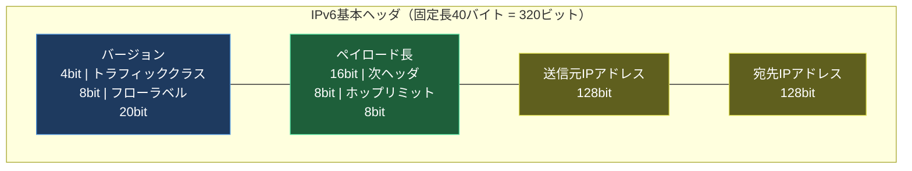
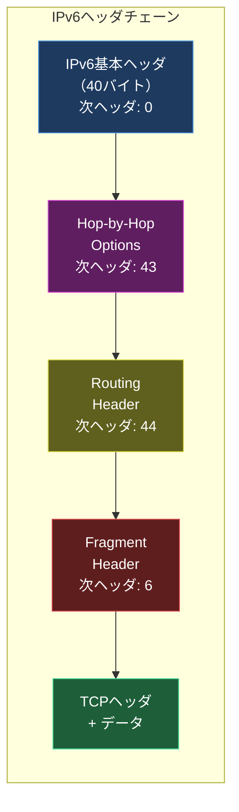

import { Aside } from '@astrojs/starlight/components';

## この節で学ぶこと

IPv6ヘッダはIPv4ヘッダと比較して大幅に簡素化されており，固定長40バイトのシンプルな構造を持ちます．この節では，IPv6基本ヘッダの各フィールドと，必要に応じて追加される拡張ヘッダの仕組みを学びます．

## IPv6基本ヘッダの構造

IPv6の基本ヘッダは固定長40バイト（320ビット）です．IPv4ヘッダから不要なフィールドが削除され，ルーターでの処理効率が大幅に向上しています．

### 各フィールドの詳細

バージョン（Version）- 4ビット

IPプロトコルのバージョンを示します．IPv6の場合は「6」が設定されます．

トラフィッククラス（Traffic Class）- 8ビット

IPv4のToS/DSCPフィールドに相当し，パケットの優先度やサービス品質（QoS）を指定します．DSCP（6ビット）とECN（2ビット）に分かれます．

フローラベル（Flow Label）- 20ビット

IPv6で新たに導入されたフィールドです．同一のフロー（送信元・宛先・アプリケーションの組み合わせ）に属するパケットを識別するために使用します．ルーターはこのフローラベルを参照することで，パケットごとにヘッダの詳細を解析することなく，同じフローのパケットを同一経路で高速に転送できます．

ペイロード長（Payload Length）- 16ビット

IPv6ヘッダに続くペイロード（拡張ヘッダ + データ）のバイト数です．IPv4のパケット全長とは異なり，基本ヘッダ（40バイト）は含みません．最大値は65,535バイトですが，ジャンボペイロードオプション（拡張ヘッダ）を使用すると，これを超えるサイズも可能です．

次ヘッダ（Next Header）- 8ビット

IPv6基本ヘッダの直後に続くヘッダの種類を示します．IPv4のプロトコルフィールドに相当しますが，拡張ヘッダの連結にも使用される点が異なります．

| 値 | 次ヘッダの種類 |
|----|-------------|
| 0 | Hop-by-Hop Options |
| 6 | TCP |
| 17 | UDP |
| 43 | Routing |
| 44 | Fragment |
| 50 | ESP（IPsec） |
| 51 | AH（IPsec） |
| 58 | ICMPv6 |
| 59 | No Next Header |
| 60 | Destination Options |

ホップリミット（Hop Limit）- 8ビット

IPv4のTTLに相当するフィールドです．パケットが転送されるたびに1ずつ減算され，0になるとパケットは破棄されます．名称がTTLからHop Limitに変更されたのは，実際にはルーターの通過回数（ホップ数）で管理されるためです．

送信元IPアドレス（Source Address）- 128ビット

パケットの送信元のIPv6アドレスです．

宛先IPアドレス（Destination Address）- 128ビット

パケットの最終的な宛先のIPv6アドレスです．ルーティングヘッダ（拡張ヘッダ）が使用される場合は，中間宛先のアドレスが設定されることがあります．

### IPv4ヘッダとの比較

IPv6ヘッダではIPv4から以下のフィールドが削除されました:

| IPv4フィールド | IPv6での扱い |
|-------------|------------|
| ヘッダ長（IHL） | 固定長のため不要 |
| 識別子，フラグ，オフセット | フラグメントヘッダ（拡張ヘッダ）に移動 |
| ヘッダチェックサム | 削除（上位層・下位層で検証） |
| オプション | 拡張ヘッダに移動 |

チェックサムの削除は大きな変更点です．IPv4ではTTLがホップごとに変化するため，チェックサムの再計算が必要でしたが，IPv6ではこのオーバーヘッドが排除されました．データの整合性検証はデータリンク層（イーサネットのFCSなど）とトランスポート層（TCPチェックサム）に委ねられています．

## 4.8.1 IPv6拡張ヘッダ

IPv6では，オプション機能を拡張ヘッダとして基本ヘッダの後に連結する方式を採用しています．各拡張ヘッダは「次ヘッダ」フィールドを持ち，チェーン（連鎖）のように連結されます．

### 主な拡張ヘッダ

Hop-by-Hop Options（ホップバイホップオプション）

経路上のすべてのルーターが処理する必要があるオプションです．基本ヘッダの直後に配置する必要があります．ジャンボペイロードオプション（65,535バイトを超えるパケットの送信）やルーターアラート（ルーターに特別な処理を要求）に使用されます．

Routing Header（ルーティングヘッダ）

パケットが通過すべき中継ノードのリストを指定します．IPv4のソースルーティングオプションに相当しますが，セキュリティ上の理由からType 0ルーティングヘッダは廃止されています．

Fragment Header（フラグメントヘッダ）

フラグメンテーションに関する情報を格納します．IPv4ではフラグメンテーション関連のフィールドが基本ヘッダに含まれていましたが，IPv6ではフラグメンテーションが発生する場合にのみ拡張ヘッダとして追加されます．

| フィールド | ビット数 | 説明 |
|-----------|---------|------|
| 次ヘッダ | 8 | フラグメントヘッダの後に続くヘッダ |
| 予約 | 8 | 0で埋める |
| フラグメントオフセット | 13 | 8バイト単位のオフセット |
| 予約 | 2 | 0で埋める |
| Mフラグ | 1 | 後続のフラグメントの有無 |
| 識別子 | 32 | フラグメントの識別（IPv4の16ビットから拡大） |

Destination Options（宛先オプション）

宛先ホストのみが処理するオプションです．ルーティングヘッダの前に配置すると中継ノードも処理し，最後に配置すると最終宛先のみが処理します．

Authentication Header（AH）/ Encapsulating Security Payload（ESP）

IPsecで使用されるセキュリティ関連の拡張ヘッダです．AHはパケットの認証と整合性を提供し，ESPは暗号化に加えて認証と整合性も提供します．

### 拡張ヘッダの推奨配置順序

RFC 8200では，拡張ヘッダを以下の順序で配置することが推奨されています:

1. IPv6基本ヘッダ
2. Hop-by-Hop Options
3. Destination Options（中継ノード向け）
4. Routing Header
5. Fragment Header
6. Authentication Header
7. Encapsulating Security Payload
8. Destination Options（最終宛先向け）
9. 上位層ヘッダ（TCP，UDPなど）

### 拡張ヘッダ方式の利点

IPv4のオプション方式と比較した拡張ヘッダ方式の利点は以下の通りです:

- ルーターの処理効率向上: Hop-by-Hopオプション以外の拡張ヘッダはルーターが処理する必要がなく，高速な転送が可能
- 柔軟性: 新しい拡張ヘッダを定義することで，プロトコルを容易に拡張可能
- 効率性: 必要な場合にのみ拡張ヘッダを追加するため，通常のパケットではオーバーヘッドが発生しない

<Aside type="tip" title="FDE実務での活用">
IPv6ヘッダの簡素化は，ルーティングの高速化に直接貢献しています．

IPv4では，可変長ヘッダの解析，ヘッダチェックサムの再計算，フラグメンテーションの処理がホップごとに必要でしたが，IPv6では:

- 固定長40バイトのヘッダ → パーサーの実装がシンプルになり，ハードウェア（ASIC/FPGA）での高速処理が容易
- チェックサムの廃止 → ホップごとの再計算が不要
- フラグメンテーションの送信元限定 → ルーターでの分割処理が不要
- フローラベル → パケットごとのヘッダ解析なしに，フロー単位での高速転送が可能

これらの改善により，次世代のネットワーク機器はIPv6パケットをより効率的に処理できます．高トラフィック環境でのAI推論サービスやリアルタイムストリーミングでは，この転送効率の向上が低レイテンシの実現に貢献します．また，拡張ヘッダのチェーン構造により，IPsec（ESP/AH）を柔軟に組み込めるため，エンドツーエンドのセキュア通信をオーバーヘッド少なく実装できます．
</Aside>

## まとめ

- IPv6基本ヘッダは固定長40バイトで，IPv4ヘッダより簡素化されている
- フローラベルフィールドにより，パケット詳細を解析せずにフロー単位の高速転送が可能
- ヘッダチェックサムが廃止され，ルーターのホップごとの再計算オーバーヘッドが排除された
- オプション機能は拡張ヘッダとしてチェーン式に連結され，必要な場合にのみ追加される
- 拡張ヘッダには，Hop-by-Hop，Routing，Fragment，AH，ESPなどがある
- フラグメンテーション関連フィールドは拡張ヘッダに移動し，ルーターの処理負荷を軽減

## 理解度チェック

Q1: IPv6ヘッダからヘッダチェックサムが削除された理由を説明してください．

IPv4ではTTL（IPv6ではホップリミット）がホップごとに変化するため，ヘッダチェックサムもホップごとに再計算する必要がありました．この再計算はルーターの処理オーバーヘッドとなります．IPv6ではチェックサムを削除し，データの整合性検証をデータリンク層（イーサネットのFCSなど）とトランスポート層（TCPやUDPのチェックサム）に委ねることで，ルーターの転送効率を向上させました．なお，IPv6ではUDPのチェックサムが必須となっています（IPv4では任意）．

Q2: フローラベルフィールドはどのような場面で活用されますか？

フローラベルは，同一の送信元・宛先・アプリケーションの組み合わせ（フロー）に属するパケットに同じ値を設定することで，ルーターがパケットの詳細なヘッダ解析をせずにフロー単位での転送判断を行えるようにするフィールドです．これにより，リアルタイム通信（VoIP，ビデオストリーミング）やQoS制御において，同一フローのパケットを同じ経路で転送し，順序の入れ替わりやジッターを抑制できます．

Q3: 拡張ヘッダのうち，経路上のすべてのルーターが処理する必要があるものはどれですか？

Hop-by-Hop Options（ホップバイホップオプション）ヘッダです．このヘッダは基本ヘッダの直後に配置する必要があり，経路上のすべてのルーターが検査・処理します．それ以外の拡張ヘッダ（Routing，Fragment，Destination Optionsなど）は，基本的に宛先ホストのみが処理し，中間ルーターは基本ヘッダの情報だけで転送判断を行います．

Q4: IPv6のフラグメントヘッダの識別子フィールドが，IPv4の16ビットから32ビットに拡大された理由は何ですか？

IPv4の16ビットの識別子では，高速なネットワークにおいて識別子の値が短時間で一巡してしまい，異なるパケットのフラグメントが同じ識別子を持つ可能性がありました．IPv6では128ビットアドレスによりアドレス空間が広大になるとともに，32ビットの識別子により，識別子の衝突（ラップアラウンド）のリスクを大幅に低減しています．これにより，フラグメントの再構築時に異なるパケットのフラグメントを誤って結合する問題を防ぎます．

