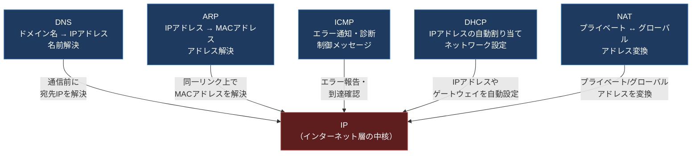
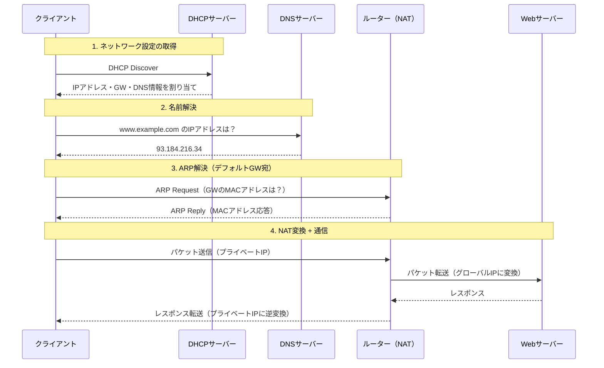
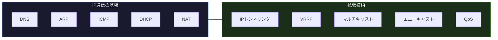

import { Aside } from '@astrojs/starlight/components';

## この節で学ぶこと

IPはインターネット層の中核プロトコルですが，IP単体では実際の通信を実現できません．
名前解決（DNS），アドレス解決（ARP），エラー通知（ICMP），自動設定（DHCP），アドレス変換（NAT）など，IPを補助するプロトコル群が不可欠です．
本節では，これらの補助プロトコルがIPをどのように支えているかの全体像を把握します．

## IPだけでは足りない理由

IPプロトコルは「送信元IPアドレスから宛先IPアドレスへパケットを届ける」というシンプルな仕組みを提供します．しかし，実際の通信を行うには以下のような課題が存在します:

- 人間はIPアドレス（例: 203.0.113.10）を覚えにくい → 名前解決が必要
- IPアドレスは論理アドレスであり，物理的なMACアドレスへの変換が必要 → アドレス解決が必要
- パケット到達不能やTTL超過などのエラー通知手段がIPにはない → 制御メッセージが必要
- 各ホストにIPアドレスを手動で設定するのは非現実的 → 自動設定が必要
- プライベートIPアドレスとグローバルIPアドレスの変換が必要 → アドレス変換が必要

これらの課題を解決するために，IP通信を補助するさまざまなプロトコルが開発されました．

## IPと補助プロトコルの全体関係

以下の図は，IPを中心として各補助プロトコルがどのように関わっているかを示しています．

## 各補助プロトコルの役割

### DNS（Domain Name System）

人間が覚えやすいドメイン名（例: `www.example.com`）をIPアドレス（例: `93.184.216.34`）に変換します．インターネット上の分散データベースとして機能し，通信を開始する前の名前解決を担います．

### ARP（Address Resolution Protocol）

IPアドレスから同一データリンク上のMACアドレスを解決します．IPパケットをイーサネットフレームに格納して送信する際に不可欠なプロトコルです．

### ICMP（Internet Control Message Protocol）

パケット配送中のエラーや異常を送信元に通知します．`ping` や `traceroute` といったネットワーク診断ツールもICMPを利用しています．

### DHCP（Dynamic Host Configuration Protocol）

ホストに対してIPアドレス，サブネットマスク，デフォルトゲートウェイ，DNSサーバーアドレスなどのネットワーク設定を自動的に割り当てます．

### NAT（Network Address Translator）

プライベートIPアドレスとグローバルIPアドレスの間で変換を行います．IPv4アドレスの枯渇対策として広く利用されています．

## 通信時のプロトコル連携フロー

Webサイトにアクセスする際，これらの補助プロトコルがどのように連携するかを示します．

この例のように，ユーザーがWebブラウザにURLを入力しただけの単純な操作の裏側で，DHCP → DNS → ARP → NAT という複数のプロトコルが順番に連携して動作しています．

## IPトンネリングとその他の技術

IP通信を支える技術はこれだけではありません．異なるネットワーク間を仮想的に接続するIPトンネリングや，冗長化のためのVRRP，効率的な配信のためのマルチキャスト・エニーキャストなど，さまざまな関連技術が存在します．これらについても本章で順次学んでいきます．

<Aside type="tip" title="FDE実務での活用">
FDEとしてAIサービスをデプロイする際，IP通信の全体像を把握していることは非常に重要です．例えば「モデル推論APIへのリクエストがタイムアウトする」という障害が発生した場合，DNS解決の遅延なのか，ARP解決の問題なのか，NAT変換テーブルの枯渇なのか，ICMPで到達不能が返ってきているのかなど，層ごとに切り分けて調査できます．補助プロトコルの全体像を理解していれば，問題の切り分けが格段に速くなります．
</Aside>

## まとめ

- IPプロトコル単体では，名前解決やアドレス解決，エラー通知，自動設定，アドレス変換ができない
- DNS，ARP，ICMP，DHCP，NATなどの補助プロトコルがIPを支えている
- Webアクセスのような単純な操作でも，DHCP → DNS → ARP → NAT と複数のプロトコルが連携する
- さらにIPトンネリング，VRRP，マルチキャストなどの拡張技術もIP通信を支えている
- 障害調査では，各補助プロトコルの役割を理解した上で層ごとの切り分けが重要

## 理解度チェック

Q1: IPだけでは通信できない理由を3つ挙げてください．

1. 人間が覚えやすいドメイン名からIPアドレスへの名前解決ができない（DNSが必要）
2. IPアドレスから物理的なMACアドレスへの変換ができない（ARPが必要）
3. パケット配送中のエラーや異常を送信元に通知する仕組みがない（ICMPが必要）

他にも，IPアドレスの自動割り当て（DHCP）やアドレス変換（NAT）なども挙げられます．

Q2: WebブラウザでURLを入力してページが表示されるまでに，どのような補助プロトコルが順に動作しますか？

1. DHCP: クライアントがネットワーク接続時にIPアドレスやDNSサーバー情報を自動取得
2. DNS: 入力したドメイン名をIPアドレスに変換
3. ARP: デフォルトゲートウェイのMACアドレスを解決
4. NAT: ルーターがプライベートIPをグローバルIPに変換して外部と通信

これらが順番に連携することで，ユーザーはIPアドレスを意識することなくWebサイトにアクセスできます．

Q3: ICMPはどのような場面で利用されますか？具体的なツールを2つ挙げてください．

ICMPはパケット配送中のエラーや異常を送信元に通知するために利用されます．代表的なツールは以下の2つです:

1. ping: ICMPのEcho RequestとEcho Replyを使い，宛先ホストへの到達性とRTT（往復遅延時間）を確認する
2. traceroute: TTLを段階的に増やしながらICMPのTime Exceededメッセージを利用して，宛先までの経路（経由するルーター）を調査する

Q4: NATが必要とされる主な理由は何ですか？

NATが必要とされる主な理由は，IPv4アドレスの枯渇です．IPv4アドレスは約43億個しかなく，世界中のすべてのデバイスにグローバルIPアドレスを割り当てることは不可能です．NATを使うことで，組織内ではプライベートIPアドレスを利用し，インターネットとの通信時にグローバルIPアドレスに変換することで，限られたグローバルIPアドレスを効率的に共有できます．

