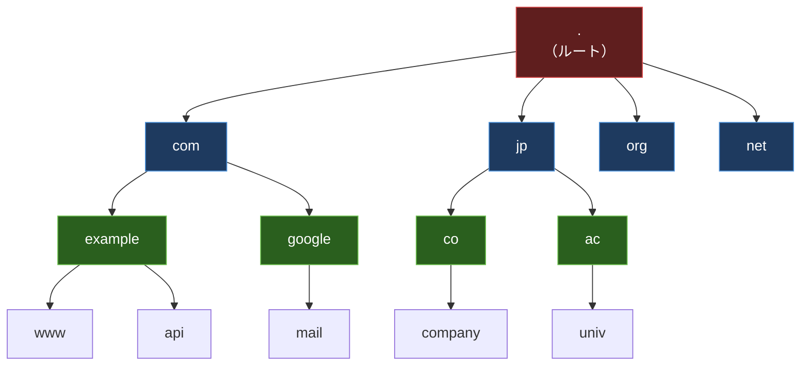
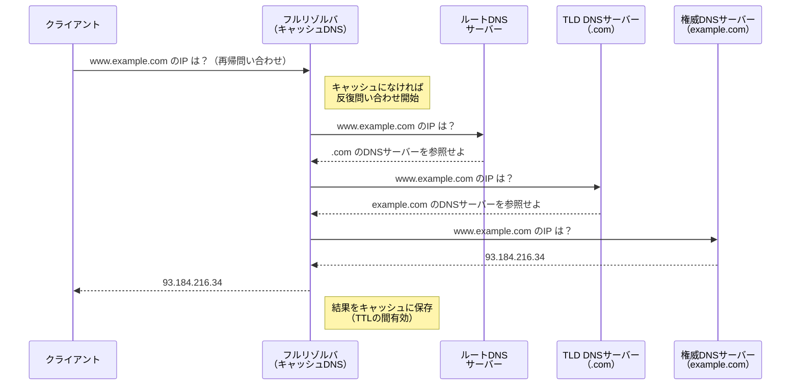
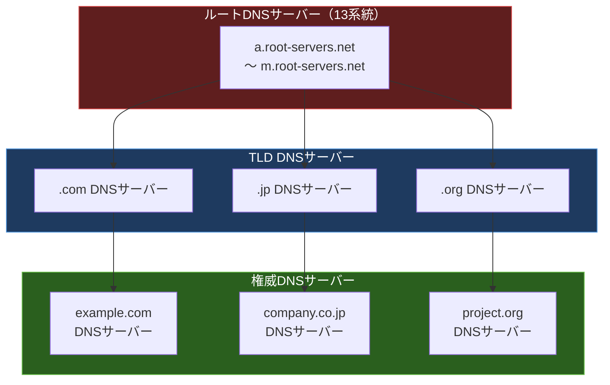

import { Aside } from '@astrojs/starlight/components';

## この節で学ぶこと

DNS（Domain Name System）は，人間が覚えやすいドメイン名とIPアドレスを対応づける名前解決システムです．
DNSの階層構造と分散データベースの仕組み，再帰問い合わせと反復問い合わせの違いを理解します．
さらに，DNSレコードの種類やキャッシュの仕組みについても学びます．

## 5.2.1 IPアドレスを覚えるのはたいへん

TCP/IPの通信では，宛先を指定するためにIPアドレスを使用します．IPv4のIPアドレスは `203.0.113.10` のような32ビットの数値であり，IPv6では `2001:0db8:85a3::8a2e:0370:7334` のように128ビットとさらに長くなります．

人間がこれらの数値を記憶してすべての通信先を指定するのは非常に困難です．電話番号を覚えるのが大変なのと同じように，IPアドレスを直接扱うのは現実的ではありません．そこで，人間が覚えやすい「名前」でコンピュータを指定し，それを自動的にIPアドレスに変換する仕組みが必要になりました．

初期のインターネットでは，`hosts` ファイルにホスト名とIPアドレスの対応を記述する方法が使われていました．しかし，インターネットの規模が拡大するにつれ，単一のファイルですべてのホスト情報を管理することは不可能になりました．

## 5.2.2 DNSの登場

1983年にPaul MockapetrisがRFC 882, 883（後にRFC 1034, 1035に改訂）でDNSを提案しました．DNSは以下の特徴を持ちます:

- 階層的な名前空間: ドメイン名はツリー構造で管理される
- 分散データベース: 各ドメインの情報は担当する権威DNSサーバーが管理する
- キャッシュ機構: 一度解決した結果を一定期間保持し，問い合わせ回数を削減する
- 冗長性: 各ゾーンに複数のDNSサーバーを配置して可用性を確保する

DNSはインターネットの基盤サービスの一つであり，Webアクセス，メール送受信，API通信など，ほぼすべてのインターネット通信でDNSによる名前解決が行われています．

## 5.2.3 ドメイン名の構造

ドメイン名は，ピリオド（`.`）で区切られた階層構造を持ちます．右側が上位，左側が下位のドメインです．

ドメイン名の各構成要素:

- ルートドメイン（`.`）: ドメイン名ツリーの頂点．通常は省略される
- トップレベルドメイン（TLD）: `com`, `jp`, `org`, `net` など．gTLD（汎用TLD）とccTLD（国別TLD）に分類される
- セカンドレベルドメイン: TLDの直下のドメイン．`example.com` の `example` 部分
- サブドメイン: さらに下位のドメイン．`www.example.com` の `www` 部分

FQDN（Fully Qualified Domain Name: 完全修飾ドメイン名）は，ルートドメインまで含めた完全なドメイン名です．例えば `www.example.com.` がFQDNであり，末尾のピリオドがルートドメインを表します．

## 5.2.4 DNSによる問い合わせ

DNSの問い合わせには，再帰問い合わせ（recursive query）と反復問い合わせ（iterative query）の2つの方式があります．

### 再帰問い合わせと反復問い合わせの流れ

- 再帰問い合わせ: クライアントがフルリゾルバ（キャッシュDNSサーバー）に対して行う問い合わせ．クライアントは最終的な回答を受け取るまで待つ
- 反復問い合わせ: フルリゾルバがルートDNSサーバーから順に各権威DNSサーバーに対して行う問い合わせ．次に問い合わせるべきDNSサーバーの参照情報（リファラル）を受け取る

### 主なDNSレコードの種類

| レコードタイプ | 用途 | 例 |
|---|---|---|
| A | ドメイン名 → IPv4アドレス | `www.example.com → 93.184.216.34` |
| AAAA | ドメイン名 → IPv6アドレス | `www.example.com → 2606:2800:220:1::` |
| CNAME | ドメイン名のエイリアス（別名） | `blog.example.com → www.example.com` |
| MX | メールサーバーの指定 | `example.com → mail.example.com` |
| NS | ゾーンの権威DNSサーバー | `example.com → ns1.example.com` |
| PTR | IPアドレス → ドメイン名（逆引き） | `93.184.216.34 → www.example.com` |
| TXT | テキスト情報（SPF，DKIMなど） | SPFレコード，ドメイン認証 |
| SOA | ゾーンの管理情報 | シリアル番号，更新間隔など |

### TTL（Time To Live）とキャッシュ

DNSレコードにはTTL（生存時間）が設定されています．フルリゾルバはDNS応答をTTLの期間キャッシュし，同じドメイン名への問い合わせに対してキャッシュから応答します．これにより:

- 権威DNSサーバーへの問い合わせ回数が削減される
- 名前解決のレスポンス時間が短縮される
- ネットワーク全体の負荷が軽減される

ただし，TTLが長すぎるとDNSレコードの変更が反映されるまでに時間がかかり，短すぎると権威DNSサーバーへの問い合わせが増加するというトレードオフがあります．

## 5.2.5 DNSはインターネットに広がる分散データベース

DNSは単一の巨大なデータベースではなく，インターネット全体に分散配置された階層的なデータベースです．

分散データベースとしてのDNSの特徴:

- ゾーン委任: 上位ドメインのDNSサーバーが下位ドメインの管理を委任する
- ルートDNSサーバー: 世界に13系統（a〜m）のルートDNSサーバーが存在し，エニーキャストで多数のサーバーに分散
- 各組織が自分のドメインのDNS情報を独立に管理できる
- 障害の局所化: 1つのDNSサーバーが故障しても，他のドメインの名前解決には影響しない

### DNSの信頼性を高める技術

- DNSSEC（DNS Security Extensions）: DNSレスポンスに電子署名を付与し，応答の改ざんを検知する
- DNS over HTTPS（DoH）: DNS問い合わせをHTTPS通信で暗号化し，盗聴や改ざんを防止する
- DNS over TLS（DoT）: DNS問い合わせをTLSで暗号化する

### トラブルシューティング: DNS解決失敗時の調査手順

DNS関連の問題が発生した場合，以下の手順で調査を行います:

1. `dig` コマンドでDNS問い合わせを確認:
   - `dig www.example.com` — Aレコードの問い合わせ
   - `dig www.example.com AAAA` — AAAAレコードの問い合わせ
   - `dig www.example.com +trace` — ルートから順に問い合わせ経路を追跡
2. `nslookup` コマンドで簡易確認:
   - `nslookup www.example.com` — デフォルトDNSサーバーで名前解決
   - `nslookup www.example.com 8.8.8.8` — 指定したDNSサーバーで名前解決
3. DNSサーバーの設定確認:
   - `/etc/resolv.conf`（Linux/macOS）の設定を確認
   - `ipconfig /all`（Windows）でDNSサーバーアドレスを確認
4. キャッシュのクリア:
   - `sudo systemd-resolve --flush-caches`（Linux）
   - `sudo dscacheutil -flushcache`（macOS）
   - `ipconfig /flushdns`（Windows）

<Aside type="tip" title="FDE実務での活用">
AI APIエンドポイントにカスタムドメインを設定する場合，DNSの知識が不可欠です．例えば `api.mycompany.com` をAI推論サービスのロードバランサーに向けるには，CNAMEレコードやAレコードの設定が必要です．TTLを短く設定すればフェイルオーバー時の切り替えが速くなりますが，DNS問い合わせの増加によるレイテンシへの影響も考慮する必要があります．また，マルチリージョンで展開する場合は，Route 53のようなDNSベースのジオロケーションルーティングを活用して，ユーザーに最も近いリージョンのエンドポイントへ誘導することも重要なテクニックです．
</Aside>

## まとめ

- DNSは人間が覚えやすいドメイン名をIPアドレスに変換する名前解決システムである
- ドメイン名はルートを頂点とする階層構造（ツリー構造）を持つ
- DNSの問い合わせは，再帰問い合わせ（クライアント→リゾルバ）と反復問い合わせ（リゾルバ→各権威DNS）の2段階で行われる
- DNSはインターネット全体に分散配置された階層的データベースであり，各組織が独立して管理できる
- TTLによるキャッシュ機構でDNSの効率性と応答速度を向上させている
- DNSSEC，DoH，DoTなどのセキュリティ技術でDNSの安全性を強化している

## 理解度チェック

Q1: DNSが登場する前，ホスト名とIPアドレスの対応はどのように管理されていましたか？

DNSが登場する前は，`hosts` ファイル（UNIXでは `/etc/hosts`）にホスト名とIPアドレスの対応を記述して管理していました．しかし，インターネットの拡大に伴いホスト数が増加し，単一のファイルでの管理は更新の頻度や配布の問題から限界に達しました．

Q2: 再帰問い合わせと反復問い合わせの違いを説明してください．

- 再帰問い合わせ: クライアントがフルリゾルバ（キャッシュDNSサーバー）に対して行い，最終的な回答（IPアドレス）が返ってくるまで待つ方式です．クライアントは1回の問い合わせで結果を得られます．
- 反復問い合わせ: フルリゾルバがルートDNSサーバー，TLD DNSサーバー，権威DNSサーバーに対して順番に行う方式です．各サーバーは「次に問い合わせるべきDNSサーバー」の情報（リファラル）を返し，リゾルバが段階的に解決を進めます．

Q3: FQDN（完全修飾ドメイン名）とは何ですか？例を挙げて説明してください．

FQDNはルートドメインまで含めた完全なドメイン名のことです．例えば `www.example.com.` がFQDNであり，末尾のピリオドがルートドメインを表します．通常のブラウザ入力では末尾のピリオドは省略されますが，DNS設定ではFQDNの正確な指定が求められることがあります．

Q4: DNSレコードのTTLを長く設定した場合と短く設定した場合，それぞれのメリット・デメリットを説明してください．

TTLを長く設定した場合:
- メリット: キャッシュが長く保持されるため，権威DNSサーバーへの問い合わせ回数が減少し，名前解決が高速化する
- デメリット: DNSレコードを変更しても，TTLが切れるまで古い情報がキャッシュに残り，変更が反映されるまで時間がかかる

TTLを短く設定した場合:
- メリット: DNSレコードの変更が速やかに反映され，フェイルオーバーやサービス切り替えが迅速に行える
- デメリット: キャッシュの有効期間が短いため，権威DNSサーバーへの問い合わせが頻繁に発生し，負荷が増加する

Q5: DNSSECの役割を簡潔に説明してください．

DNSSECはDNS応答に電子署名を付与する仕組みです．これにより，DNSリゾルバは応答が正当な権威DNSサーバーからのものであり，途中で改ざんされていないことを検証できます．DNSキャッシュポイズニングなどの攻撃から名前解決を保護する役割を果たします．

