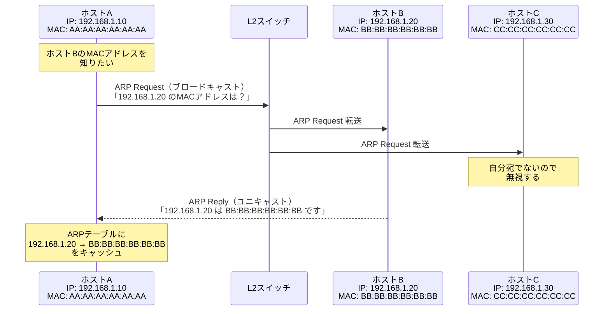
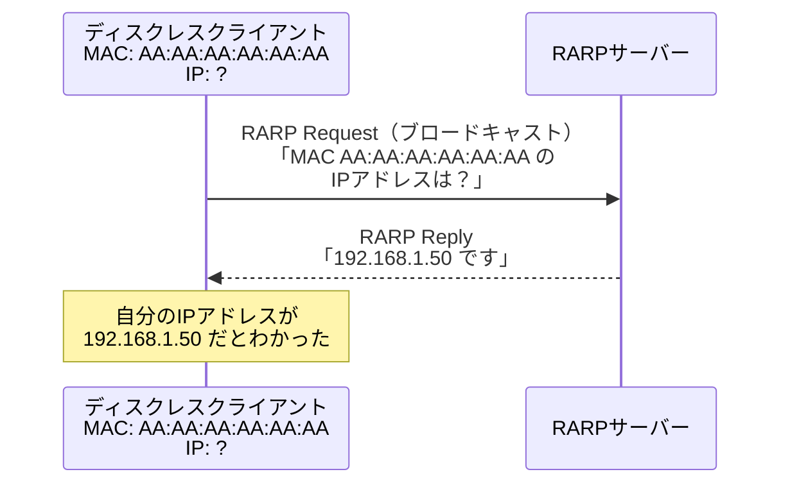
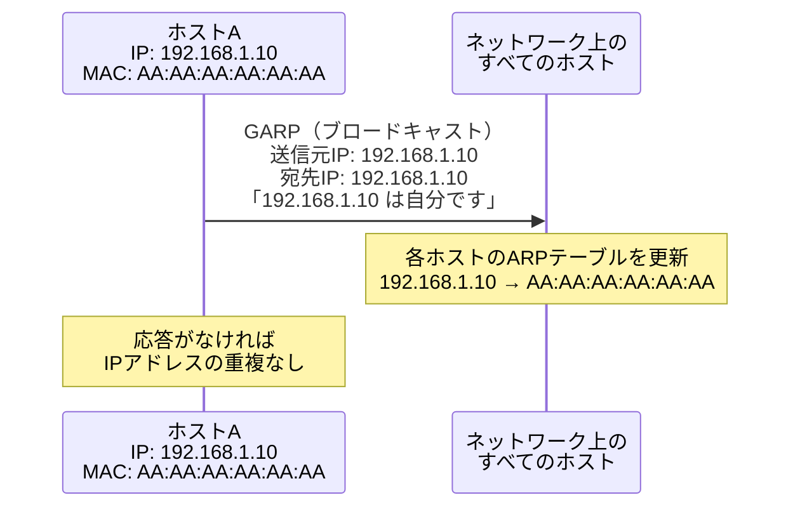

import { Aside } from '@astrojs/starlight/components';

## この節で学ぶこと

ARP（Address Resolution Protocol）は，IPアドレスから同一データリンク上のMACアドレスを解決するプロトコルです．
IPパケットをイーサネットフレームに格納して送信する際に不可欠な仕組みであり，ARPテーブルの管理やキャッシュの動作を理解します．
また，RARP，Gratuitous ARP（GARP），Proxy ARPなどの関連プロトコルについても学びます．

## 5.3.1 ARPの概要

TCP/IPネットワークにおいて，IPアドレスはネットワーク層（レイヤ3）の論理アドレスです．一方，実際にデータリンク上でフレームを送受信するためには，データリンク層（レイヤ2）のMACアドレスが必要です．

ARPは，宛先のIPアドレスから対応するMACアドレスを動的に取得するプロトコルです．RFC 826で定義されており，IPv4ネットワークで広く使用されています．

ARPが必要な場面:

- 同一サブネット内の通信: 宛先ホストのMACアドレスを取得
- 異なるサブネットへの通信: デフォルトゲートウェイ（ルーター）のMACアドレスを取得
- ルーターでのパケット転送: 次ホップルーターまたは最終宛先のMACアドレスを取得

## 5.3.2 ARPの仕組み

ARPは，ARP RequestとARP Replyの2種類のメッセージを使用します．

### ARPの動作手順

1. ホストAがホストB（192.168.1.20）に通信したい
2. ホストAのARPテーブルにホストBのMACアドレスがない
3. ホストAはARP Requestをブロードキャスト（宛先MAC: FF:FF:FF:FF:FF:FF）で送信
4. 同一サブネット上のすべてのホストがARP Requestを受信
5. 該当するIPアドレスを持つホストB だけがARP Replyをユニキャストで返信
6. ホストAはARP Replyを受信し，ARPテーブルに結果をキャッシュ
7. 以降の通信では，キャッシュされたMACアドレスを使用

### ARPテーブル（ARPキャッシュ）

ARPテーブルは，IPアドレスとMACアドレスの対応を保持するキャッシュです．各エントリにはタイムアウト値が設定されており，一定時間（通常は数分〜20分程度）経過すると自動的に削除されます．

ARPテーブルの確認コマンド:

- Linux/macOS: `arp -a` または `ip neigh show`
- Windows: `arp -a`

## 5.3.3 IPアドレスとMACアドレスは両方とも必要？

「IPアドレスだけで通信できないのか？」という疑問がよく生じます．しかし，以下の理由から両方のアドレスが必要です:

- IPアドレスは論理アドレス: ネットワークをまたいだエンドツーエンドの通信で宛先を特定する
- MACアドレスは物理アドレス: 同一データリンク上でフレームを正しい機器に届ける
- IPアドレスは変更可能: DHCPなどにより動的に割り当てられる
- MACアドレスは原則固定: ネットワークインタフェースカードに製造時に付与される

ルーターを経由する通信では，MACアドレスはホップごとに変更されますが，IPアドレスはエンドツーエンドで維持されます．この2層のアドレス体系により，柔軟で拡張性の高いネットワーク通信が実現されています．

## 5.3.4 RARP（Reverse Address Resolution Protocol）

RARPはARPの逆の機能を提供するプロトコルです．MACアドレスから対応するIPアドレスを取得します．

RARPは，ディスクレスワークステーション（ハードディスクを持たない端末）が起動時に自分のIPアドレスを知るために使われていました．現在ではDHCPやBOOTPに置き換えられており，ほとんど使用されていません．

## 5.3.5 Gratuitous ARP（GARP）

Gratuitous ARP（GARP）は，自分自身のIPアドレスに対するARP Requestです．通常のARPとは異なり，他のホストのMACアドレスを解決する目的ではなく，以下の用途で使用されます:

- IPアドレスの重複検出: 自分のIPアドレスに対するARP Requestを送信し，応答があればIPアドレスが重複していることがわかる
- ARPテーブルの更新: ネットワーク上の他のホストのARPテーブルを更新する．例えば，フェイルオーバー時に新しいMAC アドレスを通知する
- VRRPやHSRPでの利用: 仮想ルーターの切り替え時に，仮想IPアドレスに対応するMACアドレスの変更を通知する

## 5.3.6 代理ARP（Proxy ARP）

Proxy ARPは，ルーターが異なるサブネットにあるホストの代わりにARP Requestに応答する仕組みです．

Proxy ARPの動作:

1. ホストAが異なるサブネットのホストB宛にARP Requestを送信
2. ルーターがそのARP Requestを受信
3. ルーターはホストBへのルートを持っている場合，自分のMACアドレスでARP Replyを返す
4. ホストAはルーターのMACアドレスをホストBのMACアドレスとしてARPテーブルに登録
5. 以後，ホストAはルーター宛にフレームを送信し，ルーターがホストBへ転送する

Proxy ARPは，サブネットマスクの設定が不適切なホストや，サブネットを意識しない古い機器をネットワークに接続する際に利用されることがあります．ただし，セキュリティ上の懸念やARPテーブルの肥大化などの問題があるため，現在ではあまり推奨されていません．

### ARPスプーフィング（ARP Poisoning）への注意

ARPはセキュリティ機構を持たないプロトコルであるため，攻撃者が偽のARP Replyを送信してARPテーブルを汚染する「ARPスプーフィング」攻撃が可能です．対策として:

- Dynamic ARP Inspection（DAI）: L2スイッチでARPパケットの正当性を検証
- 静的ARPエントリ: 重要なホストのARPエントリを静的に設定
- 802.1Xポート認証: ネットワークアクセス時の認証を実施

<Aside type="tip" title="FDE実務での活用">
GPUクラスタでの分散学習環境では，ノード間の通信レイテンシが性能に直結します．ARP解決は初回通信時にブロードキャストが発生するため，大規模クラスタでは初回通信のレイテンシに影響する場合があります．ARPキャッシュのタイムアウト設定を適切に調整したり，静的ARPエントリを設定することで，ARP解決によるレイテンシを最小化できます．また，ARPテーブルの肥大化が問題になる場合は，サブネット設計の見直しも検討しましょう．
</Aside>

## まとめ

- ARPはIPアドレスからMACアドレスを解決するプロトコルで，イーサネット通信に不可欠
- ARP RequestはブロードキャストでARP Replyはユニキャストで送信される
- ARPテーブルに結果をキャッシュし，一定時間後に自動的に削除される
- IPアドレス（論理アドレス）とMACアドレス（物理アドレス）はそれぞれ異なる役割を持ち，両方必要
- RARPはMACからIPを解決するプロトコルだが，現在はDHCPに置き換えられている
- GARPはIPアドレスの重複検出やARPテーブルの更新に使用される
- Proxy ARPはルーターが他のサブネットのホストの代理でARP応答する仕組み

## 理解度チェック

Q1: ARPが必要な理由を説明してください．

IPパケットをイーサネットフレームに格納して送信するためには，宛先のMACアドレスが必要です．IPアドレスはネットワーク層の論理アドレスであり，データリンク層で実際にフレームを送受信するためにはMACアドレスが必要です．ARPは宛先のIPアドレスから対応するMACアドレスを動的に取得する役割を果たします．

Q2: ARP RequestとARP Replyの送信方式の違いを説明してください．

ARP Requestはブロードキャスト（宛先MAC: FF:FF:FF:FF:FF:FF）で送信されます．同一サブネット上のすべてのホストが受信します．一方，ARP Replyはユニキャストで，ARP Requestを送信した特定のホストに対してのみ返信されます．

Q3: Gratuitous ARP（GARP）の用途を2つ挙げてください．

1. IPアドレスの重複検出: 自分のIPアドレスに対するARP Requestを送信し，応答があればIPアドレスが重複していることを検知する
2. ARPテーブルの更新: フェイルオーバーやVRRP/HSRPの切り替え時に，仮想IPアドレスに対応する新しいMACアドレスを他のホストに通知し，ARPテーブルを更新させる

Q4: ARPスプーフィング攻撃とは何ですか？また，その対策を1つ挙げてください．

ARPスプーフィング（ARP Poisoning）とは，攻撃者が偽のARP Replyを送信して，他のホストのARPテーブルに不正なIPアドレスとMACアドレスの対応を登録させる攻撃です．これにより，通信を傍受（中間者攻撃）したり，通信を妨害したりできます．

対策としては，L2スイッチのDynamic ARP Inspection（DAI）を有効にすることで，DHCPスヌーピングテーブルに基づいてARPパケットの正当性を検証し，不正なARPパケットを破棄できます．

