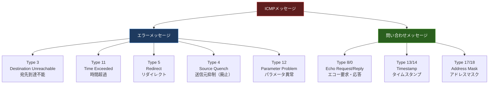
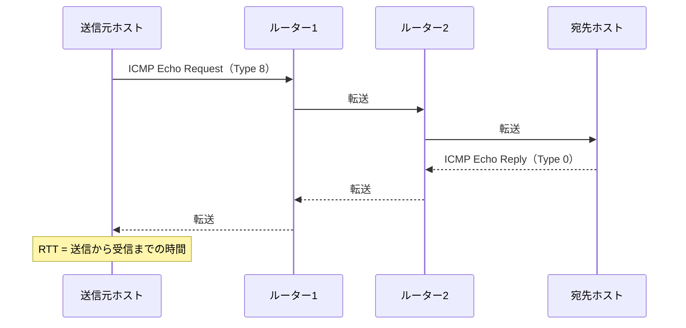
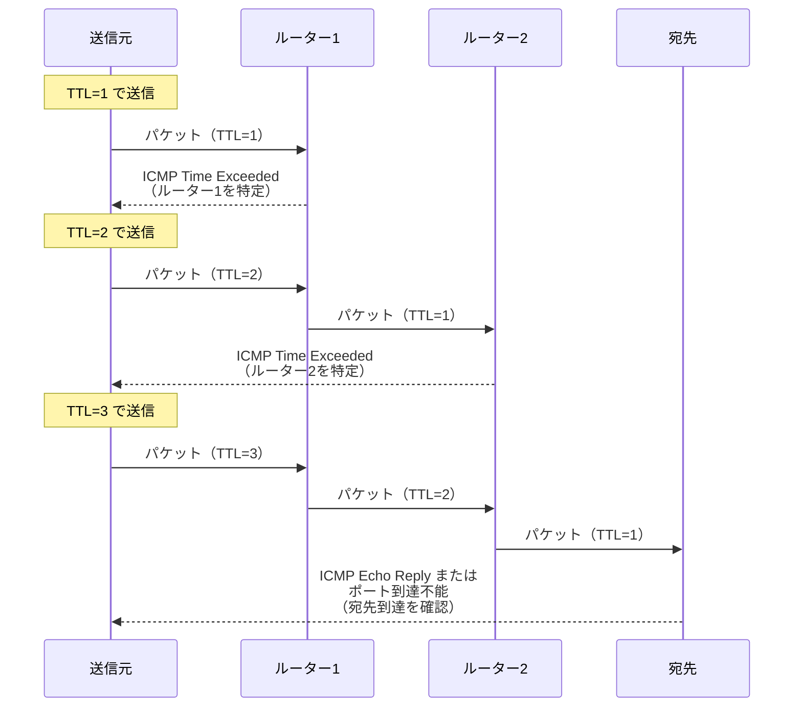

import { Aside } from '@astrojs/starlight/components';

## この節で学ぶこと

ICMP（Internet Control Message Protocol）は，IP通信におけるエラー通知や診断機能を提供するプロトコルです．
IPはコネクションレス型であり，パケットが正しく届いたかどうかを保証しません．ICMPはこの弱点を補い，通信障害の通知や経路情報の通知を行います．
pingやtracerouteなどのネットワーク診断ツールもICMPを基盤としています．

## 5.4.1 IPを補助するICMP

IPプロトコルはベストエフォート型であり，パケットの到達を保証しません．パケットが途中で破棄された場合や，宛先に到達できない場合でも，IP自体には送信元にエラーを通知する仕組みがありません．

ICMPはこの問題を補うために設計されたプロトコルで，RFC 792で定義されています．ICMPはIPの上位プロトコルとして動作しますが，トランスポート層ではなくインターネット層に分類されます（IPヘッダのプロトコル番号は1）．

ICMPの主な役割:

- エラー通知: パケットが宛先に到達できない場合や，ルーティングに問題がある場合に送信元に通知
- 診断機能: ネットワークの到達性やRTT（Round Trip Time）の測定
- 経路情報: より効率的な経路が存在する場合のリダイレクト通知

### ICMPの制約

ICMPにはいくつかの重要な制約があります:

- ICMPエラーメッセージに対してICMPエラーメッセージを生成してはならない（無限ループ防止）
- IPフラグメントの2番目以降のフラグメントに対してICMPエラーメッセージを生成しない
- ブロードキャスト/マルチキャスト宛のパケットに対してICMPエラーメッセージを生成しない

## 5.4.2 主なICMPメッセージ

ICMPメッセージは大きく「エラーメッセージ」と「問い合わせメッセージ」に分類されます．

### 主要なICMPメッセージの詳細

| Type | メッセージ名 | 説明 |
|---|---|---|
| 0 | Echo Reply | pingの応答メッセージ |
| 3 | Destination Unreachable | 宛先到達不能（Code値で理由を区別） |
| 4 | Source Quench | 送信元抑制（現在は廃止: RFC 6633） |
| 5 | Redirect | より適切なルーターへのリダイレクト |
| 8 | Echo Request | pingの要求メッセージ |
| 11 | Time Exceeded | TTL超過またはフラグメント再構築タイムアウト |
| 12 | Parameter Problem | IPヘッダのパラメータ異常 |

### Destination Unreachable（Type 3）の主なCode値

| Code | 意味 |
|---|---|
| 0 | ネットワーク到達不能 |
| 1 | ホスト到達不能 |
| 2 | プロトコル到達不能 |
| 3 | ポート到達不能 |
| 4 | フラグメント必要だがDF（Don't Fragment）ビットがセット |
| 13 | 管理上の禁止（ファイアウォールによるフィルタリング） |

### pingの動作

`ping` コマンドはICMP Echo Request（Type 8）を送信し，ICMP Echo Reply（Type 0）を受信することで，宛先ホストへの到達性とRTTを確認します．

### tracerouteの動作

`traceroute`（Windowsでは `tracert`）は，TTL（Time To Live）を1から段階的に増やしながらパケットを送信し，各ホップのルーターからICMP Time Exceeded（Type 11）メッセージを受信することで，宛先までの経路を調査します．

tracerouteの実装方法はOSによって異なります:

- Unix/Linux/macOS: UDPパケットを使用し，宛先からICMP Port Unreachable（Type 3, Code 3）が返ることで到達を確認
- Windows（tracert）: ICMP Echo Requestを使用し，Echo Replyが返ることで到達を確認

## 5.4.3 ICMPv6

IPv6ではICMPv6（RFC 4443）が使用されます．ICMPv6はIPv4のICMPの機能に加え，以下の機能も統合しています:

- 近隣探索プロトコル（NDP: Neighbor Discovery Protocol）: IPv4のARPに相当する機能をICMPv6で実現
  - Router Solicitation / Router Advertisement: ルーター情報の取得
  - Neighbor Solicitation / Neighbor Advertisement: MACアドレスの解決（ARPの代替）
  - Redirect: より適切な次ホップの通知
- MLD（Multicast Listener Discovery）: IPv4のIGMPに相当するマルチキャスト管理
- SLAAC（Stateless Address Autoconfiguration）: DHCPなしでのIPv6アドレス自動設定

ICMPv6はIPv6プロトコルスタックに不可欠な要素であり，IPv4のICMPよりも重要な役割を担っています．ファイアウォールでICMPv6を完全にブロックすると，IPv6通信に深刻な問題が発生するため注意が必要です．

<Aside type="tip" title="FDE実務での活用">
AIサービスの死活監視では，pingとtracerouteが基本的なツールとなります．例えば，GPU推論サーバーへのping応答時間を定期的に監視することで，ネットワークの遅延やパケットロスを早期に検出できます．また，API呼び出しが失敗した際にtracerouteを実行すれば，どのホップで問題が発生しているかを特定できます．ただし，多くのクラウドプロバイダーはセキュリティ上の理由からICMPをブロックしていることがあるため，TCPベースのヘルスチェック（HTTPステータスコード確認）と組み合わせて監視することが重要です．
</Aside>

## まとめ

- ICMPはIPの補助プロトコルで，エラー通知と診断機能を提供する
- ICMPメッセージはエラーメッセージと問い合わせメッセージに大別される
- pingはICMP Echo Request/Replyを使って到達性とRTTを確認する
- tracerouteはTTLを段階的に増やしてICMP Time Exceededを利用し経路を調査する
- ICMPv6はIPv6に不可欠であり，NDP（近隣探索），MLD，SLAACなどの機能を統合している
- ファイアウォールでICMPを安易にブロックすると，ネットワーク診断やIPv6通信に問題が生じる

## 理解度チェック

Q1: ICMPが必要な理由を説明してください．

IPプロトコルはコネクションレス型のベストエフォートであり，パケットの到達を保証しません．パケットが途中で破棄された場合や宛先に到達できない場合でも，IP自体にはエラーを通知する仕組みがありません．ICMPはこの弱点を補い，送信元にエラーを通知したり，ネットワークの診断情報を提供したりする役割を果たします．

Q2: tracerouteの動作原理を説明してください．

tracerouteはTTLを1から段階的に増やしながらパケットを送信します．TTLが0になるとルーターはパケットを破棄し，ICMP Time Exceeded（Type 11）メッセージを送信元に返します．これにより各ホップのルーターのIPアドレスが判明します．最終的に宛先に到達すると，Echo ReplyまたはPort Unreachableが返り，経路調査が完了します．

Q3: ICMPv6がIPv4のICMPよりも重要な役割を担っている理由を説明してください．

ICMPv6はIPv4のICMPの基本機能（エラー通知・診断）に加え，近隣探索プロトコル（NDP）によるMACアドレス解決（IPv4のARPの代替），ルーター探索，マルチキャストリスナー発見（MLD），ステートレスアドレス自動設定（SLAAC）などの機能を統合しています．これらはIPv6通信に不可欠な要素であり，ICMPv6を完全にブロックするとIPv6ネットワークが正常に動作しなくなります．

Q4: ICMP Destination Unreachable（Type 3）のCode 3（ポート到達不能）はどのような状況で発生しますか？

Code 3（Port Unreachable）は，宛先ホストにはパケットが到達したが，指定されたポート番号で待ち受けているアプリケーションが存在しない場合に発生します．例えば，UDPパケットを送信した先のポートでサービスが動作していない場合，宛先ホストがICMP Port Unreachableを返します．Unix/Linuxのtracerouteは，この仕組みを利用して宛先到達を確認しています．

