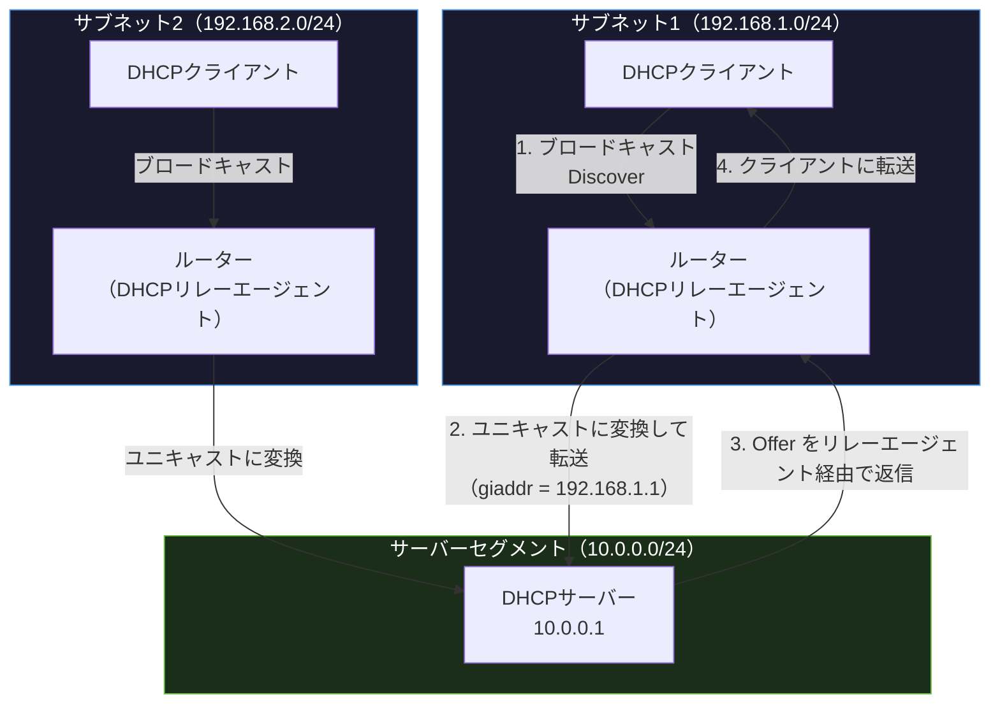

import { Aside } from '@astrojs/starlight/components';

## この節で学ぶこと

DHCP（Dynamic Host Configuration Protocol）は，ネットワークに接続したホストにIPアドレスやサブネットマスク，デフォルトゲートウェイ，DNSサーバーアドレスなどの設定を自動的に割り当てるプロトコルです．
DHCPの基本的な動作プロセス（DORA）と，サブネットをまたいだDHCPリレーエージェントの仕組みを理解します．

## 5.5.1 プラグ＆プレイを可能にするDHCP

ネットワークに接続するすべてのホストには，以下の情報を設定する必要があります:

- IPアドレス
- サブネットマスク
- デフォルトゲートウェイのIPアドレス
- DNSサーバーのIPアドレス

これらの設定を手動で行うのは，小規模なネットワークであれば可能ですが，数百台〜数千台のホストが存在する企業ネットワークでは非現実的です．また，手動設定ではIPアドレスの重複や設定ミスが発生しやすくなります．

DHCPはRFC 2131で定義されており，これらの問題を解決します．ホストをネットワークに接続するだけで，必要な設定が自動的に割り当てられる「プラグ＆プレイ」を実現します．

DHCPの利点:

- 管理コストの削減: 手動設定が不要
- 設定ミスの防止: IPアドレスの重複を自動的に回避
- IPアドレスの効率的な利用: 使用していないIPアドレスを回収・再利用
- 一元管理: DHCPサーバーでネットワーク設定を集中管理

## 5.5.2 DHCPの仕組み

DHCPはクライアント/サーバー型のプロトコルで，UDPポート67（サーバー側）とポート68（クライアント側）を使用します．

### DORA（Discover-Offer-Request-Acknowledge）プロセス

DHCPによるIPアドレス割り当ては，4つのメッセージの交換で行われます．これをDORAプロセスと呼びます．

```mermaid
sequenceDiagram
    participant Client as DHCPクライアント<br/>（IP未設定）
    participant Server1 as DHCPサーバー1<br/>（192.168.1.1）
    participant Server2 as DHCPサーバー2<br/>（192.168.1.2）

    Note over Client: ネットワークに接続

    rect rgb(30, 58, 95)
    Note right of Client: 1. DHCP Discover（発見）
    Client->>Server1: ブロードキャスト<br/>「DHCPサーバーはいますか？」
    Client->>Server2: ブロードキャスト
    end

    rect rgb(42, 95, 30)
    Note right of Server1: 2. DHCP Offer（提案）
    Server1-->>Client: 「192.168.1.100 を提供できます」<br/>サブネットマスク，GW，DNS情報も含む
    Server2-->>Client: 「192.168.1.200 を提供できます」
    end

    rect rgb(95, 30, 30)
    Note right of Client: 3. DHCP Request（要求）
    Client->>Server1: ブロードキャスト<br/>「192.168.1.100 をください」
    Client->>Server2: ブロードキャスト<br/>（Server2は自分の提案が<br/>選ばれなかったことを認識）
    end

    rect rgb(95, 30, 95)
    Note right of Server1: 4. DHCP Acknowledge（確認）
    Server1-->>Client: 「192.168.1.100 を確定しました」<br/>リース期間: 86400秒
    end

    Note over Client: IPアドレス: 192.168.1.100<br/>を使用開始
```

### 各メッセージの詳細

1. DHCP Discover: クライアントがブロードキャスト（255.255.255.255）で送信．送信元IPは0.0.0.0（まだIPアドレスを持っていないため）
2. DHCP Offer: DHCPサーバーが利用可能なIPアドレスと設定情報を提案．複数のサーバーから応答がある場合がある
3. DHCP Request: クライアントが1つのOfferを選択し，ブロードキャストで要求を送信．他のDHCPサーバーにも通知される
4. DHCP Acknowledge: DHCPサーバーがIPアドレスの割り当てを確定し，リース期間を通知

### リース（Lease）の管理

DHCPで割り当てられたIPアドレスには「リース期間」が設定されています．クライアントはリース期間の50%が経過した時点でリースの更新（DHCP Request）を行います．

- リース期間の50%経過: DHCPサーバーに直接リース更新を要求
- リース期間の87.5%経過: 更新に失敗した場合，ブロードキャストで再度要求
- リース期間満了: IPアドレスを返却し，DORAプロセスを再実行

### DHCPで割り当てられる情報

- IPアドレス
- サブネットマスク
- デフォルトゲートウェイ
- DNSサーバーアドレス（プライマリ・セカンダリ）
- ドメイン名
- リース期間
- NTPサーバーアドレス
- その他のオプション（PXEブート設定など）

## 5.5.3 DHCPリレーエージェント

DHCPのDiscover/Offerメッセージはブロードキャストを使用するため，通常はルーターを越えることができません．つまり，各サブネットにDHCPサーバーを配置する必要があります．

DHCPリレーエージェントは，この問題を解決する仕組みです．ルーターやL3スイッチがDHCPリレーエージェントとして動作し，クライアントのブロードキャストをDHCPサーバー宛のユニキャストに変換して転送します．

DHCPリレーエージェントの動作:

1. クライアントがDHCP Discoverをブロードキャストで送信
2. リレーエージェント（ルーター）がブロードキャストを受信
3. リレーエージェントは `giaddr`（Gateway IP Address）フィールドに自分のIPアドレスを設定
4. DHCPサーバーにユニキャストで転送
5. DHCPサーバーは `giaddr` からクライアントのサブネットを判断し，適切なIPアドレスプールから割り当て
6. 応答をリレーエージェント経由でクライアントに返送

### トラブルシューティング: IPアドレス取得失敗時の確認手順

DHCPによるIPアドレス取得に失敗した場合，以下の手順で調査を行います:

1. 物理層・データリンク層の確認:
   - ケーブルの接続状態，リンクランプの確認
   - Wi-Fiの場合はSSIDへの接続状態を確認
2. DHCPクライアントの状態確認:
   - `ipconfig /all`（Windows）または `ip addr show`（Linux）で現在のIP設定を確認
   - 169.254.x.x（リンクローカルアドレス）が割り当てられている場合，DHCPサーバーからの応答がないことを示す
3. DHCPサーバーの確認:
   - DHCPサーバーが稼働しているか確認
   - IPアドレスプールが枯渇していないか確認
   - DHCPサーバーのログでエラーを確認
4. ネットワーク経路の確認:
   - DHCPリレーエージェントが正しく設定されているか確認
   - ファイアウォールでUDPポート67/68がブロックされていないか確認
5. IPアドレスのリリースと再取得:
   - `ipconfig /release && ipconfig /renew`（Windows）
   - `sudo dhclient -r && sudo dhclient`（Linux）

<Aside type="tip" title="FDE実務での活用">
オンプレミスのGPUサーバー環境を構築する際，DHCPを適切に設定することで大量のサーバーのネットワーク設定を自動化できます．ただし，GPUサーバーのように固定的に運用するサーバーでは，DHCPの「予約」機能（MACアドレスとIPアドレスの固定対応）を使用するのが一般的です．これにより，DHCPの一元管理の利点を活かしつつ，IPアドレスが変わらないことを保証できます．PXEブート（ネットワークブート）でOSのインストールを自動化する際にも，DHCPのオプション設定（Option 66: TFTPサーバー，Option 67: ブートファイル名）が重要な役割を果たします．
</Aside>

## まとめ

- DHCPはIPアドレスやネットワーク設定を自動的に割り当てるプロトコルである
- DORAプロセス（Discover → Offer → Request → Acknowledge）の4ステップでIPアドレスを割り当てる
- リース機能により，使用していないIPアドレスを回収・再利用できる
- DHCPリレーエージェントにより，異なるサブネットのクライアントにもIPアドレスを割り当てられる
- IPアドレス取得失敗時は，物理層からDHCPサーバーまで順に確認する

## 理解度チェック

Q1: DHCPが必要な理由を説明してください．

ネットワークに接続するホストにはIPアドレス，サブネットマスク，デフォルトゲートウェイ，DNSサーバーアドレスなどの設定が必要です．これらを大量のホストに手動で設定するのは非現実的であり，設定ミスやIPアドレスの重複が発生しやすくなります．DHCPはこれらの設定を自動的に割り当てることで，管理コストの削減，設定ミスの防止，IPアドレスの効率的な利用を実現します．

Q2: DORAプロセスの4つのステップを説明してください．

1. Discover（発見）: クライアントがブロードキャストでDHCPサーバーを探す
2. Offer（提案）: DHCPサーバーが利用可能なIPアドレスと設定情報を提案する
3. Request（要求）: クライアントが1つのOfferを選択し，ブロードキャストで割り当てを要求する
4. Acknowledge（確認）: DHCPサーバーがIPアドレスの割り当てを確定し，リース期間を通知する

Q3: DHCPリレーエージェントが必要な理由と動作原理を説明してください．

DHCPのDiscoverメッセージはブロードキャストで送信されるため，ルーターを越えることができません．そのため，DHCPサーバーが別のサブネットにある場合，クライアントはDHCPサーバーに到達できません．

DHCPリレーエージェントは，ルーターがクライアントのブロードキャストを受信し，`giaddr` フィールドに自分のIPアドレスを設定してDHCPサーバーへユニキャストで転送します．DHCPサーバーは `giaddr` からクライアントのサブネットを判断し，適切なIPアドレスを割り当てます．

Q4: IPアドレスが169.254.x.xになっている場合，何が原因と考えられますか？

169.254.x.x はリンクローカルアドレス（APIPA: Automatic Private IP Addressing）であり，DHCPサーバーからIPアドレスを取得できなかった場合にOSが自動的に割り当てるアドレスです．原因としては，DHCPサーバーの停止，ネットワーク接続の問題（ケーブル不良，Wi-Fi切断），DHCPサーバーのIPアドレスプール枯渇，ファイアウォールによるUDPポート67/68のブロックなどが考えられます．

Q5: DHCPのリース更新はどのタイミングで行われますか？

DHCPクライアントはリース期間の50%が経過した時点で，DHCPサーバーに直接（ユニキャストで）リース更新を要求します．この更新に失敗した場合，リース期間の87.5%経過時点でブロードキャストで再度要求します．それでも更新できなかった場合，リース期間が満了するとIPアドレスを返却し，DORAプロセスを最初から再実行します．

