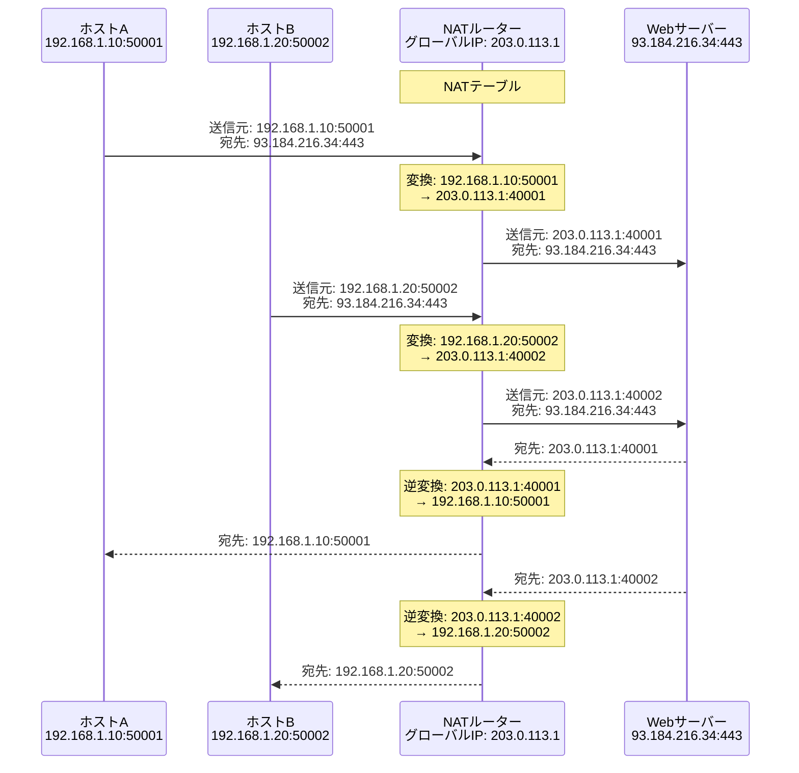
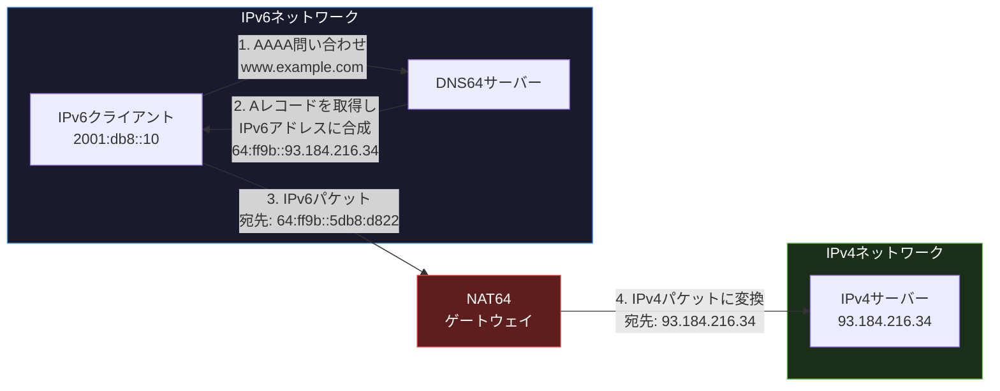
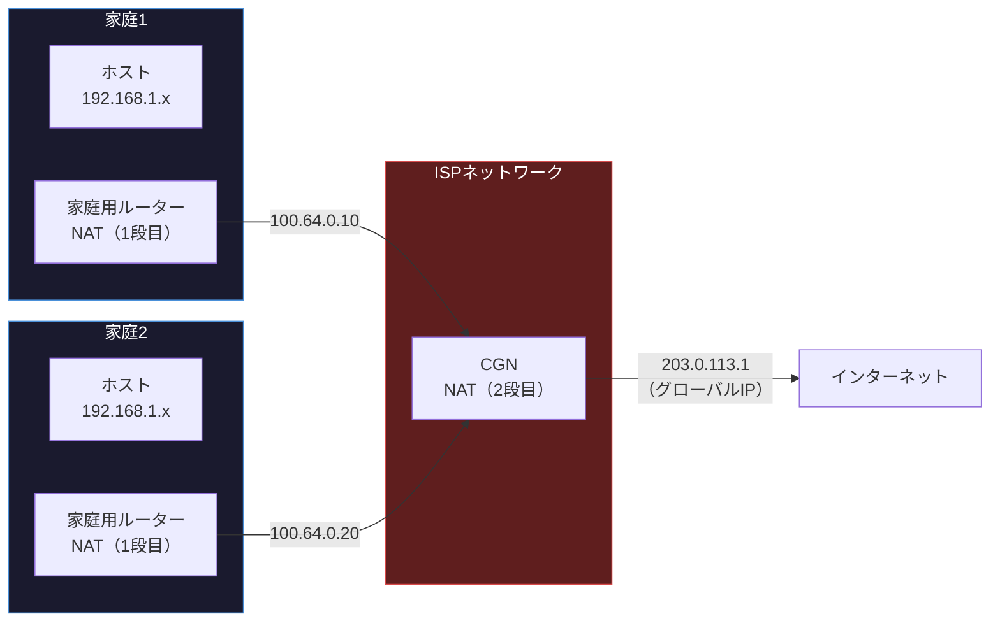

import { Aside } from '@astrojs/starlight/components';

## この節で学ぶこと

NAT（Network Address Translator）は，プライベートIPアドレスとグローバルIPアドレスの間で変換を行う技術です．
IPv4アドレスの枯渇対策として広く利用されており，NAPT（Network Address Port Translation），NAT64/DNS64，CGN（Carrier Grade NAT）などの拡張技術も含めて理解します．
また，NATがもたらす通信上の問題点とその解決策についても学びます．

## 5.6.1 NATとは

IPv4のアドレス空間は約43億個（2の32乗）しかなく，世界中のすべてのデバイスにグローバルIPアドレスを割り当てることは不可能です．この問題を解決するために，組織内ではプライベートIPアドレス（RFC 1918）を使用し，インターネットとの通信時にグローバルIPアドレスに変換する仕組みがNATです．

プライベートIPアドレスの範囲:

| クラス | アドレス範囲 | ネットワーク数 |
|---|---|---|
| クラスA | 10.0.0.0 〜 10.255.255.255 | 1個（/8） |
| クラスB | 172.16.0.0 〜 172.31.255.255 | 16個（/12） |
| クラスC | 192.168.0.0 〜 192.168.255.255 | 256個（/16） |

NATを使用することで:

- 限られたグローバルIPアドレスを効率的に共有できる
- 内部ネットワークの構造を外部から隠蔽できる（セキュリティの副次的効果）
- 組織内のIPアドレス体系を自由に設計できる

## 5.6.2 NATの仕組み

### 静的NAT（Static NAT）

プライベートIPアドレスとグローバルIPアドレスの1対1の対応を固定的に設定します．外部からのアクセスを受ける必要があるサーバーで使用されます．

### 動的NAT（Dynamic NAT）

グローバルIPアドレスのプールから空いているアドレスを動的に割り当てます．プール内のグローバルIPアドレスが使い果たされると，新たな変換ができなくなります．

### NAPT（Network Address Port Translation）

NAPTは，IPアドレスだけでなくポート番号も変換することで，1つのグローバルIPアドレスを複数のホストで共有する仕組みです．IPマスカレードやPAT（Port Address Translation）とも呼ばれます．

NAPTの変換テーブル（例）:

| プライベート側 | グローバル側 |
|---|---|
| 192.168.1.10:50001 | 203.0.113.1:40001 |
| 192.168.1.20:50002 | 203.0.113.1:40002 |
| 192.168.1.10:50003 | 203.0.113.1:40003 |

ポート番号を組み合わせることで，理論上は1つのグローバルIPアドレスで約65,535のセッションを同時に処理できます．

## 5.6.3 NAT64/DNS64

NAT64/DNS64は，IPv6ネットワークからIPv4ネットワークへの通信を実現する技術です．IPv6への移行期において，IPv6のみのネットワークからIPv4のサーバーにアクセスするために使用されます．

DNS64の動作:

1. IPv6クライアントがDNS64サーバーにAAAAレコードを問い合わせ
2. AAAAレコードが存在しない場合，DNS64サーバーがAレコードを取得
3. IPv4アドレスをIPv6アドレスに合成（Well-Known Prefix `64:ff9b::/96` + IPv4アドレス）
4. 合成したAAAAレコードをクライアントに返却

NAT64の動作:

1. クライアントが合成されたIPv6アドレス宛にパケットを送信
2. NAT64ゲートウェイがIPv6ヘッダをIPv4ヘッダに変換
3. IPv4ネットワーク上のサーバーにパケットを転送
4. 応答パケットはIPv4からIPv6に逆変換してクライアントに返送

## 5.6.4 CGN（Carrier Grade NAT）

CGN（Carrier Grade NAT，LSN: Large Scale NATとも呼ばれる）は，ISP（インターネットサービスプロバイダー）がグローバルIPアドレスの枯渇に対処するために導入するNATです．

通常のNATは各家庭や企業のルーターで行われますが，CGNはISPのネットワーク内に設置され，複数の加入者が1つのグローバルIPアドレスを共有します．

CGNでは `100.64.0.0/10`（RFC 6598: Shared Address Space）のアドレス帯が使用されます．これはCGNのために予約されたアドレス空間で，プライベートアドレスでもグローバルアドレスでもない特殊な位置づけです．

CGNの影響:

- 二重NAT（家庭内NAT + CGN）により，NATテーブルの管理が複雑化
- 外部からの接続が困難になる
- IPアドレスベースのアクセス制限やログ管理が複雑化
- P2P通信やオンラインゲームに影響が出る可能性

## 5.6.5 NATの問題点

NATは便利な技術ですが，以下のような問題点があります:

- エンドツーエンド通信の阻害: NATの内側にあるホストには外部から直接アクセスできない
- アプリケーション層への影響: FTP，SIP，H.323など，データ部にIPアドレスを含むプロトコルはNATと相性が悪い
- IPsecとの非互換性: IPsecのAH（Authentication Header）はIPアドレスの改変を検出してしまう
- NATテーブルの管理: 大量のセッションを処理する場合，NATテーブルのメモリ消費と処理負荷が増大
- ログ管理の複雑化: グローバルIPアドレスからプライベートIPアドレスへの追跡が必要

## 5.6.6 NATの問題点の解決とNAT越え

NATの内側にあるホスト同士が直接通信するための技術（NAT越え，NATトラバーサル）がいくつか開発されています:

- STUN（Session Traversal Utilities for NAT）: NATの外側にあるSTUNサーバーを利用して，自分のグローバルIPアドレスとポートを取得
- TURN（Traversal Using Relays around NAT）: STUNで直接通信できない場合にリレーサーバーを経由して通信
- ICE（Interactive Connectivity Establishment）: STUNとTURNを組み合わせて最適な通信経路を自動選択
- UPnP IGD（Universal Plug and Play Internet Gateway Device）: ルーターのポートマッピングを自動設定
- NAT-PMP / PCP（Port Control Protocol）: Apple開発のポートマッピングプロトコル

### トラブルシューティング: NAT越え問題の診断

NAT関連の通信問題が発生した場合:

1. NATタイプの確認: Full Cone，Address-Restricted Cone，Port-Restricted Cone，Symmetric NATのどれか確認
2. ポートフォワーディングの設定確認: 外部からのアクセスが必要なサービスについて，ルーターのポートフォワーディングが正しく設定されているか確認
3. NATテーブルの確認: `show ip nat translations`（Cisco），`conntrack -L`（Linux）でNATテーブルの状態を確認
4. タイムアウトの確認: NATテーブルエントリのタイムアウト値が短すぎないか確認（長時間のTCP接続が切断される場合）
5. ALG（Application Level Gateway）の確認: FTP，SIPなどのプロトコルでALGが正しく動作しているか確認

<Aside type="tip" title="FDE実務での活用">
プライベートサブネット内のAIワーカーから外部API（OpenAI，Claude APIなど）を呼び出す場合，NATの仕組みが重要になります．クラウド環境ではNAT Gatewayを経由して外部APIにアクセスしますが，大量の推論リクエストを同時に送信すると，NATテーブルのポート枯渇やコネクション数の制限に達する可能性があります．この場合，複数のNAT GatewayをAZ（Availability Zone）ごとに配置したり，固定のElastic IPを割り当ててAPI側のIPホワイトリストに登録したりする設計が必要です．
</Aside>

## まとめ

- NATはプライベートIPアドレスとグローバルIPアドレスを変換する技術で，IPv4アドレス枯渇対策として広く利用される
- NAPTはIPアドレスとポート番号を組み合わせて変換し，1つのグローバルIPで多数のホストが通信可能
- NAT64/DNS64はIPv6ネットワークからIPv4サーバーへのアクセスを実現する移行技術
- CGNはISPレベルでNATを行い，グローバルIPアドレスの共有をさらに進める
- NATはエンドツーエンド通信の阻害やアプリケーション層への影響などの問題点がある
- STUN/TURN/ICEなどのNAT越え技術で問題を解決できる

## 理解度チェック

Q1: NATとNAPTの違いを説明してください．

NATはIPアドレスのみを変換する技術で，プライベートIPアドレスとグローバルIPアドレスの間で1対1の変換を行います．一方，NAPTはIPアドレスに加えてポート番号も変換することで，1つのグローバルIPアドレスを複数のホストで共有できます．NAPTにより，ポート番号の組み合わせで通信を識別するため，理論上は1つのグローバルIPで約65,535のセッションを同時処理できます．

Q2: CGN（Carrier Grade NAT）とは何ですか？通常のNATとの違いを説明してください．

CGNはISPのネットワーク内に設置されるNATで，複数の加入者が1つのグローバルIPアドレスを共有する仕組みです．通常のNATは各家庭や企業のルーターで行われますが，CGNはISPレベルで行われるため，家庭内NAT + CGNの二重NATとなります．CGNでは `100.64.0.0/10` のShared Address Spaceが使用され，外部からの接続やP2P通信が困難になるなどの影響があります．

Q3: NATがエンドツーエンド通信を阻害する理由を説明してください．

NATはプライベートIPアドレスとグローバルIPアドレスの変換を行いますが，変換エントリは通常，内部から外部への通信開始時に作成されます．そのため，外部から内部のホストに対して能動的に接続を開始することができません．これにより，P2P通信やサーバー公開，VoIP，オンラインゲームなど，双方向の通信開始が必要なアプリケーションに影響が生じます．

Q4: STUN/TURN/ICEの役割と違いを簡潔に説明してください．

- STUN: NATの外側にあるSTUNサーバーを利用して，自分のグローバルIPアドレスとポート番号を取得する技術．対称NAT以外では直接通信が可能になる
- TURN: STUNで直接通信できない場合（対称NATなど）に，リレーサーバーを経由して通信する技術．すべてのNATタイプで動作するが，リレーサーバーの帯域を消費する
- ICE: STUNとTURNを組み合わせて，直接通信，STUN経由，TURN経由の中から最適な通信経路を自動的に選択する枠組み

