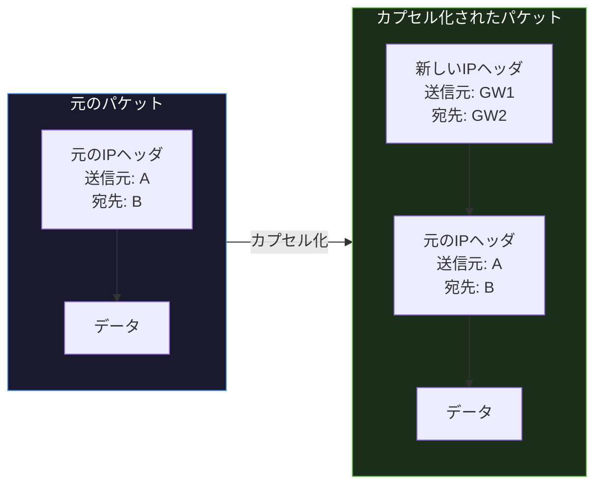
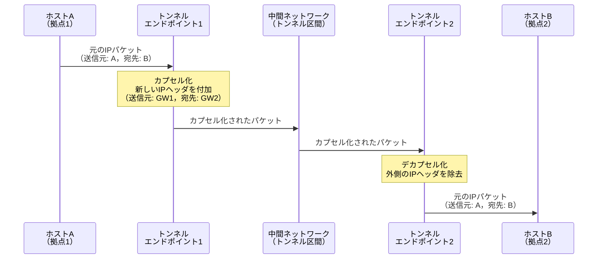
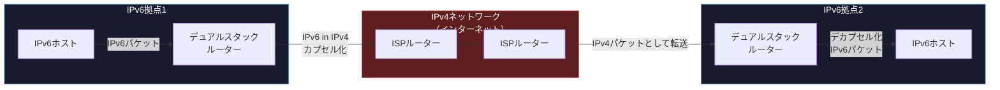

import { Aside } from '@astrojs/starlight/components';

## この節で学ぶこと

IPトンネリングは，あるネットワークプロトコルのパケットを別のプロトコルのパケットに包み込んで（カプセル化して）転送する技術です．
異なるプロトコルのネットワーク間を仮想的に接続したり，セキュアな通信路を構築したりするために利用されます．
VPNやIPv4/IPv6移行技術としてのトンネリングの実践的な活用を理解します．

## IPトンネリングの基本概念

IPトンネリングとは，元のIPパケット（またはその他のプロトコルのパケット）を新しいIPヘッダで包み込み，異なるネットワークを経由して宛先まで運ぶ技術です．

### トンネリングの動作

トンネリングの主な用途:

- VPN（Virtual Private Network）: インターネット上にセキュアな仮想的な専用線を構築
- IPv4/IPv6移行: IPv4ネットワークを越えてIPv6通信を行う，またはその逆
- プロトコル変換: 異なるプロトコル体系のネットワーク間を接続
- モバイルIP: ホームネットワークと外出先のネットワーク間の透過的な通信

## 主なトンネリング技術

### IP in IP（RFC 2003）

最もシンプルなトンネリング方式で，IPv4パケットを別のIPv4パケットに格納します．プロトコル番号4を使用します．

### GRE（Generic Routing Encapsulation，RFC 2784）

Cisco が開発した汎用的なトンネリングプロトコルです．IPv4，IPv6，IPXなどさまざまなプロトコルのパケットをカプセル化できます．プロトコル番号47を使用します．

GREの特徴:

- マルチプロトコル対応: さまざまなネットワーク層プロトコルを転送可能
- ルーティングプロトコルの転送: マルチキャストパケットも転送できるため，OSPF やRIPなどのルーティングプロトコルをトンネル上で動作させることが可能
- 暗号化機能なし: GRE自体には暗号化機能がないため，セキュリティが必要な場合はIPsecと組み合わせて使用

### IPv6 over IPv4トンネル

IPv4ネットワークを経由してIPv6パケットを転送するための技術です．IPv6への移行期に広く使用されています．

IPv6 over IPv4の主な方式:

- 手動トンネル（6in4）: 管理者が明示的にトンネルエンドポイントを設定
- 6to4（RFC 3056）: 2002::/16 のプレフィックスを使い，自動的にトンネルを構成（現在は非推奨: RFC 7526）
- ISATAP（Intra-Site Automatic Tunnel Addressing Protocol）: 組織内でのIPv6自動トンネル
- Teredo（RFC 4380）: NAT越えに対応したIPv6トンネリング．UDPでカプセル化

### IPv4 over IPv6トンネル

IPv6ネットワーク上でIPv4パケットを転送する技術です．IPv6移行が進んだネットワークでIPv4互換性を維持するために使用されます．

- DS-Lite（Dual-Stack Lite，RFC 6333）: IPv4パケットをIPv6でカプセル化してISPのCGNに転送
- MAP-E（Mapping of Address and Port with Encapsulation，RFC 7597）: IPv4パケットをIPv6でカプセル化し，ポート範囲を分配してNATを分散処理

### IPsecトンネルモード

IPsec（Internet Protocol Security）のトンネルモードは，元のIPパケット全体を暗号化し，新しいIPヘッダを付加します．VPNの構築に最も広く使用されている技術の一つです．

IPsecトンネルモードの特徴:

- 暗号化: ESP（Encapsulating Security Payload）によるデータの暗号化
- 認証: AH（Authentication Header）またはESPによるパケットの認証
- 完全性: パケットの改ざんを検出
- リプレイ防止: シーケンス番号によるリプレイ攻撃の防止

### WireGuard

WireGuardは比較的新しいVPNプロトコルで，シンプルな設計と高性能が特徴です．Linuxカーネルに組み込まれており，従来のIPsecやOpenVPNと比較して:

- コードベースが約4,000行と非常に小さい
- 最新の暗号アルゴリズム（ChaCha20，Curve25519，BLAKE2s）を採用
- 設定がシンプル
- 高い通信性能

## MTUへの影響

トンネリングでは元のパケットに新しいヘッダを付加するため，実効MTU（Maximum Transmission Unit）が減少します．例えば:

- 通常のイーサネットMTU: 1,500バイト
- GREヘッダ: 24バイト（4バイトGREヘッダ + 20バイトIPヘッダ）
- IPsec ESPヘッダ: 約50〜70バイト（暗号化方式による）

MTUの問題を避けるためには:

- トンネルインタフェースのMTUを適切に設定
- Path MTU Discovery を有効にする
- TCP MSS（Maximum Segment Size）の調整（TCP MSS clamping）

<Aside type="tip" title="FDE実務での活用">
リモートからオンプレミスのAI開発環境にアクセスする際，VPNトンネルが不可欠です．例えば，自宅からオフィスのGPUサーバーにSSH接続してモデル学習を実行する場合，IPsec VPNやWireGuardでセキュアなトンネルを構築します．クラウドとオンプレミスのハイブリッド環境では，AWS Site-to-Site VPNやGoogle Cloud VPNなどのマネージドVPNサービスを利用して拠点間を接続し，学習データの転送やモデルのデプロイを安全に行えます．トンネリングによるMTU低下が大容量データ転送のスループットに影響する場合は，Jumbo Frame（MTU 9,000）の設定やTCP MSS調整を検討しましょう．
</Aside>

## まとめ

- IPトンネリングはパケットを別のプロトコルのパケットにカプセル化して転送する技術
- VPN構築やIPv4/IPv6移行に広く利用されている
- IP in IP，GRE，IPsecトンネルモード，WireGuardなど多様な方式がある
- IPv6 over IPv4（6in4，Teredo）やIPv4 over IPv6（DS-Lite，MAP-E）でプロトコル移行を支援
- トンネリングによりMTUが減少するため，適切なMTU設定やTCP MSS調整が必要

## 理解度チェック

Q1: IPトンネリングの基本的な仕組みを説明してください．

IPトンネリングは，元のIPパケットを新しいIPヘッダで包み込む（カプセル化する）ことで，異なるネットワークを経由して転送する技術です．トンネルの入口（エンドポイント1）で元のパケットに新しいIPヘッダを付加してカプセル化し，中間ネットワークを通過してトンネルの出口（エンドポイント2）でデカプセル化（外側のヘッダを除去）して元のパケットを復元します．

Q2: GREとIPsecの違いを説明してください．

GRE（Generic Routing Encapsulation）はさまざまなプロトコルのパケットをカプセル化できる汎用的なトンネリングプロトコルですが，暗号化機能を持ちません．一方，IPsecは暗号化（ESP），認証（AH），完全性保証，リプレイ防止などのセキュリティ機能を提供します．セキュリティが必要な場合はGREをIPsecで保護する（GRE over IPsec）という組み合わせが一般的です．

Q3: トンネリングがMTUに与える影響と対策を説明してください．

トンネリングでは元のパケットに新しいヘッダ（GREヘッダ，IPsec ESPヘッダなど）を付加するため，実効MTUが減少します．例えば通常のイーサネットMTU 1,500バイトから，GREでは約24バイト，IPsecでは約50〜70バイト分が使えなくなります．対策としては，トンネルインタフェースのMTUを適切に設定する，Path MTU Discoveryを有効にする，TCP MSS clamping でTCPセグメントサイズを調整するなどがあります．

Q4: DS-Lite とはどのような技術ですか？

DS-Lite（Dual-Stack Lite）は，IPv6ネットワーク上でIPv4通信を実現する技術です．顧客宅のルーター（B4: Basic Bridging BroadBand element）がIPv4パケットをIPv6でカプセル化し，ISPのAFTR（Address Family Transition Router）に転送します．AFTRでデカプセル化とNAT44（IPv4→IPv4のNAT）を行い，インターネットに接続します．これにより，ISPのネットワークをIPv6に統一しつつ，IPv4互換性を維持できます．

