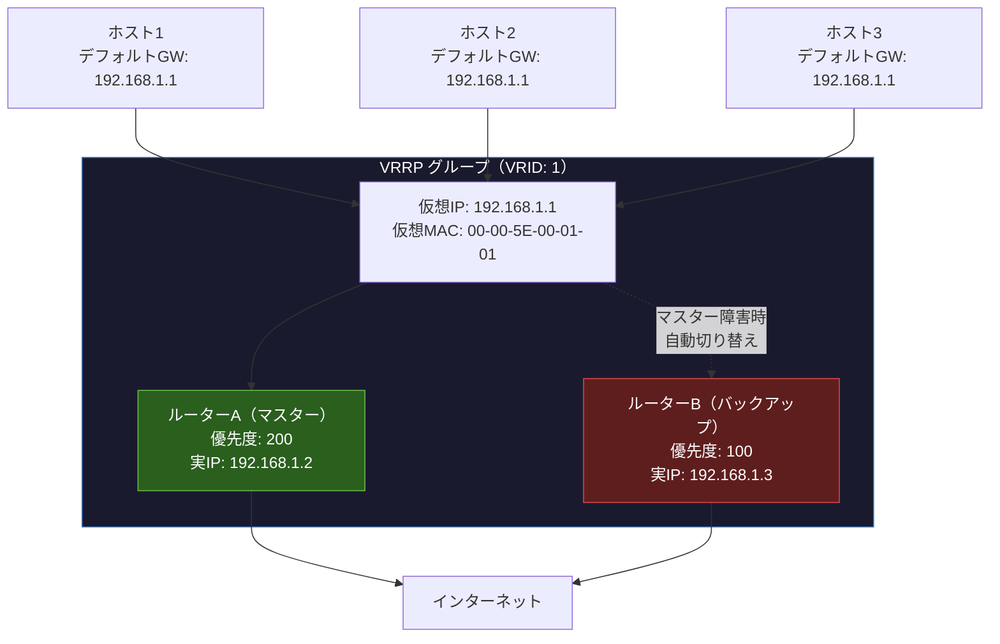
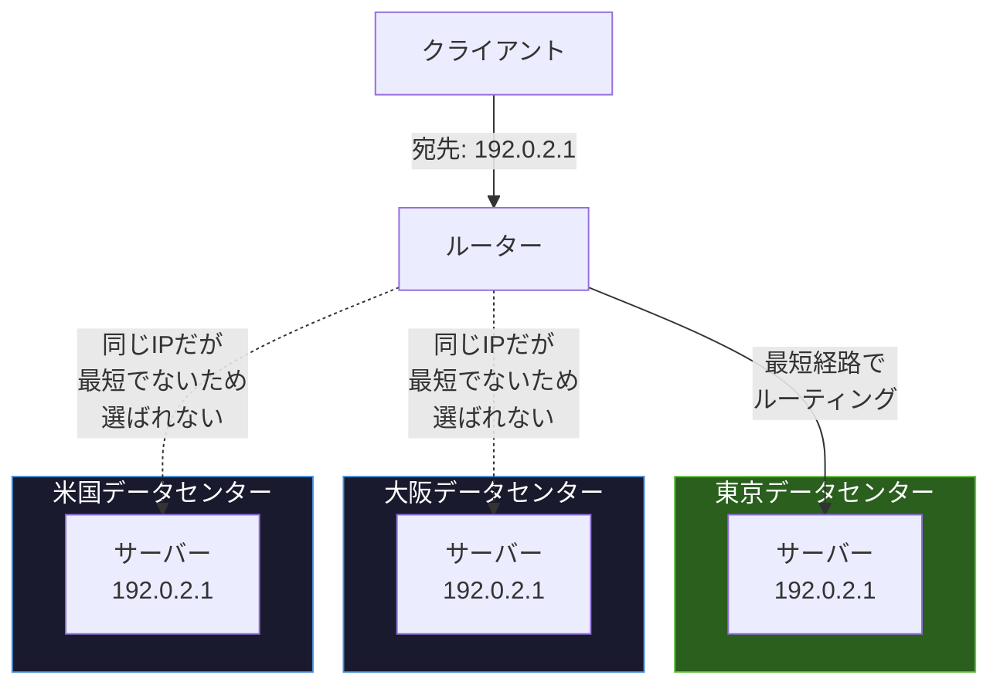
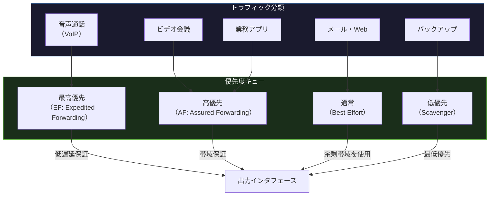

import { Aside } from '@astrojs/starlight/components';

## この節で学ぶこと

IPに関連する技術はDNS，ARP，ICMP，DHCP，NATだけではありません．
冗長化のためのVRRP，効率的な配信のためのIPマルチキャストやエニーキャスト，通信品質を制御するQoS，混雑を通知するECN，モバイル環境での透過的な通信を実現するMobile IPなど，さまざまな拡張技術があります．
本節ではこれらの技術の仕組みと用途を概観します．

## 5.8.1 VRRP（Virtual Router Redundancy Protocol）

VRRP（RFC 5798）は，複数の物理ルーターで1つの仮想ルーターを構成し，デフォルトゲートウェイの冗長化を実現するプロトコルです．

### VRRPの必要性

ホストはデフォルトゲートウェイとして1つのルーターのIPアドレスを設定します．しかし，そのルーターが故障するとホストはサブネット外との通信ができなくなります．VRRPを使用することで，マスタールーターが故障した場合にバックアップルーターが自動的にマスターの役割を引き継ぎ，通信を継続できます．

VRRPの動作:

- マスタールーターは定期的にVRRP Advertisementパケットを送信（デフォルト1秒間隔）
- バックアップルーターは，マスターからのAdvertisementが一定時間（Master Down Interval）途絶えたことを検出するとマスターに昇格
- 新しいマスターはGARP（Gratuitous ARP）を送信して仮想IPに対応するMACアドレスの変更を通知
- ホスト側の設定変更は不要（仮想IPアドレスは変わらないため）

類似のプロトコル:

- HSRP（Hot Standby Router Protocol）: Cisco独自のプロトコル．VRRPと同様の機能を提供
- GLBP（Gateway Load Balancing Protocol）: Cisco独自．冗長化に加えて負荷分散も実現

## 5.8.2 IPマルチキャスト関連技術

IPマルチキャストは，1つの送信元から特定のグループに属する複数の受信者に対して効率的にデータを配信する技術です．

### マルチキャストの利点

| 通信方式 | 説明 | パケット数 |
|---|---|---|
| ユニキャスト | 1対1の通信．受信者ごとに個別送信 | 受信者数分 |
| ブロードキャスト | 同一ネットワーク上のすべてのホストに送信 | 1（全員受信） |
| マルチキャスト | 特定グループに属するホストのみに送信 | 1（グループのみ受信） |

マルチキャストは動画配信，オンライン会議，ソフトウェア配布など，同じデータを複数のホストに同時に届ける場面で効果的です．

### IGMP（Internet Group Management Protocol）

IGMPは，ホストがマルチキャストグループへの参加・離脱をルーターに通知するためのプロトコルです．

- IGMPv1（RFC 1112）: ホストがグループに参加するJoin機能のみ
- IGMPv2（RFC 2236）: 明示的なLeave（離脱）機能を追加
- IGMPv3（RFC 3376）: ソースフィルタリング（特定の送信元からのマルチキャストのみ受信）に対応

### PIM（Protocol Independent Multicast）

PIMは，マルチキャストパケットをルーター間で転送するためのマルチキャストルーティングプロトコルです．

- PIM-DM（Dense Mode）: マルチキャストパケットをフラッディングし，不要なルーターがプルーニング（枝刈り）する方式
- PIM-SM（Sparse Mode）: RP（Rendezvous Point）を中心にマルチキャスト配信ツリーを構築する方式．大規模ネットワーク向け
- PIM-SSM（Source-Specific Multicast）: 送信元を指定したマルチキャスト．IGMPv3と組み合わせて使用

## 5.8.3 IPエニーキャスト

IPエニーキャストは，同じIPアドレスを持つ複数のサーバーの中から，ルーティング上最も近いサーバーにパケットを届ける技術です．

エニーキャストの特徴:

- BGPの経路選択に基づいて最も近いサーバーが選択される
- サーバー障害時は自動的に次に近いサーバーにルーティングされる
- UDPベースのプロトコル（DNS）に最適．TCPでも使用可能だが，経路変更時にセッションが切れる可能性がある

エニーキャストの代表的な利用例:

- ルートDNSサーバー: 13系統のルートDNSサーバーがエニーキャストで世界中に分散配置
- CDN（Content Delivery Network）: ユーザーに最も近いエッジサーバーからコンテンツを配信
- DDoS対策: 攻撃トラフィックを複数のデータセンターに分散

## 5.8.4 通信品質の制御

QoS（Quality of Service）は，ネットワーク上のトラフィックに優先度を付けて，重要な通信の品質（遅延，帯域幅，パケットロス率）を保証する技術です．

### QoSの主な仕組み

- パケット分類・マーキング:
  - DSCP（Differentiated Services Code Point）: IPヘッダのToSフィールドの上位6ビットで優先度を指定
  - IEEE 802.1p: イーサネットフレームのVLANタグで優先度を指定（0〜7の8段階）
- キューイング:
  - PQ（Priority Queuing）: 優先度の高いキューから先に処理
  - WFQ（Weighted Fair Queuing）: フローごとに重み付けして公平に帯域を分配
  - CBWFQ（Class-Based WFQ）: クラスごとに最低帯域を保証
  - LLQ（Low Latency Queuing）: CBWFQ + 優先キュー．音声通信に最適
- トラフィック制御:
  - ポリシング: 指定帯域を超えたトラフィックを即座に破棄またはマーキング変更
  - シェーピング: 指定帯域に合うようにパケットをバッファリングして送出タイミングを調整

### IntServ と DiffServ

- IntServ（Integrated Services）: RSVPプロトコルでフローごとに帯域を予約．高精度だがスケーラビリティに課題
- DiffServ（Differentiated Services）: DSCPによるパケット分類でクラスごとに処理を分ける．スケーラビリティに優れ，現在主流

## 5.8.5 明示的なふくそう通知

ECN（Explicit Congestion Notification，RFC 3168）は，ネットワークの混雑（輻輳）をパケットを破棄せずに送信元に通知する仕組みです．

従来の輻輳制御では，ルーターがバッファオーバーフローでパケットを破棄し，送信元がパケットロスを検出して送信レートを下げるという仕組みでした．ECNはこの非効率な方法を改善します:

1. 送信元がECN対応であることをIPヘッダで示す
2. 中継ルーターが輻輳を検知した場合，パケットを破棄する代わりにIPヘッダのECNフィールドにマークを付ける
3. 受信側がECNマークを検出し，TCPのACKに輻輳通知フラグ（ECE）を設定
4. 送信元がECEフラグを受信し，送信レートを低減

ECNの利点:

- パケットロスなしで輻輳を通知できるため，再送が不要
- 通信のスループットとレイテンシが改善
- リアルタイム通信（音声，映像）の品質向上

## 5.8.6 Mobile IP

Mobile IP（RFC 5944: MIPv4，RFC 6275: MIPv6）は，ホストが異なるネットワーク間を移動しても，同じIPアドレスで通信を継続できる技術です．

### Mobile IPの基本概念

- ホームエージェント（HA）: ホームネットワークに配置されたルーター．モバイルノードの位置を管理
- 外部エージェント（FA）: 訪問先ネットワークに配置されたルーター（MIPv4のみ）
- モバイルノード（MN）: 移動するホスト
- ホームアドレス: モバイルノードの恒久的なIPアドレス
- 気付アドレス（CoA: Care-of Address）: 訪問先ネットワークで取得する一時的なIPアドレス

### Mobile IPの動作

1. モバイルノードが訪問先ネットワークに移動
2. 気付アドレス（CoA）を取得
3. ホームエージェントにCoAを登録（バインディングアップデート）
4. ホームアドレス宛のパケットをホームエージェントが受信
5. ホームエージェントがCoA宛にトンネリングで転送
6. モバイルノードがデカプセル化して受信

MIPv6ではIPv6の拡張ヘッダを活用し，外部エージェントが不要になるなど，MIPv4の課題が改善されています．また，経路最適化により，ホームエージェントを経由しない直接通信も可能です．

<Aside type="tip" title="FDE実務での活用">
VRRPはAIサービスの高可用性設計に直結します．例えば，推論APIのフロントエンドとなるロードバランサーの前段にVRRPを構成することで，ネットワーク機器の単一障害点を排除できます．IPエニーキャストはCDNやDNSサービスで広く使われており，AIモデルの推論結果をエッジキャッシュに配置してユーザーに最も近い拠点から配信することで，レイテンシを大幅に削減できます．QoSは，同じネットワーク上でモデル学習の大容量データ転送とリアルタイム推論APIのトラフィックが共存する場合に，推論APIへの低遅延を保証するために活用できます．
</Aside>

## まとめ

- VRRPは複数のルーターで仮想ルーターを構成し，デフォルトゲートウェイの冗長化を実現する
- IPマルチキャストは1対多の効率的なデータ配信を実現し，IGMP/PIMで管理・ルーティングする
- IPエニーキャストは同じIPアドレスの複数サーバーから最も近いサーバーにルーティングする
- QoSはトラフィックに優先度を付けて通信品質を制御し，DiffServが現在主流
- ECNはパケットを破棄せずに輻輳を送信元に通知する仕組み
- Mobile IPはネットワーク間を移動しても同じIPアドレスで通信を継続する技術

## 理解度チェック

Q1: VRRPが必要な理由と，ホスト側の設定変更が不要な理由を説明してください．

VRRPが必要な理由: ホストはデフォルトゲートウェイとして1つのルーターのIPアドレスを設定しますが，そのルーターが故障すると外部との通信ができなくなります．VRRPにより，マスタールーター故障時にバックアップルーターが自動的に引き継ぎ，可用性を確保します．

ホスト側の設定変更が不要な理由: ホストはVRRPの仮想IPアドレスをデフォルトゲートウェイとして設定しています．マスターが切り替わっても仮想IPアドレスは変わらず，GARPにより仮想MACアドレスの通知も自動的に行われるため，ホスト側の設定変更は不要です．

Q2: ユニキャスト，ブロードキャスト，マルチキャストの違いを説明してください．

- ユニキャスト: 1対1の通信．特定の1つの宛先にパケットを送信．受信者ごとに個別のパケットが必要
- ブロードキャスト: 1対全の通信．同一ネットワーク上のすべてのホストにパケットを送信．不要なホストもパケットを受信してしまう
- マルチキャスト: 1対多の通信．特定のグループに参加しているホストのみにパケットを送信．送信元は1つのパケットを送信するだけで，ネットワーク上で必要に応じてコピーされる

Q3: IPエニーキャストの代表的な利用例を2つ挙げてください．

1. ルートDNSサーバー: 13系統のルートDNSサーバー（a〜m.root-servers.net）がエニーキャストで世界中に分散配置されており，問い合わせ元に最も近いサーバーが応答する
2. CDN（Content Delivery Network）: CDNプロバイダーが世界中のデータセンターに同じIPアドレスのエッジサーバーを配置し，ユーザーに最も近いサーバーからコンテンツを配信してレイテンシを削減する

Q4: ECN（明示的なふくそう通知）が従来の輻輳制御と比較して優れている点を説明してください．

従来の輻輳制御では，ルーターがバッファオーバーフロー時にパケットを破棄し，送信元がパケットロスを検出して送信レートを下げるという仕組みでした．ECNでは，ルーターが輻輳を検知した際にパケットを破棄する代わりにIPヘッダにマークを付けて輻輳を通知します．これにより，パケットロスと再送が不要となり，スループットとレイテンシが改善されます．特にリアルタイム通信（音声，映像）では，パケットロスによる品質劣化を避けられるため効果が大きいです．

Q5: Mobile IPにおけるホームアドレスと気付アドレスの違いを説明してください．

- ホームアドレス: モバイルノードに恒久的に割り当てられたIPアドレスで，ホームネットワーク上のアドレスです．通信相手はこのアドレスを使ってモバイルノードと通信します
- 気付アドレス（CoA: Care-of Address）: モバイルノードが訪問先ネットワークで取得する一時的なIPアドレスです．モバイルノードの現在の物理的な位置（接続先ネットワーク）を示します．ホームエージェントは気付アドレスを使ってパケットをトンネリングで転送します

