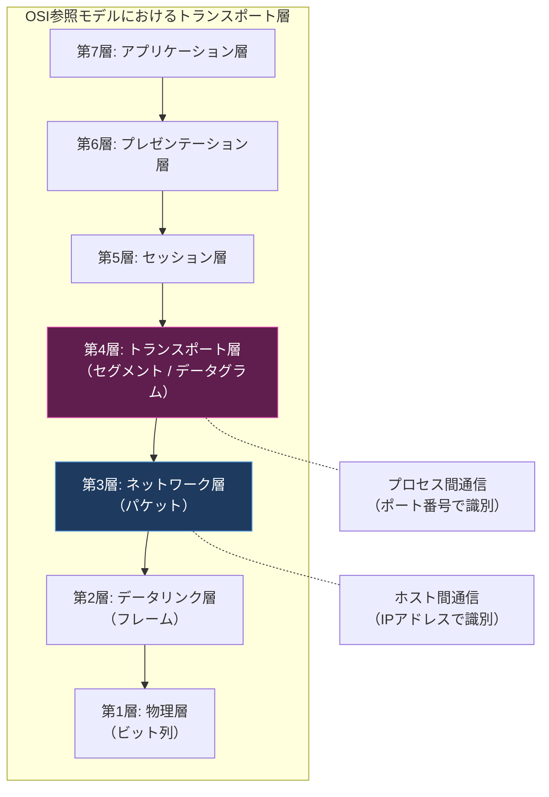
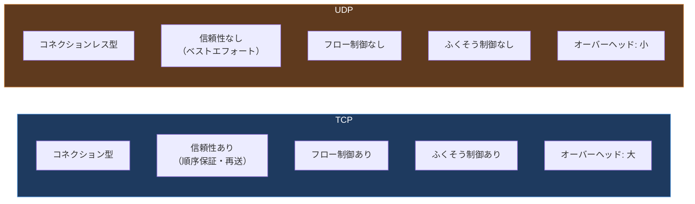

import { Aside } from '@astrojs/starlight/components';

## この節で学ぶこと

トランスポート層はOSI参照モデルの第4層に位置し，アプリケーション間のエンドツーエンド通信を実現します．
ネットワーク層（IP）がホスト間の通信を担当するのに対し，トランスポート層はホスト上で動作するアプリケーションプロセス間の通信を担います．
この節では，トランスポート層の基本的な役割，通信の処理の流れ，そしてTCPとUDPという2つの代表的なプロトコルの違いと使い分けを学びます．

## 6.1.1 トランスポート層とは

トランスポート層は，ネットワーク層が提供するホスト間通信の仕組みを利用して，アプリケーションプロセス間の論理的な通信路を提供します．具体的には以下の役割を担います:

- アプリケーションの識別: ポート番号を用いて，同一ホスト上の複数のアプリケーションを区別する
- エンドツーエンド通信: 送信元アプリケーションから宛先アプリケーションへの直接的な通信を実現する
- 信頼性の提供（TCPの場合）: データの順序保証，再送制御，重複検出を行う
- フロー制御: 送信側と受信側の処理能力の差を調整する
- ふくそう制御: ネットワークの混雑状態を考慮して送信量を調整する

ネットワーク層がIPアドレスを用いて「どのホストへ届けるか」を決定するのに対し，トランスポート層はポート番号を用いて「どのアプリケーションへ届けるか」を決定します．この2つの層が連携することで，インターネット上の任意のホストの任意のアプリケーション間で通信が可能になります．

## 6.1.2 通信の処理

トランスポート層がアプリケーションから受け取ったデータを送信する際の処理の流れを見てみましょう．

送信側では，アプリケーションが生成したデータにトランスポート層のヘッダ（送信元ポート番号，宛先ポート番号など）を付加してセグメント（TCP）またはデータグラム（UDP）を作成し，ネットワーク層に渡します．受信側では，ネットワーク層から受け取ったデータのトランスポート層ヘッダを解析し，宛先ポート番号に対応するアプリケーションにデータを引き渡します．

この処理により，1つのホスト上で同時に動作する複数のアプリケーション（Webブラウザ，メールクライアント，SSHクライアントなど）が，それぞれ独立して通信を行うことができます．ネットワーク層はIPアドレスによるホストの識別までしか行わないため，アプリケーションの識別はトランスポート層の重要な責務です．

## 6.1.3 2つのトランスポートプロトコルTCPとUDP

TCP/IPのトランスポート層には，用途や要件に応じて2つの主要なプロトコルが用意されています．

- TCP（Transmission Control Protocol）: コネクション型の信頼性のあるプロトコル．データの順序保証，再送制御，フロー制御，ふくそう制御を行う
- UDP（User Datagram Protocol）: コネクションレス型の軽量なプロトコル．信頼性の保証はないが，オーバーヘッドが小さく高速

TCPは「確実にデータを届ける」ことを重視し，UDPは「速さと効率」を重視するという設計思想の違いがあります．アプリケーションの要件に応じて適切なプロトコルを選択することが重要です．

## 6.1.4 TCPとUDPの使い分け

TCPとUDPの使い分けは，アプリケーションがデータ転送に対してどのような要件を持っているかによって決まります．

TCPが適するケース:

- ファイル転送（FTP）: データの欠落や順序の入れ替わりが許容できない
- Webアクセス（HTTP/HTTPS）: Webページのコンテンツが完全に到達する必要がある
- メール送受信（SMTP/POP/IMAP）: メールの内容が正確に伝わる必要がある
- データベース通信: クエリ結果の正確性が求められる

UDPが適するケース:

- DNS名前解決: 小さなデータの高速なやり取り（失敗時はアプリケーション側で再送）
- 音声・映像のリアルタイム通信（VoIP，ビデオ会議）: 多少のパケットロスよりも遅延の少なさを重視
- ネットワーク管理（SNMP）: 定期的なポーリングで最新の状態を取得すればよい
- ライブストリーミング: リアルタイム性が重視される

選択の基準をまとめると:

- 信頼性が最優先 → TCP
- リアルタイム性・低遅延が最優先 → UDP
- 小さなデータの高速なやり取り → UDP
- 大量のデータの確実な転送 → TCP
- アプリケーション側で独自の信頼性制御を行いたい → UDP

<Aside type="tip" title="FDE実務での活用">
AIサービスの開発・運用では，TCPとUDPの使い分けが重要な場面があります．例えば，LLM（大規模言語モデル）のAPIへのリクエスト・レスポンスはHTTPSを通じてTCPで通信され，プロンプトや生成テキストの完全性が保証されます．一方，音声AIアシスタント（リアルタイム音声認識・合成）ではWebRTCを用いてUDPで音声データを転送し，多少のパケットロスよりも低遅延を優先します．クラウドのロードバランサ設計においても，APIエンドポイントにはTCP用のロードバランサを，リアルタイム音声にはUDP用のロードバランサを使い分ける必要があります．通信要件に応じた適切なプロトコル選択が，サービス品質を大きく左右します．
</Aside>

## まとめ

- トランスポート層はOSI参照モデルの第4層に位置し，アプリケーションプロセス間のエンドツーエンド通信を実現する
- ネットワーク層がIPアドレスでホストを識別するのに対し，トランスポート層はポート番号でアプリケーションを識別する
- TCPはコネクション型で信頼性を重視し，UDPはコネクションレス型で速さと効率を重視する
- TCPはファイル転送やWeb通信など確実なデータ到達が必要な場面で，UDPはリアルタイム通信やDNSなど速度が重要な場面で使われる
- アプリケーションの要件（信頼性，リアルタイム性，データサイズなど）に応じて適切なプロトコルを選択することが重要

## 理解度チェック

Q1: トランスポート層とネットワーク層の役割の違いを説明してください．

ネットワーク層はIPアドレスを用いてホスト間の通信（ルーティング）を担当します．一方，トランスポート層はポート番号を用いてアプリケーションプロセス間の通信を担当します．ネットワーク層が「どのホストへ届けるか」を決めるのに対し，トランスポート層は「そのホストのどのアプリケーションへ届けるか」を決定します．

Q2: TCPとUDPの主な違いを3つ挙げてください．

1. 接続方式: TCPはコネクション型（通信前に接続を確立），UDPはコネクションレス型（接続確立なしに送信）
2. 信頼性: TCPは順序保証・再送制御があり信頼性が高い，UDPには信頼性の保証がない
3. オーバーヘッド: TCPはヘッダが大きくコネクション管理のオーバーヘッドがある，UDPはヘッダが小さく軽量

Q3: リアルタイムの音声通話にTCPではなくUDPが使われる理由は何ですか？

音声通話ではリアルタイム性（低遅延）が最も重要であり，多少のパケットロスは人間の耳には気づきにくいため許容できます．TCPを使うと，再送制御によって遅延が発生し，会話がスムーズに行えなくなります．また，再送で届いた古い音声データは既にタイミングを逸しているため意味がありません．UDPは再送や順序保証のオーバーヘッドがなく，低遅延で音声データを送信できるため適しています．

Q4: 1つのホスト上で複数のアプリケーションが同時に通信できるのは，トランスポート層のどの機能のおかげですか？

ポート番号によるアプリケーションの識別機能のおかげです．各アプリケーションは異なるポート番号を使用することで，トランスポート層が受信したデータを適切なアプリケーションに振り分けることができます．ネットワーク層のIPアドレスだけではホストの識別しかできないため，ポート番号によるアプリケーションの識別はトランスポート層の重要な役割です．

