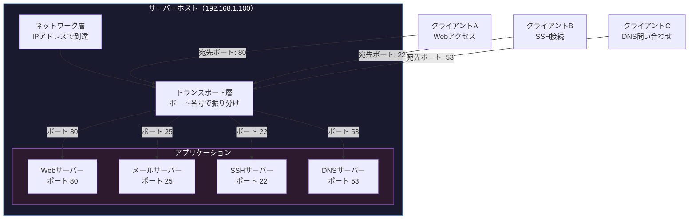
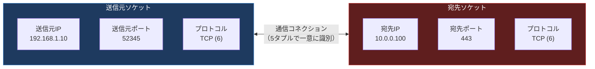

import { Aside } from '@astrojs/starlight/components';

## この節で学ぶこと

ポート番号は，トランスポート層がアプリケーションを識別するために使用する16ビットの数値です．
IPアドレスがネットワーク上のホストを識別するのに対し，ポート番号はそのホスト上で動作するアプリケーションを識別します．
この節では，ポート番号の仕組み，アプリケーション識別の方法，IPアドレスとポート番号を組み合わせたソケットの概念，そしてポート番号の分類と決定方法について学びます．

## 6.2.1 ポート番号とは

ポート番号は，0から65535までの範囲を持つ16ビットの整数値です．トランスポート層のヘッダ（TCPヘッダまたはUDPヘッダ）に含まれ，送信元ポート番号と宛先ポート番号のペアで通信のエンドポイントを特定します．

ポート番号は，建物の部屋番号に例えることができます．IPアドレスが建物の住所（どの建物か）を示すのに対し，ポート番号はその建物内の部屋番号（どの部屋か）を示します．郵便物を届けるには，住所だけでなく部屋番号も必要であるのと同様に，ネットワーク通信ではIPアドレスとポート番号の両方が必要です．

## 6.2.2 ポート番号によるアプリケーションの識別

ホスト上では複数のアプリケーションが同時にネットワーク通信を行っています．トランスポート層は，受信したデータのポート番号を確認し，対応するアプリケーションにデータを振り分けます．

このように，トランスポート層はポート番号をキーとして，受信データを適切なアプリケーションに多重化（multiplexing）および逆多重化（demultiplexing）する役割を果たします．

## 6.2.3 IPアドレスとポート番号とプロトコル番号による通信の識別

ネットワーク上の通信を一意に識別するためには，以下の5つの要素（5タプル）が使われます:

1. 送信元IPアドレス
2. 宛先IPアドレス
3. プロトコル番号（TCP=6，UDP=17）
4. 送信元ポート番号
5. 宛先ポート番号

これらの組み合わせにより，ネットワーク上のすべての通信を一意に区別できます．

IPアドレスとポート番号とプロトコルの組み合わせは「ソケット」と呼ばれ，通信のエンドポイントを表します．

重要な点として，同じポート番号であっても，プロトコルが異なれば（TCPの80番とUDPの80番など）別の通信として扱われます．つまり，TCPとUDPのポート番号空間は独立しています．

## 6.2.4 ポート番号の決め方

ポート番号は，その範囲と用途に応じて以下の3つに分類されます:

- ウェルノウンポート（Well-Known Ports）: 0〜1023
  - IANA（Internet Assigned Numbers Authority）によって管理される
  - 広く知られたサービスに割り当てられる（HTTP=80，HTTPS=443，SSH=22など）
  - 一般のプログラムが使用するにはroot権限（管理者権限）が必要な場合が多い

- 登録済みポート（Registered Ports）: 1024〜49151
  - IANAに登録されたアプリケーション用
  - ウェルノウンポートほど厳密ではないが，特定のアプリケーションに関連づけられている
  - 例: MySQL=3306，PostgreSQL=5432，Redis=6379

- ダイナミックポート（Dynamic / Private Ports）: 49152〜65535
  - クライアント側の送信元ポート番号として一時的に割り当てられる
  - エフェメラルポート（Ephemeral Ports）とも呼ばれる
  - OSが自動的に未使用の番号を割り当てる

サーバー側は事前に決められたウェルノウンポートまたは登録済みポートで待ち受け（listen）し，クライアント側はダイナミックポートの範囲からOSが自動的に送信元ポートを割り当てます．

## 6.2.5 ポート番号とプロトコル

代表的なプロトコルとポート番号の対応を以下に示します:

| ポート番号 | プロトコル | 説明 |
|:---:|:---|:---|
| 20/21 | FTP | ファイル転送（データ/制御） |
| 22 | SSH | セキュアリモートログイン |
| 23 | TELNET | リモートログイン |
| 25 | SMTP | メール送信 |
| 53 | DNS | 名前解決（TCP/UDP両方） |
| 67/68 | DHCP | IPアドレス自動割り当て |
| 80 | HTTP | Web通信 |
| 110 | POP3 | メール受信 |
| 143 | IMAP | メール受信 |
| 443 | HTTPS | セキュアWeb通信 |
| 993 | IMAPS | セキュアメール受信 |
| 3306 | MySQL | データベース |
| 5432 | PostgreSQL | データベース |
| 6379 | Redis | インメモリデータストア |
| 8080 | HTTP代替 | 開発サーバーなど |

DNSのように，1つのサービスがTCPとUDPの両方を使用する場合もあります．DNSは通常の名前解決クエリにはUDPの53番ポートを使用し，ゾーン転送などの大きなデータ転送にはTCPの53番ポートを使用します．

<Aside type="tip" title="FDE実務での活用">
コンテナ環境（Docker/Kubernetes）では，ポートマッピングの設計が非常に重要です．Dockerではコンテナ内部のポートをホストの任意のポートにマッピングできます（例: `-p 8080:80`でホストの8080をコンテナの80に転送）．Kubernetesでは，ServiceリソースがClusterIP，NodePort，LoadBalancerなどのタイプでポートの公開方法を制御します．AIサービスのデプロイでは，推論サーバー（例: ポート8000），メトリクスエンドポイント（例: ポート9090），ヘルスチェック（例: ポート8080）など，1つのPodで複数のポートを公開することが一般的です．ポート番号の衝突を避けるためにも，チーム内でポート番号の割り当てルールを決めておくことが推奨されます．
</Aside>

## まとめ

- ポート番号は0〜65535の16ビット整数で，トランスポート層がアプリケーションを識別するために使用する
- 通信はIPアドレス，ポート番号，プロトコル番号の5タプルで一意に識別される
- IPアドレスとポート番号とプロトコルの組み合わせをソケットと呼び，通信のエンドポイントを表す
- ポート番号はウェルノウンポート（0〜1023），登録済みポート（1024〜49151），ダイナミックポート（49152〜65535）の3つに分類される
- TCPとUDPのポート番号空間は独立しており，同じ番号でもプロトコルが異なれば別の通信として扱われる

## 理解度チェック

Q1: ポート番号がなかった場合，どのような問題が発生しますか？

ポート番号がないと，ホスト上で動作する複数のアプリケーションを区別できません．例えば，1台のサーバーでWebサーバーとメールサーバーを同時に動作させている場合，受信したパケットをどちらのアプリケーションに渡すべきか判断できなくなります．ポート番号があることで，トランスポート層が適切なアプリケーションにデータを振り分けることが可能になります．

Q2: 5タプルとは何ですか？それぞれの要素を挙げてください．

5タプルとは，ネットワーク上の通信を一意に識別するための5つの要素の組み合わせです．具体的には，(1)送信元IPアドレス，(2)宛先IPアドレス，(3)プロトコル番号（TCP=6，UDP=17），(4)送信元ポート番号，(5)宛先ポート番号の5つです．この組み合わせにより，ネットワーク上のすべての通信フローを一意に区別できます．

Q3: ウェルノウンポート，登録済みポート，ダイナミックポートの違いを説明してください．

ウェルノウンポート（0〜1023）はIANAが管理し，HTTP（80），SSH（22）などの広く知られたサービスに割り当てられます．登録済みポート（1024〜49151）はIANAに登録された特定のアプリケーション向けで，MySQL（3306）やPostgreSQL（5432）などがあります．ダイナミックポート（49152〜65535）はクライアントの送信元ポートとしてOSが一時的に割り当てるエフェメラルポートです．

Q4: TCPの80番ポートとUDPの80番ポートは同じ通信ですか？

いいえ，異なる通信です．TCPとUDPのポート番号空間は独立しているため，同じ80番であってもプロトコルが異なれば別の通信として扱われます．通信の識別には5タプル（送信元IP，宛先IP，プロトコル番号，送信元ポート，宛先ポート）が使われるため，プロトコル番号が異なれば別の通信です．

