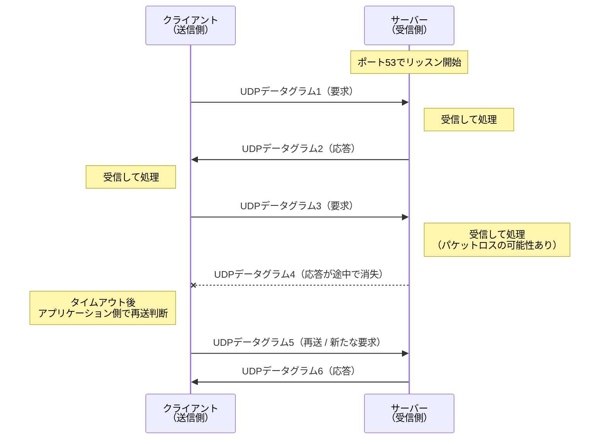
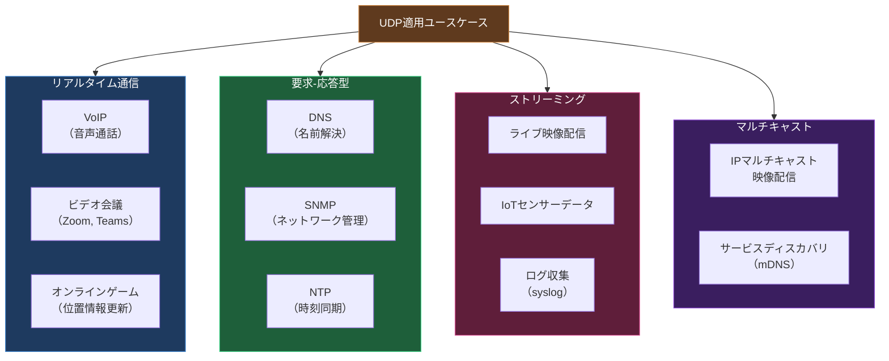

import { Aside } from '@astrojs/starlight/components';

## この節で学ぶこと

UDP（User Datagram Protocol）は，トランスポート層のプロトコルの中で最もシンプルなプロトコルです．
コネクションの確立や信頼性の保証を行わない代わりに，オーバーヘッドが非常に小さく，高速な通信が可能です．
この節では，UDPの設計目的，主な特徴，通信の流れ，そしてUDPが最適なユースケースについて学びます．

## 6.3.1 UDPの目的と特徴

UDPは，IP上に必要最小限のトランスポート層機能を追加したプロトコルです．その設計目的は，アプリケーションに対してポート番号によるアプリケーション識別機能と，オプションのチェックサムによるデータ完全性の検証機能を提供することにあります．

UDPの主な特徴は以下のとおりです:

- コネクションレス型: 通信開始前にコネクションの確立（ハンドシェイク）を行わない
- 信頼性の保証なし: データの到達確認，再送制御，順序保証を行わない
- 軽量なヘッダ: ヘッダサイズは8バイトのみ（TCPは20バイト以上）
- メッセージ境界の保存: アプリケーションが送信したメッセージの境界がそのまま保持される
- ブロードキャスト・マルチキャスト対応: TCPと異なり，1対多の通信が可能
- ふくそう制御なし: ネットワークの混雑状態に関係なく送信し続ける

UDPがIPに追加する機能は，実質的にはポート番号による多重化とチェックサムの2つだけです．このシンプルさゆえに，UDPは「IPにポート番号を付けたもの」と表現されることもあります．

### UDPの通信フロー

UDPの通信では，TCPのような事前のコネクション確立は不要です．送信側はいきなりデータグラム（UDPパケット）を送信し，受信側はそれを受け取ります．

UDPでは，パケットロスが発生してもプロトコル自体は何もしません．信頼性が必要な場合は，アプリケーション側で再送制御やタイムアウト処理を実装する必要があります．

### UDPが信頼性を保証しない理由

UDPが意図的に信頼性を保証しない設計になっている理由は以下のとおりです:

- 再送制御のオーバーヘッドを省くことで低遅延を実現できる
- アプリケーションごとに最適な信頼性制御を実装できる柔軟性がある
- リアルタイム通信では再送されたデータが到着した時点で既に不要になっている場合がある
- ブロードキャストやマルチキャストのような1対多の通信に対応しやすい

### UDPが適するユースケース

UDPが特に効果を発揮するユースケースを整理します．

各ユースケースの特徴:

- リアルタイム通信: 低遅延が最優先．数パケットのロスは許容される
- 要求-応答型: 1回の要求に対して1回の応答で完結する短いやりとり．失敗時はアプリケーション側でリトライ
- ストリーミング: 連続的なデータの流れ．古いデータの再送より最新データの到達が重要
- マルチキャスト: TCPはコネクション型のため1対多の通信に不向き．UDPならマルチキャスト・ブロードキャストに対応

### UDPの注意点

UDPを使用する際の注意点:

- パケットの到達が保証されないため，重要なデータの転送にはアプリケーション層での再送機構が必要
- パケットの順序が保証されないため，順序が重要な場合はアプリケーション層でシーケンス番号を付与する必要がある
- ふくそう制御がないため，大量のUDPパケットを送信するとネットワーク全体のパフォーマンスに影響を与える可能性がある
- ファイアウォールやNATでUDP通信がブロックされることがある

<Aside type="tip" title="FDE実務での活用">
リアルタイム音声AI（例: 音声アシスタントや電話ボット）では，WebRTCを使ってUDPで音声データを転送します．WebRTCの内部では，UDPの上にSRTP（Secure Real-time Transport Protocol）を使用してリアルタイム音声の暗号化と転送を行います．音声AIシステムでは，ユーザーの発話をリアルタイムで音声認識エンジンに送信し，生成された応答音声を即座に返す必要があるため，TCPの再送による遅延は致命的です．例えば，100msの遅延追加でも会話の自然さが大きく損なわれます．UDPを使うことで，ネットワークジッター（遅延のばらつき）の影響を最小限に抑え，バッファリングと補間処理でパケットロスに対処するのが一般的な設計パターンです．
</Aside>

## まとめ

- UDPはコネクションレス型の軽量なトランスポートプロトコルで，ヘッダサイズはわずか8バイト
- 信頼性（到達保証，順序保証，再送制御）を提供しない代わりに，低遅延で高速な通信を実現する
- UDPがIPに追加する機能は，ポート番号による多重化とチェックサムの2つだけ
- リアルタイム通信，DNS名前解決，マルチキャストなど，速度や効率が重視される場面で使用される
- 信頼性が必要な場合は，アプリケーション層で独自に再送制御や順序管理を実装する

## 理解度チェック

Q1: UDPが意図的に信頼性を保証しない設計になっている理由を説明してください．

UDPは，再送制御のオーバーヘッドを省くことで低遅延な通信を実現するために，意図的に信頼性を保証しない設計になっています．リアルタイム通信では再送データが到着した時点で不要になっている場合があり，アプリケーションごとに最適な信頼性制御を実装できる柔軟性も求められます．また，ブロードキャストやマルチキャストなど1対多の通信にも対応しやすくなります．

Q2: UDPのヘッダサイズとTCPのヘッダサイズの違いは何ですか？

UDPのヘッダサイズは8バイトで，TCPのヘッダサイズ（最小20バイト，オプション含めて最大60バイト）と比較して非常に小さいです．UDPヘッダには送信元ポート番号（2バイト），宛先ポート番号（2バイト），データ長（2バイト），チェックサム（2バイト）の4つのフィールドしかありません．この軽量さが，UDPの低オーバーヘッドと高速性を実現しています．

Q3: DNSがUDPを使用する理由は何ですか？また，TCPを使用する場合はどのようなケースですか？

DNSの通常の名前解決クエリは，「ドメイン名を送って対応するIPアドレスを受け取る」という小さなデータの1回の要求-応答で完結するため，コネクション確立のオーバーヘッドがないUDPが適しています．失敗した場合はアプリケーション側で再送します．一方，ゾーン転送（プライマリDNSサーバーからセカンダリDNSサーバーへの全レコードのコピー）のように大きなデータを確実に転送する必要がある場合はTCPを使用します．また，応答サイズが512バイトを超える場合もTCPにフォールバックします．

