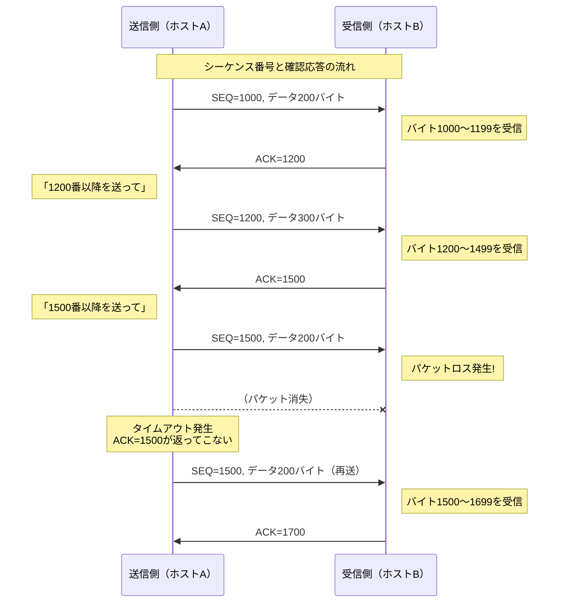
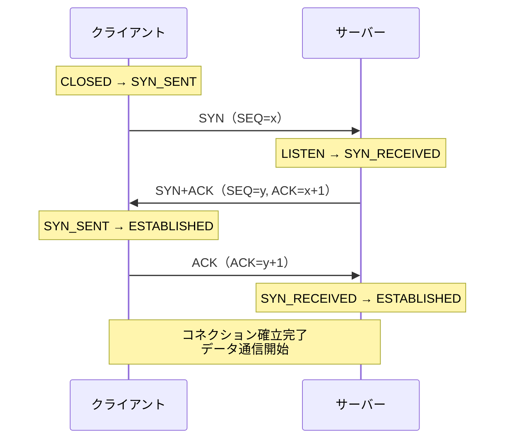
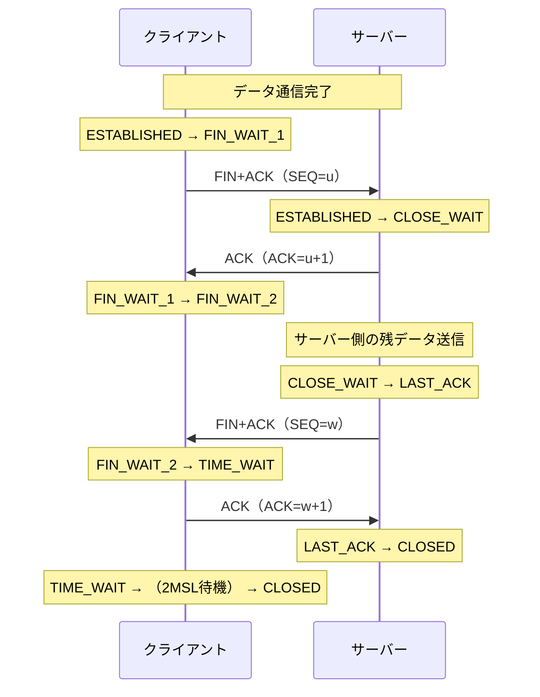
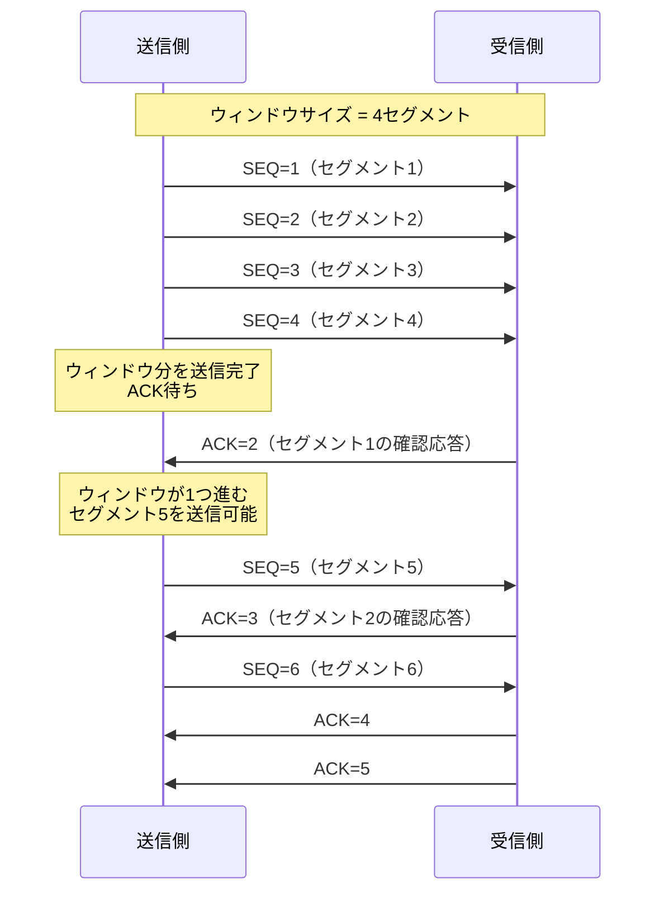
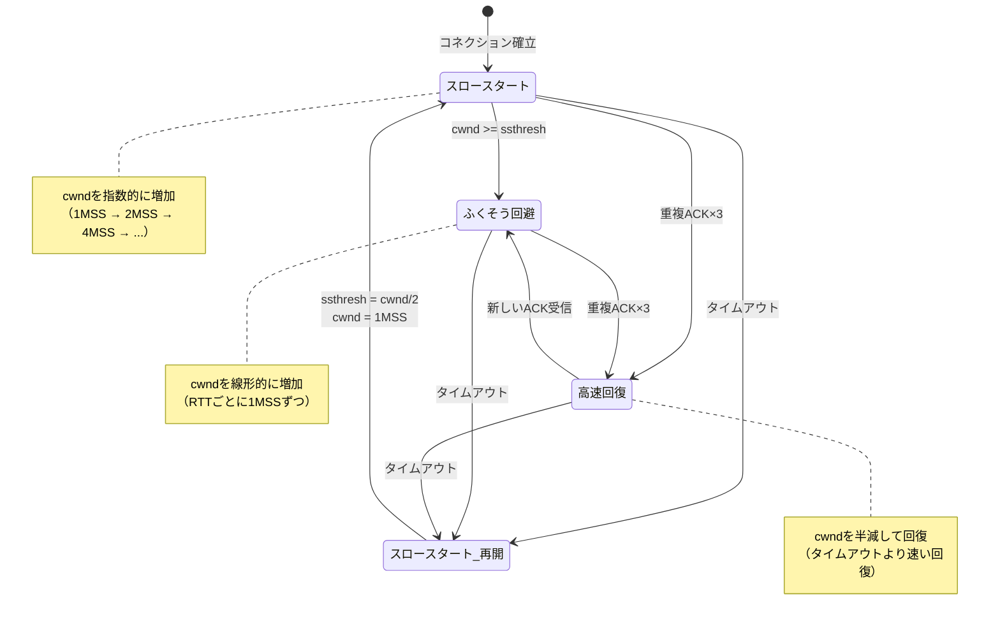
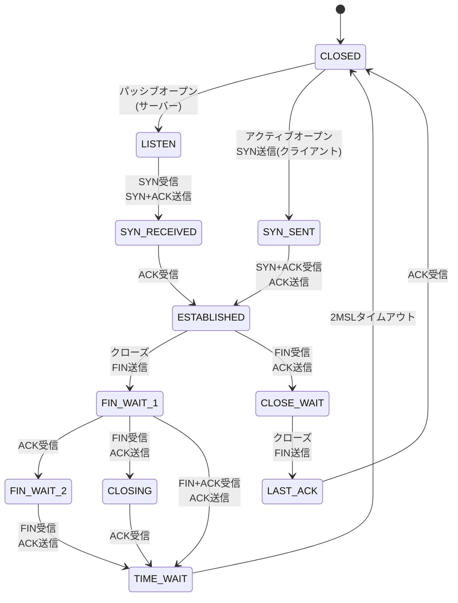

import { Aside } from '@astrojs/starlight/components';

## この節で学ぶこと

TCP（Transmission Control Protocol）は，IP上で信頼性の高いデータ転送を実現するコネクション型のプロトコルです．
シーケンス番号と確認応答による信頼性の保証，ウィンドウ制御による効率的な送信，ふくそう制御によるネットワークの安定性確保など，多くの機能を持ちます．
この節では，TCPの11のサブセクションにわたって，その仕組みを詳しく学びます．

## 6.4.1 TCPの目的と特徴

TCPは，信頼性のないIP上で，アプリケーションに対して信頼性の高いバイトストリーム通信を提供することを目的としています．

TCPの主な特徴:

- コネクション型: 通信前に3ウェイハンドシェイクでコネクションを確立する
- 全二重通信: 双方向で同時にデータを送受信できる
- バイトストリーム: データをバイト列として扱い，メッセージ境界を保持しない
- 信頼性: シーケンス番号と確認応答によりデータの欠落・重複・順序逆転を検出・修正する
- フロー制御: ウィンドウサイズにより受信側の処理能力に合わせて送信量を調整する
- ふくそう制御: ネットワークの混雑状態を検知し，送信量を適応的に制御する

## 6.4.2 シーケンス番号と確認応答で信頼性を提供

TCPが信頼性を実現する基本メカニズムは，シーケンス番号（Sequence Number）と確認応答番号（Acknowledgment Number）です．

- シーケンス番号: 送信するデータの各バイトに番号を振り，データの順序を管理する
- 確認応答番号: 受信側が「次に期待するバイトの番号」を送信側に伝えることで，データの到達を確認する

確認応答番号は「累積的」であり，その番号未満のすべてのバイトを正しく受信したことを意味します．例えばACK=1500は「1499バイト目までのすべてのデータを受信した」ことを示します．

## 6.4.3 再送タイムアウトの決定

送信側は確認応答を受信できなかった場合，一定時間後にデータを再送します．この待機時間を再送タイムアウト（RTO: Retransmission Timeout）と呼びます．

RTOの計算にはRTT（Round Trip Time，往復遅延時間）の測定値が使われます:

- RTTが短いネットワークではRTOも短く設定される
- RTTが長いネットワークではRTOも長く設定される
- RTTは動的に計測され，平滑化RTT（SRTT）と偏差（RTTVAR）から算出される

RTOが短すぎると不必要な再送が発生してネットワークに負荷をかけ，長すぎるとパケットロス時の回復が遅れます．TCPは通信の状態に応じてRTOを動的に調整します．

再送が続く場合は「エクスポネンシャルバックオフ」が適用され，再送のたびにタイムアウト値が2倍に増加します．

## 6.4.4 コネクション管理

TCPはコネクション型プロトコルであり，データ通信の前にコネクションの確立（3ウェイハンドシェイク），通信終了後にコネクションの解放（4ウェイハンドシェイク）を行います．

### 3ウェイハンドシェイク（コネクション確立）

3ウェイハンドシェイクの各ステップ:

1. クライアントがSYNセグメントを送信し，初期シーケンス番号（ISN）を通知する
2. サーバーがSYN+ACKセグメントを返送し，自身のISNとクライアントのSYNへの確認応答を送る
3. クライアントがACKセグメントを送信し，サーバーのSYNへの確認応答を送る

### 4ウェイハンドシェイク（コネクション解放）

4ウェイハンドシェイクでは，双方が独立してコネクションを閉じます．TIME_WAIT状態は，最後のACKが消失した場合の再送に備えて，一定時間（2MSL: Maximum Segment Lifetime）待機する状態です．

## 6.4.5 TCPはセグメント単位でデータを送信

TCPはアプリケーションから受け取ったバイトストリームを，MSS（Maximum Segment Size）を上限とするセグメント単位に分割して送信します．

MSSは，MTU（Maximum Transmission Unit）からIPヘッダ（20バイト）とTCPヘッダ（20バイト）を差し引いた値で決まります．例えば，イーサネットのMTU=1500バイトの場合，MSS=1460バイトになります．

MSSはコネクション確立時の3ウェイハンドシェイクにおいて，TCPオプションで交換されます．

## 6.4.6 ウィンドウ制御で速度向上

1つのセグメントを送信するたびに確認応答を待っていては，RTTが大きいネットワークでスループットが極端に低下します．この問題を解決するのがウィンドウ制御（スライディングウィンドウ）です．

ウィンドウ制御のポイント:

- 確認応答を待たずに，ウィンドウサイズ分のデータを連続送信できる
- 確認応答を受信するたびにウィンドウが「スライド」し，新たなデータを送信できるようになる
- ウィンドウサイズが大きいほど，一度に多くのデータを送信でき，スループットが向上する

## 6.4.7 ウィンドウ制御と再送制御

ウィンドウ制御の中でパケットロスが発生した場合の再送方式として，以下の2つがあります:

- Go-Back-N: ロスしたセグメント以降のすべてを再送する方式
- 選択的再送（Selective Repeat / SACK）: ロスしたセグメントのみを再送する方式

現代のTCPでは，SACK（Selective ACKnowledgment）オプションにより，受信側がどのセグメントを受信済みかを詳細に通知し，送信側はロスしたセグメントのみを効率的に再送できます．

また，高速再送（Fast Retransmit）という仕組みもあります．同じ確認応答番号（重複ACK）を3回受信した場合，タイムアウトを待たずに即座に再送を行います．

## 6.4.8 フロー制御（流量制御）

フロー制御は，受信側の処理能力を超えたデータが送信されることを防ぐ仕組みです．受信側は，TCPヘッダのウィンドウサイズフィールドを用いて，自分が受信可能なバッファサイズ（受信ウィンドウ: rwnd）を送信側に通知します．

- 受信側のバッファに余裕がある → ウィンドウサイズを大きく通知 → 送信側は多く送れる
- 受信側のバッファが逼迫 → ウィンドウサイズを小さく通知 → 送信側は送信量を抑える
- 受信側のバッファが満杯 → ウィンドウサイズ=0を通知 → 送信側は送信を停止

ウィンドウサイズが0になった場合，送信側は定期的にウィンドウプローブ（Window Probe）と呼ばれる小さなセグメントを送信し，受信側のウィンドウが開いたかどうかを確認します．

## 6.4.9 ふくそう制御（ネットワークの混雑解消）

フロー制御が受信側の能力に合わせた制御であるのに対し，ふくそう制御はネットワークの混雑状態に合わせた制御です．

TCPは送信側にふくそうウィンドウ（cwnd: Congestion Window）を管理し，ネットワークの状態に応じて送信量を調整します．実際の送信可能量は，受信ウィンドウ（rwnd）とふくそうウィンドウ（cwnd）の小さい方で決まります．

各フェーズの動作:

- スロースタート: 初期のcwndは1MSS．ACKを受信するたびにcwndを指数的に増加させる
- ふくそう回避: cwndがssthresh（スロースタート閾値）に達すると，cwndを線形的（RTTごとに1MSSずつ）に増加させる
- 高速回復（Fast Recovery）: 重複ACKを3つ受信すると，タイムアウトを待たずにcwndを半減して高速回復モードに入る
- タイムアウト時: ssthreshをcwndの半分に設定し，cwndを1MSSにリセットしてスロースタートからやり直す

## 6.4.10 ネットワークの利用効率を高める仕組み

TCPにはネットワークの利用効率を高めるためのさまざまな仕組みがあります:

- Nagleアルゴリズム: 小さなセグメントの連続送信を抑制し，一定量のデータがたまってから送信する．ネットワーク帯域の効率は向上するが，遅延が増加する場合がある
- 遅延ACK（Delayed ACK）: 確認応答をすぐに返さず，少し待ってからまとめて返すことでACKの数を減らす
- ピギーバック: データセグメントに確認応答を相乗りさせることで，パケット数を削減する

Nagleアルゴリズムが有効な場合，小さなデータ（例えば1バイトずつのキー入力）が効率的にまとめて送信されます．しかし，インタラクティブな通信やリアルタイム性が求められる場面では，TCP_NODELAYオプションでNagleアルゴリズムを無効化することがあります．

## 6.4.11 TCPを利用するアプリケーション

TCPを利用する代表的なアプリケーションプロトコル:

- HTTP/HTTPS（Web通信）: Webページの完全なコンテンツの配信
- FTP（ファイル転送）: ファイルの正確な転送
- SMTP/POP/IMAP（メール）: メールの確実な送受信
- SSH（セキュアシェル）: セキュアなリモート接続とデータ転送
- データベース通信（MySQL，PostgreSQL）: クエリと結果の確実なやり取り

これらはすべて，データの完全性と順序が重要なアプリケーションです．

### TCP状態遷移図

TCPコネクションのライフサイクルにおける状態遷移を以下に示します．

この状態遷移図はTCPの動作を理解する上で非常に重要です．特に，トラブルシューティングにおいて，コネクションがどの状態にあるかを確認することで問題の原因を特定できます．

<Aside type="tip" title="FDE実務での活用">
LLM APIのRate Limitingとリトライ戦略: LLM APIへのリクエストがレート制限（HTTP 429）に達した場合，TCPの再送タイムアウトの考え方と同様に，エクスポネンシャルバックオフを適用してリトライすることが推奨されます．例えば，初回リトライは1秒後，2回目は2秒後，3回目は4秒後といった具合です．

Nagleアルゴリズムとストリーミング応答遅延: ChatGPTのようなストリーミング応答（Server-Sent Eventsなど）では，LLMが生成したトークンを1つずつ即座にクライアントに送信する必要があります．Nagleアルゴリズムが有効だと，小さなデータがバッファされて送信が遅れ，ユーザーにはトークンがまとめて表示される「カクつき」が発生します．このため，ストリーミング応答を提供するサーバーでは`TCP_NODELAY`オプションを設定してNagleアルゴリズムを無効化するのが一般的です．
</Aside>

### トラブルシューティング: TCPコネクションタイムアウト診断

TCPコネクションの問題を診断する際に役立つコマンド:

`ss`コマンド（Linuxの推奨ツール）:

- `ss -tna`: 全TCPコネクションの状態を表示（-t: TCP，-n: 数値表示，-a: 全状態）
- `ss -tna state time-wait`: TIME_WAIT状態のコネクションのみ表示
- `ss -tni`: TCPコネクションの詳細情報（再送回数，RTTなど）を表示

`netstat`コマンド（レガシーだが広く利用可能）:

- `netstat -an`: 全コネクションの状態を数値表示
- `netstat -s`: プロトコル統計（再送回数，エラー数など）を表示

診断時のポイント:

- SYN_SENT状態のコネクションが多い → サーバーへの到達性に問題がある可能性
- TIME_WAIT状態のコネクションが大量 → 短命なコネクションが大量に発生している可能性
- CLOSE_WAIT状態のコネクションが蓄積 → アプリケーション側でソケットのクローズ処理が行われていない可能性
- ESTABLISHED状態でデータが流れない → ウィンドウサイズが0（ゼロウィンドウ）になっている可能性

## まとめ

- TCPはコネクション型の信頼性の高いバイトストリーム通信を提供するプロトコル
- シーケンス番号と確認応答番号により，データの欠落・重複・順序逆転を検出・修正する
- 3ウェイハンドシェイクでコネクションを確立し，4ウェイハンドシェイクで解放する
- スライディングウィンドウにより，確認応答を待たずにウィンドウサイズ分のデータを連続送信できる
- フロー制御で受信側の処理能力に，ふくそう制御でネットワークの混雑状態に合わせて送信量を調整する
- スロースタート，ふくそう回避，高速再送，高速回復の各フェーズでふくそうウィンドウを制御する
- TCP_NODELAYオプションでNagleアルゴリズムを無効化し，リアルタイム性を重視できる

## 理解度チェック

Q1: 3ウェイハンドシェイクの各ステップを説明してください．

1. クライアントがSYNフラグを設定したセグメントを送信し，自身の初期シーケンス番号（ISN）をサーバーに通知します．2. サーバーがSYN+ACKフラグを設定したセグメントを返送し，自身のISNとクライアントのSYNへの確認応答（ACK=クライアントのISN+1）を送ります．3. クライアントがACKフラグを設定したセグメントを送信し，サーバーのSYNへの確認応答（ACK=サーバーのISN+1）を返します．これでコネクションが確立され，双方向のデータ通信が可能になります．

Q2: フロー制御とふくそう制御の違いを説明してください．

フロー制御は受信側の処理能力に合わせた制御で，受信側がウィンドウサイズ（rwnd）を送信側に通知することで，受信バッファがあふれないように送信量を調整します．ふくそう制御はネットワークの混雑状態に合わせた制御で，送信側がふくそうウィンドウ（cwnd）を管理し，パケットロスの発生状況などからネットワークの混雑を推定して送信量を調整します．実際の送信可能量はrwndとcwndの小さい方で決まります．

Q3: 高速再送（Fast Retransmit）はどのような仕組みですか？

高速再送は，同じ確認応答番号の重複ACKを3つ受信した場合に，再送タイムアウトを待たずに即座にデータを再送する仕組みです．重複ACKが複数到着するということは，後続のセグメントは届いているが特定のセグメントが失われたことを示唆しています．タイムアウトを待つよりも速やかに再送できるため，パケットロス時の回復が高速化されます．

Q4: TIME_WAIT状態の目的は何ですか？

TIME_WAIT状態は，TCPコネクションの切断後にクライアント側が一定時間（2MSL: Maximum Segment Lifetime）維持する状態です．主な目的は2つあります．1つ目は，最後に送信したACKが消失した場合に相手からの再送FINに対応するため．2つ目は，古いコネクションのセグメントが新しいコネクションに影響を与えないようにするためです．

Q5: Nagleアルゴリズムが問題になるケースと対処法を説明してください．

Nagleアルゴリズムは小さなセグメントをバッファリングしてまとめて送信するため，インタラクティブな通信やリアルタイム性が求められる場面で遅延を引き起こします．例えば，LLMのストリーミング応答（トークン単位の逐次送信）では，トークンがバッファされてまとめて送信されることで表示のカクつきが発生します．対処法として，ソケットにTCP_NODELAYオプションを設定することでNagleアルゴリズムを無効化し，データを即座に送信できるようにします．

