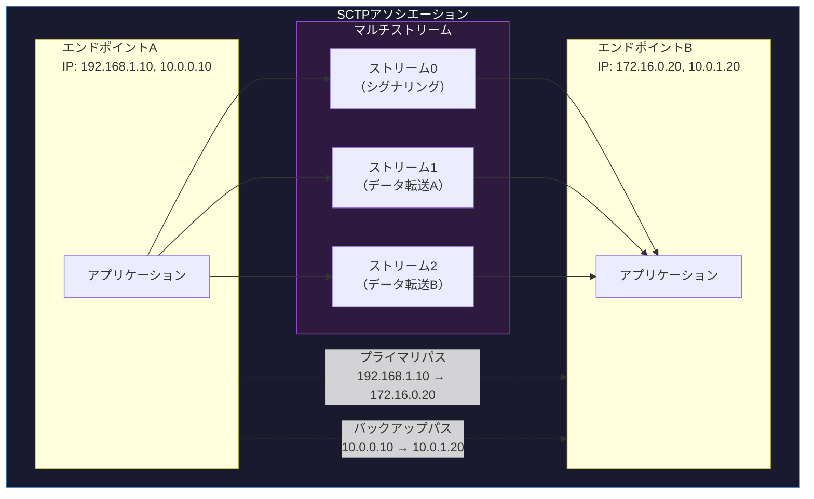

import { Aside } from '@astrojs/starlight/components';

## この節で学ぶこと

TCPとUDPはインターネットの主要なトランスポートプロトコルですが，それぞれの限界を克服するために，さまざまな新しいトランスポートプロトコルが開発されています．
この節では，QUIC，SCTP，DCCP，UDP-Liteの4つのプロトコルについて，その設計目的，特徴，ユースケースを学びます．

## 6.5.1 QUIC（Quick UDP Internet Connections）

QUICは，Googleが開発し，IETF（RFC 9000）で標準化されたトランスポートプロトコルです．UDP上に構築され，TCPの機能（信頼性，フロー制御，ふくそう制御）をユーザー空間で実現しつつ，TCPの課題を解決します．

QUICの主な特徴:

- 0-RTTハンドシェイク: 以前接続したサーバーへは最初のパケットからデータを送信可能
- 1-RTTハンドシェイク: 初回接続でもTLS 1.3を統合した1回の往復で暗号化通信を確立
- ヘッドオブラインブロッキングの解消: ストリーム単位の独立した順序制御により，1つのストリームのパケットロスが他のストリームに影響しない
- コネクションマイグレーション: IPアドレスが変わっても（Wi-Fi→モバイル回線の切り替え時など）コネクションを維持可能
- 暗号化が標準: ヘッダの大部分とペイロードがデフォルトで暗号化される

```mermaid
sequenceDiagram
    participant C as クライアント
    participant S as サーバー

    Note over C,S: TCP + TLS 1.3 の場合（2-RTT）

    rect rgb(30, 30, 60)
        C->>S: SYN
        S->>C: SYN+ACK
        C->>S: ACK（TCPハンドシェイク完了: 1RTT）
        C->>S: ClientHello
        S->>C: ServerHello + 証明書
        C->>S: Finished（TLSハンドシェイク完了: 2RTT）
    end

    Note over C,S: QUIC の場合（1-RTT / 初回接続）

    rect rgb(30, 60, 30)
        C->>S: Initial（ClientHello含む）
        S->>C: Initial（ServerHello + 証明書）
        C->>S: Handshake + データ送信開始（1RTT）
    end

    Note over C,S: QUIC の場合（0-RTT / 再接続）

    rect rgb(60, 30, 30)
        C->>S: 0-RTTデータ（事前共有鍵使用）+ Initial
        Note right of S: 即座にデータ処理開始
        S->>C: Initial + 応答データ
    end
```

QUICは HTTP/3 のトランスポート層として採用されており，現代のWebアクセスの高速化に大きく貢献しています．

### TCPとQUICの比較

| 項目 | TCP | QUIC |
|:---|:---|:---|
| ハンドシェイク | TCP(1RTT) + TLS(1RTT) = 2RTT | 1RTT（初回）/ 0RTT（再接続） |
| 暗号化 | TLSは別レイヤ（オプション） | 標準で統合 |
| ヘッドオブラインブロッキング | あり（1コネクション内で発生） | なし（ストリーム単位で独立） |
| コネクションマイグレーション | 不可（IPアドレス変更で切断） | 可能（Connection IDで識別） |
| 実装場所 | カーネル空間 | ユーザー空間 |
| 基盤プロトコル | IP上に直接 | UDP上に構築 |

## 6.5.2 SCTP（Stream Control Transmission Protocol）

SCTP（RFC 4960）は，TCPとUDPの長所を組み合わせたトランスポートプロトコルです．もともとは電話網のシグナリングプロトコル（SS7）をIP上で転送するために設計されました．

SCTPの主な特徴:

- マルチストリーム: 1つのアソシエーション（SCTPではコネクションをアソシエーションと呼ぶ）内に複数の独立したストリームを持てる
- マルチホーミング: 1つのエンドポイントが複数のIPアドレスを使い，片方のパスが故障しても通信を継続可能
- メッセージ指向: UDPのようにメッセージ境界を保持する（TCPはバイトストリーム）
- 4ウェイハンドシェイク: SYNフラッド攻撃への耐性を持つ
- 順序制御の柔軟性: ストリームごとに順序保証のありなしを選択可能

SCTPのマルチストリーム機能により，1つのストリームでパケットロスが発生しても，他のストリームのデータ転送には影響しません．これはTCPのヘッドオブラインブロッキング問題を解決します．

## 6.5.3 DCCP（Datagram Congestion Control Protocol）

DCCP（RFC 4340）は，UDPにふくそう制御機能を追加したプロトコルです．UDPはふくそう制御を行わないため，大量のUDPトラフィックがネットワークを圧迫する問題がありました．DCCPはこの問題を解決します．

DCCPの主な特徴:

- コネクション型: TCPと同様にコネクションの確立・解放を行う
- ふくそう制御あり: TCPのようなふくそう制御を提供し，ネットワーク全体の公平性を保つ
- 信頼性なし: データの再送や順序保証は行わない（UDPと同様）
- ECN（Explicit Congestion Notification）対応: ルーターからの明示的なふくそう通知を活用

DCCPは「ふくそう制御が必要だが，信頼性は不要」というユースケース，特にリアルタイムストリーミングや音声通話に適しています．ただし，実際の普及はあまり進んでいません．

## 6.5.4 UDP-Lite（Lightweight User Datagram Protocol）

UDP-Lite（RFC 3828）は，UDPを拡張して部分的なチェックサム検証を可能にしたプロトコルです．

通常のUDPでは，チェックサム検証に失敗するとパケット全体が破棄されます．しかし，音声や映像のデータでは，数ビットの誤りがあってもデータ全体としては利用可能な場合があります．UDP-Liteでは，チェックサムの対象範囲をヘッダのみ，あるいはペイロードの一部だけに限定できます．

UDP-Liteの主な特徴:

- 部分的チェックサム: ヘッダ部分のみチェックサムを検証し，ペイロード部分の誤りは許容する
- 誤りのあるデータの配送: ビット誤りがあってもパケットを破棄せずアプリケーションに渡す
- UDPとの互換性: ヘッダフォーマットはUDPとほぼ同じ（「長さ」フィールドが「チェックサムカバレッジ」フィールドに変更）

UDP-Liteは，無線ネットワークのように伝送エラーが発生しやすい環境での音声・映像通信に適しています．

<Aside type="tip" title="FDE実務での活用">
HTTP/3の採用により，AIサービスの通信性能を大幅に改善できる可能性があります．HTTP/3はQUICをトランスポートとして使用し，以下のメリットを提供します:

- 接続確立の高速化: 0-RTTにより，既知のサーバーへの再接続が瞬時に完了する．モバイルアプリからLLM APIへの繰り返しリクエストで特に効果的
- ストリーム多重化の改善: 複数のAPIリクエストを同時に送信する際，1つのリクエストのパケットロスが他に影響しない
- モバイル環境での安定性: Wi-Fiからモバイル回線に切り替わってもコネクションが維持される

主要なクラウドプロバイダ（Cloudflare，AWS CloudFront，Google Cloud CDN）はHTTP/3をサポートしており，AIサービスのフロントエンドでの導入が進んでいます．
</Aside>

## まとめ

- QUICはUDP上に構築され，0/1-RTTハンドシェイク，ストリーム多重化，コネクションマイグレーションを提供する．HTTP/3のトランスポート層として採用されている
- SCTPはマルチストリームとマルチホーミングを特徴とし，電話網のシグナリング転送を主な用途として設計された
- DCCPはUDPにふくそう制御を追加したプロトコルで，リアルタイム通信でのネットワーク公平性を確保する
- UDP-Liteは部分的チェックサムにより，ビット誤りがあってもデータを破棄せずにアプリケーションに渡す

## 理解度チェック

Q1: QUICがTCPと比較して接続確立にかかる時間を短縮できる理由を説明してください．

TCPでは，TCPハンドシェイク（1RTT）とTLSハンドシェイク（1RTT）の合計2RTTが必要です．QUICでは，暗号化がプロトコルに統合されているため，初回接続でも1RTTでハンドシェイクとTLSネゴシエーションを同時に完了できます．さらに，以前接続したサーバーへの再接続では，事前共有鍵を使って0-RTT（最初のパケットからデータ送信可能）を実現できます．

Q2: SCTPのマルチストリーム機能がTCPのヘッドオブラインブロッキング問題を解決する仕組みを説明してください．

TCPでは1つのコネクション内のデータが単一のバイトストリームとして扱われるため，途中のセグメントが失われると，後続のセグメントがすでに到着していても再送されるまでアプリケーションに渡せません（ヘッドオブラインブロッキング）．SCTPでは，1つのアソシエーション内に複数の独立したストリームを設定でき，あるストリームでパケットロスが発生しても，他のストリームのデータは影響を受けずにアプリケーションに渡されます．

Q3: DCCPとUDPの主な違いは何ですか？

主な違いはふくそう制御の有無です．UDPにはふくそう制御がなく，ネットワークの混雑状態に関係なくデータを送信し続けます．DCCPはTCPのようなふくそう制御機能を備え，ネットワーク全体の公平性を保ちます．また，DCCPはコネクション型（UDPはコネクションレス型）であり，コネクションの確立と解放の手順があります．ただし，信頼性（再送・順序保証）は提供しない点はUDPと同様です．

Q4: QUICのコネクションマイグレーションとは何ですか？

コネクションマイグレーションとは，クライアントのIPアドレスやポート番号が変更されても通信を継続できる機能です．TCPではIPアドレスとポート番号の組み合わせでコネクションを識別するため，ネットワーク切り替え時にコネクションが切断されます．QUICではConnection IDという識別子を使ってコネクションを管理するため，例えばスマートフォンがWi-Fiからモバイル回線に切り替わっても（IPアドレスが変わっても），既存のコネクションを維持したまま通信を継続できます．

