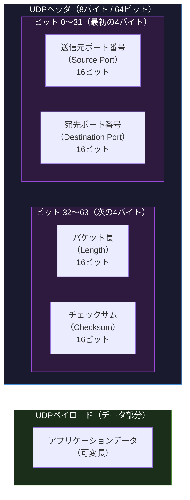
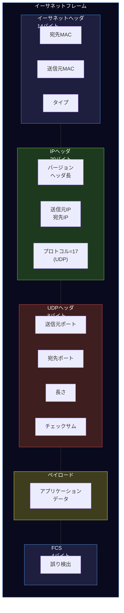

import { Aside } from '@astrojs/starlight/components';

## この節で学ぶこと

UDPヘッダは，トランスポート層のヘッダとしては最もシンプルな構造を持ちます．
わずか8バイト（64ビット）の固定長ヘッダに，ポート番号，データ長，チェックサムの4つのフィールドが含まれています．
この節では，UDPヘッダの各フィールドの役割と，チェックサム計算の仕組みについて学びます．

## UDPヘッダの構造

UDPヘッダは以下の4つのフィールドで構成され，合計8バイトの固定長です．

### 各フィールドの詳細

送信元ポート番号（Source Port）: 16ビット

- 送信側アプリケーションのポート番号
- オプションフィールドであり，応答が不要な場合は0に設定できる
- クライアントの場合，通常はOSが自動的にエフェメラルポートを割り当てる

宛先ポート番号（Destination Port）: 16ビット

- 受信側アプリケーションのポート番号
- このフィールドは必須であり，宛先のアプリケーションを識別するために使用される

パケット長（Length）: 16ビット

- UDPヘッダとデータ部分を合わせた全体のバイト数
- 最小値は8（ヘッダのみ，データなし）
- 最大値は65535だが，実際にはIPパケットのサイズ制限（通常MTUに依存）により小さくなる
- IPv6では，ジャンボグラムを使用する場合にこのフィールドが0に設定されることがある

チェックサム（Checksum）: 16ビット

- UDPヘッダとデータの整合性を検証するための値
- IPv4ではオプション（0に設定するとチェックサム検証をスキップ），IPv6では必須
- チェックサムの計算には「擬似ヘッダ」（送信元IP，宛先IP，プロトコル番号，UDP長）が含まれる

## チェックサムの計算

UDPのチェックサムは，UDPヘッダとデータだけでなく，IPヘッダの一部の情報（擬似ヘッダ）も含めて計算されます．

擬似ヘッダに含まれる情報:

- 送信元IPアドレス（32ビット / IPv4の場合）
- 宛先IPアドレス（32ビット / IPv4の場合）
- プロトコル番号（8ビット，UDPの場合は17）
- UDP長（16ビット）

擬似ヘッダを含めることで，IPアドレスの誤配送（異なるホストへの誤送信）も検出できるようになります．これはIPヘッダ自体のチェックサムとは独立した保護層として機能します．

チェックサムの計算手順:

1. 擬似ヘッダ + UDPヘッダ（チェックサムフィールドは0で計算） + UDPデータを連結する
2. 16ビットずつに分割し，すべてを1の補数加算する
3. 加算結果の1の補数を取ったものがチェックサム値となる
4. 受信側で同じ計算を行い，結果がすべて1（0xFFFF）になれば検証成功

## UDPパケット全体の構造

UDPパケットがネットワーク上を流れる際の全体構造（イーサネットフレームの場合）:

この図のように，UDPヘッダ（8バイト）はIPヘッダ（20バイト）とイーサネットヘッダ（14バイト）に比べて非常にコンパクトです．この軽量さが，UDPの低オーバーヘッドの源です．

<Aside type="tip" title="FDE実務での活用">
UDPヘッダのわずか8バイトという軽量さは，低レイテンシが要求されるシステムで大きな利点となります．例えば，リアルタイムのAI推論サービスにおいて，音声データのパケットサイズが20バイト（Opus圧縮音声フレーム）の場合，TCPヘッダ（20〜60バイト）を使うとヘッダがデータよりも大きくなりますが，UDPヘッダ（8バイト）ならオーバーヘッドを最小限に抑えられます．また，大量のIoTセンサーデータ（温度，湿度などの数バイトの値）をリアルタイムに収集するシステムでも，UDPの軽量さが帯域幅の効率的な利用とレイテンシの削減に貢献します．パケットキャプチャツール（tcpdump，Wireshark）でUDPヘッダの各フィールドを確認し，送信元ポート，宛先ポート，データ長を読み取る訓練を行うことが，トラブルシューティング能力の向上につながります．
</Aside>

## まとめ

- UDPヘッダは8バイト固定長で，送信元ポート番号，宛先ポート番号，パケット長，チェックサムの4フィールドで構成される
- 送信元ポート番号はオプション（0に設定可能）で，宛先ポート番号は必須
- チェックサムの計算には擬似ヘッダ（送信元IP，宛先IP，プロトコル番号，UDP長）が含まれ，IPアドレスの誤配送も検出できる
- IPv4ではチェックサムはオプションだが，IPv6では必須
- UDPヘッダの軽量さ（8バイト）がTCPヘッダ（20バイト以上）と比較した際の低オーバーヘッドの源である

## 理解度チェック

Q1: UDPヘッダの各フィールドの名前とサイズをすべて挙げてください．

UDPヘッダは以下の4つのフィールドで構成されます:
1. 送信元ポート番号（Source Port）: 16ビット（2バイト）
2. 宛先ポート番号（Destination Port）: 16ビット（2バイト）
3. パケット長（Length）: 16ビット（2バイト）
4. チェックサム（Checksum）: 16ビット（2バイト）
合計8バイト（64ビット）の固定長です．

Q2: UDPチェックサムの計算に擬似ヘッダが含まれる理由は何ですか？

擬似ヘッダ（送信元IPアドレス，宛先IPアドレス，プロトコル番号，UDP長）を含めることで，UDPパケットが誤ったホストに配送された場合（IPアドレスの誤配送）も検出できるようになります．UDPヘッダだけでチェックサムを計算すると，ポート番号とデータの整合性しか確認できませんが，擬似ヘッダを含めることでIPレイヤの情報も含めた端末間の整合性を検証できます．

Q3: IPv4とIPv6でUDPチェックサムの扱いが異なる理由は何ですか？

IPv4ではIPヘッダ自体にチェックサムフィールドがあるため，UDPチェックサムはオプション（省略可能）です．一方，IPv6ではIPヘッダからチェックサムフィールドが削除されたため，UDPチェックサムが必須になりました．IPv6では，UDPチェックサムが唯一のデータ整合性検証手段となるため，省略は許可されません．

